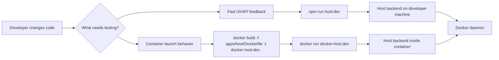

# Local development and testing

This document defines how Docker Host should be run locally while developing and testing changes before any image is pushed to a registry.

## Decision

Docker Host should support two local feedback loops:

- direct host-run development through `npm run host:dev`;
- production-like local container testing through a locally built Docker image tag, for example `docker-host:dev`.

The direct host-run mode is the default development loop. The production-like mode is used when validating Dockerfile behavior, container environment variables, Docker socket mounts, Host data root mounts, and `docker-host` CLI lifecycle behavior.



## Direct host-run development

Use this mode for normal UI and backend API development:

```bash
npm install
npm run host:dev
```

The Next.js server runs directly on the developer machine. It connects to Docker using the existing Docker connection priority:

1. `DOCKER_SOCKET_PATH`, if set;
2. `DOCKER_HOST`, if set;
3. `/var/run/docker.sock`, by default.

Examples:

```bash
DOCKER_SOCKET_PATH=/var/run/docker.sock npm run host:dev
DOCKER_HOST=unix:///var/run/docker.sock npm run host:dev
DOCKER_HOST=tcp://127.0.0.1:2375 npm run host:dev
```

In this mode, local metadata test servers can usually be referenced as `http://localhost:<port>/...`, because the Host backend also runs on the developer machine.

The repository uses npm workspace scripts from the root. `npm run host:dev`, `npm run host:build`, and `npm run host:lint` execute the Host app in `apps/host`.

The installed CLI dev harness is dev-only. It starts the Host from `HOST_DEV_REPOSITORY_PATH` through `npm run host:dev`, or it can target an already running source Host with a loopback URL such as `--host-url http://localhost:3000`.

Module dev server upstreams should usually be `http://127.0.0.1:<port>`. The metadata `runtime.ports[].localPort` value expands to that address for the top-level `docker-host dev` harness.

## Direct host-run development with a demo shell app

Use this mode for Host shell work, Apps sidebar work, account switching checks, nested app navigation, or direct-origin iframe transport against the demo module from the current repository checkout:

```bash
npm run host:dev:demo
```

This script configures an isolated CLI home and then delegates orchestration to `docker-host dev up --manifest modules/demo-module/metadata.dev.json`. It starts both local development servers:

- Docker Host at `http://localhost:3000`;
- the repository-local demo module at `http://localhost:3100`.

The script sets:

- `DOCKER_HOST_HOME` to the repository-local `.docker-host-dev-demo/` directory unless already provided;
- `HOST_DEV_REPOSITORY_PATH` in the isolated CLI config to the current checkout;
- `HOST_DEV_PORT` in the isolated CLI config to `3000` unless `HOST_DEV_PORT` or `PORT` is provided.

The generic `docker-host dev up` command sets the local Host process environment:

- `HOST_DATA_ROOT_HOST` and `HOST_DATA_ROOT_CONTAINER` to the active CLI Host data root;
- `HOST_DEV_AUTH=auto`, which enables development-only auto-login;
- `HOST_DEV_AUTH_SEED_BROWSER_ACCOUNTS=enabled`, which remembers development accounts in the browser account menu.

The demo wrapper also sets:

- `HOST_ENABLE_DEV_FIXTURES=true`, which enables the current-branch demo metadata fixture.

When auto-login is enabled, `/setup`, `/login`, and unauthenticated dashboard requests redirect through `/api/auth/dev-login`. That route is available only in development runtime, only when `HOST_DEV_AUTH=auto` is set, and only when the Host server observes the client socket as a loopback address such as `127.0.0.1` or `::1`.

Development runtime is visible in the shell: the sidebar header shows a `DEV` marker next to `DOCKER HOST`, with a compact marker on the Host icon when the sidebar is collapsed.

The route does not disable authentication. It creates or updates normal local accounts, issues a normal browser session cookie, and then redirects back to the shell. The default development administrator account is:

- email: `admin@docker-host.local`;
- password: `docker-host-dev-admin`;
- display name: `Dev Admin`.

Override these values with `HOST_DEV_ADMIN_EMAIL`, `HOST_DEV_ADMIN_PASSWORD`, and `HOST_DEV_ADMIN_NAME` if a local test needs different credentials. The password still has to satisfy the normal local password policy.

The demo script signs the first browser session in as the administrator account. It still creates and remembers a normal development user for account switching:

- email: `user@docker-host.local`;
- password: `docker-host-dev-user`;
- display name: `Dev User`.

Override these values with `HOST_DEV_USER_EMAIL`, `HOST_DEV_USER_PASSWORD`, and `HOST_DEV_USER_NAME`. The administrator account is still seeded so the Host is not left in setup-required mode. The development user and administrator emails must be different.

Module-specific development users can be added in `metadata.dev.json`:

```json
{
  "development": {
    "users": [
      {
        "email": "reviewer@example.test",
        "displayName": "Review User",
        "role": "user"
      }
    ]
  }
}
```

The CLI creates or updates those local Host users through trusted control and assigns them to the active developer target by default. The Host account menu seeds all enabled local development users into the current browser account set, so they are available for account switching without signing in. The CLI removes the `development` block before serving the metadata file to Docker Host's strict module metadata validator.

Before starting the module process, the CLI seeds a deterministic developer target through Host trusted control. The target points at the current checkout's `modules/demo-module` UI and stores the current metadata `ui` snapshot, so `/api/apps` immediately returns a `Dev` app without a manual link step.

The default app is available through the Host shell at:

```text
http://localhost:3000/apps/dev/mdev_com_haas_demo_module_localhost
```

Use this path for quick smoke tests. It validates shell navigation, app registry output, direct iframe embedding, and Host identity token bridging against current branch code. It does not create a managed Docker container or exercise module install/lifecycle operations.

## Native Windows CLI development

Native Windows CLI support targets Docker Desktop with the WSL 2 Linux engine. Windows containers mode is unsupported because the Host image and module runtime are Linux-container based.

The Windows CLI artifact should connect to Docker Engine through:

```text
npipe:////./pipe/docker_engine
```

The Host container still receives Docker access through the Linux Engine socket mount:

```text
/var/run/docker.sock:/var/run/docker.sock
```

During `docker-host install/start/status`, the CLI should fail clearly if Docker Desktop is in Windows containers mode and should instruct the administrator to switch to Linux containers.

## Production-like local container testing

Use this mode when the change needs to be validated in the same shape as the released Host container, but without pushing an image:

```bash
docker build -f apps/host/Dockerfile -t docker-host:dev .

docker run --rm --name docker-host-dev -p 127.0.0.1:3000:3000 \
  -v /var/run/docker.sock:/var/run/docker.sock \
  -v "$HOME/.docker-host-dev:/data" \
  -e HOST_DATA_ROOT_HOST="$HOME/.docker-host-dev" \
  -e HOST_DATA_ROOT_CONTAINER=/data \
  -e HOST_BIND_ADDRESS=127.0.0.1 \
  docker-host:dev
```

Use a dedicated development data root such as `~/.docker-host-dev` to avoid mixing test module state with a real local installation.

The loopback bind and `HOST_BIND_ADDRESS=127.0.0.1` are intentional. Docker port forwarding can make the Host container observe browser traffic as coming from a Docker bridge address instead of `127.0.0.1`; the bind setting tells the Host that `http://localhost:<port>` is still local-only, so it may issue non-`Secure` development cookies over HTTP. If the port is bound to `0.0.0.0` or the Host is reachable from another machine, browser authentication must use HTTPS through `HOST_PUBLIC_ORIGIN`.

In this mode, the Host backend runs inside the Host container. A metadata server or helper service running on the developer machine should be referenced from inside the container as:

```text
http://host.docker.internal:<port>/...
```

`localhost` from inside the Host container points to the Host container itself, not to the developer machine.

## CLI development contract

The standalone `docker-host` CLI allows local Host image override so the lifecycle flow can be tested without registry push.

Target local flow:

```bash
docker build -f apps/host/Dockerfile -t docker-host:dev .
docker-host config set HOST_IMAGE docker-host:dev
docker-host config set HOST_DATA_ROOT_HOST "$HOME/.docker-host-dev"
docker-host start
docker-host open
```

The CLI config command shape is:

```bash
docker-host config list
docker-host config get HOST_IMAGE
docker-host config set HOST_IMAGE docker-host:dev
docker-host config set HOST_DATA_ROOT_HOST "$HOME/.docker-host-dev"
docker-host config set HOST_IMAGE=docker-host:dev
docker-host config reset HOST_IMAGE
```

`config list` shows all launch settings, `config get` shows one setting, `config set` updates one known launch setting, and `config reset` restores one setting to its default. The `KEY VALUE` form is the primary syntax, while `KEY=VALUE` is supported as a convenience for shell users.

The launch model must preserve these capabilities:

- local Host image tags can be used instead of `ghcr.io/...:latest`;
- local development uses an isolated data root;
- Host container still receives both `HOST_DATA_ROOT_HOST` and `HOST_DATA_ROOT_CONTAINER`;
- the same Docker socket mount behavior is used as the production-like launch path.

## Local module testing

Test modules do not need to be pushed if their metadata references a Docker image tag already available to the local Docker daemon.

Example metadata container image reference for local module testing:

```json
{
  "containers": [
    {
      "key": "app",
      "image": {
        "repository": "acme-reports-module",
        "tag": "dev",
        "pullPolicy": "ifNotPresent"
      }
    }
  ]
}
```

When the Host itself runs directly through `npm run host:dev`, local metadata URLs can point to `localhost`. When the Host runs as `docker-host:dev`, metadata URLs for services on the developer machine should use `host.docker.internal`.

## Module developer mode

For faster module UI/runtime iteration, Docker Host also supports local-only module developer targets. This mode validates module metadata and lets the Host gateway route a module hostname to a local dev server without creating a managed module container.

Use this as the default module integration loop when the change touches shell embedding, authenticated pages, Host identity tokens, scoped directory reads, assigned-user behavior, redirects, WebSockets, or SSE. Run the module app locally, link it as a developer target, and let Docker Host issue the normal gateway identity instead of injecting hand-written tokens into the module.

Link a target directly:

```bash
docker-host modules dev link \
  http://localhost:3000/fixtures/modules/demo-module \
  demo.localhost \
  http \
  http://127.0.0.1:3100
```

For the reusable installed-CLI workflow, prefer the metadata-driven harness:

```bash
docker-host config set HOST_DEV_REPOSITORY_PATH /path/to/docker-host
docker-host config set HOST_DEV_PORT 3000
docker-host dev up --manifest modules/demo-module/metadata.dev.json
docker-host dev status --manifest modules/demo-module/metadata.dev.json
docker-host dev identity --manifest modules/demo-module/metadata.dev.json --format token
docker-host dev reset --manifest modules/demo-module/metadata.dev.json
```

When iterating on Host source code, run the same harness against a local Host origin:

```bash
docker-host dev up --manifest modules/demo-module/metadata.dev.json --host-url http://localhost:3000
```

This skips Docker lifecycle operations and uses the running Host's local control channel for dev target registration, user seeding, assignments, and directory policy.

Developer targets are stored under the Host data root in `/data/dev/module-targets.json`. They do not modify installed module records, module metadata, or production gateway exposure records. The harness manages targets, development users, assignments, directory policy, local process startup, status checks, reset behavior, and development data cleanup through Host-owned control routes.

For direct local module endpoint probes, `docker-host dev identity` can issue a real Host-signed identity token for the prepared developer target:

```bash
TOKEN="$(docker-host dev identity --manifest modules/demo-module/metadata.dev.json --format token)"
curl -H "X-Docker-Host-Identity: $TOKEN" http://127.0.0.1:3100/api/auth/identity
```

Use this only as a diagnostic shortcut for direct module-origin requests. Browser shell transport and gateway behavior should still be validated through the Host app URL and gateway URL printed by `docker-host dev up`.

See [Module developer mode](module-developer-mode.md) for API, CLI, and gateway details.

## Current branch demo module install

Use this mode when the smoke test must exercise a real managed module container from the current repository checkout.

First build the local demo module image:

```bash
npm run demo-module:docker:build:local
```

That command tags the image as:

```text
docker-host-demo-module:dev
```

Then run the Host and install the current demo metadata fixture from `/modules/install`. Use the `Current demo` action to fill:

```text
http://localhost:3000/fixtures/modules/demo-module
```

The fixture reads `modules/demo-module/metadata.json` from the current checkout and rewrites the image reference to `docker-host-demo-module:dev` with `pullPolicy: ifNotPresent`. This keeps install testing on the current branch instead of the published GitHub Container Registry image.

## Verification checklist

For a normal feature change:

- run `npm run host:dev`;
- for install/update request helper changes, run `npm run host:test`;
- open the Web UI;
- exercise the changed API/UI behavior;
- check the Docker operation result in the UI or Docker Desktop.

For a launch/runtime change:

- build `docker-host:dev`;
- run the container with Docker socket and data root mounts;
- verify the Web UI opens;
- verify Docker operations still work from inside the Host container;
- verify the isolated data root is used.
