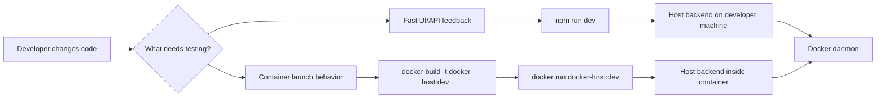

# Local development and testing

This document defines how Docker Host should be run locally while developing and testing changes before any image is pushed to a registry.

## Decision

Docker Host should support two local feedback loops:

- direct host-run development through `npm run dev`;
- production-like local container testing through a locally built Docker image tag, for example `docker-host:dev`.

The direct host-run mode is the default development loop. The production-like mode is used when validating Dockerfile behavior, container environment variables, Docker socket mounts, Host data root mounts, and future `docker-host` CLI lifecycle behavior.



## Direct host-run development

Use this mode for normal UI and backend API development:

```bash
npm install
npm run dev
```

The Next.js server runs directly on the developer machine. It connects to Docker using the existing Docker connection priority:

1. `DOCKER_SOCKET_PATH`, if set;
2. `DOCKER_HOST`, if set;
3. `/var/run/docker.sock`, by default.

Examples:

```bash
DOCKER_SOCKET_PATH=/var/run/docker.sock npm run dev
DOCKER_HOST=unix:///var/run/docker.sock npm run dev
DOCKER_HOST=tcp://127.0.0.1:2375 npm run dev
```

In this mode, local metadata test servers can usually be referenced as `http://localhost:<port>/...`, because the Host backend also runs on the developer machine.

## Production-like local container testing

Use this mode when the change needs to be validated in the same shape as the released Host container, but without pushing an image:

```bash
docker build -t docker-host:dev .

docker run --rm --name docker-host-dev -p 3000:3000 \
  -v /var/run/docker.sock:/var/run/docker.sock \
  -v "$HOME/.docker-host-dev:/data" \
  -e HOST_DATA_ROOT_HOST="$HOME/.docker-host-dev" \
  -e HOST_DATA_ROOT_CONTAINER=/data \
  docker-host:dev
```

Use a dedicated development data root such as `~/.docker-host-dev` to avoid mixing test module state with a real local installation.

In this mode, the Host backend runs inside the Host container. A metadata server or helper service running on the developer machine should be referenced from inside the container as:

```text
http://host.docker.internal:<port>/...
```

`localhost` from inside the Host container points to the Host container itself, not to the developer machine.

## CLI development contract

The future standalone `docker-host` CLI should allow local Host image override so the lifecycle flow can be tested without registry push.

Target local flow:

```bash
docker build -t docker-host:dev .
docker-host config set HOST_IMAGE=docker-host:dev
docker-host config set HOST_DATA_ROOT_HOST="$HOME/.docker-host-dev"
docker-host start
docker-host open
```

The exact CLI config command shape can change during implementation, but the launch model must preserve these capabilities:

- local Host image tags can be used instead of `ghcr.io/...:latest`;
- local development uses an isolated data root;
- Host container still receives both `HOST_DATA_ROOT_HOST` and `HOST_DATA_ROOT_CONTAINER`;
- the same Docker socket mount behavior is used as the production-like launch path.

## Local module testing

Test modules do not need to be pushed if their metadata references a Docker image tag already available to the local Docker daemon.

Example metadata image reference for local module testing:

```json
{
  "image": {
    "repository": "acme-reports-module",
    "tag": "dev",
    "pullPolicy": "ifNotPresent"
  }
}
```

When the Host itself runs directly through `npm run dev`, local metadata URLs can point to `localhost`. When the Host runs as `docker-host:dev`, metadata URLs for services on the developer machine should use `host.docker.internal`.

## Verification checklist

For a normal feature change:

- run `npm run dev`;
- open the Web UI;
- exercise the changed API/UI behavior;
- check the Docker operation result in the UI or Docker Desktop.

For a launch/runtime change:

- build `docker-host:dev`;
- run the container with Docker socket and data root mounts;
- verify the Web UI opens;
- verify Docker operations still work from inside the Host container;
- verify the isolated data root is used.

## Open Questions

- Should the repository add dedicated npm scripts for local container testing, such as `npm run docker:build:dev` and `npm run docker:run:dev`?
- What exact `docker-host config` command syntax should be implemented for local image and data root overrides?
