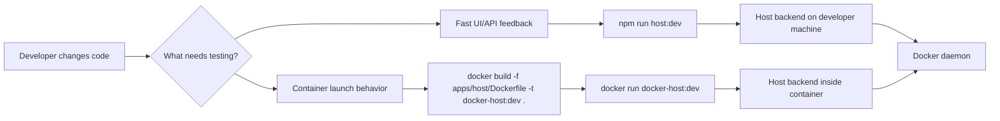

# Local development and testing

This document defines how Docker Host should be run locally while developing and testing changes before any image is pushed to a registry.

## Decision

Docker Host should support two local feedback loops:

- direct host-run development through `npm run host:dev`;
- production-like local container testing through a locally built Docker image tag, for example `docker-host:dev`.

The direct host-run mode is the default development loop. The production-like mode is used when validating Dockerfile behavior, container environment variables, Docker socket mounts, Host data root mounts, and future `docker-host` CLI lifecycle behavior.



## Direct host-run development

Use this mode for normal UI and backend API development:

```bash
npm install
npm run host:dev
```

The Next.js server runs directly on the developer machine. It connects to Docker using the existing Docker connection priority:

1. `DOCKER_SOCKET_PATH`, if set;
2. `DOCKER_HOST`, if set;
3. `/var/run/docker.sock`, by default.

Examples:

```bash
DOCKER_SOCKET_PATH=/var/run/docker.sock npm run host:dev
DOCKER_HOST=unix:///var/run/docker.sock npm run host:dev
DOCKER_HOST=tcp://127.0.0.1:2375 npm run host:dev
```

In this mode, local metadata test servers can usually be referenced as `http://localhost:<port>/...`, because the Host backend also runs on the developer machine.

The repository uses npm workspace scripts from the root. `npm run host:dev`, `npm run host:build`, and `npm run host:lint` execute the Host app in `apps/host`.

## Native Windows CLI development

Native Windows CLI support targets Docker Desktop with the WSL 2 Linux engine. Windows containers mode is unsupported for the MVP because the Host image and module runtime are Linux-container based.

The Windows CLI artifact should connect to Docker Engine through:

```text
npipe:////./pipe/docker_engine
```

The Host container still receives Docker access through the Linux Engine socket mount:

```text
/var/run/docker.sock:/var/run/docker.sock
```

During `docker-host install/start/status`, the CLI should fail clearly if Docker Desktop is in Windows containers mode and should instruct the administrator to switch to Linux containers.

## Production-like local container testing

Use this mode when the change needs to be validated in the same shape as the released Host container, but without pushing an image:

```bash
docker build -f apps/host/Dockerfile -t docker-host:dev .

docker run --rm --name docker-host-dev -p 3000:3000 \
  -v /var/run/docker.sock:/var/run/docker.sock \
  -v "$HOME/.docker-host-dev:/data" \
  -e HOST_DATA_ROOT_HOST="$HOME/.docker-host-dev" \
  -e HOST_DATA_ROOT_CONTAINER=/data \
  docker-host:dev
```

Use a dedicated development data root such as `~/.docker-host-dev` to avoid mixing test module state with a real local installation.

In this mode, the Host backend runs inside the Host container. A metadata server or helper service running on the developer machine should be referenced from inside the container as:

```text
http://host.docker.internal:<port>/...
```

`localhost` from inside the Host container points to the Host container itself, not to the developer machine.

## CLI development contract

The future standalone `docker-host` CLI should allow local Host image override so the lifecycle flow can be tested without registry push.

Target local flow:

```bash
docker build -f apps/host/Dockerfile -t docker-host:dev .
docker-host config set HOST_IMAGE docker-host:dev
docker-host config set HOST_DATA_ROOT_HOST "$HOME/.docker-host-dev"
docker-host start
docker-host open
```

The Phase 2 CLI config command shape is fixed as:

```bash
docker-host config list
docker-host config get HOST_IMAGE
docker-host config set HOST_IMAGE docker-host:dev
docker-host config set HOST_DATA_ROOT_HOST "$HOME/.docker-host-dev"
docker-host config set HOST_IMAGE=docker-host:dev
docker-host config reset HOST_IMAGE
```

`config list` shows all launch settings, `config get` shows one setting, `config set` updates one known launch setting, and `config reset` restores one setting to its default. The `KEY VALUE` form is the primary syntax, while `KEY=VALUE` is supported as a convenience for shell users.

The launch model must preserve these capabilities:

- local Host image tags can be used instead of `ghcr.io/...:latest`;
- local development uses an isolated data root;
- Host container still receives both `HOST_DATA_ROOT_HOST` and `HOST_DATA_ROOT_CONTAINER`;
- the same Docker socket mount behavior is used as the production-like launch path.

## Local module testing

Test modules do not need to be pushed if their metadata references a Docker image tag already available to the local Docker daemon.

Example metadata image reference for local module testing:

```json
{
  "image": {
    "repository": "acme-reports-module",
    "tag": "dev",
    "pullPolicy": "ifNotPresent"
  }
}
```

When the Host itself runs directly through `npm run host:dev`, local metadata URLs can point to `localhost`. When the Host runs as `docker-host:dev`, metadata URLs for services on the developer machine should use `host.docker.internal`.

## Phase 4 manual module seed

Phase 4 does not include module install runtime. To validate the module dashboard before Phase 5/6, use a dedicated development data root and manually seed one installed module record plus its local metadata file. This seed is only a validation aid; it is not a production API, fixture contract, or install flow.

Use an isolated root instead of the production default `~/.docker-host`:

```bash
export DOCKER_HOST_PHASE4_ROOT="$(mktemp -d /tmp/docker-host-phase4.XXXXXX)"
mkdir -p "$DOCKER_HOST_PHASE4_ROOT/modules/com.example.nginx"
```

Create `modules.json`:

```bash
cat > "$DOCKER_HOST_PHASE4_ROOT/modules.json" <<'JSON'
{
  "schemaVersion": "0.1",
  "hostSettings": {},
  "modules": [
    {
      "id": "com.example.nginx",
      "metadataUrl": "manual-seed://com.example.nginx",
      "metadataPath": "modules/com.example.nginx/metadata.json",
      "containerName": "mod-com-example-nginx",
      "image": {
        "repository": "nginx",
        "tag": "alpine",
        "reference": "nginx:alpine",
        "pullPolicy": "ifNotPresent"
      },
      "operationStatus": "installed",
      "settings": {},
      "storageMappings": {},
      "resolvedDependencies": {},
      "installedAt": "2026-05-14T00:00:00Z",
      "updatedAt": "2026-05-14T00:00:00Z",
      "lastError": null
    }
  ],
  "updatedAt": "2026-05-14T00:00:00Z"
}
JSON
```

Create `modules/com.example.nginx/metadata.json`:

```bash
cat > "$DOCKER_HOST_PHASE4_ROOT/modules/com.example.nginx/metadata.json" <<'JSON'
{
  "schemaVersion": "0.1",
  "id": "com.example.nginx",
  "name": "Example Nginx",
  "description": "Manual Phase 4 seed module for validating module list and lifecycle UI.",
  "version": "1.0.0",
  "image": {
    "repository": "nginx",
    "tag": "alpine",
    "pullPolicy": "ifNotPresent"
  },
  "dependencies": [],
  "settings": [],
  "storage": {
    "directories": []
  },
  "runtime": {
    "ports": [
      {
        "key": "http",
        "containerPort": 80,
        "protocol": "tcp",
        "public": false
      }
    ]
  }
}
JSON
```

Create the matching Docker container manually. Phase 4 can start, stop, and restart an existing module container, but it must not create containers from metadata:

```bash
docker rm -f mod-com-example-nginx 2>/dev/null || true
docker pull nginx:alpine
docker create --name mod-com-example-nginx nginx:alpine
```

For direct host-run development, point both Host data root variables at the isolated directory because the backend runs on the developer machine:

```bash
HOST_DATA_ROOT_HOST="$DOCKER_HOST_PHASE4_ROOT" \
HOST_DATA_ROOT_CONTAINER="$DOCKER_HOST_PHASE4_ROOT" \
npm run host:dev
```

For production-like container testing, bind the same root to `/data` and keep `/data` as the container-side root:

```bash
docker build -f apps/host/Dockerfile -t docker-host:dev .

docker run --rm --name docker-host-dev -p 3000:3000 \
  -v /var/run/docker.sock:/var/run/docker.sock \
  -v "$DOCKER_HOST_PHASE4_ROOT:/data" \
  -e HOST_DATA_ROOT_HOST="$DOCKER_HOST_PHASE4_ROOT" \
  -e HOST_DATA_ROOT_CONTAINER=/data \
  docker-host:dev
```

## Phase 6 install plan fixture

The Host app serves a local metadata fixture for install review UI development:

```text
http://localhost:3000/fixtures/modules/phase6-reports
```

The reports fixture references a second local dependency fixture at `/fixtures/modules/phase6-identity`, declares editable non-secret settings, one write-only secret, module-owned storage, one required external mount collection, runtime ports, and resource hints. Use the install route's local fixture action to fill the current origin automatically when the dev server runs on a non-default port.

The install plan endpoint still requires Docker read access and the Host-managed module network. If the fixture returns a Docker conflict or `503`, validate the UI error state first, then create/start the Host through the normal launch path before testing the successful review state.

## Phase 7 install apply fixture

Phase 7 can use the same local metadata fixture to exercise `POST /api/modules/install`. After preparing the install request on `/modules/install`, submit the explicit install action. The apply endpoint recomputes the plan, validates submitted settings and external mounts server-side, writes per-module install state to `modules.json`, stores raw metadata copies under `modules/<module-id>/metadata.json`, creates module-owned directories, pulls images according to `pullPolicy`, and creates module containers on the Host-managed network.

For the fixture path, provide an external mount host path that Docker can bind mount. The Host process does not preflight external host paths through local filesystem checks; Docker daemon mount success or failure is the validation boundary.

## Verification checklist

For a normal feature change:

- run `npm run host:dev`;
- for Phase 6 UI helper changes, run `npm run host:test`;
- open the Web UI;
- exercise the changed API/UI behavior;
- check the Docker operation result in the UI or Docker Desktop.

For a launch/runtime change:

- build `docker-host:dev`;
- run the container with Docker socket and data root mounts;
- verify the Web UI opens;
- verify Docker operations still work from inside the Host container;
- verify the isolated data root is used.

## Open Questions

No local development questions are currently open for Phase 2.
