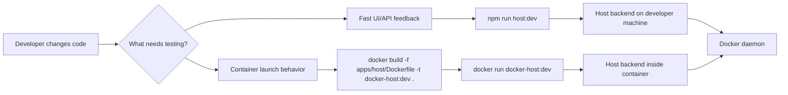

# Local development and testing

This document defines how Docker Host should be run locally while developing and testing changes before any image is pushed to a registry.

## Decision

Docker Host should support two local feedback loops:

- direct host-run development through `npm run host:dev`;
- production-like local container testing through a locally built Docker image tag, for example `docker-host:dev`.

The direct host-run mode is the default development loop. The production-like mode is used when validating Dockerfile behavior, container environment variables, Docker socket mounts, Host data root mounts, and `docker-host` CLI lifecycle behavior.



## Direct host-run development

Use this mode for normal UI and backend API development:

```bash
npm install
npm run host:dev
```

The Next.js server runs directly on the developer machine. It connects to Docker using the existing Docker connection priority:

1. `DOCKER_SOCKET_PATH`, if set;
2. `DOCKER_HOST`, if set;
3. `/var/run/docker.sock`, by default.

Examples:

```bash
DOCKER_SOCKET_PATH=/var/run/docker.sock npm run host:dev
DOCKER_HOST=unix:///var/run/docker.sock npm run host:dev
DOCKER_HOST=tcp://127.0.0.1:2375 npm run host:dev
```

In this mode, local metadata test servers can usually be referenced as `http://localhost:<port>/...`, because the Host backend also runs on the developer machine.

The repository uses npm workspace scripts from the root. `npm run host:dev`, `npm run host:build`, and `npm run host:lint` execute the Host app in `apps/host`.

## Direct host-run development with auto-login

Use this mode for fast UI work when the first screen should be the dashboard:

```bash
npm run host:dev:auth-admin
```

Use this mode when the first shell session should be a non-admin user:

```bash
npm run host:dev:auth-user
```

This script sets:

- `HOST_DATA_ROOT_HOST` and `HOST_DATA_ROOT_CONTAINER` to the repository-local `.docker-host-dev/` directory;
- `HOST_DEV_AUTH=auto`, which enables development-only auto-login.

The user-role script uses `.docker-host-dev-user/` and also sets `HOST_DEV_AUTH_ROLE=user`. Both auto-login scripts are backed by a Node wrapper rather than POSIX inline environment assignments, so the same npm commands work from POSIX shells, PowerShell, and cmd.

When auto-login is enabled, `/setup`, `/login`, and unauthenticated dashboard requests redirect through `/api/auth/dev-login`. That route is available only in development runtime, only when `HOST_DEV_AUTH=auto` is set, and only when the Host server observes the client socket as a loopback address such as `127.0.0.1` or `::1`.

Development runtime is visible in the shell: the sidebar header shows a `DEV` marker next to `DOCKER HOST`, with a compact marker on the Host icon when the sidebar is collapsed.

The route does not disable authentication. It creates or updates normal local accounts, issues a normal browser session cookie, and then redirects back to the shell. The default development administrator account is:

- email: `admin@docker-host.local`;
- password: `docker-host-dev-admin`;
- display name: `Dev Admin`.

Override these values with `HOST_DEV_ADMIN_EMAIL`, `HOST_DEV_ADMIN_PASSWORD`, and `HOST_DEV_ADMIN_NAME` if a local test needs different credentials. The password still has to satisfy the normal local password policy.

When `HOST_DEV_AUTH_ROLE=user` is set, auto-login also creates or updates a normal local user account and signs in as that user:

- email: `user@docker-host.local`;
- password: `docker-host-dev-user`;
- display name: `Dev User`.

Override these values with `HOST_DEV_USER_EMAIL`, `HOST_DEV_USER_PASSWORD`, and `HOST_DEV_USER_NAME`. The administrator account is still seeded so the Host is not left in setup-required mode.

Production runs and direct `npm run host:dev` runs do not enable this behavior. They continue to require a CLI-generated setup token for first administrator setup.

## Direct host-run development with a demo shell app

Use this mode when testing the Host shell, Apps sidebar, nested app navigation, or embedded app transport against the demo module from the current repository checkout:

```bash
npm run host:dev:demo
```

This script starts both local development servers:

- Docker Host at `http://localhost:3000`;
- the repository-local demo module at `http://localhost:3100`.

Before starting the servers, the script seeds a deterministic developer target in `.docker-host-dev-demo/dev/module-targets.json`. The target points at the current checkout's `modules/demo-module` UI and stores the current metadata `ui` snapshot, so `/api/apps` immediately returns a `Dev` app without a manual link step. The script also enables `HOST_DEV_AUTH=auto`, `HOST_MODULE_DEV_MODE=enabled`, and local metadata fixtures for the Host process.

The default app is available through the Host shell at:

```text
http://localhost:3000/apps/dev/mdev_local_demo_module
```

Use this path for quick smoke tests. It validates shell navigation, app registry output, iframe embedding, route rewriting, and Host identity token injection against current branch code. It does not create a managed Docker container or exercise module install/lifecycle operations.

## Native Windows CLI development

Native Windows CLI support targets Docker Desktop with the WSL 2 Linux engine. Windows containers mode is unsupported because the Host image and module runtime are Linux-container based.

The Windows CLI artifact should connect to Docker Engine through:

```text
npipe:////./pipe/docker_engine
```

The Host container still receives Docker access through the Linux Engine socket mount:

```text
/var/run/docker.sock:/var/run/docker.sock
```

During `docker-host install/start/status`, the CLI should fail clearly if Docker Desktop is in Windows containers mode and should instruct the administrator to switch to Linux containers.

## Production-like local container testing

Use this mode when the change needs to be validated in the same shape as the released Host container, but without pushing an image:

```bash
docker build -f apps/host/Dockerfile -t docker-host:dev .

docker run --rm --name docker-host-dev -p 3000:3000 \
  -v /var/run/docker.sock:/var/run/docker.sock \
  -v "$HOME/.docker-host-dev:/data" \
  -e HOST_DATA_ROOT_HOST="$HOME/.docker-host-dev" \
  -e HOST_DATA_ROOT_CONTAINER=/data \
  docker-host:dev
```

Use a dedicated development data root such as `~/.docker-host-dev` to avoid mixing test module state with a real local installation.

In this mode, the Host backend runs inside the Host container. A metadata server or helper service running on the developer machine should be referenced from inside the container as:

```text
http://host.docker.internal:<port>/...
```

`localhost` from inside the Host container points to the Host container itself, not to the developer machine.

## CLI development contract

The standalone `docker-host` CLI allows local Host image override so the lifecycle flow can be tested without registry push.

Target local flow:

```bash
docker build -f apps/host/Dockerfile -t docker-host:dev .
docker-host config set HOST_IMAGE docker-host:dev
docker-host config set HOST_DATA_ROOT_HOST "$HOME/.docker-host-dev"
docker-host start
docker-host open
```

The CLI config command shape is:

```bash
docker-host config list
docker-host config get HOST_IMAGE
docker-host config set HOST_IMAGE docker-host:dev
docker-host config set HOST_DATA_ROOT_HOST "$HOME/.docker-host-dev"
docker-host config set HOST_IMAGE=docker-host:dev
docker-host config reset HOST_IMAGE
```

`config list` shows all launch settings, `config get` shows one setting, `config set` updates one known launch setting, and `config reset` restores one setting to its default. The `KEY VALUE` form is the primary syntax, while `KEY=VALUE` is supported as a convenience for shell users.

The launch model must preserve these capabilities:

- local Host image tags can be used instead of `ghcr.io/...:latest`;
- local development uses an isolated data root;
- Host container still receives both `HOST_DATA_ROOT_HOST` and `HOST_DATA_ROOT_CONTAINER`;
- the same Docker socket mount behavior is used as the production-like launch path.

## Local module testing

Test modules do not need to be pushed if their metadata references a Docker image tag already available to the local Docker daemon.

Example metadata image reference for local module testing:

```json
{
  "image": {
    "repository": "acme-reports-module",
    "tag": "dev",
    "pullPolicy": "ifNotPresent"
  }
}
```

When the Host itself runs directly through `npm run host:dev`, local metadata URLs can point to `localhost`. When the Host runs as `docker-host:dev`, metadata URLs for services on the developer machine should use `host.docker.internal`.

## Module developer mode

For faster module UI/runtime iteration, Docker Host also supports local-only module developer targets. This mode validates module metadata and lets the Host gateway route a module hostname to a local dev server without creating a managed module container.

Enable it through launch configuration:

```bash
docker-host config set HOST_MODULE_DEV_MODE enabled
docker-host restart
```

Then link a target:

```bash
docker-host modules dev link \
  http://localhost:3000/fixtures/modules/demo-module \
  demo.localhost \
  http \
  http://127.0.0.1:3100
```

Developer targets are stored under the Host data root in `/data/dev/module-targets.json`. They are active only while `HOST_MODULE_DEV_MODE=enabled`; they do not modify installed module records, module metadata, or production gateway exposure records.

See [Module developer mode](module-developer-mode.md) for API, CLI, and gateway details.

## Current branch demo module install

Use this mode when the smoke test must exercise a real managed module container from the current repository checkout.

First build the local demo module image:

```bash
npm run demo-module:docker:build:local
```

That command tags the image as:

```text
docker-host-demo-module:dev
```

Then run the Host and install the current demo metadata fixture from `/modules/install`. Use the `Current demo` action to fill:

```text
http://localhost:3000/fixtures/modules/demo-module
```

The fixture reads `modules/demo-module/metadata.json` from the current checkout and rewrites the image reference to `docker-host-demo-module:dev` with `pullPolicy: ifNotPresent`. This keeps install testing on the current branch instead of the published GitHub Container Registry image.

## Local install fixture

The Host app serves a local metadata fixture for install review UI development:

```text
http://localhost:3000/fixtures/modules/sample-reports
```

The reports fixture references a second local dependency fixture at `/fixtures/modules/sample-identity`, declares editable non-secret settings, one optional write-only secret, module-owned storage, one optional external mount collection, runtime ports, and resource hints. Use the install route's local fixture action to fill the current origin automatically when the dev server runs on a non-default port. The default fixture path is intentionally installable without entering settings or external mounts.

The install plan endpoint still requires Docker read access. If the fixture returns a Docker conflict or `503`, validate the UI error state first, then create/start Docker through the normal local setup before testing the successful review state. The install apply endpoint creates the Host-managed module network if it does not already exist.

## Local install apply fixture

Use the same local metadata fixture to exercise `POST /api/modules/install`. After preparing the install request on `/modules/install`, submit the explicit install action. The apply endpoint recomputes the plan, validates submitted settings and external mounts server-side, writes per-module install state to `modules.json`, stores raw metadata copies under `modules/<module-id>/metadata.json`, creates module-owned directories, pulls images according to `pullPolicy`, and creates module containers on the Host-managed network.

Optional external mounts can still be added to the fixture path when testing mount validation. Provide a host path that Docker can bind mount. The Host process does not preflight external host paths through local filesystem checks; Docker daemon mount success or failure is the validation boundary.

## Verification checklist

For a normal feature change:

- run `npm run host:dev`;
- for install/update request helper changes, run `npm run host:test`;
- open the Web UI;
- exercise the changed API/UI behavior;
- check the Docker operation result in the UI or Docker Desktop.

For a launch/runtime change:

- build `docker-host:dev`;
- run the container with Docker socket and data root mounts;
- verify the Web UI opens;
- verify Docker operations still work from inside the Host container;
- verify the isolated data root is used.
