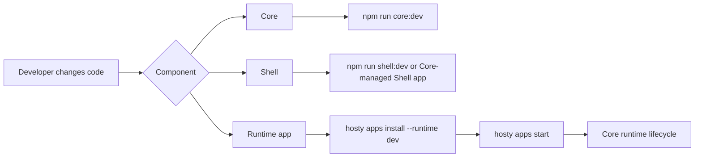

# Local Development And Testing

This document describes the current local feedback loops after the Core/Shell/runtime app split.

## Development Loops

Hosty local development uses normal component boundaries:

- Hosty Core runs as the local ASP.NET Core process.
- Hosty Shell runs as a runtime app and browser client for Core.
- User apps run through Core-managed runtime lifecycle, including local command runtime profiles.
- The CLI bootstraps Core and then calls Core APIs for app operations.



## Core And Shell

Run Core and Shell from source with one command:

```bash
npm install
npm run dev
```

`npm run dev` starts Core and Shell together. Core listens on `http://localhost:3001`, Shell listens on `http://localhost:3000`, and local state is stored in `.hosty-dev/` so branch development does not mutate an installed Hosty CLI data root. The script ensures two development-only local users exist for the Core login helper: `admin@hosty.local` with `host.admin` and `user@hosty.local` with `host.user`.

The script also lets Core bootstrap `hosty.shell` into the `.hosty-dev` app registry as a system app using the Shell manifest's `dev` runtime profile and this repository as the local source override. Core then autostarts Shell through the normal runtime app lifecycle, so the Shell dev server is visible in System Apps and its logs/health come from Core.

If those ports are already occupied, stop the existing process or choose an alternate local pair:

```bash
HOSTY_CORE_URL=http://localhost:3301 HOST_SHELL_PUBLIC_ORIGIN=http://localhost:3300 npm run dev
```

Run Core and Shell separately when debugging one side:

```bash
npm run core:dev
npm run shell:dev
```

Use `HOST_CORE_PUBLIC_ORIGIN` when Core is reached through a public origin that differs from its listen URL. Use `HOST_SHELL_PUBLIC_ORIGIN` when Shell runs on a different origin, and make the browser URL match exactly. For example, use `http://localhost:3000` consistently instead of mixing `localhost` and `127.0.0.1`.

`HOST_PUBLIC_ORIGIN` remains a compatibility alias for combined Core/Shell deployments. Prefer explicit Core/Shell origin variables for split-origin testing.

Use `HOSTY_SHELL_AUTOSTART=false npm run core:dev` when Shell is running as a separate Next.js dev process and Core should keep the installed `hosty.shell` app autostart setting disabled. Use `HOSTY_SHELL_BOOTSTRAP_RUNTIME=dev` and `HOSTY_SHELL_SOURCE_OVERRIDE_PATH=<repo-root>` when that Core process should register and run Shell with the manifest's local command runtime profile. Use Core-managed Shell when validating Shell runtime lifecycle behavior.

When validating runtime lifecycle behavior, prefer installing Shell through Core like any other runtime app.

For Shell-only runtime work through Core, use the Shell manifest's `dev` runtime profile:

```bash
hosty apps source-override hosty.shell --path "$PWD"
hosty apps switch-runtime-plan hosty.shell --runtime dev
hosty apps switch-runtime hosty.shell --runtime dev --plan-digest <digest>
```

Do not use this pattern for Core itself. Core cannot finish its own replacement after it exits; those operations need the trusted CLI or another outer supervisor.

## Local Runtime Apps

Local app development uses an app manifest runtime profile, not a separate local target command group.

For the repository demo app:

```bash
hosty core start
hosty apps install apps/demo-app/manifest.json --runtime dev
hosty apps start com.haas.demo-app
```

The `dev` runtime profile in `apps/demo-app/manifest.json` starts local command services from `apps/demo-app`:

- frontend on `http://localhost:3100`;
- backend on `http://localhost:3101`.

When Shell opens the Demo App, Core issues a one-time app authorization code. The Demo App exchanges that code through `HOSTY_CORE_ORIGIN`, creates its own app-origin cookie, and reports revalidation status on `/api/auth/identity`.

Use normal app lifecycle commands while iterating:

```bash
hosty apps list
hosty apps health com.haas.demo-app
hosty apps logs com.haas.demo-app
hosty apps restart com.haas.demo-app
hosty apps source com.haas.demo-app
hosty apps source-override com.haas.demo-app --path "$PWD"
hosty apps source-clear-override com.haas.demo-app
hosty apps switch-runtime-plan com.haas.demo-app --runtime docker
hosty apps switch-runtime com.haas.demo-app --runtime docker --plan-digest <digest>
```

Use `hosty apps source-resolve <app-id> --branch <name> --fetch` when the app should run from a Core-managed checkout. Use `source-override` when a specific local worktree should be used instead. Local override state is stored in the Hosty installation record and is not written back to the public app manifest.

## Local Command Constraints

`localCommand` profiles are process runtimes supervised by Core. Core starts each service command through the platform shell (`/bin/sh -c` on Unix-like systems and `cmd.exe /c` on Windows), captures stdout/stderr into app logs, injects Hosty environment variables, and reports process health through `hosty apps health`.

Production installers should treat `localCommand` as platform-specific unless the command is known to be portable. Prefer commands that:

- run in the foreground and let Core own stop/restart behavior;
- write diagnostics to stdout/stderr instead of daemonizing into a separate logger;
- read `HOSTY_APP_DATA_DIR`, `HOSTY_PORT_<KEY>`, `HOSTY_CORE_ORIGIN`, and dependency URL environment variables instead of hard-coding local paths or ports;
- avoid shell features that only exist on one target platform unless the runtime profile key or installer target makes that platform explicit;
- keep package installation outside runtime start commands so app start is repeatable and does not require network access.

Docker runtime profiles remain the production-oriented default for app distribution. `localCommand` is the local-first runtime path for source workflows and for apps that are intentionally supervised as local processes.

## Identity Checks

For direct local endpoint probes, request a Core-issued app identity token for an existing Hosty user:

```bash
TOKEN="$(hosty apps identity com.haas.demo-app --user user@docker-host.local --format token)"
curl -H "X-Docker-Host-Identity: $TOKEN" http://127.0.0.1:3100/api/auth/identity
```

For Shell or standalone launch validation, ask Core for an app open link:

```bash
hosty apps open com.haas.demo-app --user user@docker-host.local --mode shell
hosty apps open com.haas.demo-app --user user@docker-host.local --mode standalone
```

The CLI helpers use existing enabled Host users and normal app access checks. Disabled users, missing app assignments, incompatible exposure policy, and unavailable runtime state fail instead of silently issuing app identity. There is no deterministic development-user seeding or default bypass flag in the local source runtime workflow.

Do not validate Hosty identity, Shell embedding, app assignments, or scoped directory behavior by running an app only in standalone mode.

## Verification Checklist

For normal feature work:

- run `npm run core:build`;
- run `npm run core:test` for Core behavior changes;
- run `npm run shell:build` for Shell changes;
- run the app's lint/build/test scripts for runtime app changes;
- install the app manifest with the target runtime profile and exercise lifecycle through `hosty apps`.

For runtime changes:

- build the affected Docker image locally;
- run lifecycle commands through Core;
- verify logs, identity, data directory behavior, backups, and runtime status.
