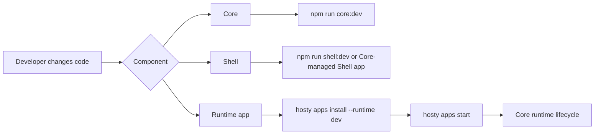

# Local Development And Testing

This document describes the current local feedback loops after the Core/Shell/runtime app split.

## Development Loops

Hosty local development uses normal component boundaries:

- Hosty Core runs as the local ASP.NET Core process.
- Hosty Shell runs as a runtime app and browser client for Core.
- User apps run through Core-managed runtime lifecycle, including local command runtime profiles.
- The CLI bootstraps Core and then calls Core APIs for app operations.



## Core And Shell

Run Core from source:

```bash
npm install
npm run core:dev
```

`npm run core:dev` starts Core in the development environment. Core listens on `http://127.0.0.1:3001` by default and allows the default local Shell origin `http://127.0.0.1:3000` for credentialed Shell API calls.

Shell can be run directly during UI work:

```bash
npm run shell:dev
```

Use `HOST_SHELL_PUBLIC_ORIGIN` when Shell runs on a different origin, and make the browser URL match exactly. For example, use `http://localhost:3000` consistently instead of mixing `localhost` and `127.0.0.1`.

Use `HOSTY_SHELL_AUTOSTART=false npm run core:dev` when Shell is running as a separate Next.js dev process and Core should not try to start the Docker-managed `hosty.shell` runtime app. Use Core-managed Shell only when validating runtime lifecycle behavior.

When validating runtime lifecycle behavior, prefer installing Shell through Core like any other runtime app.

## Local Runtime Apps

Local app development uses an app manifest runtime profile, not a separate local target command group.

For the repository demo app:

```bash
hosty core start
hosty apps install apps/demo-app/manifest.json --runtime dev
hosty apps start com.haas.demo-app
```

The `dev` runtime profile in `apps/demo-app/manifest.json` starts local command services from `apps/demo-app`:

- frontend on `http://localhost:3100`;
- backend on `http://localhost:3101`.

Use normal app lifecycle commands while iterating:

```bash
hosty apps list
hosty apps logs com.haas.demo-app
hosty apps restart com.haas.demo-app
hosty apps source com.haas.demo-app
hosty apps source-override com.haas.demo-app --path "$PWD"
hosty apps source-clear-override com.haas.demo-app
hosty apps switch-runtime-plan com.haas.demo-app --runtime docker
hosty apps switch-runtime com.haas.demo-app --runtime docker --plan-digest <digest>
```

Use `hosty apps source-resolve <app-id> --branch <name> --fetch` when the app should run from a Core-managed checkout. Use `source-override` when a specific local worktree should be used instead. Local override state is stored in the Hosty installation record and is not written back to the public app manifest.

## Identity Checks

For direct local endpoint probes, request a Core-issued app identity token for an existing Hosty user:

```bash
TOKEN="$(hosty apps identity com.haas.demo-app --user user@docker-host.local --format token)"
curl -H "X-Docker-Host-Identity: $TOKEN" http://127.0.0.1:3100/api/auth/identity
```

For Shell or standalone launch validation, ask Core for an app open link:

```bash
hosty apps open com.haas.demo-app --user user@docker-host.local --mode shell
hosty apps open com.haas.demo-app --user user@docker-host.local --mode standalone
```

Do not validate Hosty identity, Shell embedding, app assignments, or scoped directory behavior by running an app only in standalone mode.

## Production-Like Container Testing

Use this mode when the change needs to be validated in the same shape as the released legacy Host container, without pushing an image:

```bash
docker build -f apps/host/Dockerfile -t docker-host:dev .
hosty config set HOST_IMAGE docker-host:dev
hosty config set HOST_DATA_ROOT_HOST "$HOME/.hosty-dev"
hosty start
hosty open
```

Use a dedicated development data root such as `~/.hosty-dev` to avoid mixing test app state with a real local installation.

When the legacy Host container runs as `docker-host:dev`, app metadata URLs for services on the developer machine should use `host.docker.internal`. When Core runs directly through `npm run core:dev`, local URLs can point to `localhost`.

## Verification Checklist

For normal feature work:

- run `npm run core:build`;
- run `npm run core:test` for Core behavior changes;
- run `npm run shell:build` for Shell changes;
- run the app's lint/build/test scripts for runtime app changes;
- install the app manifest with the target runtime profile and exercise lifecycle through `hosty apps`.

For launch/runtime changes:

- build the affected Docker image locally;
- run lifecycle commands through Core;
- verify logs, identity, data directory behavior, backups, and runtime status.
