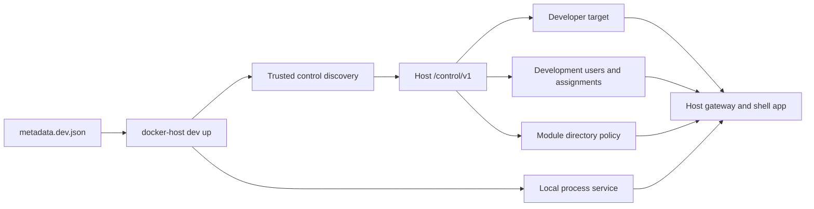

# Module Development Harness

The module development harness is the installed-CLI workflow for running a local module process through Docker Host. It keeps Docker Host responsible for gateway authentication, module assignment checks, Host-signed module identity tokens, direct-origin shell embedding, scoped module directory behavior, and app registry visibility while the module application runs from the developer machine.



## Commands

`docker-host dev up` prepares the integrated loop from `metadata.dev.json`:

```bash
docker-host dev up
```

It performs these steps:

- starts Docker Host or connects to the selected Host origin;
- discovers the Host local control channel from `<HOST_DATA_ROOT_HOST>/run/control.json`;
- serves local dev metadata to the Host when needed;
- links or updates a deterministic developer target through `/control/v1/modules/dev/targets/{targetId}`;
- reuses existing development users, updates their display name or role when needed, or creates missing users through Host-owned invitation flows;
- revokes an existing pending invitation for a manifest email before creating and accepting a fresh invitation, which keeps `dev up` idempotent after interrupted runs;
- applies manifest user assignments through Host-owned assignment services;
- applies module directory policy through Host-owned directory policy services;
- creates `<HOST_DATA_ROOT_HOST>/dev/modules/<module-id>/` for persistent development data;
- prints the Host shell app URL, gateway URL, and development account credentials;
- starts the local process service in the foreground unless `--prepare-only` is passed.

Use `--prepare-only` when another terminal or process manager owns the module dev server:

```bash
docker-host dev up --prepare-only
```

Use `--host-url` to connect to an already running Host origin:

```bash
docker-host dev up --host-url http://localhost:3000
docker-host dev status --host-url http://localhost:3000
docker-host dev reset --host-url http://localhost:3000
```

`docker-host dev status` reports Host readiness, target link state, target URL reachability, app registry visibility, and identity mode:

```bash
docker-host dev status
```

`docker-host dev reset` removes only harness-owned state for the manifest target:

```bash
docker-host dev reset
```

Reset deletes the developer target, removes the manifest module assignment from manifest users, and resets the module directory email policy when the target still exists and the module id can be resolved. It does not delete Host users because those accounts may also be useful for other local checks.

`docker-host dev clean` removes persistent development data for one module after confirmation:

```bash
docker-host dev clean com.haas.demo-module
docker-host dev clean modules/demo-module/metadata.dev.json --yes
```

When `--manifest` is omitted, `up`, `status`, and `reset` use `metadata.dev.json` from the current working directory. A supplied manifest path may be a JSON file or a directory containing `metadata.dev.json`.

## Dev Metadata

The canonical development manifest is module metadata. The demo module manifest lives at:

```text
modules/demo-module/metadata.dev.json
```

`metadata.dev.json` uses `schemaVersion: "0.3"` with canonical `services[]`. A local process service declares `source.type: "process"`:

```json
{
  "schemaVersion": "0.3",
  "id": "com.haas.demo-module",
  "name": "Demo Module",
  "version": "0.2.1",
  "services": [
    {
      "key": "app",
      "source": {
        "type": "process",
        "command": "npm run dev",
        "workingDirectory": ".",
        "environment": {
          "PORT": "3100"
        }
      },
      "runtime": {
        "ports": [
          {
            "key": "http",
            "containerPort": 3000,
            "localPort": 3100,
            "protocol": "http"
          }
        ]
      },
      "healthCheck": {
        "type": "http",
        "path": "/api/health",
        "successStatus": [200]
      }
    }
  ],
  "endpoints": [
    {
      "key": "http",
      "service": "app",
      "port": "http",
      "public": true
    }
  ]
}
```

The CLI maps the selected public endpoint to a developer target. It uses `runtime.ports[].localPort` as the local process port when present and falls back to `containerPort`. Relative process working directories are resolved from the metadata file location.

The CLI injects process environment values needed by Docker Host modules:

- values from `services[].source.environment`;
- `PORT` when not already set and a local port is known;
- `DOCKER_HOST_INTERNAL_ORIGIN`;
- `DOCKER_HOST_MODULE_ID`;
- `DOCKER_HOST_MODULE_DATA_ROOT`;
- `MODULE_ID`;
- `MODULE_VERSION`.

## Host Modes

`docker-container` mode is the production-like installed CLI loop. The CLI reads launch settings, starts the configured Host container when needed, discovers the mapped Host UI port from Docker, then reads the Host control discovery file from the data root.

`local-process` mode is for changing the Host itself. The CLI starts `host.command` as a child process, waits for the configured Host origin to publish control discovery, then links module developer targets through that local Host. The Host process is stopped when the foreground module command exits or the dev harness is interrupted.

`external` mode is for a Host that is already running. The CLI does not start, stop, inspect, or read logs from the Host process. It connects to `host.origin` or `--host-url` and uses local control for Host-owned operations.

The important distinction is network perspective:

- in `docker-container` mode, a module dev server on the developer machine is usually reached by the Host as `host.docker.internal`;
- in `local-process` mode, the Host process runs on the developer machine, so module dev servers are reached as `127.0.0.1`;
- in `external` mode, the local port shorthand assumes the Host also runs on the developer machine.

## Boundaries

The harness does not install module containers, create Docker volumes, or prove Dockerfile behavior. It is for fast integrated module development through the real Host gateway.

Use the harness for:

- direct-origin shell embedding;
- authenticated module pages;
- Host-signed identity token validation;
- assigned-user behavior;
- scoped directory reads;
- redirects, WebSockets, and SSE through the gateway.

Use production-like image testing for:

- Dockerfile changes;
- storage mounts;
- install and update plans;
- module container lifecycle;
- container networking.

## Authentication

`docker-host dev` uses the trusted local control channel. It requires local access to the Host data root and a running Host control endpoint; it does not require a Host user session, a CLI admin token, or `DOCKER_HOST_CLI_TOKEN`.

The CLI does not write Host auth JSON, module assignment JSON, or developer target JSON directly. It calls Host-owned control routes so audit events, metadata validation, and state normalization stay centralized in Docker Host.
