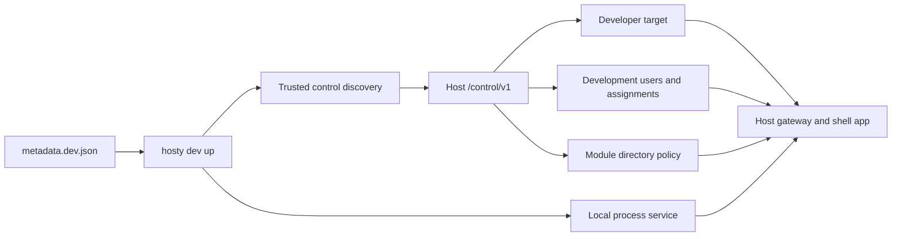

# Module Development Harness

The module development harness is the installed-CLI workflow for running a local module process through Hosty. It keeps Hosty responsible for gateway authentication, module assignment checks, Host-signed module identity tokens, direct-origin shell embedding, scoped module directory behavior, and app registry visibility while the module application runs from the developer machine.



## Commands

`hosty dev up` prepares the integrated loop from `metadata.dev.json`:

```bash
hosty dev up
```

It performs these steps:

- starts Hosty Core from source or connects to the selected Host origin;
- enables development auto-login and browser account seeding when it starts the local Host process;
- discovers the Host local control channel from `<HOST_DATA_ROOT_HOST>/run/control.json`;
- serves local dev metadata to the Host when needed;
- links or updates a deterministic developer target through `/control/v1/modules/dev/targets/{targetId}`;
- reuses existing development users, updates their display name or role when needed, or creates missing users through Host-owned invitation flows;
- revokes existing pending invitations for development account emails before creating and accepting fresh invitations, which keeps `dev up` idempotent after interrupted runs;
- applies development user assignments through Host-owned assignment services;
- applies module directory policy through Host-owned directory policy services;
- creates `<HOST_DATA_ROOT_HOST>/dev/modules/<module-id>/` for persistent development data;
- prints the Host shell app URL, gateway URL, and development account credentials;
- starts the local process service in the foreground unless `--prepare-only` is passed.

Use `--prepare-only` when another terminal or process manager owns the module dev server:

```bash
hosty dev up --prepare-only
```

Use `--host-url` to connect to an already running local Host origin:

```bash
hosty dev up --host-url http://localhost:3000
hosty dev status --host-url http://localhost:3000
hosty dev reset --host-url http://localhost:3000
```

`hosty dev status` reports Host readiness, target link state, target URL reachability, app registry visibility, and identity mode:

```bash
hosty dev status
```

`hosty dev identity` issues a short-lived Host-signed module identity token for the prepared developer target:

```bash
hosty dev identity --format token
hosty dev identity --user user@docker-host.local --format header
```

The command uses the trusted local control channel and the current `metadata.dev.json` to resolve the target id. `--user` accepts a development user email or Host user id. When omitted, the CLI uses the first assigned development user from the manifest, which is normally `admin@docker-host.local`. Supported output formats are:

- `header` - prints `X-Docker-Host-Identity: <token>` for direct `curl` probes;
- `token` - prints only the JWT for shell scripting;
- `json` - prints the full token response with module, target, origin, and user details;
- `env` - prints environment assignments for diagnostic scripts.

This token is real Host identity, signed by the local Host key store and scoped to the module id. It is still only a diagnostic helper for direct module-origin API probes. Use the Host shell app URL or gateway URL printed by `dev up` when validating app shell transport, gateway policy, browser sessions, redirects, WebSockets, SSE, or iframe identity bridging.

`hosty dev reset` removes only harness-owned state for the metadata target:

```bash
hosty dev reset
```

Reset deletes the developer target, removes the module assignment from development users, and resets the module directory email policy when the target still exists and the module id can be resolved. It does not delete Host users because those accounts may also be useful for other local checks.

`hosty dev clean` removes persistent development data for one module after confirmation:

```bash
hosty dev clean com.haas.demo-module
hosty dev clean modules/demo-module/metadata.dev.json --yes
```

When `--manifest` is omitted, `up`, `status`, and `reset` use `metadata.dev.json` from the current working directory. A supplied path may be a metadata JSON file or a directory containing `metadata.dev.json`.

`identity` follows the same manifest resolution rules and requires that `dev up` has already prepared the target and development users.

## Dev Metadata

The canonical development input is module metadata. The demo module metadata lives at:

```text
modules/demo-module/metadata.dev.json
```

`metadata.dev.json` uses `schemaVersion: "0.3"` with canonical `services[]`. A local process service declares `source.type: "process"`:

```json
{
  "schemaVersion": "0.3",
  "id": "com.haas.demo-module",
  "name": "Demo Module",
  "version": "0.2.1",
  "services": [
    {
      "key": "app",
      "source": {
        "type": "process",
        "command": "npm run dev",
        "workingDirectory": ".",
        "environment": {
          "PORT": "3100"
        }
      },
      "runtime": {
        "ports": [
          {
            "key": "http",
            "containerPort": 3000,
            "localPort": 3100,
            "protocol": "http"
          }
        ]
      },
      "healthCheck": {
        "type": "http",
        "path": "/api/health",
        "successStatus": [200]
      }
    }
  ],
  "endpoints": [
    {
      "key": "http",
      "service": "app",
      "port": "http",
      "public": true
    }
  ]
}
```

The CLI maps the selected public endpoint to a developer target. It uses `runtime.ports[].localPort` as the local process port when present and falls back to `containerPort`. Relative process working directories are resolved from the metadata file location.

The CLI injects process environment values needed by Docker Host modules:

- values from `services[].source.environment`;
- `PORT` when not already set and a local port is known;
- `DOCKER_HOST_INTERNAL_ORIGIN`;
- `DOCKER_HOST_MODULE_ID`;
- `DOCKER_HOST_MODULE_DATA_ROOT`;
- `MODULE_ID`;
- `MODULE_VERSION`.

The CLI also seeds two deterministic development accounts and assigns them to the linked module:

- `admin@docker-host.local` with password `docker-host-dev-admin` and role `host.admin`;
- `user@docker-host.local` with password `docker-host-dev-user` and role `host.user`.

Additional development users can be declared in the CLI-only `development.users` section of `metadata.dev.json`:

```json
{
  "development": {
    "users": [
      {
        "email": "reviewer@example.test",
        "displayName": "Review User",
        "role": "user"
      },
      {
        "email": "operator@example.test",
        "displayName": "Operator Admin",
        "role": "host.admin",
        "assigned": false
      }
    ]
  }
}
```

Supported role values are `admin`, `user`, `host.admin`, `host.user`, `host-admin`, and `host-user`; they normalize to `host.admin` or `host.user`. `assigned` defaults to `true`, so declared users are assigned to the linked module unless explicitly disabled. Passwords are optional and normally omitted; Docker Host uses deterministic development passwords only to satisfy the local-account model, not as a required dev workflow.

The `development` block is not part of production module metadata. The CLI reads it for local orchestration and strips it before serving metadata to the Host developer target validator, so the Host still validates the normal strict module metadata schema.

When development browser account seeding is enabled, Docker Host adds the deterministic accounts and all enabled local development users to the current browser account set. The sidebar account menu can then switch among those users without opening `/login` or entering credentials.

The harness sets module directory policy to include email addresses so local module UIs can validate scoped directory and module-owned role flows.

## Host Modes

The top-level `hosty dev` harness is dev-only. It does not start, inspect, or require the production Host container. Without `--host-url`, it requires `HOST_DEV_REPOSITORY_PATH` in CLI config and starts `npm run host:dev` in that repository, waits for the configured Host origin to publish control discovery, then links module developer targets through that local Host. The Host process is stopped when the foreground module command exits or the dev harness is interrupted.

For repository-local Host development, the CLI can infer `local-process` mode from launch settings:

```bash
hosty config set HOST_DEV_REPOSITORY_PATH /path/to/docker-host
hosty config set HOST_DEV_PORT 3000
hosty dev up --manifest modules/demo-module/metadata.dev.json
```

When `HOST_DEV_REPOSITORY_PATH` is set, `hosty dev up` starts `npm run host:dev` in that repository and uses `http://localhost:<HOST_DEV_PORT>` as the Host origin. The CLI injects `HOST_DATA_ROOT_HOST`, `HOST_DATA_ROOT_CONTAINER`, `HOST_INTERNAL_ORIGIN`, `HOST_CONTROL_PUBLIC_PORT`, `HOST_DEV_AUTH=auto`, `HOST_DEV_AUTH_SEED_BROWSER_ACCOUNTS=enabled`, and `PORT` into the Host process so trusted control discovery and development browser sessions work without manual setup. Existing `HOST_DEV_AUTH` and `HOST_DEV_AUTH_SEED_BROWSER_ACCOUNTS` environment values are preserved when they are already set.

If `HOST_DEV_REPOSITORY_PATH` is not configured, `hosty dev up` exits before reading module metadata or starting anything. Configure it first or pass a loopback `--host-url` for an already running development Host on the developer machine.

`external` mode is for a development Host that is already running on the developer machine. The CLI accepts only loopback `--host-url` origins such as `http://localhost:3000` or `http://127.0.0.1:3000`, because it serves `metadata.dev.json` and maps module process services through `127.0.0.1` from the Host process. The CLI does not start, stop, inspect, or read logs from the Host process. It connects to `--host-url` and uses local control for Host-owned operations.

In both modes, `runtime.ports[].localPort` maps the module target to `127.0.0.1:<port>` from the Host process.

## Boundaries

The harness does not install module containers, create Docker volumes, or prove Dockerfile behavior. It is for fast integrated module development through the real Host gateway.

Use the harness for:

- direct-origin shell embedding;
- authenticated module pages;
- Host-signed identity token validation;
- assigned-user behavior;
- scoped directory reads;
- redirects, WebSockets, and SSE through the gateway.

Use production-like image testing for:

- Dockerfile changes;
- storage mounts;
- install and update plans;
- module container lifecycle;
- container networking.

## Authentication

`hosty dev` uses the trusted local control channel. It requires local access to the Host data root and a running Host control endpoint; it does not require a Host user session, a CLI admin token, or `DOCKER_HOST_CLI_TOKEN`.

The CLI does not write Host auth JSON, module assignment JSON, or developer target JSON directly. It calls Host-owned control routes so audit events, metadata validation, and state normalization stay centralized in Docker Host.
