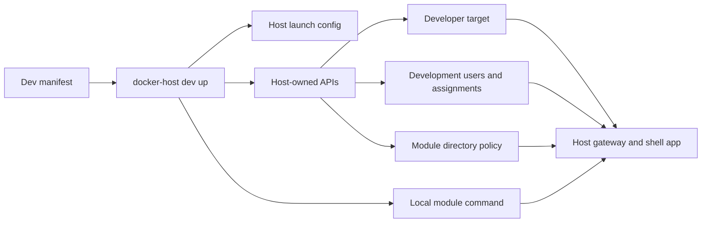

# Module Development Harness

The module development harness is the installed-CLI workflow for running a local module dev server through Docker Host. It keeps Docker Host responsible for gateway authentication, module assignment checks, `X-Docker-Host-Identity` signing, shell embedding, and scoped module directory behavior while the module application runs from the developer machine.



## Commands

`docker-host dev up` prepares the integrated loop from a manifest:

```bash
docker-host dev up --manifest modules/demo-module/.docker-host/dev.json
```

It performs these steps:

- enables `HOST_MODULE_DEV_MODE=enabled` in launch configuration when needed;
- starts Docker Host, or recreates it when the dev-mode launch setting changed;
- links or updates a deterministic developer target through `/api/modules/dev/targets/{targetId}`;
- reuses existing development users, updates their display name or role when needed, or creates missing users through Host invitation APIs;
- revokes an existing pending invitation for a manifest email before creating and accepting a fresh invitation, which keeps `dev up` idempotent after interrupted runs;
- applies manifest user assignments through Host user assignment APIs;
- applies module directory policy through the Host directory policy API;
- prints the Host shell app URL, gateway URL, and development account credentials;
- starts the local module command in the foreground unless `--prepare-only` is passed.

Use `--prepare-only` when another terminal or process manager should own the module dev server:

```bash
docker-host dev up --manifest modules/demo-module/.docker-host/dev.json --prepare-only
```

`docker-host dev status` reports Host readiness, developer mode, target link state, target URL reachability, app registry visibility, and identity mode:

```bash
docker-host dev status --manifest modules/demo-module/.docker-host/dev.json
```

`docker-host dev reset` removes only harness-owned state for the manifest target:

```bash
docker-host dev reset --manifest modules/demo-module/.docker-host/dev.json
```

Reset deletes the developer target, removes the manifest module assignment from manifest users, and resets the module directory email policy when the target still exists and the module id can be resolved. It does not delete Host users because those accounts may also be useful for other local checks.

When `--manifest` is omitted, all commands use `.docker-host/dev.json` from the current working directory.

## Manifest

A manifest is module-local JSON. The demo module manifest lives at `modules/demo-module/.docker-host/dev.json`.

```json
{
  "metadataFile": "../metadata.json",
  "metadataFileHost": "host.docker.internal",
  "moduleCommand": "npm run dev",
  "workingDirectory": "..",
  "target": {
    "id": "mdev_local_demo_module",
    "hostname": "demo.localhost",
    "portKey": "http",
    "targetBaseUrl": "http://host.docker.internal:3100",
    "policy": "assignedUsersOnly",
    "identity": "required"
  },
  "users": [
    {
      "email": "admin@docker-host.local",
      "displayName": "Development Admin",
      "role": "host.admin"
    },
    {
      "email": "user@docker-host.local",
      "displayName": "Development User",
      "role": "host.user",
      "assigned": true
    }
  ],
  "directoryPolicy": {
    "includeEmail": true
  },
  "environment": {
    "PORT": "3100",
    "DEMO_PUBLIC_URL": "http://localhost:3100"
  }
}
```

Supported fields:

- `metadataUrl`: absolute HTTP(S) metadata URL. Use this when metadata is already served somewhere the Host container can reach.
- `metadataFile`: local metadata JSON path, resolved relative to the manifest file. When this is used, the CLI temporarily serves the file and passes a `metadataFileHost` URL to the Host API.
- `metadataFileHost`: hostname the Host container should use to reach the temporary metadata server. The default is `host.docker.internal`, which matches Docker Desktop.
- `moduleCommand`: shell command started in the foreground by `dev up`. Required unless `--prepare-only` is passed.
- `workingDirectory`: command working directory, resolved relative to the manifest file.
- `target.id`: stable developer target id. If omitted, the CLI derives `mdev_{sanitized-hostname}` from `target.hostname`.
- `target.hostname`: local gateway hostname, such as `demo.localhost`.
- `target.portKey`: public endpoint key from module metadata.
- `target.targetBaseUrl`: URL the Host container should proxy to. For Docker Desktop this is usually `http://host.docker.internal:<port>`.
- `target.policy`: `public`, `loginRequired`, or `assignedUsersOnly`.
- `target.identity`: `none`, `optional`, or `required`.
- `users`: development Host users to ensure. Existing active users are reused; pending invitations with the same email are revoked before creating a fresh development user.
- `users[].assigned`: when true, the manifest module id is added to the user's assignments. When false or omitted, that module assignment is removed if present.
- `users[].password`: optional local development password. When omitted, `host.admin` uses `docker-host-dev-admin` and `host.user` uses `docker-host-dev-user`.
- `directoryPolicy.includeEmail`: whether scoped module directory responses may include email addresses.
- `environment`: additional environment variables for the local module process. The CLI also injects `DOCKER_HOST_INTERNAL_ORIGIN`, `DOCKER_HOST_MODULE_ID`, `MODULE_ID`, and `MODULE_VERSION`.

## Boundaries

The harness does not install module containers, create Docker volumes, or prove Dockerfile behavior. It is for fast integrated module development through the real Host gateway.

Use the harness for:

- shell embedding;
- authenticated module pages;
- Host-signed identity token validation;
- assigned-user behavior;
- scoped directory reads;
- redirects, WebSockets, and SSE through the gateway.

Use production-like image testing for:

- Dockerfile changes;
- storage mounts;
- install and update plans;
- module container lifecycle;
- container networking.

## Authentication

`docker-host dev` is a Host API-backed workflow. It requires the Host to be set up and the local CLI to have an admin token, either from `docker-host auth token import` or `DOCKER_HOST_CLI_TOKEN`.

The CLI does not write Host auth JSON, module assignment JSON, or developer target JSON directly. It calls Host-owned APIs so audit events, authorization checks, metadata validation, and state normalization stay centralized in Docker Host.
