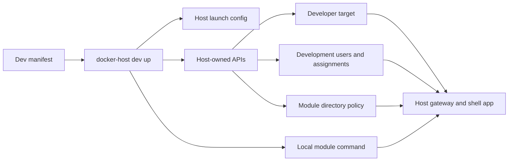

# Module Development Harness

The module development harness is the installed-CLI workflow for running a local module dev server through Docker Host. It keeps Docker Host responsible for gateway authentication, module assignment checks, Host-signed module identity tokens, direct-origin shell embedding, and scoped module directory behavior while the module application runs from the developer machine.



## Commands

`docker-host dev up` prepares the integrated loop from a manifest:

```bash
docker-host dev up --manifest modules/demo-module/.docker-host/dev.json
```

It performs these steps:

- enables `HOST_MODULE_DEV_MODE=enabled` in launch configuration when needed;
- starts Docker Host, or recreates it when the dev-mode launch setting changed;
- links or updates a deterministic developer target through `/api/modules/dev/targets/{targetId}`;
- reuses existing development users, updates their display name or role when needed, or creates missing users through Host invitation APIs;
- revokes an existing pending invitation for a manifest email before creating and accepting a fresh invitation, which keeps `dev up` idempotent after interrupted runs;
- applies manifest user assignments through Host user assignment APIs;
- applies module directory policy through the Host directory policy API;
- prints the Host shell app URL, gateway URL, and development account credentials;
- starts the local module command in the foreground unless `--prepare-only` is passed.

The harness can either manage the released Host container, start a local Host process from source, or connect to an already running Host API. This lets module work and Host development use the same dev target, user seeding, assignment, and gateway validation flow.

Use `--prepare-only` when another terminal or process manager should own the module dev server:

```bash
docker-host dev up --manifest modules/demo-module/.docker-host/dev.json --prepare-only
```

Use `--host-url` to connect to an already running Host without inspecting or starting the configured Host container:

```bash
docker-host dev up --manifest modules/demo-module/.docker-host/dev.json --host-url http://localhost:3000
docker-host dev status --manifest modules/demo-module/.docker-host/dev.json --host-url http://localhost:3000
docker-host dev reset --manifest modules/demo-module/.docker-host/dev.json --host-url http://localhost:3000
```

`docker-host dev status` reports Host readiness, developer mode, target link state, target URL reachability, app registry visibility, and identity mode:

```bash
docker-host dev status --manifest modules/demo-module/.docker-host/dev.json
```

`docker-host dev reset` removes only harness-owned state for the manifest target:

```bash
docker-host dev reset --manifest modules/demo-module/.docker-host/dev.json
```

Reset deletes the developer target, removes the manifest module assignment from manifest users, and resets the module directory email policy when the target still exists and the module id can be resolved. It does not delete Host users because those accounts may also be useful for other local checks.

When `--manifest` is omitted, all commands use `.docker-host/dev.json` from the current working directory.

## Manifest

A manifest is module-local JSON. The demo module manifest lives at `modules/demo-module/.docker-host/dev.json`.

```json
{
  "metadataFile": "../metadata.json",
  "moduleCommand": "npm run dev",
  "workingDirectory": "..",
  "target": {
    "id": "mdev_local_demo_module",
    "hostname": "demo.localhost",
    "portKey": "http",
    "localPort": 3100,
    "policy": "assignedUsersOnly",
    "identity": "required"
  },
  "users": [
    {
      "email": "admin@docker-host.local",
      "displayName": "Development Admin",
      "role": "host.admin"
    },
    {
      "email": "user@docker-host.local",
      "displayName": "Development User",
      "role": "host.user",
      "assigned": true
    }
  ],
  "directoryPolicy": {
    "includeEmail": true
  },
  "environment": {
    "PORT": "3100",
    "DEMO_PUBLIC_URL": "http://localhost:3100"
  }
}
```

Supported fields:

- `host.mode`: optional Host connection mode. Supported values are `docker-container`, `local-process`, and `external`. The default is `docker-container`, preserving the installed CLI behavior.
- `host.origin`: absolute Host API origin, for example `http://localhost:3000`. Required for `external` unless `host.port` is set.
- `host.port`: shorthand for `http://localhost:<port>`. For `local-process`, the default is `3000` when neither `host.origin` nor `host.port` is set.
- `host.command`: shell command used when `host.mode` is `local-process`, for example `npm run host:dev`.
- `host.workingDirectory`: working directory for `host.command`, resolved relative to the manifest file.
- `host.environment`: environment variables for `host.command`. The CLI also injects `HOST_MODULE_DEV_MODE=enabled`, `HOST_INTERNAL_ORIGIN`, and `PORT` when the origin has an explicit port and `PORT` is not already set.
- `metadataUrl`: absolute HTTP(S) metadata URL. Use this when metadata is already served somewhere the Host container can reach.
- `metadataFile`: local metadata JSON path, resolved relative to the manifest file. When this is used, the CLI temporarily serves the file and passes a `metadataFileHost` URL to the Host API.
- `metadataFileHost`: hostname the Host should use to reach the temporary metadata server. The default is `host.docker.internal` for `docker-container` and `127.0.0.1` for `local-process` or `external`.
- `moduleCommand`: shell command started in the foreground by `dev up`. Required unless `--prepare-only` is passed.
- `workingDirectory`: command working directory, resolved relative to the manifest file.
- `target.id`: stable developer target id. If omitted, the CLI derives `mdev_{sanitized-hostname}` from `target.hostname`.
- `target.hostname`: local gateway hostname, such as `demo.localhost`.
- `target.portKey`: public endpoint key from module metadata.
- `target.targetBaseUrl`: explicit URL the Host process should proxy to. For Docker-container mode on Docker Desktop this is usually `http://host.docker.internal:<port>`.
- `target.localPort`: shorthand for a module dev server running on the developer machine. In `docker-container` mode the CLI expands it to `http://host.docker.internal:<port>`; in `local-process` and `external` modes it expands to `http://127.0.0.1:<port>`.
- `target.policy`: `public`, `loginRequired`, or `assignedUsersOnly`.
- `target.identity`: `none`, `optional`, or `required`.
- `users`: development Host users to ensure. Existing active users are reused; pending invitations with the same email are revoked before creating a fresh development user.
- `users[].assigned`: when true, the manifest module id is added to the user's assignments. When false or omitted, that module assignment is removed if present.
- `users[].password`: optional local development password. When omitted, `host.admin` uses `docker-host-dev-admin` and `host.user` uses `docker-host-dev-user`.
- `directoryPolicy.includeEmail`: whether scoped module directory responses may include email addresses.
- `environment`: additional environment variables for the local module process. The CLI also injects `DOCKER_HOST_INTERNAL_ORIGIN`, `DOCKER_HOST_MODULE_ID`, `MODULE_ID`, and `MODULE_VERSION`.

## Host Modes

`docker-container` mode is the production-like installed CLI loop. The CLI reads launch settings, enables `HOST_MODULE_DEV_MODE`, starts or recreates the Host container when needed, discovers the mapped Host UI port from Docker, and reads the admin token for that Host origin.

`local-process` mode is for changing the Host itself. The CLI starts `host.command` as a child process, waits for the configured Host origin to answer the Host API, then links module developer targets through that local Host. The Host process is stopped when the foreground module command exits or the dev harness is interrupted.

Example:

```json
{
  "host": {
    "mode": "local-process",
    "origin": "http://localhost:3000",
    "command": "npm run host:dev",
    "workingDirectory": "../../..",
    "environment": {
      "HOST_DATA_ROOT_HOST": ".docker-host/local-host",
      "HOST_DATA_ROOT_CONTAINER": ".docker-host/local-host",
      "HOST_DEV_AUTH": "auto",
      "HOST_DEV_AUTH_SEED_BROWSER_ACCOUNTS": "enabled"
    }
  }
}
```

`external` mode is for a Host that is already running. The CLI does not start, stop, inspect, or read logs from the Host process. It only connects to `host.origin` or `--host-url` and uses the Host APIs. This is the right mode when the developer wants to run `npm run host:dev` in a separate terminal or debugger.

The important distinction is network perspective:

- in `docker-container` mode, a module dev server on the developer machine must usually be reached by the Host as `host.docker.internal`;
- in `local-process` mode, the Host process runs on the developer machine, so module dev servers can be reached as `127.0.0.1`;
- in `external` mode, `target.localPort` assumes the Host also runs on the developer machine. Use explicit `target.targetBaseUrl` when connecting to a Host on another machine or VM.

## Boundaries

The harness does not install module containers, create Docker volumes, or prove Dockerfile behavior. It is for fast integrated module development through the real Host gateway.

Use the harness for:

- direct-origin shell embedding;
- authenticated module pages;
- Host-signed identity token validation;
- assigned-user behavior;
- scoped directory reads;
- redirects, WebSockets, and SSE through the gateway.

Use production-like image testing for:

- Dockerfile changes;
- storage mounts;
- install and update plans;
- module container lifecycle;
- container networking.

## Authentication

`docker-host dev` is a Host API-backed workflow. It requires the Host to be set up and the local CLI to have an admin token, either from `docker-host auth token import` or `DOCKER_HOST_CLI_TOKEN`.

The CLI does not write Host auth JSON, module assignment JSON, or developer target JSON directly. It calls Host-owned APIs so audit events, authorization checks, metadata validation, and state normalization stay centralized in Docker Host.
