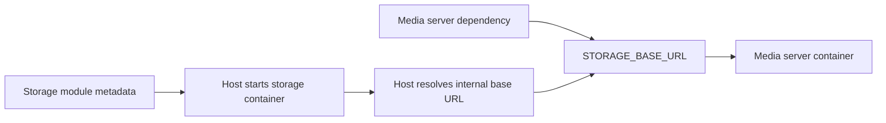

# Module metadata files

Этот документ описывает черновую модель добавления модулей в Docker Host. Это только продуктовая и техническая документация, без требований к текущей имплементации.

## Идея

Docker Host должен уметь добавлять не просто Docker images, а логические модули, которые запускаются в Docker. Источником описания модуля является не Git repository и не image repository, а прямая ссылка на JSON-файл с метаданными модуля.

Такой JSON-файл может лежать:

- в GitHub repository как raw file;
- в любом другом Git hosting provider;
- на обычном сайте;
- в object storage;
- во внутреннем HTTP-сервисе.

Имя файла не важно. Важно только, чтобы содержимое соответствовало ожидаемой JSON-структуре Docker Host.

Один Git repository или один сайт может хранить сразу много metadata JSON files для разных модулей. Host не должен скачивать repository целиком: ему достаточно получить конкретный JSON-файл, прочитать из него Docker image и дополнительные metadata, а затем скачать нужный image.

Metadata file описывает:

- уникальный идентификатор и человекочитаемое название модуля;
- Docker image, который нужно скачать и запустить;
- ссылки на metadata files зависимых модулей и правила передачи base URLs этих зависимостей;
- конфигурационные параметры, которые Host может запросить у администратора;
- используемые приложением директории внутри container image и правила их маппинга в host storage;
- динамические коллекции внешних storage mounts, если модуль должен работать с произвольным числом физических папок;
- минимальные runtime-требования: порты, переменные окружения, ресурсы.

## Термины

- **Host** - текущее приложение Docker Host, которое управляет модулями и контейнерами.
- **Module** - логическая функциональная единица, размещенная в Docker container.
- **Module metadata file** - JSON-файл, который описывает один модуль.
- **Module metadata URL** - прямая ссылка на module metadata file.
- **Image repository** - registry path, где лежит Docker image модуля, например `ghcr.io/acme/reports-module`.
- **Dependency module** - другой модуль, на metadata file которого ссылается текущий модуль.
- **Host data root** - физическая папка, где Docker Host хранит установленные модули и их данные.
- **Module directory** - папка конкретного модуля внутри `modules/<module-id>/`.
- **Module-owned storage** - storage-директория, которая физически находится внутри module directory.
- **External storage mount** - host path, выбранный администратором и находящийся за пределами module directory.
- **Mount collection** - декларация в metadata, которая разрешает администратору добавить динамическое количество external storage mounts одного типа.
- **Runtime endpoint** - именованный port зависимого модуля, по которому другие модули могут получить internal base URL.
- **Shell UI entrypoint** - будущий metadata contract для browser UI, который открывается только внутри Host shell на root domain.
- **Service/API exposure** - отдельная будущая декларация для endpoint, который можно публиковать на dedicated subdomain для сторонних клиентов. Такая декларация не делает browser UI модуля публичным.

## Metadata URL

Администратор добавляет модуль через URL конкретного JSON-файла, например:

```text
https://raw.githubusercontent.com/acme/docker-host-modules/main/reports.json
https://modules.acme.internal/reports/1.0.0/metadata.json
https://cdn.example.com/docker-host/modules/reports.json
```

Host не должен делать предположение, что URL указывает на Git repository. Даже если URL расположен внутри GitHub, он рассматривается как обычный JSON resource.

В MVP Host не применяет специальные security restrictions к metadata URL. Администратор сам принимает trust decision, когда вводит URL metadata file для установки модуля. Host должен скачать указанный resource, распарсить JSON, проверить metadata schema и показать install plan перед созданием контейнеров или mounts.

MVP не требует trusted domain allow-list, metadata signatures, SSRF protection, special redirect handling или warnings для распространенных image tags вроде `latest`.

MVP metadata downloader reliability limits:

- maximum response size: 1 MiB per metadata JSON file;
- request timeout: 10 seconds per metadata JSON fetch;
- maximum dependency graph size: root metadata plus 32 unique dependency nodes;
- dependency cycles must be rejected.

Для production-сценариев желательно использовать immutable URL:

- Git tag;
- Git commit SHA;
- signed metadata.

Branch URL удобен для разработки, но он менее предсказуем: содержимое JSON по тому же URL может измениться.

## Basic install flow

1. Администратор вводит module metadata URL.
2. Host скачивает JSON по этому URL.
3. Host валидирует `schemaVersion`, `id`, `image` и базовые runtime-поля.
4. Host рекурсивно читает зависимости из `dependencies`, используя их `metadataUrl`.
5. Host готовит module directory: `<host-data-root>/modules/<module-id>/`.
6. Host рассчитывает volume mappings для директорий из `storage.directories`.
7. Если metadata объявляет `storage.mountCollections`, Host дает администратору добавить внешние storage mounts.
8. Host показывает администратору итоговый install plan: модуль, image, зависимости, settings, module directory, storage mappings, external storage mounts, порты и потенциальные конфликты.
9. После подтверждения Host сохраняет metadata file в module directory, скачивает images и создает контейнеры зависимостей.
10. Host вычисляет internal base URLs зависимых модулей и прокидывает их в контейнер потребителя через environment variables.
11. Host запускает контейнер устанавливаемого модуля.
12. Host сохраняет установленный module source: metadata URL, image reference, computed storage mappings, resolved dependency URLs и external storage mounts.

Host должен хранить локальную копию metadata file, который был использован для установки или последнего обновления модуля.

В MVP install flow является optimistic fail-fast и не делает automatic rollback. Если один из шагов установки падает, Host должен сохранить уже созданные files, directories, downloaded images и containers для диагностики, пометить install как `failed` и показать ошибку администратору.

Retry и cleanup должны быть явными действиями администратора. Retry должен по возможности терпимо относиться к уже существующим directories, images и containers. Cleanup/removal failed install может быть отдельной операцией и должен явно показывать, будут ли удалены module data directories.

Минимальные persistent operation statuses первого implementation:

```text
installing
installed
updating
failed
removing
```

`removing` используется только во время explicit remove flow. Если remove падает до удаления registry entry, Host возвращает module status в `installed` и сохраняет `lastError`. Disable state/action не входит в lifecycle model. Если модуль не должен быть запущен, администратор использует stop.

Implemented recovery rules:

- failed install retry запускается явно и по умолчанию использует локальный `metadata.json` плюс сохраненный install record;
- retry пересоздает failed module container и сохраняет module-owned data directories;
- cleanup failed install и remove installed module используют backend-generated plan перед apply;
- module-owned data удаляется только при явном `deleteModuleData=true`;
- external host paths никогда не удаляются, Host удаляет только mappings из своего состояния;
- Docker images сохраняются и только показываются как preserved artifacts.

## Module update flow

Module update всегда должен refresh metadata URL установленного модуля. Host не должен трактовать update только как `docker pull` текущего image tag.

Базовый update flow:

1. Администратор выбирает update для установленного модуля.
2. Host скачивает свежий metadata JSON из сохраненного metadata URL.
3. Host валидирует metadata schema и проверяет, что `id` совпадает с установленным module id.
4. Host сравнивает свежий metadata file с локально сохраненным `metadata.json`.
5. Host показывает update plan: изменения image, settings schema, storage mappings, dependency metadata URLs, runtime ports/resources и потенциальные конфликты.
6. После подтверждения Host применяет update на основе новых metadata.
7. Host пересоздает или обновляет container configuration согласно новым metadata.
8. Host сохраняет свежий metadata file как локальный `metadata.json`.
9. Host сохраняет updated module source и computed mappings.

В MVP update failure handling следует тому же optimistic fail-fast подходу, что install failure handling. Если update падает на любом шаге после начала применения, Host не делает automatic rollback. Уже созданные files, directories, downloaded images и containers остаются для диагностики, module status становится `failed`, а retry/cleanup выполняются только явным действием администратора.

## Host storage layout

Docker Host хранит установленные модули внутри `modules` directory своего data root. Для каждого модуля создается отдельная папка по `id` модуля.

Физический default path для Host data root на машине администратора:

```text
~/.docker-host
```

Так как production-like запуск Host container-first, `docker-host` CLI должен по умолчанию монтировать этот путь внутрь Host container как `/data`. Внутри Host container backend работает с `HOST_DATA_ROOT_CONTAINER=/data`, а физические данные остаются в `HOST_DATA_ROOT_HOST`, обычно `~/.docker-host`, на машине администратора.

CLI должен передавать Host backend оба data root path:

```env
HOST_DATA_ROOT_HOST=/Users/example/.docker-host
HOST_DATA_ROOT_CONTAINER=/data
```

Host backend использует `HOST_DATA_ROOT_CONTAINER` для собственного file IO внутри Host container. Для Docker bind mount source paths module containers backend должен использовать `HOST_DATA_ROOT_HOST`, потому что Docker daemon интерпретирует bind source paths относительно host machine, а не относительно filesystem Host container.

Пример:

```text
<host-data-root>/
  modules.json
  modules/
    com.acme.reports/
      metadata.json
      settings/
      data/
      cache/
```

Назначение файлов и папок:

- `modules.json` - root-level registry установленных модулей, persistent module state и MVP Host-owned settings: module id, source metadata URL для install/update, settings values, install/update status, failure state, last error details, computed storage mappings, resolved dependency URLs и настройки Host backend, которые не являются CLI launch settings;
- `metadata.json` - локальная копия module metadata file, полученного по metadata URL;
- `settings/`, `data/`, `cache/` - физические папки, которые маппятся в container paths из `storage.directories`.

Host использует `modules.json` как registry установленных модулей, источник metadata URL для update flow и место хранения install/update bookkeeping. Runtime container status модуля не хранится в `modules.json`: Host получает текущее состояние container из Docker daemon.

Отдельный `host-settings.json` в MVP не создается. Launch settings самого Host container остаются в CLI-owned `config/launch.env`; настройки, которыми владеет Host backend, при необходимости сохраняются в root-level `modules.json`.

Отдельные per-module `module-state.json`, `module-installation.json` или `module-settings.json` не создаются в MVP. `metadata.json` и storage-директории находятся рядом, потому что они описывают установленную конфигурацию конкретного модуля. При переносе или backup модуля Host должен учитывать и module directory, и соответствующую запись в root-level `modules.json`.

External storage mounts могут находиться за пределами `modules/<module-id>/`. В этом случае внутри module directory хранится только mapping configuration, а сами данные остаются в выбранной администратором физической папке.

## Metadata draft

```json
{
  "schemaVersion": "0.1",
  "id": "com.acme.reports",
  "name": "Reports",
  "description": "Generates operational reports from host-managed data.",
  "version": "1.0.0",
  "image": {
    "repository": "ghcr.io/acme/reports-module",
    "tag": "1.0.0",
    "pullPolicy": "ifNotPresent"
  },
  "dependencies": [
    {
      "id": "com.acme.identity",
      "version": "1",
      "required": true,
      "metadataUrl": "https://raw.githubusercontent.com/acme/docker-host-modules/main/identity.json",
      "connection": {
        "endpoint": "http",
        "baseUrlEnv": "IDENTITY_BASE_URL"
      }
    }
  ],
  "settings": [
    {
      "key": "REPORT_RETENTION_DAYS",
      "type": "number",
      "required": true,
      "default": 30,
      "target": {
        "type": "env",
        "name": "REPORT_RETENTION_DAYS"
      }
    },
    {
      "key": "EXTERNAL_API_TOKEN",
      "type": "secret",
      "required": false,
      "target": {
        "type": "env",
        "name": "EXTERNAL_API_TOKEN"
      }
    }
  ],
  "storage": {
    "directories": [
      {
        "key": "settings",
        "label": "Settings",
        "description": "Persistent module configuration files.",
        "containerPath": "/app/settings",
        "purpose": "settings",
        "required": true,
        "writable": true,
        "mount": {
          "recommended": true,
          "type": "bind",
          "modulePath": "settings"
        }
      },
      {
        "key": "data",
        "label": "Data",
        "description": "Generated reports and local module state.",
        "containerPath": "/app/data",
        "purpose": "data",
        "required": true,
        "writable": true,
        "mount": {
          "recommended": true,
          "type": "bind",
          "modulePath": "data"
        }
      },
      {
        "key": "cache",
        "label": "Cache",
        "containerPath": "/app/cache",
        "purpose": "cache",
        "required": false,
        "writable": true,
        "mount": {
          "recommended": true,
          "type": "bind",
          "modulePath": "cache"
        }
      }
    ]
  },
  "runtime": {
    "ports": [
      {
        "key": "http",
        "containerPort": 8080,
        "protocol": "http",
        "public": true
      }
    ],
    "resources": {
      "cpus": 1,
      "memory": "512m"
    }
  },
  "ui": {
    "category": "Apps",
    "icon": "boxes",
    "entrypoint": {
      "portKey": "http",
      "path": "/"
    },
    "navigation": [
      {
        "label": "Overview",
        "path": "/"
      },
      {
        "label": "People",
        "path": "/people"
      }
    ]
  }
}
```

## Schema source of truth

На текущем этапе источником правды для module metadata schema является этот документ: пример `Metadata draft`, `Schema outline`, field notes и validation rules ниже вместе описывают ожидаемый контракт.

Executable validation now lives inside the Host backend and follows this document. The Host validates and normalizes `schemaVersion: "0.1"` metadata in `apps/host/src/lib/module-metadata.ts` and uses it from the read-only install planner. Отдельный shared contracts package или generated schema artifact для metadata MVP не требуется; этот документ остается источником правды для supported metadata contract.

## Schema outline

Top-level metadata object:

| Field | Type | Required | Notes |
| --- | --- | --- | --- |
| `schemaVersion` | string | yes | Version of the metadata file schema supported by Host. Current draft value: `0.1`. |
| `id` | string | yes | Stable unique module id, recommended reverse-DNS format. |
| `name` | string | yes | Human-readable module name. |
| `description` | string | no | Short module description for UI display. |
| `version` | string | yes | Module contract version. Host uses the major part for dependency compatibility in the first implementation. |
| `image` | object | yes | Docker image reference and pull behavior. |
| `dependencies` | array | no | Dependency metadata URLs and connection mappings. Default: empty array. |
| `settings` | array | no | Configuration schema. Values are stored by Host, not in metadata. Default: empty array. |
| `storage` | object | no | Module-owned storage directories and dynamic external mount collections. |
| `runtime` | object | yes | Minimal launch requirements: ports and resource hints. |
| `ui` | object | no | Shell-only UI entrypoint and optional navigation for the Host app registry. |

`image` object:

| Field | Type | Required | Notes |
| --- | --- | --- | --- |
| `repository` | string | yes | Docker image repository, for example `ghcr.io/acme/reports-module`. |
| `tag` | string | yes | Docker image tag. |
| `pullPolicy` | string | no | One of `ifNotPresent`, `always`, or `manual`. Default: `ifNotPresent`. |

`dependencies[]` item:

| Field | Type | Required | Notes |
| --- | --- | --- | --- |
| `id` | string | yes | Expected dependency module id. |
| `version` | string | yes | Expected dependency major contract version, for example `"1"`. |
| `required` | boolean | yes | Whether the consumer can start without this dependency resolved. |
| `metadataUrl` | string | yes | Direct URL to the dependency metadata JSON file. |
| `connection` | object | no | Required when the consumer needs a runtime base URL from the dependency. |

`dependencies[].connection` object:

| Field | Type | Required | Notes |
| --- | --- | --- | --- |
| `endpoint` | string | yes | Dependency `runtime.ports[].key` to use. |
| `baseUrlEnv` | string | yes | Environment variable name that receives the resolved internal base URL. |

`settings[]` item:

| Field | Type | Required | Notes |
| --- | --- | --- | --- |
| `key` | string | yes | Stable setting key, unique inside the metadata file. |
| `type` | string | yes | One of `string`, `number`, `boolean`, `url`, or `secret`. |
| `required` | boolean | yes | Whether the administrator must provide or confirm a value. |
| `default` | any | no | Default value. Secrets must not contain real secret values in `default`. |
| `target` | object | no | Runtime target for the resolved setting. First implementation target type: `env`. |

`storage` object:

| Field | Type | Required | Notes |
| --- | --- | --- | --- |
| `directories` | array | no | Fixed module-owned container paths that Host maps into the module directory. |
| `mountCollections` | array | no | Dynamic external mount collections configured by the administrator. |

`storage.directories[]` item:

| Field | Type | Required | Notes |
| --- | --- | --- | --- |
| `key` | string | yes | Stable storage key, unique inside the metadata file. |
| `label` | string | no | Human-readable label for UI display. |
| `description` | string | no | Short explanation for UI display. |
| `containerPath` | string | yes | Absolute Unix path inside the module container. |
| `purpose` | string | no | Suggested purpose, for example `settings`, `data`, `cache`, `logs`, or `temp`. |
| `required` | boolean | yes | Whether the mapping must exist before container start. |
| `writable` | boolean | yes | Whether the module expects write access. |
| `mount` | object | yes | Mount recommendation. Base implementation supports only `type: "bind"`. |

`storage.mountCollections[]` item:

| Field | Type | Required | Notes |
| --- | --- | --- | --- |
| `key` | string | yes | Stable collection key, unique inside the metadata file. |
| `label` | string | no | Human-readable label for UI display. |
| `description` | string | no | Short explanation for UI display. |
| `purpose` | string | no | Suggested purpose, usually `data`. |
| `required` | boolean | yes | Whether at least the configured minimum must be present. |
| `minItems` | number | no | Minimum number of external mounts. Default: `0`. |
| `maxItems` | number or null | no | Maximum number of external mounts. `null` means no fixed limit. |
| `writable` | boolean | yes | Whether items are writable by default. |
| `containerPathPrefix` | string | yes | Absolute Unix prefix for collection item paths inside the container. |
| `itemContainerPathTemplate` | string | yes | Template for item paths. Must contain a safe `{key}` segment. |
| `hostPathPolicy` | object | yes | Host path selection policy. External paths are administrator-selected. |

`runtime` object:

| Field | Type | Required | Notes |
| --- | --- | --- | --- |
| `ports` | array | yes | Named container endpoints. |
| `healthcheck` | object | no | Reserved for future module health checks. Ignored by the first implementation. |
| `resources` | object | no | CPU and memory hints. |

For `schemaVersion: "0.1"`, metadata validation is strict: unknown fields are rejected at every object level. The MVP does not reserve or accept extension namespaces such as `x-*`. Future extensions must use a new schema version or a separately documented namespace. The only reserved field accepted by the MVP schema is `runtime.healthcheck`, and the MVP runtime must ignore it.

`runtime.ports[]` item:

| Field | Type | Required | Notes |
| --- | --- | --- | --- |
| `key` | string | yes | Stable endpoint key, unique inside the metadata file. |
| `containerPort` | number | yes | Container port number. |
| `protocol` | string | yes | First implementation target: `http`. |
| `public` | boolean | yes | Whether the endpoint is suitable for Host-managed routing beyond module-to-module internal dependency URLs. This is a capability hint, not an authorization policy. It does not publish the endpoint, does not create a direct public module UI domain, and does not make the endpoint appear in Apps navigation by itself. |

`ui` object:

| Field | Type | Required | Notes |
| --- | --- | --- | --- |
| `category` | string | no | Must be the non-empty value `Apps` when provided. |
| `icon` | string | no | Non-empty lowercase icon key for future sidebar rendering, for example `boxes`. |
| `entrypoint` | object | yes | Shell UI entrypoint. |
| `navigation` | array | no | Optional nested app navigation. Default: empty array. |

`ui.entrypoint` object:

| Field | Type | Required | Notes |
| --- | --- | --- | --- |
| `portKey` | string | yes | Must reference a `runtime.ports[].key` whose port is marked `public: true`. This does not create anonymous access; it only marks the port as suitable for Host-managed shell routing. |
| `path` | string | yes | Same-origin absolute path beginning with `/`, such as `/` or `/dashboard`. Direct URLs and protocol-relative paths are rejected. |

`ui.navigation[]` item:

| Field | Type | Required | Notes |
| --- | --- | --- | --- |
| `label` | string | yes | Sidebar label, at most 80 characters. |
| `path` | string | yes | Same-origin absolute module UI path beginning with `/`. Navigation paths must be unique within one `ui.navigation` array. |

The `ui` contract never requests a public module UI hostname. The Host app registry remains authenticated and returns same-origin Host shell paths only. Modules without `ui` metadata can still be installed, but they do not appear as shell Apps.

Invalid `ui` metadata is rejected during install or update planning. Missing `ui` metadata is valid and means the module does not appear as a shell App. The Host does not infer shell Apps from gateway exposure records, public runtime ports, service/API endpoint hostnames, or runtime route probing.

## Field notes

### `id`

Уникальный идентификатор модуля. Рекомендуемый формат - reverse DNS, например `com.acme.reports`.

Host должен использовать `id` для:

- проверки конфликтов между установленными модулями;
- связывания зависимостей;
- сохранения settings;
- отображения module lifecycle: installed, update available, failed.

`id` берется из metadata file, а не из URL. Один и тот же модуль может быть доступен по разным URLs, но Host должен считать его тем же модулем, если `id` совпадает.

### `image`

`image.repository` и `image.tag` задают Docker image. Metadata не фиксирует immutable image reference: обычные обновления модуля должны происходить через обновление Docker image, на который указывает tag.

Metadata model не задает общего naming convention для Docker image repositories. Module author может указать image из Docker Hub, GHCR, internal registry или любого другого container registry, доступного Docker daemon.

Если `image.tag` равен `latest`, metadata URL может оставаться неизменным, а новый Docker image может публиковаться под тем же tag. При module update Host все равно сначала refreshes metadata URL, затем применяет image/container update на основе актуальных metadata. Если нужен более стабильный канал, tag может быть `1`, `1.0`, `stable` или другим соглашением автора модуля.

`image.pullPolicy` задает, когда Host должен пытаться скачать image:

- `ifNotPresent` - скачать image только если его еще нет локально;
- `always` - при запуске или update check пытаться подтянуть актуальный image для указанного tag;
- `manual` - не подтягивать автоматически, только по явному действию администратора.

Если `pullPolicy` не указан, default должен быть `ifNotPresent`. Для CI-style модулей с tag `latest` автор metadata может указать `always`.

### Versioning and compatibility

`version` на верхнем уровне описывает версию module metadata и контракта модуля. Это не механизм частых обновлений image и не точная фиксация версии зависимости.

Рекомендуемый формат - `MAJOR.MINOR.PATCH`, например `1.0.0`. На текущем этапе Host использует только `MAJOR` для проверки dependency compatibility.

Обычный CI-flow выглядит так:

- metadata file остается тем же;
- `image.repository` и `image.tag` остаются теми же;
- автор модуля публикует новый Docker image под тем же tag;
- при module update Host refreshes metadata URL, видит тот же image reference, подтягивает актуальный Docker image для tag согласно `pullPolicy` и обновляет container.

`version` стоит менять для крупных несовместимых изменений: например, если изменились API, storage contract или ожидаемая модель взаимодействия с другими модулями. В таком случае metadata может указывать на image tag вроде `2.0`, но Host все равно не запускает параллельно несколько версий одного module `id`.

На текущем этапе Host не решает совместимость через SemVer ranges, exact module versions или запуск нескольких версий одного и того же модуля. Локальная система должна держать один установленный module instance на один `id`.

Зависимости могут указывать ожидаемую major-версию контракта зависимого модуля. Это дает простую проверку несовместимых major changes, но не превращает Host в dependency version solver.

Совместимость между модулями в будущем лучше регулировать через стабильные API-контракты, обратную совместимость API или отдельные capability fields, а не через подбор нескольких версий модулей.

### `dependencies`

Зависимость указывает не image repository, не Git repository и не version range, а URL другого module metadata file и ожидаемую major-версию его контракта.

На первом этапе implementation scope включает только required dependencies. Optional dependencies остаются частью общей модели, но должны быть спроектированы и реализованы позже как отдельная feature. MVP Host не должен реализовывать optional dependency resolution; metadata с `dependencies[].required: false` должна быть отклонена как unsupported или отложена до отдельного optional dependencies slice.

Пример:

```json
{
  "id": "com.acme.identity",
  "version": "1",
  "required": true,
  "metadataUrl": "https://modules.acme.internal/identity/1.2.0/metadata.json",
  "connection": {
    "endpoint": "http",
    "baseUrlEnv": "IDENTITY_BASE_URL"
  }
}
```

`dependencies[].version` - это major-версия контракта, а не точная версия image и не SemVer range. Например, dependency `version: "1"` совместима с dependency metadata `version: "1.2.0"`, но несовместима с `version: "2.0.0"`.

`dependencies[].connection` описывает, как потребляющий модуль узнает runtime URL зависимого модуля:

- `endpoint` - имя endpoint в `runtime.ports[]` зависимого модуля;
- `baseUrlEnv` - environment variable, которую Host должен передать в контейнер потребляющего модуля.

Если dependency объявляет `connection`, поля `endpoint` и `baseUrlEnv` обязательны. Host не должен угадывать endpoint по protocol или выбирать первый порт. Потребитель всегда явно указывает `runtime.ports[].key` зависимого модуля.

Например, storage module может иметь два HTTP endpoint:

```json
{
  "id": "com.modulis.storage",
  "version": "1.0.0",
  "runtime": {
    "ports": [
      {
        "key": "api",
        "containerPort": 8080,
        "protocol": "http",
        "public": false
      },
      {
        "key": "admin",
        "containerPort": 9090,
        "protocol": "http",
        "public": false
      }
    ]
  }
}
```

Media server должен явно выбрать, какой endpoint ему нужен:

```json
{
  "id": "com.modulis.storage",
  "version": "1",
  "required": true,
  "metadataUrl": "https://modules.example.com/storage.json",
  "connection": {
    "endpoint": "api",
    "baseUrlEnv": "STORAGE_BASE_URL"
  }
}
```

В этом случае Host прокинет в `STORAGE_BASE_URL` URL для `api`, а не для `admin`.

На базовом этапе module-to-module discovery работает только через environment variables. Отдельный Host API для runtime introspection зависимостей не требуется.

Например, если media server зависит от file storage, media server может объявить:

```json
{
  "id": "com.modulis.storage",
  "version": "1",
  "required": true,
  "metadataUrl": "https://modules.example.com/storage.json",
  "connection": {
    "endpoint": "api",
    "baseUrlEnv": "STORAGE_BASE_URL"
  }
}
```

После запуска storage module Host вычисляет internal base URL, например `http://mod-com-modulis-storage:8080`, и запускает media server с переменной окружения:

```text
STORAGE_BASE_URL=http://mod-com-modulis-storage:8080
```

В этом примере `mod-com-modulis-storage` - не имя контейнера и не Compose service name. Это стабильный network alias, который Host назначает контейнеру зависимого модуля внутри user-defined Docker network.

Network alias должен строиться детерминированно из module `id`:

```text
com.modulis.storage -> mod-com-modulis-storage
com.acme.media-server -> mod-com-acme-media-server
```

Базовое правило нормализации:

- привести `id` к lowercase;
- заменить все символы кроме `a-z`, `0-9` на `-`;
- схлопнуть повторяющиеся `-`;
- добавить префикс `mod-`;
- проверить итоговый alias на уникальность среди установленных модулей.

Если нормализация дает конфликт или слишком длинный DNS label, Host должен использовать детерминированный hash suffix, но это остается внутренней деталью Host. Модуль-потребитель не должен сам собирать alias по `id`: он получает готовый URL через env-переменную.

Docker Compose не является обязательным требованием. Host может сам создать Docker network и подключать контейнеры к ней через Docker API, назначая нужные aliases. Compose можно использовать как внутреннюю реализацию, но metadata model не должна зависеть от Compose-файла.

Metadata не должна фиксировать container name, host port или absolute URL зависимого модуля. Она только описывает, какой endpoint нужен потребителю и в какую env-переменную Host должен положить resolved base URL.

Resolved dependency base URLs должны быть только internal Docker-network URLs. Host не использует metadata dependency model для передачи внешних public URLs между модулями. Если модулю нужны внешние сервисы, такие URLs остаются ответственностью самого модуля или его обычных settings.

Если dependency обязательная (`required: true`), Host должен установить и запустить ее до запуска потребителя. Если Host не может получить resolved base URL обязательной dependency, запуск потребителя должен быть остановлен с понятной ошибкой.

Если dependency уже установлена и install plan помечает ее как reusable, planner и install apply проверяют `modules.json`, major-совместимость локального `metadata.json` и наличие Docker container. Apply повторяет эти проверки до начала мутаций нового consumer module. Если reusable dependency container отсутствует, установка consumer module отклоняется как конфликт; автоматическое восстановление dependency остается отдельным recovery flow.

Future optional dependencies behavior: если dependency опциональная (`required: false`) и она не установлена или отключена, Host должен не задавать `baseUrlEnv` или передать пустое значение. Потребляющий модуль должен трактовать пустую или отсутствующую env-переменную как "integration unavailable" и работать без этой dependency. Это не входит в first implementation scope.

Future optional dependency example:

```json
{
  "id": "com.modulis.recommendations",
  "version": "1",
  "required": false,
  "metadataUrl": "https://modules.example.com/recommendations.json",
  "connection": {
    "endpoint": "http",
    "baseUrlEnv": "RECOMMENDATIONS_BASE_URL"
  }
}
```

Если recommendations module недоступен, Host запускает потребителя без `RECOMMENDATIONS_BASE_URL` или с пустым значением:

```text
RECOMMENDATIONS_BASE_URL=
```

Диагностика состояния модулей остается ответственностью Host. В MVP Host UI должен показывать Docker daemon container state, чтобы администратор видел, какой модуль запущен, остановлен или завершился с ошибкой. Module health checks и unified health response model должны быть отдельной future feature.



Host должен уметь:

- скачать dependency metadata files;
- показать дерево зависимостей до установки;
- проверить, что `id` и major-версия скачанного dependency metadata совпадают с объявленной dependency;
- проверить, что каждый `dependencies[].connection` содержит `endpoint` и `baseUrlEnv`;
- проверить, что запрошенный `connection.endpoint` есть в `runtime.ports[]` dependency metadata;
- передать resolved dependency base URLs в environment variables потребляющего модуля;
- не запускать потребителя, если обязательная dependency не может быть resolved;
- в future optional dependency feature оставлять target environment variable пустой или unset, если optional dependency недоступна;
- обнаружить циклические зависимости;
- проверить, что в install plan нет конфликтующих metadata URLs или major-версий для одного dependency `id`;
- не устанавливать dependency автоматически без явного подтверждения администратора.

Host не требует отдельный публичный `metadataDigest` для каждой dependency metadata. Источником зависимости является набор `id` + `version` + `metadataUrl`, где `version` означает ожидаемую major-версию контракта. Содержимое dependency metadata и итоговое dependency tree покрываются общим `planDigest` install plan.

### `settings`

`settings` описывает не значения, а схему конфигурации. Значения вводятся и хранятся на стороне Host.

Базовые типы:

- `string`;
- `number`;
- `boolean`;
- `url`;
- `secret`.

В первой реализации все module settings считаются environment variables. Значения хранятся в `modules.json` как key/value pairs внутри записи установленного модуля. Ключ setting соответствует `settings[].key` из metadata и используется как environment variable name. Если позже появятся не-env targets, schema хранения settings может быть расширена.

Секреты не должны храниться в metadata file. Metadata только объявляет, что такой секрет нужен.

В MVP secret settings хранятся там же, где обычные module settings: в root-level `modules.json` внутри записи установленного модуля. `type: "secret"` не означает отдельное secret storage; это правило обработки значения на уровне Host API, Web UI, logs и diagnostics.

Host должен обращаться с secret settings как с write-only values на UI/API boundary:

- API responses, которые использует Web UI, не должны возвращать raw secret value;
- UI может показывать, что значение задано, и должен позволять set, change и clear без раскрытия текущего значения;
- install plan, status views, logs, error messages и diagnostics должны показывать redacted value, а не реальный secret;
- secret value может быть передан в runtime configuration модуля, например как environment variable, если так задано в setting target.

Такой подход считается достаточным для local-first MVP. Основная защита на первом этапе - не допустить случайного раскрытия token/API key через Web UI, API responses, logs или diagnostics. Шифрование secret files, OS keychain integration, protected local files и external secret managers можно рассмотреть позже как advanced storage backends.

### `storage`

`storage.directories` описывает фиксированные директории, которые приложение использует внутри container image. Это не фактические host paths, а декларация того, какие container paths желательно или обязательно вынести в persistent storage.

Типовые назначения:

- `settings` - конфигурационные файлы приложения;
- `data` - пользовательские или бизнес-данные;
- `cache` - кэш, который можно пересоздать;
- `logs` - файловые логи, если модуль не пишет их только в stdout/stderr;
- `temp` - временные файлы.

Пример директории:

```json
{
  "key": "data",
  "label": "Data",
  "containerPath": "/app/data",
  "purpose": "data",
  "required": true,
  "writable": true,
  "mount": {
    "recommended": true,
    "type": "bind",
    "modulePath": "data"
  }
}
```

Host должен использовать эти данные для volume mapping:

- показать администратору список директорий, которые модуль хочет использовать;
- вычислить host path внутри module directory, например `~/.docker-host/modules/com.acme.reports/data`;
- создать bind mount на физическую папку Host;
- передать mapping в Docker как volume mount, например `~/.docker-host/modules/com.acme.reports/data:/app/data`;
- сохранить computed mapping как часть установленного модуля.

На базовом уровне `mount.type` должен быть `bind`, чтобы обычные module-owned данные физически лежали в module directory Host. Docker named volumes можно рассмотреть позже как advanced mode, но они не являются базовым контрактом этой metadata-схемы.

`modulePath` должен быть относительным путем внутри module directory. Если `modulePath` не указан, Host может использовать `storage.directories[].key` как имя подпапки. Metadata file не должен навязывать absolute host paths вроде `/etc`, `/var/run` или `/Users/...`.

Host не должен давать администратору менять `modulePath` или `containerPath` для обычных `storage.directories`. Эти значения являются частью контракта модуля: автор модуля сам решает, какая структура папок нужна приложению.

Например, для module id `com.acme.reports` и `modulePath: "data"` итоговый host path будет:

```text
<host-data-root>/modules/com.acme.reports/data
```

Если сам Host запущен в контейнере, bind mount path должен быть путем на машине Docker daemon, а не внутренним путем контейнера Host. Иначе Docker создаст volume mount не там, где администратор ожидает.

Пример path mapping:

```text
metadata modulePath:
  data

Host backend state path:
  /data/modules/com.acme.reports/data

Docker bind source path:
  /Users/example/.docker-host/modules/com.acme.reports/data

Module container mount path:
  /app/data
```

Все computed bind source paths для `storage.directories` должны строиться только из `HOST_DATA_ROOT_HOST + modules/<module-id>/<modulePath>`. Metadata file не должен задавать absolute host paths для module-owned storage.

Если `required` равно `true`, Host должен создать mapping до запуска контейнера. Если mapping создать нельзя, установку или запуск модуля нужно остановить с понятной ошибкой. Required storage не должен молча падать обратно на запись внутрь container filesystem.

#### Dynamic external mounts

Не все storage paths должны жить внутри module directory. Для модулей вроде файлового хранилища нужен другой сценарий: администратор может подключить произвольное количество внешних физических папок, включая папки на другом диске, NAS mount или другом storage device.

Для этого metadata может объявить `storage.mountCollections`. Это не конкретная директория, а правило для динамического набора mounts:

```json
{
  "storage": {
    "mountCollections": [
      {
        "key": "libraries",
        "label": "Storage libraries",
        "description": "External folders managed by the storage module.",
        "purpose": "data",
        "required": false,
        "minItems": 0,
        "maxItems": null,
        "writable": true,
        "containerPathPrefix": "/storage/libraries",
        "itemContainerPathTemplate": "/storage/libraries/{key}",
        "hostPathPolicy": {
          "mode": "adminSelected",
          "allowExternal": true
        }
      }
    ]
  }
}
```

Администратор добавляет конкретные mounts уже в Host UI. Эти значения не приходят из metadata URL, а сохраняются в root-level `modules.json` внутри записи установленного модуля.

Пример resolved configuration:

```json
{
  "storageMounts": {
    "libraries": [
      {
        "key": "main-media",
        "label": "Main media disk",
        "hostPath": "/mnt/media",
        "containerPath": "/storage/libraries/main-media",
        "access": "readWrite"
      },
      {
        "key": "archive",
        "label": "Archive disk",
        "hostPath": "/Volumes/archive",
        "containerPath": "/storage/libraries/archive",
        "access": "readOnly"
      }
    ]
  }
}
```

В этом сценарии данные физически лежат не в:

```text
<host-data-root>/modules/com.acme.media-storage/
```

а в выбранных external paths:

```text
/mnt/media
/Volumes/archive
```

Host все равно должен хранить metadata, настройки и список подключенных external mounts внутри module directory. Это позволяет пересоздать контейнер с теми же Docker mounts, но backup самих external paths должен быть отдельной ответственностью администратора или storage module.

`containerPath` для каждого item вычисляется из `itemContainerPathTemplate`. `{key}` должен быть безопасным path segment, например `main-media`, а не произвольной строкой с `/` или `..`.

External host paths всегда выбирает администратор. Metadata file может только объявить, что модуль поддерживает такую коллекцию mounts. Metadata не должна содержать готовые absolute host paths.

Host не должен ограничивать external host paths глобальным allow-list. Администратор несет ответственность за то, какие физические папки он предоставляет конкретному модулю и с каким access mode.

Host все равно должен явно показывать выбранные external mounts в install/update plan, потому что подключение системных или чувствительных директорий может дать модулю доступ к данным за пределами его module directory.

Host не должен пытаться валидировать external host path через filesystem самого Host UI процесса. External path считается путем, который должен быть доступен Docker daemon для bind mount.

Валидация external path происходит фактом Docker mount:

- Host передает введенный администратором path в Docker как bind mount source;
- если Docker daemon успешно создал container или test mount, path считается валидным;
- если Docker daemon вернул ошибку mount, Host показывает ошибку конфигурации external storage path.

Это важно для Docker Desktop на Windows и для случаев, когда Host сам запущен в контейнере. Например, администратор может указать Windows path `D:\Media`; Host UI container сам не видит этот путь как локальную папку, но Docker Desktop может смонтировать его в module container. Поэтому источником истины является результат операции Docker daemon, а не локальная проверка `exists()` внутри Host.

### File exchange between modules

Прямой шаринг storage resources между контейнерами пока не входит в модель. Если нескольким модулям нужно работать с одними файлами, это должен делать отдельный file storage module.

Базовый сценарий:

- `com.acme.media-storage` владеет physical storage mounts и внутренней моделью файлов;
- `com.acme.media-server` зависит от `com.acme.media-storage`;
- `com.acme.ffmpeg-worker` зависит от `com.acme.media-storage`;
- media server отправляет FFmpeg задачу с logical file id или logical path;
- FFmpeg получает файл через storage module API или другой согласованный storage protocol;
- результат сохраняется обратно через storage module.

В такой модели Host не монтирует storage одного модуля напрямую в контейнер другого модуля. Storage module остается единственным владельцем физических папок и сам решает, как давать доступ к файлам.

### `runtime`

`runtime` описывает минимальные параметры запуска. На первом этапе достаточно:

- named container ports;
- public/private capability marker для порта;
- CPU и memory hints.

The install/update runtime applies resource hints when creating Docker containers. `runtime.resources.cpus` maps to Docker `NanoCpus`. `runtime.resources.memory` supports plain byte counts and `k`, `m`, or `g` suffixes, for example `512m` or `1g`.

В первой implementation Host не вводит runtime health checks или readiness probes для модулей. Статус модуля определяется только через Docker daemon container state: container created, running, stopped, exited или failed по данным Docker.

Для required dependencies Host считает dependency запущенной, если Docker успешно стартовал dependency container и Host может вычислить internal Docker-network base URL. Host не ждет HTTP health endpoint или custom readiness signal на первом этапе.

Module health checks должны быть отдельной future feature. В будущем health status может опираться на Docker healthcheck или другой унифицированный сигнал, но на первом этапе Host не рассчитывает и не возвращает health/readiness.

Эти поля не обязаны полностью заменять Docker Compose. Их задача - дать Host достаточно информации для управляемого запуска и отображения в UI.

`runtime.ports[].key` нужен для ссылок из `dependencies[].connection.endpoint`. Если другой модуль просит endpoint `http`, Host ищет у dependency port с `key: "http"` и строит internal base URL из protocol, Host-managed network alias и `containerPort`.

Пример:

```json
{
  "runtime": {
    "ports": [
      {
        "key": "http",
        "containerPort": 8080,
        "protocol": "http",
        "public": false
      }
    ]
  }
}
```

`public: false` означает, что endpoint нужен только внутри Host-managed Docker network. Для module-to-module коммуникации Host должен использовать internal URL, а не опубликованный host port.

В первой implementation Host не должен автоматически публиковать module host ports наружу только на основании `runtime.ports[].public`. Наружная публикация service/API endpoints должна быть отдельной feature с explicit authorization и exposure settings. Browser UI модулей должен открываться через Host shell, а не через отдельный публичный UI subdomain. Shell Apps are always discovered after Host authentication; older Auth Gateway exposure policy names apply only to separate service/API endpoint publishing until that model is revisited.

Host-managed Docker network должна быть одной общей user-defined network для всех managed modules. Default bridge network не подходит, потому что не дает достаточно надежной DNS-модели для module-to-module names.

Для каждого installed module Host должен назначать стабильный alias, построенный из module `id`. Alias должен быть уникален внутри общего Host-managed network и не обязан совпадать с Docker container name.

## Multiple modules in one location

Поскольку источником является конкретный JSON URL, нет требования "один модуль - один repository".

В одном Git repository можно хранить несколько metadata files:

```text
modules/
  reports.json
  identity.json
  billing.json
```

На сайте или во внутреннем HTTP-сервисе можно сделать аналогичную структуру:

```text
https://modules.example.com/reports.json
https://modules.example.com/identity.json
https://modules.example.com/billing.json
```

Host не должен знать, как эти files организованы за пределами конкретного URL. Для него каждый module metadata URL является самостоятельной точкой входа.

## Validation rules

Минимальные правила валидации metadata file:

- JSON должен соответствовать поддерживаемой `schemaVersion`;
- unknown fields must be rejected at every object level for `schemaVersion: "0.1"`;
- extension namespaces such as `x-*` are not accepted in the MVP metadata schema;
- `id`, `name`, `version`, `image.repository` и `image.tag` обязательны;
- `image.pullPolicy`, если указан, должен быть `ifNotPresent`, `always` или `manual`;
- `version` должен иметь читаемую major-часть; рекомендуемый формат - `MAJOR.MINOR.PATCH`;
- `id` должен быть уникален среди установленных модулей;
- `dependencies[].id` не должен совпадать с `id` текущего модуля;
- каждый dependency должен иметь `version`, `required` и `metadataUrl`;
- `dependencies[].version` должен быть major-версией контракта, например `"1"`;
- первая implementation поддерживает только `dependencies[].required: true`; `required: false` зарезервирован для отдельной optional dependencies feature;
- если dependency содержит `connection`, `dependencies[].connection.endpoint` и `dependencies[].connection.baseUrlEnv` обязательны;
- `dependencies[].connection.baseUrlEnv` должен быть валидным environment variable name;
- `dependencies[].required: true` означает, что dependency должна быть resolved до запуска потребителя;
- future support для `dependencies[].required: false` означает, что пустая или отсутствующая `baseUrlEnv` является допустимым runtime state;
- dependency graph may include root metadata plus at most 32 unique dependency nodes;
- после загрузки dependency metadata Host должен проверить, что major часть `dependencyMetadata.version` совпадает с `dependencies[].version`;
- если dependency объявляет `connection.endpoint`, dependency metadata должен содержать `runtime.ports[]` с таким `key`;
- dependency graph не должен содержать циклов;
- setting keys должны быть уникальны внутри одного metadata file;
- setting с `type: "secret"` не должен иметь real secret в `default`;
- `storage.directories[].key` должен быть уникален внутри одного metadata file;
- `storage.directories[].containerPath` должен быть абсолютным Unix path внутри container filesystem;
- `storage.directories[].containerPath` не должен пересекаться с другим declared container path без явного разрешения Host;
- `storage.directories[].mount.type` на базовом этапе должен быть `bind`;
- `storage.directories[].mount.modulePath`, если указан, должен быть относительным путем внутри module directory без `..`;
- resolved host paths для `storage.directories` должны оставаться внутри `<host-data-root>/modules/<module-id>/`;
- `storage.mountCollections[].key` должен быть уникален внутри одного metadata file;
- `storage.mountCollections[].containerPathPrefix` и `itemContainerPathTemplate` должны быть absolute Unix paths внутри container filesystem;
- `storage.mountCollections[].hostPathPolicy.allowExternal` должен быть `true`, если collection допускает paths за пределами module directory;
- external host paths не должны приходить из metadata file, их выбирает только администратор;
- resolved external host paths должны быть сохранены в локальном state Host и явно показаны в install/update plan;
- Host не должен применять глобальный allow-list для external storage roots;
- Host не должен проверять external host path через filesystem Host UI процесса;
- external host path считается валидным только после успешной Docker bind mount operation;
- если future service/API exposure feature публикует module ports наружу, public ports не должны конфликтовать с уже опубликованными портами;
- `runtime.ports[].key` должен быть уникален внутри одного metadata file;
- `runtime.ports[].containerPort` должен быть валидным container port;
- Host-generated network alias должен быть уникален среди установленных модулей;

## Trust and security

Module metadata URL является trust boundary. Даже если это всего лишь JSON-файл, он указывает на image, который будет запущен на хосте.

В local-first MVP security baseline намеренно минимальный:

- metadata URL считается осознанным вводом администратора;
- Host не ограничивает URL trusted domains, allow-list или private network checks;
- Host не требует metadata signatures;
- Host не добавляет warning для image tag `latest`;
- dependencies, port declarations и external mounts показываются как обычные элементы install plan, а не как security warnings;
- Host валидирует JSON/schema и не выполняет install без явного подтверждения install plan.

Перед установкой Host должен явно показать:

- metadata URL;
- module id, name и version;
- module directory;
- image repository и tag;
- зависимости, их ожидаемые major-версии и metadata URLs;
- dependency connection mappings: dependency id, endpoint key, resolved internal base URL и target environment variable;
- запрашиваемые settings;
- директории внутри container image и выбранные volume mappings;
- dynamic external storage mounts: collection key, host path, container path и access mode;
- port declarations;
- requested resources.

Желательные будущие улучшения:

- подпись metadata file;
- подпись image;
- allow-list доверенных metadata domains или URLs;
- immutable dependency references;
- запрет на metadata-defined absolute host paths;
- backup и restore policy для `modules/<module-id>/`;
- backup и restore policy для external storage mounts;
- audit log установки, обновления и удаления модулей.
