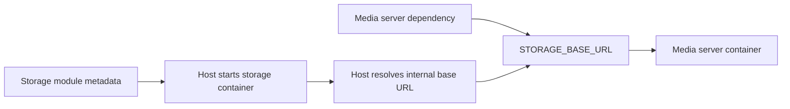

# Module metadata files

This document describes the implemented contract for adding modules to Docker Host.

## Idea

Docker Host must be able to add logical modules that run in Docker, not just Docker images. The source of a module description is not a Git repository or an image repository, but a direct URL to a JSON module metadata file.

That JSON file can live in:

- a GitHub repository as a raw file;
- any other Git hosting provider;
- a normal website;
- object storage;
- an internal HTTP service.

The file name does not matter. Only the content must match the JSON structure expected by Docker Host.

One Git repository or website can host many metadata JSON files for different modules. The Host must not download the whole repository: it only needs to fetch the specific JSON file, read container images and additional metadata from it, then download the required images.

The metadata file describes:

- the unique identifier and human-readable module name;
- Docker containers and images that need to be downloaded and run;
- links to dependent module metadata files and rules for passing dependency base URLs;
- configuration parameters that the Host can request from the administrator;
- directories used by the application inside the container image and rules for mapping them into host storage;
- dynamic collections of external storage mounts when a module must work with an arbitrary number of physical folders;
- minimum runtime requirements: endpoints, ports, environment variables, and resources.

## Terms

- **Host** - the current Docker Host application that manages modules and containers.
- **Module** - a logical functional unit hosted in one or more Docker containers.
- **Module metadata file** - the JSON file that describes one module.
- **Module metadata URL** - a direct link to a module metadata file.
- **Image repository** - the registry path where a module Docker image lives, for example `ghcr.io/acme/reports-module`.
- **Dependency module** - another module whose metadata file is referenced by the current module.
- **Host data root** - the physical folder where Docker Host stores installed modules and their data.
- **Module directory** - the folder for a specific module under `modules/<module-id>/`.
- **Module-owned storage** - a storage directory that physically lives inside the module directory.
- **External storage mount** - a host path selected by the administrator outside the module directory.
- **Mount collection** - a metadata declaration that lets the administrator add a dynamic number of external storage mounts of one type.
- **Runtime endpoint** - a named module endpoint through which other modules, the Host shell, or the gateway can receive a base URL.
- **Shell UI entrypoint** - the metadata contract for browser UI that opens inside the Host shell iframe from a module-owned origin.
- **Service/API exposure** - a separate Host-owned gateway record for an endpoint that can be published on a dedicated hostname for external clients. This record does not control shell App discovery.

## Metadata URL

An administrator adds a module through the URL of a specific JSON file, for example:

```text
https://raw.githubusercontent.com/acme/docker-host-modules/main/reports.json
https://modules.acme.internal/reports/1.0.0/metadata.json
https://cdn.example.com/docker-host/modules/reports.json
```

The Host must not assume that the URL points to a Git repository. Even if the URL is hosted inside GitHub, it is treated as a normal JSON resource.

The Host does not apply special security restrictions to metadata URLs. The administrator makes the trust decision when entering a metadata file URL for module installation. The Host must download the specified resource, parse JSON, validate the metadata schema, and show an install plan before creating containers or mounts.

Metadata installation does not require a trusted domain allow-list, metadata signatures, SSRF protection, special redirect handling, or warnings for common image tags such as `latest`.

Metadata downloader reliability limits:

- maximum response size: 1 MiB per metadata JSON file;
- request timeout: 10 seconds per metadata JSON fetch;
- maximum dependency graph size: root metadata plus 32 unique dependency nodes;
- dependency cycles must be rejected.

For production scenarios, an immutable URL is preferred:

- Git tag;
- Git commit SHA;
- signed metadata.

A branch URL is convenient for development, but it is less predictable: the JSON content at the same URL can change.

## Basic install flow

1. The administrator enters a module metadata URL.
2. The Host downloads JSON from that URL.
3. The Host validates `schemaVersion`, `id`, `containers`, `endpoints`, and basic runtime fields.
4. The Host recursively reads dependencies from `dependencies` using their `metadataUrl`.
5. The Host prepares the module directory: `<host-data-root>/modules/<module-id>/`.
6. The Host computes volume mappings for directories from `storage.directories`.
7. If metadata declares `storage.mountCollections`, the Host lets the administrator add external storage mounts.
8. The Host shows the administrator the final install plan: module, containers/images, dependencies, settings, module directory, storage mappings, external storage mounts, endpoints, Host-assigned published ports, optional public origins, and potential conflicts.
9. After confirmation, the Host saves the metadata file in the module directory, downloads images, and creates dependency containers.
10. The Host computes internal base URLs for dependency modules and passes them to the consumer container through environment variables.
11. The Host starts the containers for the module being installed.
12. The Host stores the installed module source: metadata URL, container image references, computed storage mappings, resolved dependency URLs, published Host port bindings, selected public origins, and external storage mounts.

The Host must keep a local copy of the metadata file used for installation or the latest module update.

The install flow is optimistic and fail-fast, and it does not perform automatic rollback. If one installation step fails, the Host must preserve already created files, directories, downloaded images, and containers for diagnosis, mark the install as `failed`, and show the administrator the error.

Retry and cleanup must be explicit administrator actions. Retry should tolerate already existing directories, images, and containers when possible. Cleanup/removal of a failed install can be a separate operation and must explicitly show whether module data directories will be deleted.

Minimum persistent operation statuses for the first implementation:

```text
installing
installed
updating
failed
removing
```

`removing` is used only during the explicit remove flow. If remove fails before the registry entry is deleted, the Host returns the module status to `installed` and preserves `lastError`. Disable state/action is not part of the lifecycle model. If a module should not be running, the administrator uses stop.

Implemented recovery rules:

- failed install retry is started explicitly and uses the local `metadata.json` plus the stored install record by default;
- retry recreates failed module containers and preserves module-owned data directories;
- failed install cleanup and installed module removal use a backend-generated plan before apply;
- module-owned data is deleted only with explicit `deleteModuleData=true`;
- external host paths are never deleted; the Host removes only mappings from its own state;
- Docker images are preserved and shown only as preserved artifacts.

## Module update flow

Module update must always refresh the metadata URL of the installed module. The Host must not treat update as only `docker pull` for the current image tag.

Baseline update flow:

1. The administrator selects update for an installed module.
2. The Host downloads fresh metadata JSON from the stored metadata URL.
3. The Host validates the metadata schema and verifies that `id` matches the installed module id.
4. The Host compares the fresh metadata file with the locally stored `metadata.json`.
5. The Host shows an update plan: changes to containers/images, settings schema, storage mappings, dependency metadata URLs, endpoints/runtime resources, and potential conflicts.
6. After confirmation, the Host applies the update based on the new metadata.
7. The Host recreates or updates container configuration according to the new metadata.
8. The Host saves the fresh metadata file as local `metadata.json`.
9. The Host stores the updated module source and computed mappings.

Update failure handling follows the same optimistic fail-fast approach as install failure handling. If update fails at any step after apply has started, the Host does not perform automatic rollback. Already created files, directories, downloaded images, and containers remain for diagnosis, module status becomes `failed`, and retry/cleanup runs only through explicit administrator action.

## Host storage layout

Docker Host stores installed modules inside the `modules` directory of its data root. Each module gets a separate folder by module `id`.

The physical default path for the Host data root on the administrator's machine:

```text
~/.docker-host
```

Because production-like launch is Host-container-first, the `docker-host` CLI must mount this path into the Host container as `/data` by default. Inside the Host container, the backend works with `HOST_DATA_ROOT_CONTAINER=/data`, while physical data remains in `HOST_DATA_ROOT_HOST`, usually `~/.docker-host`, on the administrator's machine.

The CLI must pass both data-root paths to the Host backend:

```env
HOST_DATA_ROOT_HOST=/Users/example/.docker-host
HOST_DATA_ROOT_CONTAINER=/data
```

The Host backend uses `HOST_DATA_ROOT_CONTAINER` for its own file IO inside the Host container. For Docker bind mount source paths for module containers, the backend must use `HOST_DATA_ROOT_HOST`, because the Docker daemon interprets bind source paths relative to the host machine, not relative to the Host container filesystem.

Example:

```text
<host-data-root>/
  modules.json
  modules/
    com.acme.reports/
      metadata.json
      settings/
      data/
      cache/
```

File and folder responsibilities:

- `modules.json` - root-level registry of installed modules, persistent module state, and Host-owned settings: module id, source metadata URL for install/update, settings values, install/update status, failure state, last error details, computed storage mappings, resolved dependency URLs, and Host backend settings that are not CLI launch settings;
- `metadata.json` - local copy of the module metadata file fetched from the metadata URL;
- `settings/`, `data/`, `cache/` - physical folders mapped to container paths from `storage.directories`.

The Host uses `modules.json` as the installed module registry, the source of metadata URLs for update flow, and the storage location for install/update bookkeeping. Module runtime container status is not stored in `modules.json`: the Host reads current container state from Docker daemon.

A separate `host-settings.json` is not created. Launch settings for the Host container itself remain in CLI-owned `config/launch.env`; settings owned by the Host backend are stored in root-level `modules.json` when needed.

Separate per-module `module-state.json`, `module-installation.json`, or `module-settings.json` files are not created. `metadata.json` and storage directories live together because they describe the installed configuration of one module. When moving or backing up a module, the Host must account for both the module directory and the corresponding root-level `modules.json` entry.

External storage mounts can live outside `modules/<module-id>/`. In that case, only mapping configuration is stored inside the module directory, while the data itself remains in the physical folder selected by the administrator.

## Metadata example

```json
{
  "schemaVersion": "0.2",
  "id": "com.acme.reports",
  "name": "Reports",
  "description": "Generates operational reports from host-managed data.",
  "version": "1.0.0",
  "containers": [
    {
      "key": "app",
      "image": {
        "repository": "ghcr.io/acme/reports-module",
        "tag": "1.0.0",
        "pullPolicy": "ifNotPresent"
      },
      "runtime": {
        "ports": [
          {
            "key": "http",
            "containerPort": 8080,
            "protocol": "http"
          }
        ],
        "resources": {
          "cpus": 1,
          "memory": "512m"
        }
      }
    }
  ],
  "endpoints": [
    {
      "key": "http",
      "container": "app",
      "port": "http",
      "public": true
    }
  ],
  "dependencies": [
    {
      "id": "com.acme.identity",
      "version": "1",
      "required": true,
      "metadataUrl": "https://raw.githubusercontent.com/acme/docker-host-modules/main/identity.json",
      "connection": {
        "endpoint": "http",
        "targets": [
          {
            "container": "app",
            "type": "env",
            "name": "IDENTITY_BASE_URL"
          }
        ]
      }
    }
  ],
  "settings": [
    {
      "key": "REPORT_RETENTION_DAYS",
      "type": "number",
      "required": true,
      "default": 30,
      "targets": [
        {
          "container": "app",
          "type": "env",
          "name": "REPORT_RETENTION_DAYS"
        }
      ]
    },
    {
      "key": "EXTERNAL_API_TOKEN",
      "type": "secret",
      "required": false,
      "targets": [
        {
          "container": "app",
          "type": "env",
          "name": "EXTERNAL_API_TOKEN"
        }
      ]
    }
  ],
  "storage": {
    "directories": [
      {
        "key": "settings",
        "label": "Settings",
        "description": "Persistent module configuration files.",
        "purpose": "settings",
        "required": true,
        "targets": [
          {
            "container": "app",
            "containerPath": "/app/settings",
            "writable": true
          }
        ],
        "mount": {
          "recommended": true,
          "type": "bind",
          "modulePath": "settings"
        }
      },
      {
        "key": "data",
        "label": "Data",
        "description": "Generated reports and local module state.",
        "purpose": "data",
        "required": true,
        "targets": [
          {
            "container": "app",
            "containerPath": "/app/data",
            "writable": true
          }
        ],
        "mount": {
          "recommended": true,
          "type": "bind",
          "modulePath": "data"
        }
      },
      {
        "key": "cache",
        "label": "Cache",
        "purpose": "cache",
        "required": false,
        "targets": [
          {
            "container": "app",
            "containerPath": "/app/cache",
            "writable": true
          }
        ],
        "mount": {
          "recommended": true,
          "type": "bind",
          "modulePath": "cache"
        }
      }
    ],
    "mountCollections": []
  },
  "ui": {
    "category": "Apps",
    "icon": "boxes",
    "entrypoint": {
      "portKey": "http",
      "path": "/"
    },
    "navigation": [
      {
        "label": "Overview",
        "path": "/"
      },
      {
        "label": "People",
        "path": "/people"
      }
    ]
  }
}
```

## Schema source of truth

This document is the source of truth for the module metadata schema: the `Metadata example`, `Schema outline`, field notes, and validation rules below together describe the supported contract.

Executable validation now lives inside the Host backend and follows this document. The Host validates and normalizes only `schemaVersion: "0.2"` metadata in `apps/host/src/lib/module-metadata.ts` and uses it from install/update planning. A separate shared contracts package or generated schema artifact is not required for the metadata MVP; this document remains the source of truth for the supported metadata contract.

## Schema outline

Top-level metadata object:

| Field | Type | Required | Notes |
| --- | --- | --- | --- |
| `schemaVersion` | string | yes | Version of the metadata file schema supported by Host. Current supported value: `0.2`. |
| `id` | string | yes | Stable unique module id, recommended reverse-DNS format. |
| `name` | string | yes | Human-readable module name. |
| `description` | string | no | Short module description for UI display. |
| `version` | string | yes | Module contract version. Host uses the major part for dependency compatibility in the first implementation. |
| `containers` | array | yes | Runtime services owned by this module. At least one container is required. |
| `endpoints` | array | no | Stable module endpoints used by gateway exposure and dependency resolution. Default: empty array. |
| `connections` | array | no | Internal module endpoint URLs injected from one container into other containers. Default: empty array. |
| `dependencies` | array | no | Dependency metadata URLs and connection mappings. Default: empty array. |
| `settings` | array | no | Configuration schema. Values are stored by Host, not in metadata. Default: empty array. |
| `storage` | object | no | Module-owned storage directories and dynamic external mount collections. |
| `ui` | object | no | Shell-only UI entrypoint and optional navigation for the Host app registry. |

`containers[]` item:

| Field | Type | Required | Notes |
| --- | --- | --- | --- |
| `key` | string | yes | Stable lowercase container key, unique inside the module. |
| `dependsOn` | array | no | Container keys that must start before this container. Default: empty array. |
| `image` | object | yes | Docker image reference and pull behavior for this container. |
| `runtime` | object | no | Container ports, ignored healthcheck metadata, and resource hints. Default: no ports. |

`containers[].image` object:

| Field | Type | Required | Notes |
| --- | --- | --- | --- |
| `repository` | string | yes | Docker image repository, for example `ghcr.io/acme/reports-module`. |
| `tag` | string | yes | Docker image tag. |
| `pullPolicy` | string | no | One of `ifNotPresent`, `always`, or `manual`. Default: `ifNotPresent`. |

`containers[].runtime` object:

| Field | Type | Required | Notes |
| --- | --- | --- | --- |
| `ports` | array | no | Named container ports. Worker and sidecar containers may omit ports. |
| `healthcheck` | object | no | Reserved for future module health checks. Ignored by the first implementation. |
| `resources` | object | no | CPU and memory hints. |

`containers[].runtime.ports[]` item:

| Field | Type | Required | Notes |
| --- | --- | --- | --- |
| `key` | string | yes | Stable port key, unique inside the container. |
| `containerPort` | number | yes | Container port number. |
| `protocol` | string | yes | First implementation target: `http`. |

`endpoints[]` item:

| Field | Type | Required | Notes |
| --- | --- | --- | --- |
| `key` | string | yes | Stable module endpoint key, unique inside the module. |
| `container` | string | yes | Container key that owns the target port. |
| `port` | string | yes | Port key inside the selected container. |
| `public` | boolean | yes | Whether this endpoint is suitable for Host gateway exposure. This is a capability hint, not an authorization policy. |

`connections[]` item:

| Field | Type | Required | Notes |
| --- | --- | --- | --- |
| `source` | object | yes | Endpoint source. Current form: `{ "type": "endpoint", "key": "<endpointKey>" }`. |
| `targets` | array | yes | Environment targets that receive the resolved internal URL. |

`dependencies[]` item:

| Field | Type | Required | Notes |
| --- | --- | --- | --- |
| `id` | string | yes | Expected dependency module id. |
| `version` | string | yes | Expected dependency major contract version, for example `"1"`. |
| `required` | boolean | yes | Whether the consumer can start without this dependency resolved. |
| `metadataUrl` | string | yes | Direct URL to the dependency metadata JSON file. |
| `connection` | object | no | Required when the consumer needs a runtime base URL from the dependency. |

`dependencies[].connection` object:

| Field | Type | Required | Notes |
| --- | --- | --- | --- |
| `endpoint` | string | yes | Dependency `endpoints[].key` to use. |
| `targets` | array | yes | Environment targets in the consumer containers that receive the resolved internal base URL. |

`settings[]` item:

| Field | Type | Required | Notes |
| --- | --- | --- | --- |
| `key` | string | yes | Stable setting key, unique inside the metadata file. |
| `type` | string | yes | One of `string`, `number`, `boolean`, `url`, or `secret`. |
| `required` | boolean | yes | Whether the administrator must provide or confirm a value. |
| `default` | any | no | Default value. Secrets must not contain real secret values in `default`. |
| `targets` | array | no | Runtime targets for the resolved setting. First implementation target type: `env`. Default: empty array. |

Environment target object:

| Field | Type | Required | Notes |
| --- | --- | --- | --- |
| `container` | string | yes | Container key that receives the environment variable. |
| `type` | string | yes | Current supported value: `env`. |
| `name` | string | yes | Environment variable name. |

`storage` object:

| Field | Type | Required | Notes |
| --- | --- | --- | --- |
| `directories` | array | no | Fixed module-owned container paths that Host maps into the module directory. |
| `mountCollections` | array | no | Dynamic external mount collections configured by the administrator. |

`storage.directories[]` item:

| Field | Type | Required | Notes |
| --- | --- | --- | --- |
| `key` | string | yes | Stable storage key, unique inside the metadata file. |
| `label` | string | no | Human-readable label for UI display. |
| `description` | string | no | Short explanation for UI display. |
| `purpose` | string | no | Suggested purpose, for example `settings`, `data`, `cache`, `logs`, or `temp`. |
| `required` | boolean | yes | Whether the mapping must exist before container start. |
| `targets` | array | yes | Container-specific mount targets. |
| `mount` | object | yes | Mount recommendation. Base implementation supports only `type: "bind"`. |

`storage.mountCollections[]` item:

| Field | Type | Required | Notes |
| --- | --- | --- | --- |
| `key` | string | yes | Stable collection key, unique inside the metadata file. |
| `label` | string | no | Human-readable label for UI display. |
| `description` | string | no | Short explanation for UI display. |
| `purpose` | string | no | Suggested purpose, usually `data`. |
| `required` | boolean | yes | Whether at least the configured minimum must be present. |
| `minItems` | number | no | Minimum number of external mounts. Default: `0`. |
| `maxItems` | number or null | no | Maximum number of external mounts. `null` means no fixed limit. |
| `targets` | array | yes | Container-specific dynamic mount targets. |
| `hostPathPolicy` | object | yes | Host path selection policy. External paths are administrator-selected. |

Storage target object:

| Field | Type | Required | Notes |
| --- | --- | --- | --- |
| `container` | string | yes | Container key receiving the mount. |
| `containerPath` | string | yes | Absolute Unix path inside the container. |
| `writable` | boolean | yes | Whether the module expects write access for this mount. |

Mount collection target object:

| Field | Type | Required | Notes |
| --- | --- | --- | --- |
| `container` | string | yes | Container key receiving each selected item. |
| `containerPathPrefix` | string | yes | Absolute Unix prefix for collection item paths inside the container. |
| `itemContainerPathTemplate` | string | yes | Template for item paths. Must contain a safe `{key}` segment. |
| `writable` | boolean | yes | Whether selected items are writable in this container. |

For `schemaVersion: "0.2"`, metadata validation is strict: unknown fields are rejected at every object level. The MVP does not reserve or accept extension namespaces such as `x-*`. Future extensions must use a new schema version or a separately documented namespace. The only reserved field accepted by the MVP schema is `containers[].runtime.healthcheck`, and the MVP runtime must ignore it.

`ui` object:

| Field | Type | Required | Notes |
| --- | --- | --- | --- |
| `category` | string | no | Must be the non-empty value `Apps` when provided. |
| `icon` | string | no | Non-empty lowercase icon key for shell rendering, for example `boxes`. |
| `entrypoint` | object | yes | Shell UI entrypoint. |
| `navigation` | array | no | Optional nested app navigation. Default: empty array. |

`ui.entrypoint` object:

| Field | Type | Required | Notes |
| --- | --- | --- | --- |
| `portKey` | string | yes | Must reference an `endpoints[].key` marked `public: true`. The name is kept for compatibility with the initial shell UI work, but the value is the metadata endpoint key in schema `0.2`. |
| `path` | string | yes | Same-origin absolute path beginning with `/`, such as `/` or `/dashboard`. Direct URLs and protocol-relative paths are rejected. |

`ui.navigation[]` item:

| Field | Type | Required | Notes |
| --- | --- | --- | --- |
| `label` | string | yes | Sidebar label, at most 80 characters. |
| `path` | string | yes | Same-origin absolute module UI path beginning with `/`. Navigation paths must be unique within one `ui.navigation` array. |

The `ui` contract never requests a public module UI hostname. Public origins are administrator-selected install-time values, not module metadata. Modules without `ui` metadata can still be installed, but they do not appear as shell Apps.

Invalid `ui` metadata is rejected during install or update planning. Missing `ui` metadata is valid and means the module does not appear as a shell App. The Host does not infer shell Apps from gateway exposure records, public runtime ports, service/API endpoint hostnames, or runtime route probing.

The Host app registry treats `ui` metadata as shell state, not a networking shortcut. `/api/apps` returns Host shell paths plus direct module iframe URLs and origins. Host authentication and app access checks stay on the registry and identity-token endpoints; module HTML, assets, cookies, and application requests stay on the module origin.

## Field notes

### `id`

The unique module identifier. The recommended format is reverse DNS, for example `com.acme.reports`.

The Host must use `id` for:

- checking conflicts between installed modules;
- linking dependencies;
- storing settings;
- displaying module lifecycle: installed, update available, failed.

`id` comes from the metadata file, not from the URL. The same module can be available through different URLs, but the Host must treat it as the same module when `id` matches.

### `containers`

`containers[]` describes Docker containers that together form one logical module. In the user interface they can be displayed as services inside a module row/detail view, but manifests and backend contracts use the term `containers`.

`containers[].key` must be a stable lowercase identifier, for example `app`, `api`, `worker`, or `db`. The Host uses the key for Docker names/aliases, target references, storage mappings, and per-container runtime status. The key is part of the contract: changing it is a runtime-affecting update.

`containers[].image.repository` and `containers[].image.tag` define the Docker image for a specific container. Metadata does not lock an immutable image reference: ordinary module updates can happen by updating the Docker image pointed to by the tag.

The metadata model does not define a common naming convention for Docker image repositories. A module author can point to Docker Hub, GHCR, an internal registry, or any other container registry reachable by the Docker daemon.

If `containers[].image.tag` is `latest`, the metadata URL can remain unchanged while a new Docker image is published under the same tag. During module update, the Host still refreshes the metadata URL first, then applies image/container updates based on current metadata. If a more stable channel is needed, the tag can be `1`, `1.0`, `stable`, or another convention chosen by the module author.

`containers[].image.pullPolicy` defines when the Host should try to download the image:

- `ifNotPresent` - download the image only if it is not available locally;
- `always` - try to pull the current image for the specified tag during start or update check;
- `manual` - do not pull automatically, only through an explicit administrator action.

If `pullPolicy` is omitted, the default must be `ifNotPresent`. For CI-style modules using a `latest` tag, the metadata author can specify `always`.

`containers[].dependsOn` defines startup order only inside the current module. It is not a dependency boundary between modules and not a version solver. Cycles in `dependsOn` are rejected by validation.

### Versioning and compatibility

Top-level `version` describes the module metadata and module contract version. It is not a mechanism for frequent image updates and not an exact dependency version pin.

The recommended format is `MAJOR.MINOR.PATCH`, for example `1.0.0`. The Host uses only `MAJOR` for dependency compatibility checks.

An ordinary CI flow looks like this:

- the metadata file stays the same;
- `containers[].image.repository` and `containers[].image.tag` stay the same;
- the module author publishes a new Docker image under the same tag;
- during module update, the Host refreshes the metadata URL, sees the same image reference, pulls the current Docker image for the tag according to `pullPolicy`, and updates the container.

`version` should change for major incompatible changes, for example when an API, storage contract, or expected interaction model with other modules changes. In that case, metadata can point to an image tag such as `2.0`, but the Host still does not run multiple versions of one module `id` in parallel.

The Host does not resolve compatibility through SemVer ranges, exact module versions, or running several versions of the same module. The local system must keep one installed module instance per `id`.

Dependencies can specify the expected major contract version of a dependency module. This gives a simple check for incompatible major changes without turning the Host into a dependency version solver.

Compatibility between modules is governed by stable API contracts, API backward compatibility, or separate capability fields, not by selecting multiple module versions.

### `dependencies`

A dependency points not to an image repository, Git repository, or version range, but to another module metadata file URL and the expected major version of its contract.

The Host supports only required dependencies. Metadata with `dependencies[].required: false` is rejected as unsupported.

Example:

```json
{
  "id": "com.acme.identity",
  "version": "1",
  "required": true,
  "metadataUrl": "https://modules.acme.internal/identity/1.2.0/metadata.json",
  "connection": {
    "endpoint": "http",
    "targets": [
      {
        "container": "app",
        "type": "env",
        "name": "IDENTITY_BASE_URL"
      }
    ]
  }
}
```

`dependencies[].version` is the major contract version, not an exact image version and not a SemVer range. For example, dependency `version: "1"` is compatible with dependency metadata `version: "1.2.0"`, but incompatible with `version: "2.0.0"`.

`dependencies[].connection` describes how the consuming module receives the runtime URL of the dependency module:

- `endpoint` - the endpoint name in the dependency module's `endpoints[]`;
- `targets` - environment variables that the Host must pass into target containers of the consuming module.

If a dependency declares `connection`, the `endpoint` and `targets` fields are required. The Host must not guess the endpoint by protocol or choose the first port. The consumer always explicitly specifies the dependency module `endpoints[].key` and the container targets that should receive the URL.

For example, a storage module can have two HTTP endpoints:

```json
{
  "id": "com.modulis.storage",
  "version": "1.0.0",
  "containers": [
    {
      "key": "api",
      "image": {
        "repository": "ghcr.io/modulis/storage-api",
        "tag": "1.0.0"
      },
      "runtime": {
        "ports": [
          {
            "key": "http",
            "containerPort": 8080,
            "protocol": "http"
          }
        ]
      }
    },
    {
      "key": "admin",
      "image": {
        "repository": "ghcr.io/modulis/storage-admin",
        "tag": "1.0.0"
      },
      "runtime": {
        "ports": [
          {
            "key": "http",
            "containerPort": 9090,
            "protocol": "http"
          }
        ]
      }
    }
  ],
  "endpoints": [
    {
      "key": "api",
      "container": "api",
      "port": "http",
      "public": false
    },
    {
      "key": "admin",
      "container": "admin",
      "port": "http",
      "public": false
    }
  ]
}
```

The media server must explicitly choose which endpoint it needs:

```json
{
  "id": "com.modulis.storage",
  "version": "1",
  "required": true,
  "metadataUrl": "https://modules.example.com/storage.json",
  "connection": {
    "endpoint": "api",
    "targets": [
      {
        "container": "app",
        "type": "env",
        "name": "STORAGE_BASE_URL"
      }
    ]
  }
}
```

In this case, the Host injects the URL for `api` into `STORAGE_BASE_URL`, not the URL for `admin`.

Module-to-module discovery works only through environment variables. A separate Host API for runtime dependency introspection is not required.

For example, if the media server depends on file storage, the media server can declare:

```json
{
  "id": "com.modulis.storage",
  "version": "1",
  "required": true,
  "metadataUrl": "https://modules.example.com/storage.json",
  "connection": {
    "endpoint": "api",
    "targets": [
      {
        "container": "app",
        "type": "env",
        "name": "STORAGE_BASE_URL"
      }
    ]
  }
}
```

After starting the storage module, the Host computes an internal base URL, for example `http://mod-com-modulis-storage-api:8080`, and starts the media server with this environment variable:

```text
STORAGE_BASE_URL=http://mod-com-modulis-storage-api:8080
```

In this example, `mod-com-modulis-storage-api` is not a Compose service name. It is a stable per-container network alias that the Host assigns to the dependency module container inside a user-defined Docker network.

The network alias must be built deterministically from module `id` and `containers[].key`:

```text
com.modulis.storage + api -> mod-com-modulis-storage-api
com.acme.media-server + app -> mod-com-acme-media-server-app
```

Baseline normalization rule:

- convert `id` to lowercase;
- replace every character except `a-z` and `0-9` with `-`;
- collapse repeated `-`;
- add the `mod-` prefix and the container-key suffix;
- check that the final alias is unique among installed modules.

If normalization creates a conflict or a DNS label that is too long, the Host must use a deterministic hash suffix, but that remains an internal Host detail. A consuming module must not construct the alias from `id` itself: it receives the ready URL through an environment variable.

Docker Compose is not a required dependency. The Host can create the Docker network itself and attach containers through the Docker API while assigning the needed aliases. Compose can be used as an internal implementation detail, but the metadata model must not depend on a Compose file.

Metadata must not pin the container name, host port, or absolute URL of a dependency module. It only describes which endpoint the consumer needs and which target environment variables should receive the resolved base URL.

Resolved dependency base URLs must be internal Docker-network URLs only. The Host does not use the metadata dependency model to pass external public URLs between modules. If a module needs external services, those URLs remain the responsibility of the module itself or its ordinary settings.

If a dependency is required (`required: true`), the Host must install and start it before starting the consumer. If the Host cannot obtain the resolved base URL for a required dependency, consumer startup must be stopped with a clear error.

If a dependency is already installed and the install plan marks it as reusable, the planner and install apply check `modules.json`, major compatibility of local `metadata.json`, and Docker container presence. Apply repeats these checks before mutating the new consumer module. If the reusable dependency container is missing, installing the consumer module is rejected as a conflict; automatic dependency repair remains a separate recovery flow.

Future optional dependency behavior: if a dependency is optional (`required: false`) and it is not installed or disabled, the Host should omit the target environment variable or pass an empty value. The consuming module should treat an empty or absent environment variable as "integration unavailable" and run without that dependency. This is outside the first implementation scope.

Future optional dependency example:

```json
{
  "id": "com.modulis.recommendations",
  "version": "1",
  "required": false,
  "metadataUrl": "https://modules.example.com/recommendations.json",
  "connection": {
    "endpoint": "http",
    "targets": [
      {
        "container": "app",
        "type": "env",
        "name": "RECOMMENDATIONS_BASE_URL"
      }
    ]
  }
}
```

If the recommendations module is unavailable, the Host starts the consumer without `RECOMMENDATIONS_BASE_URL` or with an empty value:

```text
RECOMMENDATIONS_BASE_URL=
```

Module state diagnostics remain the Host's responsibility. In the MVP, the Host UI should show Docker daemon container state so the administrator can see which module is running, stopped, or exited with an error. Module health checks and a unified health response model should be a separate future feature.



The Host must be able to:

- download dependency metadata files;
- show the dependency tree before installation;
- verify that `id` and the major version of downloaded dependency metadata match the declared dependency;
- verify that every `dependencies[].connection` contains `endpoint` and `targets`;
- verify that the requested `connection.endpoint` exists in the dependency metadata `endpoints[]`;
- pass resolved dependency base URLs into environment variables of the consuming module;
- avoid starting the consumer when a required dependency cannot be resolved;
- detect cyclic dependencies;
- verify that the install plan has no conflicting metadata URLs or major versions for one dependency `id`;
- avoid installing a dependency automatically without explicit administrator confirmation.

The Host does not require a separate public `metadataDigest` for each dependency metadata file. The source of a dependency is the tuple `id` + `version` + `metadataUrl`, where `version` means the expected major contract version. The dependency metadata content and final dependency tree are covered by the shared install plan `planDigest`.

### `settings`

`settings` describes the configuration schema, not values. Values are entered and stored on the Host side.

Baseline types:

- `string`;
- `number`;
- `boolean`;
- `url`;
- `secret`.

In the first implementation, setting values can be passed into one or more containers through `settings[].targets`. Values are stored in `modules.json` as key/value pairs inside the installed module record. The setting key matches `settings[].key` from metadata; specific environment variable names are defined in targets. If non-env targets appear later, the settings storage schema can be extended.

Secrets must not be stored in the metadata file. Metadata only declares that such a secret is required.

Secret settings are stored in the same place as ordinary module settings: root-level `modules.json` inside the installed module record. `type: "secret"` does not mean separate secret storage; it is a value-handling rule at the Host API, Web UI, logs, and diagnostics boundary.

The Host must treat secret settings as write-only values at the UI/API boundary:

- API responses used by the Web UI must not return the raw secret value;
- the UI can show that a value is set and must allow set, change, and clear without revealing the current value;
- install plans, status views, logs, error messages, and diagnostics must show a redacted value, not the real secret;
- the secret value can be passed into module runtime configuration, for example as an environment variable, when setting targets require it.

The main protection is preventing accidental token/API key disclosure through the Web UI, API responses, logs, or diagnostics. Secret file encryption, OS keychain integration, protected local files, and external secret managers are not part of the current storage contract.

### `storage`

`storage.directories` describes fixed directories that the application uses inside the container image. These are not actual host paths, but declarations of which container paths should or must be moved into persistent storage.

Typical purposes:

- `settings` - application configuration files;
- `data` - user or business data;
- `cache` - cache that can be recreated;
- `logs` - file logs, when the module does not write only to stdout/stderr;
- `temp` - temporary files.

Directory example:

```json
{
  "key": "data",
  "label": "Data",
  "purpose": "data",
  "required": true,
  "targets": [
    {
      "container": "app",
      "containerPath": "/app/data",
      "writable": true
    }
  ],
  "mount": {
    "recommended": true,
    "type": "bind",
    "modulePath": "data"
  }
}
```

The Host must use this data for volume mapping:

- show the administrator the list of directories the module wants to use;
- compute the host path inside the module directory, for example `~/.docker-host/modules/com.acme.reports/data`;
- create a bind mount to the physical Host folder;
- pass the mapping to target containers as Docker volume mounts, for example `~/.docker-host/modules/com.acme.reports/data:/app/data`;
- store the computed mapping as part of the installed module.

`mount.type` must be `bind` so ordinary module-owned data physically lives in the Host module directory. Docker named volumes are not part of the baseline contract for this metadata schema.

`modulePath` must be a relative path inside the module directory. If `modulePath` is omitted, the Host can use `storage.directories[].key` as the subfolder name. The metadata file must not impose absolute host paths such as `/etc`, `/var/run`, or `/Users/...`.

The Host must not let the administrator change `modulePath` or `targets[].containerPath` for ordinary `storage.directories`. These values are part of the module contract: the module author decides which folder structure the application needs.

For example, for module id `com.acme.reports` and `modulePath: "data"`, the final host path is:

```text
<host-data-root>/modules/com.acme.reports/data
```

If the Host itself runs in a container, the bind mount path must be a path on the Docker daemon machine, not an internal path inside the Host container. Otherwise Docker creates the volume mount somewhere other than where the administrator expects.

Path mapping example:

```text
metadata modulePath:
  data

Host backend state path:
  /data/modules/com.acme.reports/data

Docker bind source path:
  /Users/example/.docker-host/modules/com.acme.reports/data

Module container mount path:
  /app/data
```

All computed bind source paths for `storage.directories` must be built only from `HOST_DATA_ROOT_HOST + modules/<module-id>/<modulePath>`. The metadata file must not define absolute host paths for module-owned storage.

If `required` is `true`, the Host must create the mapping before starting the container. If the mapping cannot be created, module installation or startup must stop with a clear error. Required storage must not silently fall back to writing inside the container filesystem.

#### Dynamic external mounts

Not all storage paths should live inside the module directory. Modules such as file storage need another scenario: the administrator can attach an arbitrary number of external physical folders, including folders on another disk, NAS mount, or other storage device.

For that, metadata can declare `storage.mountCollections`. This is not a specific directory, but a rule for a dynamic set of mounts:

```json
{
  "storage": {
    "mountCollections": [
      {
        "key": "libraries",
        "label": "Storage libraries",
        "description": "External folders managed by the storage module.",
        "purpose": "data",
        "required": false,
        "minItems": 0,
        "maxItems": null,
        "targets": [
          {
            "container": "app",
            "containerPathPrefix": "/storage/libraries",
            "itemContainerPathTemplate": "/storage/libraries/{key}",
            "writable": true
          }
        ],
        "hostPathPolicy": {
          "mode": "adminSelected",
          "allowExternal": true
        }
      }
    ]
  }
}
```

The administrator adds concrete mounts in the Host UI. These values do not come from the metadata URL; they are saved in root-level `modules.json` inside the installed module record.

Resolved configuration example:

```json
{
  "storageMounts": {
    "libraries": [
      {
        "key": "main-media",
        "label": "Main media disk",
        "hostPath": "/mnt/media",
        "container": "app",
        "containerPath": "/storage/libraries/main-media",
        "access": "readWrite"
      },
      {
        "key": "archive",
        "label": "Archive disk",
        "hostPath": "/Volumes/archive",
        "container": "app",
        "containerPath": "/storage/libraries/archive",
        "access": "readOnly"
      }
    ]
  }
}
```

In this scenario, the data does not physically live in:

```text
<host-data-root>/modules/com.acme.media-storage/
```

but in the selected external paths:

```text
/mnt/media
/Volumes/archive
```

The Host must still store metadata, settings, and the list of attached external mounts inside the module directory. This makes it possible to recreate the container with the same Docker mounts, but backup of the external paths themselves remains the responsibility of the administrator or storage module.

`containerPath` for each item and container target is computed from `targets[].itemContainerPathTemplate`. `{key}` must be a safe path segment, for example `main-media`, not an arbitrary string with `/` or `..`.

External host paths are always selected by the administrator. The metadata file can only declare that the module supports this mount collection. Metadata must not contain ready absolute host paths.

The Host must not restrict external host paths with a global allow-list. The administrator is responsible for which physical folders they provide to a specific module and with which access mode.

The Host must still explicitly show selected external mounts in the install/update plan because attaching system or sensitive directories can give the module access to data outside its module directory.

The Host must not try to validate an external host path through the filesystem of the Host UI process itself. An external path is considered a path that must be available to Docker daemon for bind mounting.

External path validation happens through the Docker mount operation:

- the Host passes the administrator-entered path to Docker as the bind mount source;
- if Docker daemon successfully creates the container or test mount, the path is considered valid;
- if Docker daemon returns a mount error, the Host shows an external storage path configuration error.

This matters for Docker Desktop on Windows and for cases where the Host itself runs in a container. For example, an administrator can enter the Windows path `D:\Media`; the Host UI container itself does not see that path as a local folder, but Docker Desktop can mount it into the module container. Therefore the source of truth is the Docker daemon operation result, not a local `exists()` check inside the Host.

### File exchange between modules

Direct storage resource sharing between containers is not part of the model yet. If several modules need to work with the same files, a separate file storage module should own that.

Baseline scenario:

- `com.acme.media-storage` owns physical storage mounts and the internal file model;
- `com.acme.media-server` depends on `com.acme.media-storage`;
- `com.acme.ffmpeg-worker` depends on `com.acme.media-storage`;
- the media server sends an FFmpeg job with a logical file id or logical path;
- FFmpeg receives the file through the storage module API or another agreed storage protocol;
- the result is saved back through the storage module.

In this model, the Host does not mount one module's storage directly into another module's container. The storage module remains the only owner of the physical folders and decides how to provide file access.

### `runtime` and `endpoints`

`containers[].runtime` describes the minimum launch parameters for a specific container:

- named container ports;
- CPU and memory hints;
- reserved healthcheck metadata, ignored by the first implementation.

Containers may omit `runtime` or declare no ports. This is valid for workers, schedulers, sidecars, and other services that do not expose network endpoints.

The install/update runtime applies resource hints when creating Docker containers. `containers[].runtime.resources.cpus` maps to Docker `NanoCpus`. `containers[].runtime.resources.memory` supports plain byte counts and `k`, `m`, or `g` suffixes, for example `512m` or `1g`.

`endpoints[]` is the stable module-level contract for dependency resolution and gateway exposure. Each endpoint references one `containers[].runtime.ports[]` item through `endpoint.container` and `endpoint.port`.

Example:

```json
{
  "containers": [
    {
      "key": "api",
      "image": {
        "repository": "ghcr.io/acme/api",
        "tag": "1.0.0"
      },
      "runtime": {
        "ports": [
          {
            "key": "http",
            "containerPort": 8080,
            "protocol": "http"
          }
        ]
      }
    }
  ],
  "endpoints": [
    {
      "key": "api",
      "container": "api",
      "port": "http",
      "public": false
    }
  ]
}
```

`endpoints[].public: false` means the endpoint is needed only inside the Host-managed Docker network. For module-to-module communication, the Host must use an internal URL, not a published host port.

`endpoints[].public: true` means the endpoint is eligible for Host-assigned local port publishing, direct-origin shell UI embedding, and service/API gateway exposure. The metadata still does not pin the Host port or external domain. The install plan assigns the Host port, lets the administrator edit it, and optionally records a public origin. Auth Gateway still owns service/API exposure policy: `public`, `loginRequired`, or `assignedUsersOnly`.

In the first implementation, the Host does not introduce runtime health checks or readiness probes for modules. Module status is determined through Docker daemon container states: individual container states plus aggregate module status.

For required dependencies, the Host considers a dependency running when Docker successfully starts dependency containers and the Host can compute an internal Docker-network base URL for the requested endpoint. The Host does not wait for an HTTP health endpoint or custom readiness signal in the first stage.

Module browser UI opens through the Host shell iframe from a direct module origin. That origin can be an administrator-provided public origin or a Host-generated local fallback origin based on the assigned Host port. Shell Apps are discovered only after Host authentication from explicit `ui` metadata plus Host access policy; gateway exposure policy names apply only to separate service/API endpoint publishing.

The Host-managed Docker network must be one shared user-defined network for all managed modules. The default bridge network is not suitable because it does not provide a reliable enough DNS model for module-to-module names.

For each installed module container, the Host must assign a stable alias built from module `id` and container key. The alias must be unique inside the shared Host-managed network and does not have to match the Docker container name.

## Multiple modules in one location

Because the source is a specific JSON URL, there is no "one module, one repository" requirement.

One Git repository can store several metadata files:

```text
modules/
  reports.json
  identity.json
  billing.json
```

A website or internal HTTP service can use a similar structure:

```text
https://modules.example.com/reports.json
https://modules.example.com/identity.json
https://modules.example.com/billing.json
```

The Host must not know how these files are organized beyond the specific URL. For the Host, each module metadata URL is an independent entry point.

## Validation rules

Minimum validation rules for a metadata file:

- JSON must match the supported `schemaVersion`;
- unknown fields must be rejected at every object level for `schemaVersion: "0.2"`;
- extension namespaces such as `x-*` are not accepted in the MVP metadata schema;
- `id`, `name`, `version`, and `containers[]` are required;
- `containers[].key` must be unique inside module metadata and match a safe lowercase identifier;
- `containers[].dependsOn` must reference only containers in the current module and must not form cycles;
- `containers[].image.repository` and `containers[].image.tag` are required;
- `containers[].image.pullPolicy`, when provided, must be `ifNotPresent`, `always`, or `manual`;
- `containers[].runtime.ports[].key` must be unique inside one container;
- `containers[].runtime.ports[].containerPort` must be a valid container port;
- `endpoints[].key` must be unique inside one metadata file;
- `endpoints[].container` must reference an existing `containers[].key`;
- `endpoints[].port` must reference an existing `containers[].runtime.ports[].key` inside the selected container;
- `connections[].source.key` must reference an existing `endpoints[].key`;
- `connections[].targets[]` must reference existing `containers[].key` values and valid environment variable names;
- `version` must have a readable major part; the recommended format is `MAJOR.MINOR.PATCH`;
- `id` must be unique among installed modules;
- `dependencies[].id` must not match the current module `id`;
- every dependency must have `version`, `required`, and `metadataUrl`;
- `dependencies[].version` must be the contract major version, for example `"1"`;
- the first implementation supports only `dependencies[].required: true`; `required: false` is reserved for a separate optional dependencies feature;
- if a dependency contains `connection`, `dependencies[].connection.endpoint` and `dependencies[].connection.targets` are required;
- `dependencies[].connection.targets[]` must reference existing consumer containers and valid environment variable names;
- `dependencies[].required: true` means the dependency must be resolved before starting the consumer;
- future support for `dependencies[].required: false` means an empty or missing target environment variable is a valid runtime state;
- dependency graph may include root metadata plus at most 32 unique dependency nodes;
- after loading dependency metadata, the Host must verify that the major part of `dependencyMetadata.version` matches `dependencies[].version`;
- if a dependency declares `connection.endpoint`, dependency metadata must contain `endpoints[]` with that `key`;
- dependency graph must not contain cycles;
- setting keys must be unique inside one metadata file;
- `settings[].targets[]`, when provided, must reference existing containers and valid environment variable names;
- a setting with `type: "secret"` must not have a real secret in `default`;
- `storage.directories[].key` must be unique inside one metadata file;
- `storage.directories[].targets[]` are required and must reference existing containers;
- `storage.directories[].targets[].containerPath` must be an absolute Unix path inside the container filesystem;
- `storage.directories[].targets[].containerPath` must not overlap another declared container path in the same container without explicit Host allowance;
- `storage.directories[].mount.type` must be `bind` in the baseline implementation;
- `storage.directories[].mount.modulePath`, when provided, must be a relative path inside the module directory without `..`;
- resolved host paths for `storage.directories` must remain inside `<host-data-root>/modules/<module-id>/`;
- `storage.mountCollections[].key` must be unique inside one metadata file;
- `storage.mountCollections[].targets[]` are required and must reference existing containers;
- `storage.mountCollections[].targets[].containerPathPrefix` and `itemContainerPathTemplate` must be absolute Unix paths inside the container filesystem;
- `storage.mountCollections[].hostPathPolicy.allowExternal` must be `true` when the collection allows paths outside the module directory;
- external host paths must not come from the metadata file; only the administrator chooses them;
- resolved external host paths must be stored in local Host state and explicitly shown in install/update plans;
- the Host must not apply a global allow-list for external storage roots;
- the Host must not check external host paths through the Host UI process filesystem;
- an external host path is considered valid only after a successful Docker bind mount operation;
- public endpoints receive Host-assigned published ports during install planning, but metadata must not contain Host ports or public origins;
- when `ui` is provided, `ui.entrypoint.portKey` must reference an `endpoints[].key` with `public: true`;
- when `ui.navigation` is provided, navigation paths must be unique same-origin absolute paths;
- shell App discovery must come only from explicit `ui` metadata plus Host access policy, not from public endpoints or gateway exposure records;
- Host-generated network aliases must be unique among installed module containers;

## Trust and security

The module metadata URL is a trust boundary. Even though it is only a JSON file, it points to an image that will be run on the host.

Security baseline:

- metadata URL is treated as intentional administrator input;
- the Host does not restrict URLs by trusted domains, allow-lists, or private network checks;
- the Host does not require metadata signatures;
- the Host does not add a warning for image tag `latest`;
- dependencies, port declarations, and external mounts are shown as ordinary install plan elements, not as security warnings;
- the Host validates JSON/schema and does not install without explicit install plan confirmation.

Before installation, the Host must explicitly show:

- metadata URL;
- module id, name, and version;
- module directory;
- containers, image repositories, and tags;
- dependencies, their expected major versions, and metadata URLs;
- dependency connection mappings: dependency id, endpoint key, resolved internal base URL, and target environment variables;
- requested settings;
- directories inside container images and selected volume mappings;
- dynamic external storage mounts: collection key, host path, container path, and access mode;
- endpoint and port declarations;
- requested resources.
