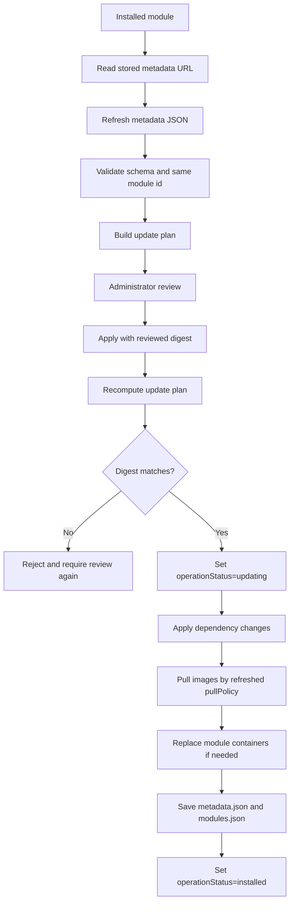

# Module update flow

This document describes the behavior for updating installed modules.
Module update is a metadata refresh plus reviewed change plan, not only a Docker image pull.

## Scope

The update flow implements:

- an update plan API for installed modules;
- a reviewed update UI;
- an update apply API;
- explicit retry behavior for failed updates.
- same-source install handoff, where installing an already registered module id from the same metadata URL opens update review instead of blocking on the existing id or container names.

The update flow does not support:

- automatic rollback after partial update failure;
- recursive automatic updates of already installed dependencies;
- SemVer range solving or multiple installed versions of the same module id;
- generic settings edit APIs outside the update review flow.

## Update API

The Host uses separate update endpoints:

- `POST /api/modules/{moduleId}/update/plan`
- `POST /api/modules/{moduleId}/update`
- `POST /api/modules/{moduleId}/update/retry`

The plan endpoint reads the installed module record from `modules.json` and refreshes the stored `metadataUrl`. The update API does not accept a replacement metadata URL during update.

`POST /api/modules/install/plan` may also return an update handoff when the requested metadata resolves to a module id that is already registered with the same stored metadata URL. In that case clients should switch to update review and apply through `POST /api/modules/{moduleId}/update`, preserving existing settings, storage mappings, external mounts, and published ports where compatible.

The apply endpoint recomputes the update plan from the installed record, refreshed metadata, and submitted administrator decisions. It rejects the request when the reviewed `updatePlanDigest` no longer matches the recomputed plan.

The retry endpoint is only for failed update attempts. Failed installs still have `POST /api/modules/{moduleId}/retry`; a same-source reinstall attempt can also move into update review when the administrator enters the original metadata URL again.

## Plan Shape

`ModuleUpdatePlan` is a separate type, not a reused `InstallPlan`. It reuses install planner internals where practical, but update review needs both the current installed state and the proposed refreshed state.

The plan includes:

- `moduleId`;
- stored `metadataUrl`;
- current local metadata digest;
- refreshed metadata digest;
- `updatePlanDigest`;
- current and proposed module summary;
- container/image changes;
- settings schema changes and setting prompts;
- storage directory and external mount changes;
- dependency changes;
- endpoint/runtime resource changes;
- generated container configuration changes;
- replacement steps;
- warnings and conflicts.

The digest covers the proposed normalized metadata, dependency tree, computed paths, Docker names, endpoints/runtime configuration, preserved compatible settings/storage decisions, and administrator decisions that affect generated runtime configuration. It must exclude timestamps, transient Docker status, download timing, and read-only Docker conflict observations.

Secret values must never be returned or embedded in a user-visible plan. When a secret decision affects the plan digest, the digest input may include only a redacted presence marker plus stable metadata such as key, type, and target.

## Update Flow

Failed modules can create an update plan. A failed module always requires container replacement so a repeated same-source install can repair partially created files, images, directories, or Docker containers without manual cleanup first.

## Settings Decisions

Existing settings are preserved only when `key`, `type`, and environment targets are compatible.

- Compatible settings keep their stored typed value.
- New required settings are shown as prompts in the update review UI.
- Removed settings are removed from the generated runtime environment and from the installed record after a successful update.
- Type or target changes require a new value.

Secret settings follow the same compatibility rule, but the current secret value is never shown. If `key`, `type: "secret"`, and target are unchanged, the stored secret value is preserved. If any of those fields change, the update plan prompts for a new write-only value.

## Storage Decisions

Storage mappings are preserved by stable storage key when compatible.

- Existing module-owned host paths remain unchanged for the same storage key.
- New required directories are created during apply.
- Changed container paths, read-only flags, or writable flags are shown in the update plan and applied to the recreated container.
- Removed module-owned directories are not deleted automatically.

External mount collection selections are preserved by collection key and mount key when compatible. The update plan prompts only for new or insufficient required external mounts. External host paths are never deleted by update.

## Dependency Decisions

Dependency changes are applied before recreating the consumer module.

During dependency changes, the update flow:

- installs missing new required dependencies;
- reuses and starts compatible installed dependencies;
- blocks the update when an installed dependency is incompatible, failed, or missing required containers;
- updates the consumer's resolved dependency URLs after dependency changes are applied.

It does not automatically update already installed dependencies just because their own metadata URL has changed. Recursive dependency update remains a separate explicit update action.

## Container Replacement

The replacement strategy is explicit:

- set the module record to `operationStatus=updating`;
- pull proposed images according to refreshed `pullPolicy`;
- stop/remove existing module containers when runtime configuration must change;
- create/start containers with deterministic container names;
- save refreshed `metadata.json` and updated `modules.json` only after successful apply.

If metadata-only changes do not affect images, environment, mounts, endpoints/ports, resources, or network aliases, the update may skip container replacement. If `pullPolicy` is `always`, update pulls and recreates affected containers even when an image reference is unchanged.

Partial failures are optimistic fail-fast. Host records `operationStatus=failed`, keeps `lastError`, and preserves files, directories, images, and containers for explicit administrator recovery.

## Failed Update Retry

Failed install retry and failed update retry do not share ambiguous behavior.

The installed module record stores the last operation, reviewed update plan digest, and administrator decisions for a failed update attempt. Update retry is exposed as update-specific behavior. On retry, the Host refreshes the metadata URL and recomputes the update plan. If the digest still matches, it retries apply; if the digest changed, the administrator must review the update again.

## Web UI

The update review UI uses the dedicated route `/modules/{moduleId}/update`, while reusing install review components where practical.

Installed module rows expose update as an action for installed modules. Failed updates show retry/update-review recovery actions without treating them as failed installs.
