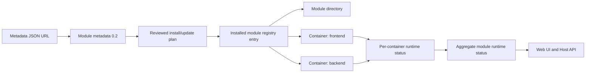

# Multi-container modules

Docker Host modules are module-first runtime units. A module can own one or more Docker containers, but administrators install, update, start, stop, restart, recover, and remove the module as one logical unit.

Containers are runtime services inside a module. The Web UI may label them as services for readability; metadata files, backend contracts, installed state, and API responses use the term `containers`.



## Contract

Docker Host supports the `schemaVersion: "0.2"` module metadata contract for module-owned containers. The older single-container shape with top-level `image` and `runtime` is not accepted.

Core rules:

- module identity and version stay at module level;
- containers inside a module do not have independent module versions;
- `containers[]` replaces top-level `image` and `runtime`;
- a module must declare at least one container;
- `containers[].key` is unique inside the module and uses a safe lowercase identifier;
- each container declares exactly one Docker image;
- `containers[].runtime.ports[].key` is unique inside that container;
- `endpoints[].key` is unique inside the module;
- `endpoints[].container` references an existing container key;
- `endpoints[].port` references an existing port key inside that container;
- `endpoints[].public` is the gateway exposure capability flag;
- `containers[].dependsOn` controls startup order inside the module only;
- dependency cycles in `containers[].dependsOn` are rejected.

Example metadata:

```json
{
  "schemaVersion": "0.2",
  "id": "com.acme.app",
  "name": "Acme App",
  "description": "Frontend and backend packaged as one Docker Host module.",
  "version": "1.0.0",
  "containers": [
    {
      "key": "backend",
      "image": {
        "repository": "ghcr.io/acme/app-backend",
        "tag": "1.0.0",
        "pullPolicy": "ifNotPresent"
      },
      "runtime": {
        "ports": [
          {
            "key": "http",
            "containerPort": 8080,
            "protocol": "http"
          }
        ],
        "resources": {
          "cpus": 0.5,
          "memory": "512m"
        }
      }
    },
    {
      "key": "frontend",
      "dependsOn": ["backend"],
      "image": {
        "repository": "ghcr.io/acme/app-frontend",
        "tag": "1.0.0",
        "pullPolicy": "ifNotPresent"
      },
      "runtime": {
        "ports": [
          {
            "key": "http",
            "containerPort": 3000,
            "protocol": "http"
          }
        ]
      }
    }
  ],
  "endpoints": [
    {
      "key": "web",
      "container": "frontend",
      "port": "http",
      "public": true
    },
    {
      "key": "api",
      "container": "backend",
      "port": "http",
      "public": false
    }
  ],
  "connections": [
    {
      "source": {
        "type": "endpoint",
        "key": "api"
      },
      "targets": [
        {
          "container": "frontend",
          "type": "env",
          "name": "BACKEND_BASE_URL"
        }
      ]
    }
  ]
}
```

## Planning

Install and update planning is module-level. Any container image, runtime declaration, endpoint, environment target, storage target, dependency, or Docker configuration change belongs to the module plan.

The planner:

- creates a planned Docker target for each container;
- generates deterministic Docker container names and network aliases from `moduleId + containerKey`;
- pulls or checks each image according to the declared pull policy;
- detects duplicate container keys, endpoint keys, Docker names, network aliases, storage mappings, environment targets per container, and dependency cycles;
- computes dependency install or reuse decisions;
- includes all container names, aliases, endpoints, ports, mounts, environment variables, resources, images, and replacement requirements in the reviewed plan digest.

Update apply remains module-level. Docker Host recomputes the full plan, compares the reviewed digest, then applies the accepted module update. There is no separate per-container update workflow.

## Settings And Environment

Settings are module-level because administrators configure the module, not individual containers. Runtime delivery is container-aware through `settings[].targets`.

```json
{
  "key": "PUBLIC_API_BASE_URL",
  "type": "url",
  "required": false,
  "default": "http://localhost:8080",
  "targets": [
    {
      "container": "frontend",
      "type": "env",
      "name": "PUBLIC_API_BASE_URL"
    }
  ]
}
```

Environment variable conflict checks are scoped per container. The same environment variable name can be valid in different containers, but conflicting values for the same container and environment name are rejected.

Internal module connections use top-level `connections[]`. Docker Host resolves the source endpoint to an internal Docker-network URL and injects that URL into the requested target containers, so module authors do not hard-code Host-generated Docker aliases.

## Storage

Storage is module-owned, while mount targets are container-aware.

```json
{
  "key": "data",
  "label": "Data",
  "purpose": "data",
  "required": true,
  "mount": {
    "recommended": true,
    "type": "bind",
    "modulePath": "data"
  },
  "targets": [
    {
      "container": "backend",
      "containerPath": "/app/data",
      "writable": true
    },
    {
      "container": "frontend",
      "containerPath": "/app/data",
      "writable": false
    }
  ]
}
```

External mount collections use the same target model. One administrator-selected host path can be mounted into one or more containers with container-specific paths and writable/read-only behavior.

Required storage mappings are validated before container start. Missing required storage marks the module action as failed with an administrator-facing error instead of silently falling back to container-local storage.

## Installed State

`modules.json` stores installed module records with container-aware runtime configuration. It does not store legacy single-container fields such as top-level `containerName`, top-level `image`, or a single persisted runtime status.

When reading existing state from before schema `0.2`, Host tolerates legacy module records that used top-level `containerName`, `networkAlias`, and `image`. It projects those fields into a single `containers[]` entry with key `main` so installed modules are not dropped during upgrade. Subsequent writes persist only the schema `0.2` shape.

Installed records include:

- module id and source metadata URL;
- local metadata path and metadata digest;
- reviewed plan digest;
- persistent operation status;
- `containers[]` with each container key, Docker container name, network alias, and image reference;
- typed setting values, including write-only secret values;
- container-aware storage mappings and external mounts;
- resolved dependency URLs and their target containers;
- timestamps and last operation error.

Docker runtime status is read from Docker daemon for API responses and is not persisted in `modules.json`.

## Runtime Status

`ModuleSummary` includes module identity, persistent operation status, aggregate runtime status, per-container runtime status, endpoint summary, timestamps, and the latest module-level error.

Aggregate runtime status is derived from all required module containers:

- `not_created` when all required containers are absent;
- `running` when all required containers are running;
- `degraded` when at least one required container is absent, non-running, or unknown while others differ;
- `exited` when all required containers are stopped or exited;
- `unknown` when Docker status cannot be determined for the module.

If Docker inspect returns a not-found response for every module container, the aggregate state is `not_created`. If only some containers are missing, the aggregate state is `degraded`. If Docker inspect fails for a container with a non-not-found error, Docker Host reports `unknown` for that container and continues inspecting the others.

## Lifecycle

The Host API remains module-level:

- `POST /api/modules/{moduleId}/start`
- `POST /api/modules/{moduleId}/stop`
- `POST /api/modules/{moduleId}/restart`
- install, update, retry, cleanup, and remove flows

Lifecycle behavior:

- `start` starts existing containers in dependency order from `containers[].dependsOn`;
- `stop` stops containers in reverse dependency order;
- `restart` performs a whole-module stop followed by a whole-module start;
- start does not create missing containers;
- lifecycle actions fail fast when a required container operation fails;
- errors include the affected container key/name where available;
- install creates and starts all containers for the module;
- update applies to the module as a unit and may recreate module containers;
- retry recreates missing or failed module containers from stored module state and local metadata;
- cleanup and remove plans enumerate each container and each image reference.

Per-container start, stop, restart, update, and remove actions are not exposed by the implemented module lifecycle surface.

## Dependencies And Endpoints

Dependencies are relationships between logical modules. A consumer requests an endpoint key from the dependency module, not a concrete container key.

Resolution flow:

1. The consumer declares dependency `com.acme.identity`.
2. The consumer requests dependency endpoint `api`.
3. Dependency metadata defines `api -> container: backend, port: http`.
4. Docker Host resolves `http://<dependency-network-alias>:<container-port>`.
5. Docker Host injects the resolved URL into the requested target containers on the consumer.

This keeps dependency contracts stable when a dependency module later moves an endpoint from one internal container to another.

Dependency connection example:

```json
{
  "id": "com.acme.identity",
  "version": "1",
  "required": true,
  "metadataUrl": "https://modules.example/identity.json",
  "connection": {
    "endpoint": "api",
    "targets": [
      {
        "container": "backend",
        "type": "env",
        "name": "IDENTITY_BASE_URL"
      }
    ]
  }
}
```

Gateway exposure also uses module endpoint keys. Gateway exposure state stores `endpointKey`, validates exposure eligibility with `endpoints[].public = true`, and resolves target URLs through `endpoints[]`. Local development records that still contain the older `portKey` field are normalized to `endpointKey` when read. Module developer-mode targets keep their separate `portKey` field because that store is not gateway exposure state.

## Web UI

The dashboard stays module-first and shows services as nested runtime details.

Implemented UI behavior:

- module rows show aggregate runtime status;
- the old image-focused column is represented as services/image information;
- service chips summarize per-container state, such as `frontend Running` and `backend Running`;
- aggregate copy uses service counts such as `2/2 running`, `1/2 degraded`, or `0/2 stopped`;
- expanded rows show service key, image reference, Docker state, container name, container id, network alias, endpoints, ports, timestamps, and per-container error;
- stats cards count installed modules and running services;
- install review shows containers, images, endpoints, dependency URL targets, storage targets, and environment targets;
- update review shows changes per container;
- cleanup and remove dialogs list all affected container artifacts.
