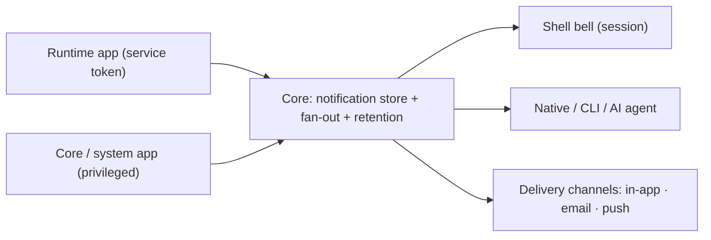

# Notifications

Status: v1 backend implemented (Core store/service/endpoints/SSE + retention). Shell bell UI and the MCP facade remain (the latter gated on the `ai-core` branch).

## Description

Hosty notifications are a **platform capability owned by Core**: a per-user inbox stream that
any producer writes into and any client renders. Notifications are always **user-targeted**.
Runtime apps emit them opt-in with their service token; Core (and privileged system apps) emit
platform messages. **Shell is just one renderer** — the same per-user stream is read by the
Shell bell, native apps, the CLI, or an AI agent over MCP.



This document specifies the v1 contract. It is the concrete realization of the `notifications`
platform interface reserved in the [AI Agent Bridge](ai-agent-bridge/plan.md) draft, and the
delivery surface anticipated by its durable-jobs section.

## Goal

- One source of truth for user-facing notifications, in Core, reachable through a stable,
  client-agnostic HTTP contract that maps cleanly onto MCP resources/tools.
- Producing is opt-in for runtime apps (a fully independent app simply never calls it).
- Consuming is identical regardless of client (Shell, native, CLI, agent).

## Non-goals

- `Core → app` machine/control signaling (lifecycle "you will be stopped", config-changed,
  token-rotated). That is a separate **webhooks / durable-jobs** feature with at-least-once
  delivery, retries, and idempotency — not this inbox. See Open Questions.
- App-to-app notifications. If ever needed, they route through Core as a normal producer.
- Letting one app read another app's or Core's notifications. The unified inbox is a
  **user** surface, not an app surface (see Authorization).
- A separate `hosty.notifications` system app in v1. Notifications live **in Core**; unlike
  `ai.gateway` there is no language/runtime forcing function to externalize them. The interface
  is declared so a future externalization needs no consumer-contract change.

## Scope: Notifications vs In-App Toasts

Notifications are **not** a replacement for transient in-app UI feedback. A runtime app keeps its
own ephemeral confirmations (e.g. Sonner toasts such as "Task created", "Saved", inline form
validation). Those are synchronous, view-bound, and **never** sent to Core — they have no
read-state, deep-link, or cross-device meaning, and round-tripping to Core per confirmation is
noise, latency, and retention pressure.

Emit a Core notification only when the message must **survive the moment or reach the user outside
the current context**. The test: *if the user navigated away, closed the app, or is on another
device — does this still need to reach them?* No → in-app toast. Yes → Core notification.

This makes background / async work the primary case (the user is not watching when it finishes),
but the rule is "must reach the user when they are not looking", not strictly "background only".
The two layers are **complementary, not exclusive**: a background operation may both show a toast
(if the user is currently in the app) and post a Core notification (for durability, the Shell
bell, other devices, or an agent). The runtime app decides, guided by this rule.

## Direction And Model

Direction is **`→ user` only**, with two producer kinds and an audience dimension.

- `source`: who produced it — `{ kind: "app", appId }` or `{ kind: "core" }`.
- `target` (producer input): a Host user id, or `"broadcast"`.
- `audience`: `"user"` (default) or `"host-admin"`. `host-admin` notifications (e.g. "app needs
  update", "disk 90%") are only visible to clients of users whose Host role is `host.admin`.

Core **fans out on write**: a `broadcast` (or any `target`) is expanded into one
`NotificationRecord` per recipient user, each with its own read state. This keeps the read model
trivial and per-user read tracking exact.

```csharp
// Persisted record (one per recipient; broadcast is expanded on write).
internal sealed record NotificationRecord(
    string Id,                    // "ntf_{guid:N}"
    string RecipientUserId,       // resolved Host user id
    NotificationSource Source,    // { Kind, AppId? }
    string Audience,              // "user" | "host-admin"
    string Level,                 // "info" | "success" | "warning" | "error"
    string Title,
    string? Body,
    string? Link,                 // deep link: Shell route or app origin url
    string? DedupeKey,            // optional idempotency within (source, recipient)
    DateTimeOffset CreatedAt,
    DateTimeOffset? ReadAt);      // null until read

internal sealed record NotificationSource(string Kind, string? AppId); // "app"+AppId | "core"+null
```

## Authorization

Two distinct auth modes, matching the existing split between **app identity** (service token)
and **user identity** (Core session):

| Surface | Who | Auth | Scope |
|---|---|---|---|
| **Producer** | runtime app | `HOSTY_APP_SERVICE_TOKEN` (`AppServiceTokenService.ValidateToken`) | may target only users assigned to that app (its directory); `audience` forced to `"user"` |
| **Producer** | Core / privileged system code | in-process `NotificationService.PublishAsync(...)` | any user; may set `audience: "host-admin"` |
| **Consumer** | Host user via Shell/browser | Core session cookie (`CoreSessionAuthorization.RequireSessionAsync`) | own inbox; `host-admin` items only when `user.Role == "host.admin"` |
| **Consumer** | native / CLI / AI agent | Core-issued user/delegated token | same as session; **gated on the delegated-token work in [AI Agent Bridge](ai-agent-bridge/plan.md)** |

Key rule: the **unified inbox (all sources) is a user surface**. An app's service token can
*produce*, and may optionally *read back only its own* notifications (`source.appId == appId`),
but never the unified cross-source inbox. This prevents cross-app/Core leakage.

## HTTP Contract

Producer (app-authenticated, mirrors `AppDirectoryEndpoints` / `AppBackupEndpoints`):

```text
POST /api/internal/apps/{appId}/notifications        # Authorization: Bearer <service token>
```
```csharp
internal sealed record AppNotificationCreateRequest(
    string Target,            // a Host user id, or "broadcast"
    string? Audience,         // default "user"; "host-admin" rejected for app producers
    string? Level,            // default "info"
    string Title,             // required, trimmed, max 120
    string? Body,             // optional, max 2000
    string? Link,             // optional
    string? DedupeKey);       // optional

internal sealed record AppNotificationCreateResponse(
    string Status,            // "created" | "deduplicated" | "no_recipients"
    int RecipientCount,
    IReadOnlyList<string> NotificationIds);
```
- 401 `notification_unauthorized` — missing/invalid service token.
- 404 `app_not_found` — unknown app.
- 400 `notification_title_required` / `notification_title_too_long` / `notification_body_too_long`.
- 403 `notification_audience_forbidden` — app tried to set `audience: "host-admin"`.
- `target` user not assigned to the app → excluded (broadcast) or `no_recipients` (single).
- 201 on create, 200 on `deduplicated` / `no_recipients`. Emits `notification.publish` audit.

Consumer (Core session = the signed-in Host user):

```text
GET  /api/notifications?unread={bool}&limit={n}&offset={n}
POST /api/notifications/read                         # requires X-Hosty-CSRF
```
```csharp
internal sealed record NotificationsResponse(
    IReadOnlyList<NotificationView> Notifications,
    int UnreadCount,
    NotificationPagination Pagination,   // { Limit, Offset, Total }, like AppDirectoryPagination
    DateTimeOffset UpdatedAt);

internal sealed record NotificationView(
    string Id, NotificationSource Source, string Audience, string Level,
    string Title, string? Body, string? Link,
    DateTimeOffset CreatedAt, bool Read, DateTimeOffset? ReadAt);

internal sealed record NotificationPagination(int Limit, int Offset, int Total);

internal sealed record NotificationMarkReadRequest(IReadOnlyList<string>? Ids); // null/empty = all
internal sealed record NotificationMarkReadResponse(int Updated, int UnreadCount);
```
The session user only ever sees their own records; `host-admin`-audience items are filtered in
unless `user.Role == "host.admin"`.

Optional, phase 2 — app reads back **its own** notifications for standalone-UI rendering
(service token, scoped to `source.appId == appId`):

```text
GET /api/internal/apps/{appId}/notifications?user={userId}
```

Live delivery rides the shared Core event stream — notifications arrive as `event: notification`
frames on the unified SSE endpoint, so a client opens one connection for everything:

```text
GET /api/events                                      # Core session; live-only (no replay)
```
Polling `GET /api/notifications` remains the fallback and holds the durable history; the stream is
an additive upgrade, not a prerequisite. See
[core-event-bus](core-event-bus/feature.md) for the stream's semantics.

## MCP Mapping

The consumer contract is deliberately shaped so the Core MCP facade (from
[AI Agent Bridge](ai-agent-bridge/plan.md)) is a thin wrapper over the same `NotificationService`,
not a redesign:

- **Resources** (reads): `hosty://notifications` (+ `?unread=true`), `hosty://notifications/unread-count`
  → back the `GET /api/notifications` data.
- **Tool** (mutation): `mark_notification_read(ids?)` → backs `POST /api/notifications/read`.
- The **producer** endpoint is intentionally **not** an agent tool: apps produce, agents do not.

The MCP facade resolves the Hosty user from the Core-issued delegated/user token and calls the
service with that identity — same scoping as the session consumer.

## Interface Registry

Core registers a built-in `notifications` platform interface so clients discover it uniformly:

```json
{ "interfaces": { "notifications": [{ "provider": "core", "endpoint": "http", "path": "/api/notifications" }] } }
```
Externalizing later (e.g. white-labeled delivery) swaps `"provider": "core"` for a system app
without changing the consumer contract.

## Storage And Retention

- `NotificationStore` persists a `NotificationState` document via `JsonStorage` at
  `<core-root>/notifications/notifications.json` (mirrors `UserDirectoryStore`). NDJSON
  append-log is a future optimization if volume warrants — see Open Questions.
- `NotificationService` owns publish (fan-out, dedupe), read, query, and retention; registered in
  DI in `HostyCoreApplication`; endpoints mapped like `AppBackupEndpoints.Map(app)`.
- Retention (mirrors backup retention's "keep latest N + background pass"):
  - keep the latest N (default 100) records per recipient user;
  - prune `Read` records read more than 30 days ago (cutoff applied to `ReadAt`, not `CreatedAt`);
  - never prune below the unread set.
  - Background pass after startup and periodically; emits a `notification.retention.cleanup` audit with counts.
- Dedupe: if an **unread** record with the same `(source, recipientUserId, dedupeKey)` exists, the
  publish is reported `deduplicated` and no new record is created.

## AOT / Source-Gen

Every new request/response/state type must be added as a `[JsonSerializable(typeof(...))]` root in
`CoreJsonSerializerContext` (Native AOT; `JsonSerializerDefaults.Web` = camelCase):
`AppNotificationCreateRequest`, `AppNotificationCreateResponse`, `NotificationsResponse`,
`NotificationView`, `NotificationMarkReadRequest`, `NotificationMarkReadResponse`, and the
persisted `NotificationState`. Endpoints return via `CoreJson.Json(...)`.

## Edge Cases

- App targets a user not in its directory → excluded / `no_recipients`; disabled users excluded.
- App attempts `audience: "host-admin"` → 403 `notification_audience_forbidden`.
- Broadcast with zero eligible recipients → `no_recipients`.
- Duplicate publish with same `DedupeKey` while still unread → `deduplicated`.
- Mark-read of unknown/foreign ids → ignored; `Updated` counts only the caller's own records.
- Producing app later removed → its records remain in user inboxes; clients render a dangling
  `source.appId` gracefully.
- User loses app assignment after a notification was created → the notification stays in their
  inbox (it is already theirs).
- SSE reconnect → the stream is live-only; clients re-read missed history via `GET /api/notifications`.
- Retention must never delete unread records.

## Testing Plan

- Producer rejects missing/invalid service token and unknown app.
- Producer enforces directory scope and the `host-admin` audience restriction.
- Broadcast fan-out creates exactly one record per eligible recipient.
- Dedupe suppresses a second unread publish with the same key.
- Session consumer sees only its own records; `host-admin` items hidden for `host.user`.
- Mark-read updates only the caller's records and returns a correct `UnreadCount`.
- Retention prunes read/old records, keeps unread, writes audit.
- SSE delivers new records live and replays from `since`.
- All new types round-trip through the source-gen context (no reflection fallback).

## Rollout / Migration Notes

1. `NotificationRecord`/`NotificationState`, `NotificationStore`, `NotificationService` (in-Core,
   source-gen JSON, retention) + DI registration.
2. Producer `POST /api/internal/apps/{appId}/notifications` + in-process Core producer + audit.
3. Consumer `GET /api/notifications` + `POST /api/notifications/read` + Shell bell renderer.
4. Register the built-in `notifications` interface in the Core registry.
5. SSE live delivery — shipped first as `GET /api/notifications/stream`, then folded into the
   unified `GET /api/events` stream (see [core-event-bus](core-event-bus/feature.md)).
6. (Later, on AI Agent Bridge) Core MCP resources/tools; optional app read-back endpoint;
   pluggable delivery channels (email, web/mobile push) behind a `NotificationChannel` seam.

Apps that never call the producer endpoint are unaffected.

## Open Questions

- Question: One JSON state document vs NDJSON append-log for storage?
  Answer: A single `JsonStorage` document matches `UserDirectoryStore` and is fine at
  single-host scale, but it is rewritten on every publish.
  Recommendation: Start with the JSON document; revisit an append-log + read-overlay only if
  notification volume becomes significant.

- Question: Can a privileged **system app** (e.g. a job runner) emit `host-admin` notifications
  over HTTP?
  Answer: Not in v1 — `host-admin` is in-process Core only; system apps use `audience: "user"`.
  Recommendation: Defer a privileged-producer scope until a concrete system-app need appears.

- Question: Where do `Core → app` control signals live?
  Answer: Not here. They need machine-targeted, at-least-once delivery.
  Recommendation: Track them as a separate webhooks / durable-jobs feature.
