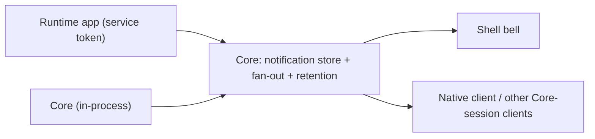

# Notifications

Created: 2026-06-16
Updated: 2026-08-31

Hosty notifications are a **platform capability owned by Core**: a per-user inbox that any producer
writes into and any client renders. Notifications are always **user-targeted**. Runtime apps emit them
opt-in with their service token; Core emits platform messages in-process. **Shell is just one
renderer** — the same per-user stream is readable by the Shell bell, the native client, or anything
else holding a Core session.



This is the concrete realization of the `notifications` platform interface reserved in the
[AI Agent Bridge interface registry](../ai-agent-bridge/feature.md#manifest-interfaces-and-registry),
and the delivery surface its
[durable-jobs step](../ai-agent-bridge/plan.md#step-11--durable-jobs-and-notifications) builds on.

## Scope: Notifications vs In-App Toasts

Notifications do not replace transient in-app UI feedback. A runtime app keeps its own ephemeral
confirmations (a "Task created" toast, inline form validation). Those are synchronous, view-bound, and
never sent to Core — they have no read-state, deep-link, or cross-device meaning, and round-tripping to
Core per confirmation is noise, latency, and retention pressure.

A Core notification is for a message that must **survive the moment or reach the user outside the
current context**. The test: *if the user navigated away, closed the app, or is on another device —
does this still need to reach them?* No → in-app toast. Yes → Core notification.

That makes background or async work the primary case, but the rule is "must reach the user when they
are not looking", not strictly "background only". The two layers are complementary: a background
operation may both show a toast (if the user is in the app) and post a notification (for durability,
the bell, or another device).

## Direction And Model

Direction is `→ user` only, with two producer kinds and an audience dimension.

- `source`: who produced it — `{ kind: "app", appId }` or `{ kind: "core" }`.
- `target` (producer input): a Host user id, or `"broadcast"`.
- `audience`: `"user"` (default) or `"host-admin"`. `host-admin` items are visible only to clients of
  users whose Host role is `host.admin`.

Core **fans out on write**: any target is expanded into one `NotificationRecord` per eligible
recipient, each with its own read state, which keeps the read model trivial and per-user read tracking
exact. Recipients exclude disabled users; for an app producer they are further restricted to that app's
directory.

```csharp
internal sealed record NotificationRecord(
    string Id,                    // "ntf_{guid:N}"
    string RecipientUserId,
    NotificationSource Source,    // { Kind, AppId? }
    string Audience,              // "user" | "host-admin"
    string Level,                 // "info" | "success" | "warning" | "error"
    string Title,
    string? Body,
    string? Link,                 // deep link: Shell route or app origin url
    string? DedupeKey,            // optional idempotency within (source, recipient)
    DateTimeOffset CreatedAt,
    DateTimeOffset? ReadAt);      // null until read

internal sealed record NotificationSource(string Kind, string? AppId);
```

## Authorization

Two auth modes, matching the platform split between **app identity** (service token) and **user
identity** (Core session):

| Surface | Who | Auth | Scope |
|---|---|---|---|
| **Producer** | runtime app | `HOSTY_APP_SERVICE_TOKEN` (`AppServiceTokenService.ValidateToken`) | may target only users assigned to that app; `audience` forced to `"user"` |
| **Producer** | Core | in-process `NotificationService.PublishAsync(...)` | any user; may set `audience: "host-admin"` |
| **Consumer** | Host user | Core session (`CoreSessionAuthorization.RequireSessionAsync`) | own inbox; `host-admin` items only when `user.Role == "host.admin"` |

The key rule: the **unified inbox is a user surface**. An app's service token can produce, but never
reads the cross-source inbox — that is what prevents cross-app and Core leakage.

## HTTP Contract

Producer (app-authenticated, mirroring `AppDirectoryEndpoints` / `AppBackupEndpoints`):

```text
POST /api/internal/apps/{appId}/notifications        # Authorization: Bearer <service token>
```
```csharp
internal sealed record AppNotificationCreateRequest(
    string? Target,           // a Host user id, or "broadcast"
    string? Audience,         // default "user"; "host-admin" rejected for app producers
    string? Level,            // default "info"
    string? Title,            // required, trimmed, max 120
    string? Body,             // optional, max 2000
    string? Link,
    string? DedupeKey);

internal sealed record AppNotificationCreateResponse(
    string Status,            // "created" | "deduplicated" | "no_recipients"
    int RecipientCount,
    IReadOnlyList<string> NotificationIds);
```

- 401 `notification_unauthorized` — missing or invalid service token; 404 `app_not_found`.
- 400 `notification_title_required` / `notification_title_too_long` / `notification_body_too_long` /
  `notification_target_required` / `notification_level_invalid` / `notification_audience_invalid`.
- 403 `notification_audience_forbidden` — an app tried to set `audience: "host-admin"`.
- A `target` outside the app's directory is excluded (broadcast) or answers `no_recipients` (single).
- 201 on `created`, 200 on `deduplicated` / `no_recipients`. A publish that reached at least one
  recipient emits a `notification.publish` audit record carrying the app id, recipient count, and
  status.

Consumer (Core session = the signed-in Host user):

```text
GET  /api/notifications?unread={bool}&limit={n}&offset={n}   # limit default 50, clamped to 1..200
POST /api/notifications/read                                 # requires X-Hosty-CSRF
```
```csharp
internal sealed record NotificationsResponse(
    IReadOnlyList<NotificationView> Notifications,
    int UnreadCount,
    NotificationPagination Pagination,   // { Limit, Offset, Total }
    DateTimeOffset UpdatedAt);

internal sealed record NotificationView(
    string Id, NotificationSource Source, string Audience, string Level,
    string Title, string? Body, string? Link,
    DateTimeOffset CreatedAt, bool Read, DateTimeOffset? ReadAt);

internal sealed record NotificationMarkReadRequest(IReadOnlyList<string>? Ids); // null/empty = all
internal sealed record NotificationMarkReadResponse(int Updated, int UnreadCount);
```

The session user only ever sees their own records, and `host-admin`-audience items are filtered out
unless their role is `host.admin`. Mark-read ignores unknown or foreign ids; `Updated` counts only the
caller's own records.

## Live Delivery

New records ride the shared Core event stream as `event: notification` frames, so a client opens one
connection for everything:

```text
GET /api/events                                      # Core session; live-only (no replay)
```

`CoreEventHub.PublishNotification` serializes the same `NotificationView` the HTTP route returns. Every
session receives its own notifications on the stream; domain events on the same connection stay
admin-only. Polling `GET /api/notifications` remains the fallback and holds the durable history, so a
missed live frame is always recoverable. See [core-event-bus](../core-event-bus/feature.md) for the
stream's semantics.

## Producers Today

- **Runtime apps** over the producer endpoint, opt-in — an app that never calls it is unaffected.
- **Core, in-process**, always `audience: "host-admin"` and usually broadcast: an app's local port
  moving under a manually maintained public origin (`CoreLifecycleService`), and Cloudflare publication
  outcomes (`CloudflarePublicationService`). Both wrap the publish so a notification failure never
  breaks the operation that triggered it.
- Core also **purges its own advisories** by dedupe-key prefix (`PurgeByDedupePrefixAsync`) when the
  condition behind them retires — read or unread. The purge path is core-source only and unreachable by
  an app, which is why an app-side dedupe key must identify the *event*, not the long-lived subject:
  a suppressed publish is never un-suppressed for it.

## Clients

- **Shell bell** (`apps/shell/src/app/shell/notifications/notification-bell.tsx`), rendered by the
  sidebar: reads `GET /api/notifications`, subscribes to the `notification` event on the Core stream,
  polls every 30 seconds as a backstop, and posts `/api/notifications/read`. It tracks ids it has
  already counted so a record arriving twice (poll plus stream) is not double-counted.
- **Swift client**: `CoreEventStream` models the `notification` event and consumes the stream, so the
  transport is in place; raising an OS banner from it shipped with
  [agent-background-sessions](../agent-background-sessions/feature.md).

## Storage And Retention

- `NotificationStore` persists a `NotificationState` document via `JsonStorage` at
  `<core-root>/notifications/notifications.json` (mirroring `UserDirectoryStore`), guarding against a
  persisted file that omits the collection property. The parsed document is cached in memory and
  replaced by the store's own writes, with a file stamp catching an out-of-band edit — the bell is
  polled by every open client, and this store is its only writer
  ([core-read-path-caching](../core-read-path-caching/feature.md)).
- `NotificationService` owns publish (fan-out, dedupe), query, mark-read, purge, and retention; it is
  registered in DI in `HostyCoreApplication`, and the endpoints are mapped like `AppBackupEndpoints`.
- Retention (`NotificationRetentionScheduler`, mirroring `AppBackupRetentionScheduler`) runs after
  startup and periodically. Per recipient the budget is 100 records and it bounds the **whole** inbox:
  the newest 100 unread records are kept, then read records fill whatever is left of that budget,
  newest first, dropping any read more than 30 days ago (the cutoff applies to `ReadAt`, not
  `CreatedAt`). Unread is prioritized but no longer unlimited — it used to be the one class with no
  ceiling, so an operator who never opened the bell grew this document without bound, and because
  publishing is a whole-document read-modify-write every later publish paid for that growth. Past the
  cap the **oldest unread records are dropped**, which is a real loss of a message the user never saw;
  the budget is per recipient and deliberately generous for that reason. A pass that pruned anything
  emits a `notification.retention.cleanup` audit with counts.
- Dedupe: a publish is reported `deduplicated` and creates nothing when an **unread** record with the
  same `(source, recipientUserId, dedupeKey)` already exists. The publish path indexes the matching
  unread records once per call rather than scanning the inbox per recipient, so a broadcast costs one
  pass instead of recipients × inbox.

## AOT / Source-Gen

Every request, response, and state type is a `[JsonSerializable(typeof(...))]` root in
`CoreJsonSerializerContext` (Native AOT; `JsonSerializerDefaults.Web` = camelCase), and endpoints
return through `CoreJson.Json(...)`. A new type added here without its source-gen root fails at
runtime under AOT rather than at build time, which is what the round-trip test exists to catch.

## Edge Cases

- An app targeting a user outside its directory → excluded, or `no_recipients` for a single target;
  disabled users are excluded everywhere.
- An app attempting `audience: "host-admin"` → 403 `notification_audience_forbidden`.
- Broadcast with zero eligible recipients → `no_recipients`.
- Duplicate publish with the same `DedupeKey` while the earlier record is still unread →
  `deduplicated`. Once that record is read, the same key publishes again.
- Mark-read of unknown or foreign ids → ignored.
- A producing app removed later → its records stay in user inboxes; clients render a dangling
  `source.appId` gracefully.
- A user losing app assignment after a notification was created → it stays in their inbox; it is
  already theirs.
- SSE reconnect → the stream is live-only; clients re-read missed history from `GET /api/notifications`.
- Retention never deletes unread records, and the per-user cap never displaces one.

## Testing Expectations

- Producer refuses a missing or invalid service token and an unknown app; input validation is unit-
  tested directly against the pure validator (title required and bounded, body bounded, level and
  audience vocabularies, target required).
- Producer enforces directory scope and the `host-admin` audience restriction.
- Broadcast fan-out creates exactly one record per eligible recipient, and excludes disabled users.
- Dedupe suppresses a second unread publish with the same key — and stops suppressing once the first is
  read, since a permanently swallowed key is the failure mode that hides real events.
- Session consumer sees only its own records, `host-admin` items are hidden from `host.user`, and
  mark-read updates only the caller's records and returns a correct `UnreadCount`.
- Purge by dedupe prefix removes Core advisories read and unread while leaving app-owned keys alone.
- Retention prunes read and over-cap records, keeps every unread one, and writes its audit.
- The unified stream delivers a new record live to the recipient's session.
- All new types round-trip through the source-gen context with no reflection fallback.
