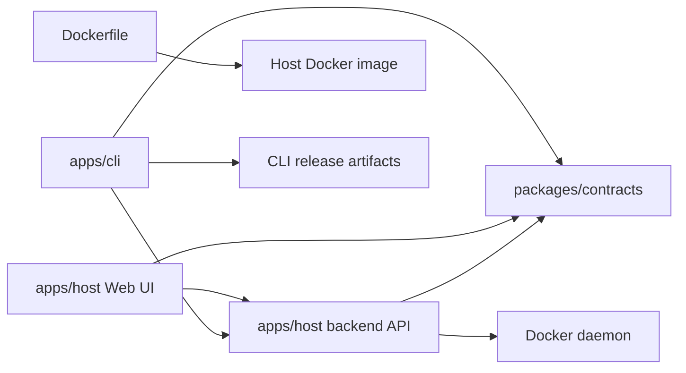

# Repository and release model

Этот документ фиксирует решение хранить Docker Host, Web UI, backend API и `docker-host` CLI в одном repository, но собирать и публиковать их как независимые release artifacts.

## Решение

Docker Host должен использовать monorepo:

- Host Web UI и backend API остаются частью одного Host application;
- Host Docker image публикуется как отдельный container artifact;
- `docker-host` CLI публикуется как отдельный standalone executable artifact;
- общий API-контракт между Host backend API, Web UI и CLI хранится в repository рядом с кодом;
- GitHub Actions разделяются по artifact type и запускаются только для затронутых частей.

Такой подход сохраняет синхронизацию между CLI и Host API, но не заставляет пересобирать Host image при каждом изменении CLI.

## Предлагаемая структура

```text
apps/
  host/
    src/
    public/
    Dockerfile
    package.json
  cli/
    src/
      Haas.DockerHost.Cli/
        Haas.DockerHost.Cli.csproj
    tests/
      Haas.DockerHost.Cli.Tests/
        Haas.DockerHost.Cli.Tests.csproj
packages/
  contracts/
    openapi.yaml
    generated/
scripts/
  install.sh
docs/
  features/
  planning/
.github/
  workflows/
```

На текущем этапе repository еще может физически не соответствовать этой структуре. Документ описывает целевую организацию, к которой нужно двигаться при появлении полноценного CLI и общего API-контракта.

При первом split текущий Next.js application переносится в `apps/host`, а standalone `docker-host` CLI создается в `apps/cli`. Shared API contract между Web UI, Host backend API и CLI должен быть определен в repository рядом с кодом при введении CLI-facing Host API surface. Executable OpenAPI artifact можно добавить позже, когда endpoint model стабилизируется.

## Component boundaries



Host backend API остается единственным владельцем module management logic. Web UI вызывает этот API напрямую. CLI вызывает этот же API для module commands и работает напрямую с Docker daemon только для lifecycle самого Host container: install, start, stop, restart, update, status и logs.

## GitHub Actions model

Сборки должны быть независимыми:

- `ci.yml` - общие проверки на pull request и push;
- `host-image.yml` - build/push Host Docker image;
- `cli-release.yml` - build/publish standalone CLI artifacts;
- опционально `docs.yml` - проверки документации.

Recommended path filters:

```text
Host image build:
  apps/host/**
  packages/contracts/**
  Dockerfile
  package.json
  package-lock.json
  .github/workflows/host-image.yml

CLI build:
  apps/cli/**
  packages/contracts/**
  scripts/install.sh
  .github/workflows/cli-release.yml

Docs-only changes:
  docs/**
  README.md
```

Если изменился только CLI, Host image не должен публиковаться. Если изменился только Host UI без изменения API-контракта, CLI artifacts не должны публиковаться. Если изменился общий API-контракт, CI должен проверить и Host, и CLI.

## Release artifacts

Host release artifact:

```text
ghcr.io/<owner>/<repo>:<version>
ghcr.io/<owner>/<repo>:latest
ghcr.io/<owner>/<repo>:sha-<commit>
```

This matches the current repository workflow, which publishes one Host image for the repository. There is no need to add a nested `/docker-host` image path unless the repository later publishes multiple different container images.

CLI release artifacts:

```text
docker-host-darwin-arm64
docker-host-darwin-x64
docker-host-linux-arm64
docker-host-linux-x64
docker-host-windows-x64.exe
SHA256SUMS
```

For development and early usage, CLI artifacts are published to one rolling GitHub prerelease with tag `cli-dev`. The `cli-dev` workflow overwrites existing release assets for every new CLI build, so installation URLs stay stable while the binary tracks the latest development build.

Unix users install the current development CLI through `scripts/install.sh`:

```sh
curl -fsSL https://raw.githubusercontent.com/alex-de-haas/docker-host/main/scripts/install.sh | sh
```

Later stable CLI versions can be published as immutable GitHub releases, for example `cli-v0.2.1`. Those stable release assets should not be overwritten. GitHub Actions artifacts may still be used for CI/debugging, but they are not the installation channel because they have retention limits and less convenient download URLs.

`install.sh` detects OS/architecture, downloads the right `cli-dev` artifact, verifies checksums when available, installs the executable to `~/.docker-host/bin/docker-host`, marks it executable, and prints PATH instructions. CLI already manages the Host container after installation and uses configured Host image reference.

`docker-host update` updates both the CLI executable and the Host container image. It downloads the matching CLI artifact from `cli-dev`, verifies checksums when available, safely replaces the installed executable, then pulls and recreates the Host container with the configured Host image. `scripts/install.sh` remains the first-install and repair/reinstall path. Module updates are separate module commands, for example `docker-host modules update <module-id>`.

## Versioning

CLI и Host image могут иметь независимые версии:

```text
host-v0.3.0
cli-v0.2.1
```

During early development, `cli-dev` is the main CLI distribution channel. Immutable `cli-v*` releases can be introduced when the project needs stable public versions.

При изменении API-контракта нужно явно проверить совместимость:

- старый CLI с новым Host API;
- новый CLI со старым Host API, если поддерживается upgrade path;
- version negotiation или понятная ошибка, если версии несовместимы.

Для базового этапа достаточно, чтобы CLI отправлял свой version и ожидаемую contract version в запросах к Host API, а Host возвращал понятную ошибку при несовместимости.

## Why not separate repositories

Отдельные repositories стоит рассматривать позже, если CLI станет самостоятельным продуктом с отдельным release process, командой или roadmap.

На текущем этапе отдельные repositories создадут больше проблем, чем пользы:

- сложнее менять API-контракт атомарно;
- сложнее гарантировать совместимость CLI и Host API;
- сложнее делать pull request, который одновременно меняет backend endpoint и CLI command;
- сложнее синхронизировать release notes и install script;
- выше риск, что CLI начнет дублировать business logic Host backend.

Monorepo лучше соответствует текущей архитектуре: один продукт, несколько independently built artifacts.
