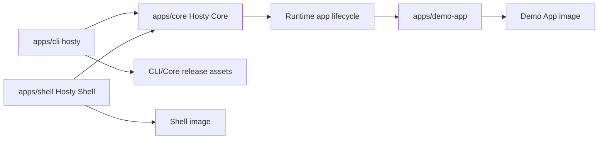

# Repository And Release Model

This document records the current repository layout and release artifact boundaries after the Core/Shell split and retirement of the legacy combined Host package.

## Decision

Hosty uses one repository for:

- `apps/core` - Hosty Core, the local-first ASP.NET Core API and runtime orchestrator;
- `apps/shell` - Hosty Shell, the browser client and Core-managed runtime app;
- `apps/demo-app` - the first-party example runtime app;
- `apps/cli` - the standalone `hosty` CLI;
- `skills/hosty-app-skill` - the repository-shipped Codex skill for wrapping apps as Hosty runtime apps;
- product/channel metadata and documentation.

The retired `apps/host` package and `host-image.yml` workflow are no longer part of the release model. Core and Shell are separate components; Shell is distributed and managed as a runtime app rather than bundled into a combined Next.js Host image.

## Component Boundaries



Core owns API, auth, app lifecycle, source state, backup state, local control discovery, and runtime adapters. Shell owns only browser UI. The CLI bootstraps local Core and calls Core APIs for ordinary operations.

## GitHub Actions Model

Builds are independent:

- `ci.yml` - shared checks on pull requests and pushes;
- `shell-image.yml` - build and push the Hosty Shell Docker image on `main`;
- `demo-app-image.yml` - build and push the first-party Demo App Docker image;
- `cli-release.yml` - build and publish standalone CLI and Core executable artifacts;
- optional future workflows - desktop Shell packages or generated product channel indexes.

Recommended path filters:

```text
Shell build:
  apps/shell/**
  package.json
  package-lock.json

Shell image build:
  apps/shell/**
  package.json
  package-lock.json
  .github/workflows/shell-image.yml

Demo App build:
  apps/demo-app/**
  package.json
  package-lock.json

Demo App image build:
  apps/demo-app/**
  package.json
  package-lock.json
  .github/workflows/demo-app-image.yml

Core build:
  apps/core/**
  global.json

CLI/Core release build:
  apps/core/**
  apps/cli/**
  scripts/install.sh
  scripts/install.ps1
  global.json
  .github/workflows/cli-release.yml

Docs-only changes:
  docs/**
  README.md
```

Full CI runs Shell build, Demo App lint/build, Core build/tests, installer syntax validation for shell and PowerShell installers, CLI build, and CLI xUnit tests. The root `npm run ci` script mirrors the primary Shell, Demo App, Core, and CLI validation sequence for local validation.

Pull request CI is intentionally lighter than default-branch CI. Pull requests run build-only checks for Shell, Demo App, Core, and CLI so reviewers get a fast compile signal without publishing artifacts. Pushes to `main` run the fuller validation path, including lint and tests where configured.

## Release Artifacts

Hosty Shell image artifact:

```text
ghcr.io/alex-de-haas/hosty-shell:latest
ghcr.io/alex-de-haas/hosty-shell:sha-<commit>
```

The Shell image is the Core-managed system runtime app artifact for the browser UI. Its source of truth is `apps/shell/manifest.json` and `apps/shell/Dockerfile`. The `shell-image.yml` workflow publishes `latest` and `sha-<commit>` tags to GitHub Container Registry on pushes to `main`.

Demo App image artifact:

```text
ghcr.io/alex-de-haas/demo-app:latest
ghcr.io/alex-de-haas/demo-app:sha-<commit>
```

The Demo App image is the first-party example runtime app artifact for app manifest workflows. Its source of truth is `apps/demo-app/manifest.json` and `apps/demo-app/Dockerfile`. The `demo-app-image.yml` workflow publishes `latest` and `sha-<commit>` tags to GitHub Container Registry.

CLI release artifacts:

```text
hosty-darwin-arm64
hosty-darwin-x64
hosty-linux-arm64
hosty-linux-x64
hosty-windows-x64.exe
```

Core release artifacts:

```text
hosty-core-darwin-arm64
hosty-core-darwin-x64
hosty-core-linux-arm64
hosty-core-linux-x64
hosty-core-windows-x64.exe
SHA256SUMS
```

For development and early usage, CLI and Core artifacts are published to one rolling GitHub prerelease with tag `cli-dev`. The `cli-dev` workflow overwrites existing release assets for every new release build, so installation URLs stay stable while the binaries track the latest development build.

Unix users install the current development CLI through `scripts/install.sh`:

```sh
curl -fsSL https://raw.githubusercontent.com/alex-de-haas/docker-host/main/scripts/install.sh | sh
```

Windows users install the current development CLI through `scripts/install.ps1`:

```powershell
irm https://raw.githubusercontent.com/alex-de-haas/docker-host/main/scripts/install.ps1 | iex
```

Stable CLI/Core versions can use immutable GitHub releases such as `cli-v0.2.1` when that channel is enabled.

`install.sh` detects OS/architecture, downloads the right CLI artifact, verifies checksums when available, installs the executable to `~/.hosty/bin/hosty`, marks it as runnable, and adds the install directory to a detected shell profile. `install.ps1` downloads `hosty-windows-x64.exe`, verifies checksums when available, installs it to `%USERPROFILE%\.hosty\bin\hosty.exe`, and adds the install directory to the current user's PATH. Hosty uses `~/.hosty` as its default local root, or `HOSTY_HOME` when explicitly set.

The installer does not install Core directly. `hosty start` downloads Core only when `~/.hosty/core/bin/hosty-core` is missing. `hosty update` updates the managed CLI executable first, then installs or replaces the managed Core executable. It does not pull a Host image or recreate a Host container. Shell remains a Core-managed system runtime app. Core bootstraps it from `HOSTY_SHELL_MANIFEST_PATH` and `HOSTY_SHELL_BOOTSTRAP_RUNTIME`, then Docker pulls the image according to the Shell manifest.

## Release-Ready Validation

Manual validation for the current artifact model:

- install the CLI through the curl flow;
- run `hosty install` and confirm local Hosty directories are prepared;
- start installed Core with `hosty start` and confirm missing Core bootstrap downloads `hosty-core`;
- start source Core explicitly with `hosty core start --project apps/core/src/Haas.Hosty.Core/Haas.Hosty.Core.csproj` when validating repository Core changes;
- run Shell locally with `npm run shell:dev` or through the Core-managed `hosty.shell` runtime app;
- verify `docker pull ghcr.io/alex-de-haas/hosty-shell:latest` succeeds after `shell-image.yml` runs on `main`;
- install the Demo App through `hosty apps install apps/demo-app/manifest.json`;
- start, stop, restart, log, update-plan, update, backup, restore, and remove the Demo App through `hosty apps`;
- run `hosty update` and confirm the CLI channel works.

## Versioning

During early development, `cli-dev` is the main CLI/Core distribution channel. Immutable `cli-v*` releases can be introduced when the project needs stable public versions.

Runtime apps carry their own app manifest versions. Product channel metadata can coordinate CLI/Core/Shell updates later. Generated product channels are tracked as an idea in [Update Channels](../ideas/update-channels.md). Until then, the placeholder product channel records the Core artifact family instead of a source project path.
