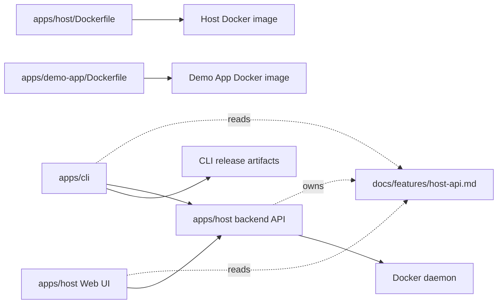

# Repository and release model

This document records the decision to keep Docker Host, the Web UI, the backend API, and the `docker-host` CLI in one repository while building and publishing them as independent release artifacts.

## Decision

Docker Host uses a monorepo:

- the Host Web UI and backend API remain part of one Host application;
- the Host Docker image is published as a separate container artifact;
- repository-local runtime apps can publish their own container artifacts;
- the `docker-host` CLI is published as a separate standalone executable artifact;
- the shared API contract between the Host backend API, Web UI, and CLI is documented in this repository;
- GitHub Actions are split by artifact type and run only for affected areas.

This approach keeps the CLI and Host API synchronized without rebuilding the Host image for every CLI-only change.

## Proposed structure

```text
apps/
  core/
    src/
    tests/
  shell/
    src/
    package.json
  demo-app/
    src/
    Dockerfile
    manifest.json
  host/
    src/
    public/
    Dockerfile
    package.json
  cli/
    src/
      Haas.DockerHost.Cli/
        Haas.DockerHost.Cli.csproj
    tests/
      Haas.DockerHost.Cli.Tests/
        Haas.DockerHost.Cli.Tests.csproj
scripts/
  install.sh
docs/
  features/
    host-api.md
.github/
  workflows/
```

Repository physically follows this skeleton: Hosty Core lives in `apps/core`, Hosty Shell lives in `apps/shell`, the CLI lives in `apps/cli`, the first-party Demo App lives in `apps/demo-app`, legacy module compatibility fixtures live in `modules`, and the Host API contract is documented in `docs/features/host-api.md`.

The Host API contract between the Web UI, Host backend API, and CLI is defined in `docs/features/host-api.md`. A separate contracts package, generated OpenAPI artifact, and generated clients are not part of the repository contract.

## Component boundaries



The Host backend API remains the only owner of module-management logic. The Web UI calls this API directly. The CLI calls the same API for module commands and works directly with Docker daemon only for the Host container lifecycle: install, start, stop, restart, update, status, and logs.

## GitHub Actions model

Builds must be independent:

- `ci.yml` - shared checks on pull requests and pushes;
- `host-image.yml` - build and push the Host Docker image;
- `demo-module-image.yml` - legacy compatibility workflow that builds and pushes the Demo Module Docker image until the post-validation removal phase;
- `cli-release.yml` - build and publish standalone CLI artifacts;
- optional `docs.yml` - documentation checks.

Recommended path filters:

```text
Host image build:
  apps/host/**
  apps/host/Dockerfile
  package.json
  package-lock.json
  .github/workflows/host-image.yml

Demo App build:
  apps/demo-app/**
  package.json
  package-lock.json
  .github/workflows/ci.yml

Legacy Demo Module image build:
  modules/demo-module/**
  package.json
  package-lock.json
  .github/workflows/demo-module-image.yml

CLI build:
  apps/cli/**
  docs/features/host-api.md
  scripts/install.sh
  global.json
  .github/workflows/cli-release.yml

Docs-only changes:
  docs/**
  README.md
```

If only the CLI changes, the Host image should not be published. If only the Host UI changes without changing the API contract, CLI artifacts should not be published. If `docs/features/host-api.md` changes, CI should validate both Host and CLI.

Full CI runs Shell build, Demo App lint/build, legacy Demo Module lint/build while the compatibility fixture remains, Core build/tests, installer syntax validation, CLI build, and CLI xUnit tests. The root `npm run ci` script mirrors the primary Shell, Demo App, Core, and CLI validation sequence for local validation.

Pull request CI is intentionally lighter than default-branch CI. Pull requests run build-only checks for Shell, Demo App, the legacy Demo Module fixture, Core, and CLI so reviewers get a fast signal that changed code compiles without publishing artifacts or running release-grade image builds. Pushes to `main` run the full validation path, including lint and tests where configured.

## Release artifacts

Host release artifact:

```text
ghcr.io/<owner>/<repo>:<host-version>
ghcr.io/<owner>/<repo>:latest
ghcr.io/<owner>/<repo>:sha-<commit>
```

This matches the current repository workflow, which publishes one Host image for the repository. There is no nested `/docker-host` image path because the repository publishes a single Host container image.

Immutable Host versions are created from `host-v*` git tags. The Host image workflow must not publish versioned Host images for CLI tags such as `cli-dev` or `cli-v*`. The `latest` tag tracks the default branch, and `sha-<commit>` tags provide traceability for every published image.

The Host image should be published as a multi-platform Linux image for `linux/amd64` and `linux/arm64`, so Docker Desktop users on Apple Silicon and standard x64 Linux hosts can pull the same image reference without local emulation setup.

The Host image workflow runs only for pushes to `main` and `host-v*` tags. Pull requests do not run the Docker Buildx/QEMU image build; the lightweight CI build is the pull request compile gate. The Host, Demo App, and legacy Demo Module image workflows should use separate GitHub Actions Buildx cache scopes and `mode=min` cache export so their caches do not overwrite each other and cache upload does not dominate the build.

Demo App image artifact:

```text
ghcr.io/alex-de-haas/demo-app:latest
ghcr.io/alex-de-haas/demo-app:sha-<commit>
```

The Demo App image is the first-party runtime app artifact for app manifest workflows. Its source of truth is `apps/demo-app/manifest.json` and `apps/demo-app/Dockerfile`.

Legacy Demo Module image artifact:

```text
ghcr.io/alex-de-haas/demo-module:latest
ghcr.io/alex-de-haas/demo-module:sha-<commit>
```

The Demo Module image is still published to GitHub Container Registry from `demo-module-image.yml` as a legacy schema `0.3` compatibility fixture. It should not be presented as the primary first-party runtime app workflow. The workflow can be removed in the post-validation removal phase when `modules/demo-module` is deleted.

CLI release artifacts:

```text
docker-host-darwin-arm64
docker-host-darwin-x64
docker-host-linux-arm64
docker-host-linux-x64
docker-host-windows-x64.exe
SHA256SUMS
```

For development and early usage, CLI artifacts are published to one rolling GitHub prerelease with tag `cli-dev`. The `cli-dev` workflow overwrites existing release assets for every new CLI build, so installation URLs stay stable while the binary tracks the latest development build.

Unix users install the current development CLI through `scripts/install.sh`:

```sh
curl -fsSL https://raw.githubusercontent.com/alex-de-haas/docker-host/main/scripts/install.sh | sh
```

Stable CLI versions use immutable GitHub releases such as `cli-v0.2.1` when that channel is enabled. Those stable release assets should not be overwritten. GitHub Actions artifacts may still be used for CI/debugging, but they are not the installation channel because they have retention limits and less convenient download URLs.

`install.sh` detects OS/architecture, downloads the right `cli-dev` artifact, verifies checksums when available, installs the preferred executable to `~/.hosty/bin/hosty`, creates or refreshes the deprecated `docker-host` alias in the same directory, marks executables as runnable, and adds the install directory to a detected shell profile. Existing installations under `~/.docker-host` remain supported as a legacy active root when `~/.hosty` does not exist. If a POSIX-compatible profile cannot be detected or the profile update is disabled, the installer prints PATH instructions instead. If `SHA256SUMS` is available, checksum verification is mandatory; an installer that cannot verify the checksum should fail with a clear next step.

The script is intentionally thin. It delegates launch configuration creation, Docker preflight, and Host image installation to `hosty install`, which owns `launch.env` parsing and validation. Re-running the installer is a repair/reinstall path: it may replace the CLI executable, but it preserves existing launch settings through the CLI config flow and refreshes registry-backed Host image tags before start. Single-component local Host image tags that already exist locally, such as `docker-host:dev`, are preserved without a registry pull. The installer supports scoped Hosty overrides for forks, tests, custom shell profiles, and explicit start mode: `HOSTY_INSTALL_REPO`, `HOSTY_INSTALL_TAG`, `HOSTY_INSTALL_DIR`, `HOSTY_INSTALL_PROFILE`, `HOSTY_INSTALL_SKIP_PATH_UPDATE`, and `HOSTY_INSTALL_START`. Legacy `DOCKER_HOST_INSTALL_*` variables remain accepted during the migration window.

`hosty update` updates the managed CLI executable and synchronizes both command aliases. It downloads the matching CLI artifact from `cli-dev` with Spectre.Console download progress, using determinate percentage bars when HTTP response sizes are known and an indeterminate dotted spinner with downloaded bytes and transfer speed when they are not. It verifies checksums when available, compares the downloaded artifact with the installed executable, reports either `CLI updated` or `CLI already up to date`, and then recommends restarting the Host when convenient. The command no longer pulls the Host image, recreates the Host container, or starts the updated executable with `update --host-only`. Host image refresh is owned by `hosty start`: when the Host is stopped, `start` checks the configured image tag, pulls registry-backed references, falls back to a cached image if the pull fails, and recreates the container only when the local image id changed. Docker image transfer progress remains owned by Docker Engine. `scripts/install.sh` remains the first-install and repair/reinstall path. Runtime app updates are separate app commands, for example `hosty apps update <app-id>`.

## Release-ready validation

A published Host image should not be treated as release-ready until the release candidate has been validated from published artifacts, not a local checkout:

```sh
docker pull ghcr.io/alex-de-haas/docker-host:latest
curl -fsSL https://raw.githubusercontent.com/alex-de-haas/docker-host/main/scripts/install.sh | sh -s -- --start
```

The manual release checklist is:

- install the CLI through the curl flow;
- confirm `hosty install` validates Docker Engine reachability, Linux-container mode, and refreshes the published Host image;
- start the published Host image with `hosty start`;
- install a runtime app through the Host UI/API using a manifest URL;
- remove the installed runtime app and confirm preserved/deleted app data behavior follows the remove plan;
- update an installed runtime app and confirm the update plan, apply, and retry behavior work against the published Host image;
- run `hosty update` and confirm the CLI channel works;
- stop and start the Host, then confirm `hosty start` checks and adopts the configured Host image.

This manual checklist is the release gate for published artifacts.

## Versioning

The CLI and Host image can have independent versions:

```text
host-v0.3.0
cli-v0.2.1
```

During early development, `cli-dev` is the main CLI distribution channel. Immutable `cli-v*` releases can be introduced when the project needs stable public versions.

When the API contract changes, compatibility must be checked explicitly:

- old CLI with the new Host API;
- new CLI with the old Host API, if that upgrade path is supported;
- version negotiation or a clear error when versions are incompatible.

For the initial stage, it is enough for the CLI to send its own version and expected contract version in Host API requests, while the Host returns a clear error on incompatibility.

## Why not separate repositories

Separate repositories are not part of the current architecture because they create more problems than value:

- changing the API contract atomically is harder;
- guaranteeing CLI and Host API compatibility is harder;
- making one pull request that changes both a backend endpoint and a CLI command is harder;
- keeping release notes and the install script synchronized is harder;
- the risk that the CLI starts duplicating Host backend business logic is higher.

The monorepo better matches the current architecture: one product with several independently built artifacts.
