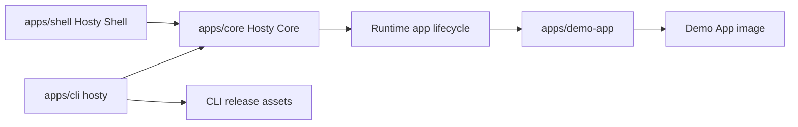

# Repository And Release Model

This document records the current repository layout and release artifact boundaries after the Core/Shell split and retirement of the legacy combined Host package.

## Decision

Hosty uses one repository for:

- `apps/core` - Hosty Core, the local-first ASP.NET Core API and runtime orchestrator;
- `apps/shell` - Hosty Shell, the browser client and Core-managed runtime app;
- `apps/demo-app` - the first-party example runtime app;
- `apps/cli` - the standalone `hosty` CLI;
- `skills/hosty-app-skill` - the repository-shipped Codex skill for wrapping apps as Hosty runtime apps;
- product/channel metadata and documentation.

The retired `apps/host` package and `host-image.yml` workflow are no longer part of the release model. Core and Shell are separate components; Shell is distributed and managed as a runtime app rather than bundled into a combined Next.js Host image.

## Component Boundaries



Core owns API, auth, app lifecycle, source state, backup state, local control discovery, and runtime adapters. Shell owns only browser UI. The CLI bootstraps local Core and calls Core APIs for ordinary operations.

## GitHub Actions Model

Builds are independent:

- `ci.yml` - shared checks on pull requests and pushes;
- `demo-app-image.yml` - build and push the first-party Demo App Docker image;
- `cli-release.yml` - build and publish standalone CLI artifacts;
- optional future workflows - Shell image or package publishing when a public Shell distribution channel is introduced.

Recommended path filters:

```text
Shell build:
  apps/shell/**
  package.json
  package-lock.json

Demo App build:
  apps/demo-app/**
  package.json
  package-lock.json

Demo App image build:
  apps/demo-app/**
  package.json
  package-lock.json
  .github/workflows/demo-app-image.yml

Core build:
  apps/core/**
  global.json

CLI build:
  apps/cli/**
  scripts/install.sh
  global.json
  .github/workflows/cli-release.yml

Docs-only changes:
  docs/**
  README.md
```

Full CI runs Shell build, Demo App lint/build, Core build/tests, installer syntax validation, CLI build, and CLI xUnit tests. The root `npm run ci` script mirrors the primary Shell, Demo App, Core, and CLI validation sequence for local validation.

Pull request CI is intentionally lighter than default-branch CI. Pull requests run build-only checks for Shell, Demo App, Core, and CLI so reviewers get a fast compile signal without publishing artifacts. Pushes to `main` run the fuller validation path, including lint and tests where configured.

## Release Artifacts

Demo App image artifact:

```text
ghcr.io/alex-de-haas/demo-app:latest
ghcr.io/alex-de-haas/demo-app:sha-<commit>
```

The Demo App image is the first-party runtime app artifact for app manifest workflows. Its source of truth is `apps/demo-app/manifest.json` and `apps/demo-app/Dockerfile`. The `demo-app-image.yml` workflow publishes `latest` and `sha-<commit>` tags to GitHub Container Registry.

CLI release artifacts:

```text
docker-host-darwin-arm64
docker-host-darwin-x64
docker-host-linux-arm64
docker-host-linux-x64
docker-host-windows-x64.exe
SHA256SUMS
```

For development and early usage, CLI artifacts are published to one rolling GitHub prerelease with tag `cli-dev`. The `cli-dev` workflow overwrites existing release assets for every new CLI build, so installation URLs stay stable while the binary tracks the latest development build.

Unix users install the current development CLI through `scripts/install.sh`:

```sh
curl -fsSL https://raw.githubusercontent.com/alex-de-haas/docker-host/main/scripts/install.sh | sh
```

Stable CLI versions use immutable GitHub releases such as `cli-v0.2.1` when that channel is enabled.

`install.sh` detects OS/architecture, downloads the right `cli-dev` artifact, verifies checksums when available, installs the preferred executable to `~/.hosty/bin/hosty`, creates or refreshes the deprecated `docker-host` alias in the same directory, marks executables as runnable, and adds the install directory to a detected shell profile. Existing installations under `~/.docker-host` remain supported as a legacy active root when `~/.hosty` does not exist.

`hosty update` updates the managed CLI executable and synchronizes both command aliases. It does not pull a Host image or recreate a Host container. Runtime app updates are separate app commands, for example `hosty apps update <app-id>`.

## Release-Ready Validation

Manual validation for the current artifact model:

- install the CLI through the curl flow;
- run `hosty install` and confirm local Hosty directories are prepared;
- start Core with `hosty start` from a checkout or a configured Core project path;
- run Shell locally with `npm run shell:dev` or through the Core-managed `hosty.shell` runtime app;
- install the Demo App through `hosty apps install apps/demo-app/manifest.json`;
- start, stop, restart, log, update-plan, update, backup, restore, and remove the Demo App through `hosty apps`;
- run `hosty update` and confirm the CLI channel works.

## Versioning

During early development, `cli-dev` is the main CLI distribution channel. Immutable `cli-v*` releases can be introduced when the project needs stable public versions.

Runtime apps carry their own app manifest versions. Product channel metadata can coordinate CLI/Core/Shell updates later, but generated product channels are deferred.
