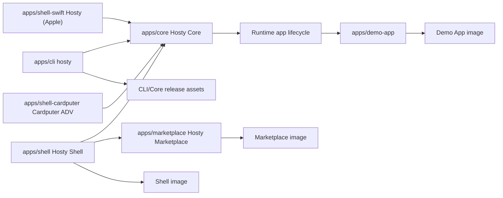

# Repository And Release Model

Created: 2026-05-12
Updated: 2026-08-03

This document records the current repository layout and release artifact boundaries after the Core/Shell split and retirement of the legacy combined Host package.

## Decision

Hosty uses one repository for:

- `apps/core` - Hosty Core, the local-first ASP.NET Core API and runtime orchestrator;
- `apps/shell` - Hosty Shell, the browser client and Core-managed runtime app;
- `apps/marketplace` - Hosty Marketplace, the optional catalog storefront system app;
- `apps/demo-app` - the first-party example runtime app;
- `apps/cli` - the standalone `hosty` CLI;
- `apps/shell-swift` - the native Apple client (iOS, iPadOS, macOS) for a Hosty host;
- `apps/shell-cardputer` - native M5Stack Cardputer ADV operator-console firmware;
- `skills/hosty-app-skill` - the repository-shipped Codex skill for wrapping apps as Hosty runtime apps;
- product/channel metadata and documentation.

The retired `apps/host` package and `host-image.yml` workflow are no longer part of the release model. Core and Shell are separate components; Shell is distributed and managed as a runtime app rather than bundled into a combined Next.js Host image.

## Component Boundaries



Core owns API, auth, app lifecycle, source/feed state, backup state, local control discovery, and runtime adapters. Shell owns the host browser UI. Marketplace owns its catalog source and storefront UI. The CLI bootstraps local Core and calls Core APIs for ordinary operations.

`apps/shell-swift` sits outside the runtime-app model entirely. It is a client installed on the operator's device, not on a host: it has no manifest, Core neither installs nor supervises it, and it is never a `ui-client` Core can redirect a browser to. It consumes the same browser API as Shell. Its version lives in `apps/shell-swift/Config/Version.xcconfig` and moves independently of every other artifact here.

`apps/shell-cardputer` is also a native operator client rather than a runtime
app. It is ESP-IDF firmware installed on an M5Stack Cardputer ADV, consumes a
bounded administrative subset of the Core API, and has no runtime-app manifest.
Its version lives only in `apps/shell-cardputer/version.txt` and moves
independently of the platform, browser Shell, and Apple client.

## GitHub Actions Model

Builds are independent:

- `ci.yml` - shared checks on pull requests and pushes;
- `shell-image.yml` - build and push the Hosty Shell Docker image on `main`;
- `marketplace-image.yml` - test, build, attest, and push the Hosty Marketplace Docker image on `main`;
- `demo-app-image.yml` - build and push the first-party Demo App Docker image;
- `cli-release.yml` - build and publish standalone CLI and Core executable artifacts.
- `cardputer-release.yml` - build, attest, and publish rolling Cardputer ADV firmware and recovery images.

No workflow packages or publishes `apps/shell-swift` (see [Swift Shell](../swift-shell/feature.md)); it is built from Xcode and checked by the `swift-shell` job in `ci.yml`. Cardputer uses the pinned ESP-IDF container in both the `cardputer-shell` CI job and its dedicated release workflow.

Unlike `ci.yml`, the publishing workflows do filter at the workflow level - there is no required status
check to leave pending, and not publishing is the correct outcome for an unrelated commit. Their
`paths:` lists must match what actually lands in the artifact, in both directions. The four Node image
workflows watch `package.json` and `package-lock.json` because each Dockerfile's `deps` stage copies
exactly those two files and runs `npm ci` against them, so a root lockfile bump changes the shipped
image even when nothing under `apps/<component>/` does. Conversely they must *not* watch `global.json`
or `Directory.Build.props`: those are .NET-only, and while `marketplace-image.yml` listed them every
platform version bump republished the image - the slowest build here, multi-arch under QEMU - for no
change at all.

### Path filtering in `ci.yml`

`ci.yml` carries every component's checks as sibling jobs, so its filtering is **per job, not per
workflow**. A `changes` job runs [`dorny/paths-filter`](https://github.com/dorny/paths-filter) and each
component job gates on the matching output.

A workflow-level `paths:` filter cannot do this. It is a union over every component, so a change to any
one of them starts all of them - which is what the repository did until this was split out. It is also
incompatible with required status checks: when the filter excludes a change the workflow never starts,
its checks never report, and the pull request waits on them forever. A job skipped by `if:` reports as
skipped, which GitHub counts as success.

Shared paths are scoped **by runtime**, not pooled into one list:

```text
node_shared:                    dotnet_shared:
  package.json                    package.json
  package-lock.json               global.json
  .github/workflows/ci.yml        Directory.Build.props
                                  .github/workflows/ci.yml

Shell / Demo App / Marketplace / Telemetry UI:
  <node_shared>
  packages/app-sdk/**          # all four depend on the @hosty-sdk/app workspace package
  apps/<component>/**

App SDK:            <node_shared>   + packages/app-sdk/**
App SDK (.NET):     <dotnet_shared> + packages/app-sdk-dotnet/**
Core:               <dotnet_shared> + apps/core/**
Telemetry Backend:  <dotnet_shared> + apps/telemetry-backend/**
CLI:                <dotnet_shared> + apps/cli/** + scripts/install.sh + scripts/install.ps1
Cardputer Shell:    apps/shell-cardputer/** + scripts/check-versions.mjs
Workflow lint:      .github/workflows/**
```

The split is not cosmetic. A single shared pool was tried first and made the filtering nearly inert:
every version bump touches either `package-lock.json` (npm workspaces record their version there) or
`Directory.Build.props` (the platform version), and the versioning policy above requires that bump in
the same commit - so almost every pull request matched every filter. An npm lockfile cannot change a
.NET build and the .NET SDK pin cannot change a Node one, so scoping them costs nothing in safety.

`package.json` is in both lists: the root manifest holds the `core:build` / `cli:build` /
`telemetry-backend:build` scripts the .NET jobs invoke, so it is not Node-only.

Within a runtime the filters still err toward over-triggering - a `package-lock.json` change runs all
four Node apps, because a version-only bump and a real dependency bump are indistinguishable by path.
Under-triggering on a shared dependency change is the failure worth avoiding, so when in doubt a path
belongs in the shared list for its runtime.

Two jobs are deliberately ungated:

- **Version consistency.** `scripts/check-versions.mjs` reads version fields from every manifest and
  `package.json` in the repository, so any filter narrow enough to be useful would also be wrong. It
  needs no `npm ci` and finishes in seconds.
- **Docs index.** `scripts/docs-index.mjs --check` validates headers and the generated index across the
  whole `docs/` tree, for the same reason and at the same cost.

The filter applies to **pushes to `main` as well as pull requests**. The `changes` job passes
`base: ${{ github.ref }}`, which on a push diffs against the commit before the push - for a merge
commit, the merged pull request's whole changeset. On a zero `before` (force-push, or a branch's first
push) `paths-filter` degrades to listing every file as added, so the full matrix runs rather than
nothing.

This relies on a branch protection rule. A push-side diff cannot see a semantic conflict between two
pull requests merged in parallel: the repository uses merge commits, so `main` can differ from the tree
any single pull request tested. **Require branches to be up to date before merging** closes that gap by
forcing a pull request onto current `main` before it can land, so the pull request run and the push run
see the same tree. That rule is load-bearing; without it the filter has to go back to running the full
matrix on every push.

### Concurrency

`ci.yml` groups runs by pull request number, cancelling superseded ones - a branch pushed three times
no longer keeps three full matrices alive. Pushes to `main` are keyed by commit instead, so no `main`
commit loses its validation to the commit merged seconds after it.

Every publishing workflow serializes its publishing job (`build-and-push`, or the release job in
`cli-release.yml` and `cardputer-release.yml`) and never cancels in progress: two runs racing to move
`:latest`, a version tag, or the `cli-dev` / `cardputer-dev` tag can leave the moving tag on whichever
finished last, and a half-finished registry push is worse than a queued one. Only the publishing job is
grouped, so a later commit's gate tests still run in parallel.

### Workflow lint

A `Workflow lint` job runs [`actionlint`](https://github.com/rhysd/actionlint) (pinned image, not
`latest`) over `.github/workflows/**`: expression syntax, `needs`/`outputs` references, action input
names, and shellcheck across every `run:` block.

It exists because a hyphenated `needs.changes.outputs.app-sdk` reference shipped in the first version of
the filtering above. A `-` in an expression property name parses as **subtraction**, so the expression
evaluated to something other than the output it named, and nothing in CI could have caught it. Property
names referenced from expressions are therefore underscored, while job ids stay hyphenated.

Note that shellcheck cannot see through `${{ }}` interpolation - `[[ "${{ matrix.rid }}" == win-* ]]`
reads to it as a comparison that can never match (SC2193). Bind workflow values to `env:` and reference
them as shell variables, which is the recommended shape anyway.

The single-purpose image and release workflows keep their own workflow-level `paths:` filters; with one
component each, the union problem does not arise.

Full CI runs Shell build, Marketplace lint/test/build, Demo App lint/build, Telemetry UI
lint/test/build, Core build/tests, Telemetry Backend build/tests, App SDK tests (Node and .NET),
installer syntax validation for shell and PowerShell installers, CLI build, and CLI xUnit tests. The
Cardputer job runs bounded host tests, builds the ESP32-S3 image, enforces the OTA-slot limit, and
uploads the image with its checksum. The
root `npm run ci` script mirrors the primary Shell, Marketplace, Demo App, Core, and CLI validation
sequence for local validation.

Pull request CI and default-branch CI therefore run the same checks, both restricted to the components
the diff touches - a push to `main` is filtered against the commit before the push exactly as a pull
request is filtered against its base.

## Release Artifacts

Hosty Shell image artifact:

```text
ghcr.io/alex-de-haas/hosty-shell:latest
ghcr.io/alex-de-haas/hosty-shell:sha-<commit>
```

The Shell image is the Core-managed system runtime app artifact for the browser UI. Its source of truth is `apps/shell/manifest.json` and `apps/shell/Dockerfile`. The `shell-image.yml` workflow publishes `latest` and `sha-<commit>` tags to GitHub Container Registry on pushes to `main`.

Demo App image artifact:

```text
ghcr.io/alex-de-haas/demo-app:latest
ghcr.io/alex-de-haas/demo-app:sha-<commit>
```

The Demo App image is the first-party example runtime app artifact for app manifest workflows. Its source of truth is `apps/demo-app/manifest.json` and `apps/demo-app/Dockerfile`. The `demo-app-image.yml` workflow publishes `latest` and `sha-<commit>` tags to GitHub Container Registry.

Marketplace image artifact:

```text
ghcr.io/alex-de-haas/hosty-marketplace:<manifest-version>
ghcr.io/alex-de-haas/hosty-marketplace:latest
ghcr.io/alex-de-haas/hosty-marketplace:sha-<commit>
```

Marketplace is versioned and shipped independently as a runtime app. Its manifest pins the versioned image tag; `marketplace-image.yml` also publishes `latest` and the commit tag and attaches build provenance.

CLI release artifacts:

```text
hosty-darwin-arm64
hosty-darwin-x64
hosty-linux-arm64
hosty-linux-x64
hosty-windows-x64.exe
```

Core release artifacts:

```text
hosty-core-darwin-arm64
hosty-core-darwin-x64
hosty-core-linux-arm64
hosty-core-linux-x64
hosty-core-windows-x64.exe
SHA256SUMS
```

Cardputer development firmware artifacts:

```text
hosty-cardputer.bin
hosty-cardputer-bootloader.bin
hosty-cardputer-partition-table.bin
hosty-cardputer-ota-data.bin
SHA256SUMS
```

The rolling `cardputer-dev` prerelease publishes these ESP32-S3 images after
host tests and a pinned ESP-IDF 5.5.4 build. GitHub build-provenance
attestations cover every binary. The firmware OTA client downloads only
`hosty-cardputer.bin` from this compiled-in release location; Core cannot
select or serve firmware.

For development and early usage, CLI and Core artifacts are published to one rolling GitHub prerelease with tag `cli-dev`. The `cli-dev` workflow overwrites existing release assets for every new release build, so installation URLs stay stable while the binaries track the latest development build.

Unix users install the current development CLI through `scripts/install.sh`:

```sh
curl -fsSL https://raw.githubusercontent.com/alex-de-haas/docker-host/main/scripts/install.sh | sh
```

Windows users install the current development CLI through `scripts/install.ps1`:

```powershell
irm https://raw.githubusercontent.com/alex-de-haas/docker-host/main/scripts/install.ps1 | iex
```

Stable CLI/Core versions can use immutable GitHub releases such as `cli-v0.2.1` when that channel is enabled.

`install.sh` detects OS/architecture, downloads the right CLI artifact, verifies checksums when available, installs the executable to `~/.hosty/bin/hosty`, marks it as runnable, and adds the install directory to a detected shell profile. `install.ps1` downloads `hosty-windows-x64.exe`, verifies checksums when available, installs it to `%USERPROFILE%\.hosty\bin\hosty.exe`, and adds the install directory to the current user's PATH. Hosty uses `~/.hosty` as its default local root, or `HOSTY_HOME` when explicitly set.

The installer does not install Core directly. `hosty start` downloads Core only when `~/.hosty/core/bin/hosty-core` is missing. `hosty update` updates the managed CLI executable first, then installs or replaces the managed Core executable. It does not pull a Host image or recreate a Host container. Shell remains a Core-managed system runtime app. Core resolves its manifest from the release-owned distribution list and installs it with the manifest's default runtime profile (`docker`, switchable afterwards with `hosty apps switch-runtime`); when the selected runtime is `docker`, Docker pulls the image according to the Shell manifest. Which first-party apps preinstall — Shell and Marketplace by default, Telemetry opt-in — is decided by the distribution list merged with the operator's `hosty setup` choices, not by per-app manifest-path launch settings.

## Release-Ready Validation

Manual validation for the current artifact model:

- install the CLI through the curl flow;
- run `hosty install` and confirm local Hosty directories are prepared;
- start installed Core with `hosty start` and confirm missing Core bootstrap downloads `hosty-core`;
- start source Core explicitly with `hosty core start --project apps/core/src/Haas.Hosty.Core/Haas.Hosty.Core.csproj` when validating repository Core changes;
- run Shell locally with `npm run shell:dev` or through the Core-managed `hosty.shell` runtime app;
- verify `docker pull ghcr.io/alex-de-haas/hosty-shell:latest` succeeds after `shell-image.yml` runs on `main`;
- run Marketplace through Core-managed `dev` and `docker` runtimes and verify its app-origin storefront and Shell install handoff;
- install the Demo App through `hosty apps install apps/demo-app`;
- start, stop, restart, log, update-plan, update, backup, restore, and remove the Demo App through `hosty apps`;
- run `hosty update` and confirm the CLI channel works.

## Versioning

Every component uses semantic versioning `major.minor.patch`, applied per release artifact rather than as one global number. There are three tiers.

### Tier 1 - Platform (`apps/core` + `apps/cli`)

Core and CLI are tightly coupled and ship together as one bundle (`cli-dev` / `cli-v*`), so they share a single version. The shared version lives in the root `Directory.Build.props` (`<Version>`). Individual `.csproj` files do not set their own `<Version>`; they inherit it.

### Tier 2 - Runtime apps (`apps/shell`, `apps/marketplace`, `apps/demo-app`, and external apps such as project-manager, media-server, torrent-engine)

Each runtime app is its own release artifact (its own image / repository) and versions independently through the `version` field in its `manifest.json`. Shell and Marketplace are versioned exactly like other runtime apps, not as part of the platform.

`version` is a separate axis from `schemaVersion` (`app.0.1`), which is the manifest *contract* version owned by Core (`RuntimeAppManifest.cs`). Bump `schemaVersion` only when the manifest format changes; it is unrelated to any single app's `version`. An app declares the `schemaVersion` it targets, and that declaration is the compatibility handshake, so no cross-repository version matrix is required.

### Tier 3 - Native clients (`apps/shell-swift`, `apps/shell-cardputer`)

Native clients install on operator-owned devices and do not have runtime-app
manifests. The Apple client uses `MARKETING_VERSION` in
`apps/shell-swift/Config/Version.xcconfig`. Cardputer firmware uses the single
line in `apps/shell-cardputer/version.txt`, which ESP-IDF consumes as
`PROJECT_VER` and `scripts/check-versions.mjs` validates as semantic versioning.
Each native client versions independently.

### Bump rules

While the project is in `0.x` (current), breaking changes go in `minor` per semver:

| Level | In `0.x` (current) | After `1.0` |
| --- | --- | --- |
| **patch** (`x.y.Z`) | bug fix or small enhancement to existing functionality | same, backward-compatible |
| **minor** (`x.Y.0`) | new functionality, or a large/breaking change to existing functionality | new functionality, backward-compatible |
| **major** (`X.0.0`) | not used; move to `1.0.0` only when the surface is declared stable | breaking change: Core HTTP API, removed/renamed CLI command or flag, breaking manifest/data migration, or requiring a higher `schemaVersion` |

Bump the relevant component's version in the same change that ships the work.

During early development, `cli-dev` is the main platform distribution channel. Immutable `cli-v*` releases can be introduced when the project needs stable public versions. The repository contains a local placeholder product-channel index that the CLI can read explicitly, but no generated publishing workflow is part of the current release model. The placeholder records the Core artifact family instead of a source project path.

## Testing Expectations

- `scripts/check-versions.mjs` fails when any two copies of one component's version disagree.
- `ci.yml` gates each component job on its own paths filter, and a skipped job still reports a status.
- Workflows pass `actionlint`, which type-checks expressions, `needs`/`outputs` references, and every `run:` block.
- Cardputer host tests and the ESP32-S3 firmware build pass, the binary fits a 3.8125 MiB OTA slot, and release assets carry checksums and provenance.
