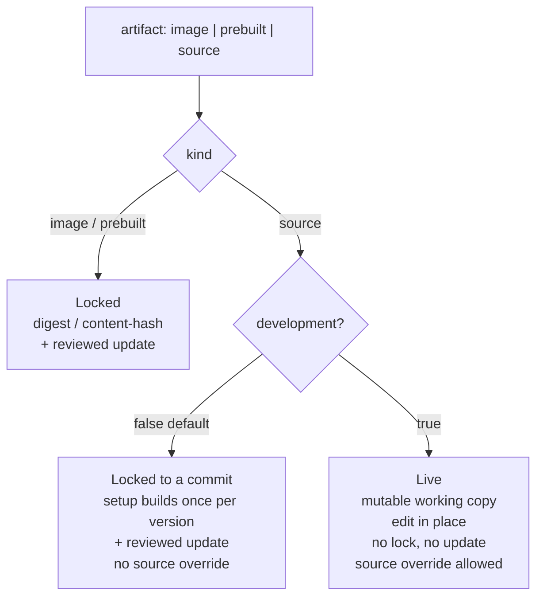

# Runtime Artifact & Storage Model

> **Status: partially implemented.** Phase 0 (the `localCommand` `setup` command), Phase 1a (the `development` flag), Phase 2 (`prebuilt` with folder delivery), and Phase 3 (the Shell Live/Locked mode badges) have shipped. The later prebuilt deliveries (git-release/URL) and per-runtime update-available state are proposed, not built; the isolated Phase 1b storage migration was dropped (see Phasing). This document is the concrete elaboration of the artifact-kind direction sketched in [Runtime app marketplace](../ideas/runtime-app-marketplace.md) ("Artifacts, Runtimes, and Delivery"), and it supersedes the single-source assumptions in [Runtime source workflows](runtime-source-workflows.md) as those phases land.
>
> **Design revision (2026-07-02, agreed, not implemented):** liveness is re-scoped from the *declared* `development` flag to an **operator-toggled Development Mode** whose default the flag provides. See "Development Mode — an operator toggle" below; sections describing flag-as-gate semantics remain accurate for the shipped state.

## Motivation

Today the platform conflates two independent axes:

- **Execution** — *how* a service runs: `docker` (container) or `localCommand` (host process).
- **Artifact kind** — *what* runs and *how it updates*: a compiled image, a compiled non-container build, or a live source tree.

In the current implementation these are welded together: [`ResolveArtifactKind`](../../apps/core/src/Haas.Hosty.Core/RuntimeAppManifest.cs) infers `docker → image` and `localCommand → source`, and rejects `prebuilt` as unsupported. So `localCommand` *is* source, in practice. Three consequences fall out of that:

1. **No place for a compiled, non-container artifact.** An app cannot declare a runtime that runs a pre-built binary or a compiled Next.js standalone output as a host process — only "build/run from source" or "docker image".
2. **Storage is keyed by app, not by runtime.** Managed source lives at `sources/<app-id>/`, one checkout per app. An app that wants *two* `localCommand` runtimes — one from source, one from a compiled build — has nowhere to keep the second artifact, and the two would collide.
3. **Liveness is a hidden special case attached to the wrong thing.** The live model (no lock, re-fetch/edit, hidden Update button, Live badge via `IsLiveSourceApp`) hangs off the runtime *type* + "there's an operator folder". But *running from source* does not imply *live*: a source runtime that compiles a production build (`npm run build` → `npm start`) is **not** live — it updates via a reviewed commit bump — while a source runtime running `npm run dev` **is** live (hot-reload). Both run from the same checkout. So liveness must be an **explicit, declared** property of the runtime, and today's inference mislabels the build-to-production case as Live.

The target scenarios this model must support:

> **(a)** One app declares two `localCommand` runtimes off the **same source**: one runs `npm run build` → `npm start` (production, **locked**, updated via commit bump); the other runs `npm run dev` (**live**, hot-reload). They differ only in liveness.
>
> **(b)** One app declares a `localCommand` runtime that runs an **already-compiled** artifact (a binary or compiled Next.js standalone) — a `prebuilt`, content-hash-locked release with no build step.
>
> Switching between runtimes switches the artifact source, the on-disk storage, *and* the update model.

## Model: execution × artifact kind

The primary classifier is **artifact kind**, declared per service-runtime via the existing `artifact` field. Execution type stays orthogonal.

| Artifact kind | What it is | Delivery (examples) | Update / liveness model | On-disk lock |
| --- | --- | --- | --- | --- |
| `image` | Compiled OCI image | OCI registry | Locked: tag → digest; reviewed update advances the digest (or `rolling` re-resolves each start) | Digest, in Docker store |
| `prebuilt` | Compiled non-container build (binary, compiled Next.js standalone, static bundle) | git release / folder / URL / OCI-as-files | Locked: content hash; reviewed update advances the hash | Content hash, in Hosty FS |
| `source` | Buildable/editable source tree | git checkout / operator-owned worktree | **Live *or* locked** — decided by **Development Mode** (operator toggle, defaulted by the `development` flag — see the 2026-07-02 revision), not by the kind | commit (locked) / none (live) |

Guiding rule (from the marketplace idea): **the update model is chosen by artifact kind, not by runtime type.** `localCommand` by itself classifies nothing — one may run a `prebuilt` build, another `source`.

**Delivery does not imply kind.** Git can deliver a *compiled* build, not only source; a folder can hold a pre-built app. So the kind is declared, not inferred from where the bytes came from.

### The `development` flag — a declared marker, not a consequence of the kind

> **Revised 2026-07-02:** the recipe-vs-binding reasoning below stands, but the flag's *gating* role is superseded — liveness becomes an operator-toggled **Development Mode** for which the flag only provides the default. See "Development Mode — an operator toggle" below.

The first draft of this model said "`kind=source` ⟹ live". That is wrong. The **same** source tree can back two different runtimes:

- a runtime whose `setup` **compiles** it and runs the production build (`npm ci && npm run build` → `npm start`) — edits do nothing until rebuilt; it advances by a reviewed **update** that bumps the pinned commit;
- a runtime whose `setup` does `npm install` and runs a dev server (`npm run dev`) — local edits are picked up on the fly; there is no reviewed-update path.

Both are `type: localCommand`, `artifact: source`, from the same checkout. What separates them is **the developer's declaration that a runtime is meant for local development** — not anything about the specific command. So this is a **declared per-runtime flag** (provisionally `development`; naming open — see below), *not* something inferred from the artifact kind, the runtime type, or the command string:

```jsonc
"runtimeProfiles": [
  { "key": "release", "type": "localCommand" },                     // development defaults to false → locked
  { "key": "dev",     "type": "localCommand", "development": true } // meant for local development
]
```

The flag is **not** tied to `npm run dev` or any particular command — the developer decides which runtime is the development one. Marking a runtime `development: true` has two coupled consequences:

1. **Source override is allowed.** The operator may point this runtime at their own local folder (the existing `source-override`). A non-development runtime runs only its declared/pinned source and offers no override.
2. **It runs live.** It executes against a mutable working copy (the override folder, else the managed checkout) with no lock and no reviewed-update path; clients show the **Live** badge and hide **Update**.

The flag is only valid where the delivery is an editable working copy (`artifact: source`). `image` and `prebuilt` are inherently locked and cannot be `development`.

| Runtime | type | artifact | development | setup / command | Override? | Update model |
| --- | --- | --- | --- | --- | --- | --- |
| Docker image | docker | image | — | (image) | no | Locked: digest, reviewed update |
| Compiled build (downloaded) | localCommand | prebuilt | — | run `command` | no | Locked: content-hash, reviewed update |
| **Build-from-source → prod** | localCommand | source | **false** | `npm ci && npm run build` → `npm start` | no | Locked: **commit**, reviewed update |
| **Development** | localCommand | source | **true** | e.g. `npm install` → `npm run dev` | **yes** | **Live**: edit in place, no lock, no update |

The two bottom rows are the user's scenario, and they differ **only** in the `development` flag.

**Naming is open.** `development` describes intent; `live` describes only the update-behavior half; `dev` is short but collides with the common runtime *key* `"dev"`. This document uses `development` provisionally.



### Coverage matrix (current vs planned)

| | `docker` | `localCommand` |
| --- | --- | --- |
| `image` | ✅ implemented | — (n/a) |
| `prebuilt` | reserved (docker-from-image is the `image` cell) | ✅ **Phase 2** — folder delivery (git-release/URL deferred) |
| `source`, `development: true` | out of scope (docker-built-from-source — see Open questions) | ✅ **Phase 1a** — declared `development` flag |
| `source`, `development: false` (build → prod) | out of scope | ✅ **Phase 1a** — no longer mislabeled Live/overridable |

## Storage layout

Move all runtime assets under the app directory, keyed by **(app, runtime)** so switching a runtime never clobbers another runtime's materialized artifact. Retire the top-level `sources/` tree.

```
~/.hosty/apps/<app-id>/
  state.json                         # AppRecord (unchanged)
  manifest.json                      # manifest copy (unchanged)
  data/                              # app data — backed up (unchanged)
  runtimes/<runtime-key>/
    source/                          # kind=source: git checkout   (was ~/.hosty/sources/<app-id>)
    build-cache/                     # kind=source: build output cache (.next, bin/…), optional
    artifact/<content-hash>/         # kind=prebuilt: immutable extracted build
    current -> artifact/<hash>       # active-version pointer == the on-disk lock
    logs/<service>.log               # (optional) move localCommand logs under the runtime
```

Rationale:

- **App-scoped.** Everything for an app is under `apps/<id>/`; removal is a single subtree delete; no orphan `sources/` entries to garbage-collect.
- **Per-runtime, non-destructive switch.** Switching runtimes activates a different subtree; the previous runtime's `source/` or `artifact/<hash>/` survives, so switch-back is cheap.
- **`source/` is a live worktree.** A managed git checkout, or a *reference* to the operator's own worktree (override folders are referenced, never copied).
- **`artifact/<hash>/` is content-addressed and immutable.** `current` is the analog of the Docker digest lock, but on Hosty's filesystem. `prebuilt` thus gets exactly the lock semantics `image` already has.

Materialization is lazy: only the *selected* runtime needs its artifact present to start. Unselected runtimes may be un-materialized until first selected.

## Runtime artifact state

`AppSourceState` is currently a single record per app (one `ManagedCheckoutPath`, one `LocalOverridePath`), and `ArtifactLocks` is a separate map keyed by service key (docker images only). Generalize both into one **per-runtime artifact state**, keyed by runtime key:

```
RuntimeArtifactState (per runtime key)
  kind            : image | prebuilt | source
  delivery        : oci | git | folder | url
  development     : bool                            (source only; true = dev runtime, overridable, live)
  sourceRef       : resolved ref + commit           (kind=source / git-delivered)
  lock            : digest | contentHash | commit   (locked runtimes; absent when development)
  materializedPath: apps/<id>/runtimes/<key>/…       (or Docker store for image)
  operatorOverride: operator-owned path              (per development runtime — the source override)
  updatedAt
```

This folds the existing `ArtifactLocks` (image digests) and `AppSourceState` (source checkout/override) into one shape, extends it to `prebuilt` content-hash locks and **source-build commit locks**, and records the runtime's `development` flag. Per-runtime `operatorOverride` is the 1b shape; **1a keeps the existing single app-level override** (bound to the one development runtime — decision 6). Persisted additively in `state.json`.

### Where `setup` fits

The `localCommand` `setup` command ([shipped, Phase 0](runtime-app-manifest.md)) is the **build/prepare hook for `artifact: source`**, in *both* modes:

- `development: true` — `setup` installs deps (`npm install`) so the dev server can run; it runs every start (idempotent).
- `development: false` — `setup` **compiles** the pinned commit (`npm ci && npm run build`) to produce the production build the `command` serves; conceptually it runs once per locked version.

For `kind=prebuilt` there is no `setup` — the artifact is already built; its analog is the fetch → verify → extract → lock step at materialization time.

## Liveness & source override — the `development` flag

> **Revised 2026-07-02:** this section describes the shipped Phase 1a gating (flag = gate) and stays accurate for the implemented state. At the design level it is superseded by the operator-toggled **Development Mode** (next section).

The `development` flag is declared per runtime, not inferred from kind or type (see "The `development` flag" above), and drives two derived facts:

- **`development: true`** (only valid for `artifact: source` on an editable working copy) → the runtime **supports source override** (operator points it at a local folder) and **runs live** against that folder (else the managed checkout): no lock, no reviewed-update path; clients show the **Live** badge and hide **Update**.
- **`development: false`** (default; the only option for `image`/`prebuilt`, and the default for `source`) → **no override**, and **locked** to a version (digest / content-hash / commit) advanced by a reviewed **update**. A source runtime here builds the pinned commit via `setup`.

This refines two existing derived flags:

- [`AppRecord.Live`](../../apps/core/src/Haas.Hosty.Core/AppRegistryStore.cs) / [`IsLiveSourceApp`](../../apps/core/src/Haas.Hosty.Core/CoreLifecycleService.cs) — gated **solely** on the selected runtime declaring `development: true`, with a resolvable operator source folder (an override, else a non-URL folder install). `ResolveLiveSourcePath` is the **single source of truth** for both the `Live` flag *and* the folder the live manifest is re-read from (`LoadSelectionWithStatusAsync`); previously the manifest reconcile keyed on "any `localCommand`" (artifact `source`) and could disagree with the flag — e.g. a folder-installed `localCommand` with no `development` flag re-read its manifest live but showed no Live badge. A build-to-production source runtime (`development: false`) is no longer mislabeled Live and no longer live-reconciles.
- [`AppSummary.SupportsSource`](../../apps/core/src/Haas.Hosty.Core/AppRegistryStore.cs) — gated on "**any** profile with `development: true`", **independent of install channel**. The earlier "non-URL install" requirement was dropped: setting a source override is an explicit operator action that supersedes even a URL/publisher install's reviewed contract, so a URL-installed app that declares a development runtime still offers the Source tab.

> **Implemented today:** the live source folder is resolved as *override → materialized managed checkout → non-URL original folder install*. `AppSourceState.ManifestSubpath` (captured at install — the manifest's directory relative to the repo root, e.g. `apps/shell`) lets Core read the live manifest from `<sourceRoot>/<subpath>/manifest.json`, so a monorepo app runs live from its subfolder whether pointed at the repo root by an override **or** by the managed checkout. A URL/git-installed development runtime runs live from the checkout once it materializes (cloned lazily at first start); before that it uses the reviewed copy (identical to the just-cloned HEAD), so there is no first-start skew.

## Development Mode — an operator toggle (design revision, 2026-07-02)

> **Status: implemented (OFF interim).** The `development` flag is re-scoped to the author's *intent marker and default*; the liveness decision now lives in an **operator-controlled, per-runtime Development Mode toggle** (`AppRecord.DevelopmentModes`, `AppSummary.ResolveDevelopmentMode`, `POST /api/apps/{id}/development-mode`, a switch on the Shell's Source tab). `SupportsSource` widened to any source runtime and the "≤1 development runtime" validation was retired. **OFF still uses today's semantics** (reviewed manifest, code from the live folder) — the honest commit-lock is the remaining follow-up (see Prerequisites #2 / Implementation order #3).

Working with the Phase 1a model surfaced that the flag was carrying two orthogonal concepts:

1. **Source binding** — where code and manifest come from: Core's reviewed copy at a pinned commit (**locked**) or the operator's live working tree (**live**). Inherently an **operator** decision ("run my local checkout"), one Core can honor for *any* source runtime.
2. **Runtime recipe** — how the runtime starts: `setup` / `command` / (future) image build. Inherently an **author** declaration — Core cannot invent `npm run dev`.

Phase 1a welded both to one declared flag. That meant an operator could not run an unflagged source runtime live without commit rights to the app's manifest, and the future docker-built-from-source case would need *two* declared runtimes differing only in binding.

### The model

**Development Mode is a per-runtime operator toggle**, valid only for `artifact: source` runtimes (`image`/`prebuilt` have no working copy to bind):

- **OFF (default)** — locked: manifest from Core's reviewed copy, execution from the pinned-commit checkout, updates via the reviewed update plan advancing the commit (decision 4).
- **ON** — live: manifest **and** code from the source folder — the operator's override folder if set, else the managed checkout. Local (even uncommitted) edits take effect; if the command doesn't hot-reload, a restart picks them up. No lock, no reviewed-update path; clients show **Live** and hide **Update**.

**The `development` manifest flag becomes the toggle's default, not its gate:** `development: true` → Development Mode defaults ON for that runtime; absent → defaults OFF. The operator may flip either way; existing manifests keep working unchanged.

| Scenario | Manifest declares | Dev Mode OFF (locked) | Dev Mode ON (live) |
| --- | --- | --- | --- |
| Plain source runtime (`npm start`) | `localCommand` + `artifact: source` | reviewed manifest, pinned-commit checkout, update plan | manifest + code from the source folder; restart to pick up edits |
| Hot-reload runtime (`npm run dev`) | a separate runtime + `development: true` | permitted, pointless | **default ON** (from the flag) |
| Docker built from source (future) | `docker` + `artifact: source` | build the pinned commit → digest lock | build from the working tree |

Why this factoring wins:

- **The docker-from-source future needs no duplicate runtimes.** Dev vs prod there is the *same* recipe with a different source binding — one runtime, toggled. (Amends decision 9's "out of scope": the model now has a natural slot for it.)
- **Hot reload stays first-class.** A dev-server command is genuinely a different recipe → a separate declared runtime; the flag just spares the operator a click.
- **Liveness no longer requires editing the publisher's manifest.** Any source runtime can be run live by the operator (e.g. a `dev` profile that never declared the flag).
- **"Running from source ≠ live" is preserved** — the default is OFF, so nothing becomes accidentally live; only the *owner* of the decision moves from author to operator, which fits a self-hosted platform.

### What changes vs Phase 1a (when implemented)

- **Gating.** `SupportsSource` (the Source tab) widens from "any `development: true` profile" to "any `artifact: source` runtime". `Live` / `ResolveLiveSourcePath` gate on "selected runtime is `artifact: source` **and** its Development Mode is ON" instead of reading the manifest flag.
- **State.** Per-runtime Development Mode is operator state seeded from the manifest flag, persisted in the app record — `RuntimeArtifactState.development` becomes operator-writable rather than manifest-derived. Toggled via a new control/web endpoint (autostart-style) plus a switch on the Shell's Source tab.
- **Validation.** `app_manifest_multiple_development_runtimes` (decision 6) can relax — the flag is only a default, so several flagged profiles are harmless. The **single app-level override remains** and is shared by the app's source runtimes (they are the same source tree by design); per-runtime overrides stay deferred (1b).

### Prerequisites

1. **Manifest subpath inside the checkout (monorepo).** Live mode reads the manifest from the source folder, but a monorepo app's manifest is not at the checkout root (the Shell's is `apps/shell/manifest.json`). Capture a repo-relative `ManifestSubpath` in `AppSourceState` at install (derivable from the manifest URL's in-repo path or the install folder layout) so Core can resolve `<source>/<subpath>/manifest.json`. Per-app checkout copies already isolate monorepo apps from one another; the subpath is the only missing piece. (This is also the blocker for live-from-managed-checkout under the current model.)
2. **An honest locked mode for source runtimes.** Today "OFF" is half-fictional: the manifest comes from the reviewed copy but the *code* still runs from the live folder/checkout — nothing pins the executed commit. Under the toggle, OFF must mean "checkout at the pinned commit; update plan advances the commit" (decision 4's commit lock).
3. **Toggle plumbing** — the per-runtime state field, the endpoint, and the Shell switch.

### Implementation order

1. `ManifestSubpath` capture — prerequisite for every live-from-checkout scenario.
2. The toggle layered over today's live mechanics, with OFF temporarily keeping current semantics (reviewed manifest + existing update plan) until the commit lock exists — documented as transitional.
3. The commit lock for OFF (pinned-commit checkout, update-plan commit bumps).

## Manifest surface

Two per-runtime declarations drive the model: the existing `artifact` field (kind) and the new `development` flag. The user's target scenario — one Docker release plus two `localCommand` runtimes off the **same source**, one production-locked and one for development:

```jsonc
"runtimeProfiles": [
  { "key": "docker",  "type": "docker", "default": true },
  { "key": "release", "type": "localCommand" },                     // development defaults to false → locked
  { "key": "dev",     "type": "localCommand", "development": true } // development runtime: overridable + live
],
"services": [{
  "key": "web",
  "runtimes": {
    "docker": {
      "type": "docker",
      "artifact": "image",
      "image": { "repository": "ghcr.io/example/web", "tag": "latest" }
    },
    "release": {                      // build the pinned commit → run the production build (LOCKED)
      "type": "localCommand",
      "artifact": "source",
      "workingDirectory": "apps/web",
      "setup": "npm ci && npm run build",
      "command": "npm run start"
    },
    "dev": {                          // DEVELOPMENT: overridable + live; command is the developer's choice
      "type": "localCommand",
      "artifact": "source",
      "development": true,
      "workingDirectory": "apps/web",
      "setup": "npm install",
      "command": "npm run dev"
    }
  }
}]
```

`release` and `dev` are both `localCommand` + `source` from the same checkout; they differ only in `development`. A `prebuilt` runtime (downloaded compiled build) would instead declare `artifact: prebuilt` with a `delivery` block — its shape (git release asset / folder / URL / OCI-as-files) is deferred to Phase 2.

## Source override & the Source settings tab

> **Revised 2026-07-02:** once the Development Mode revision lands, visibility widens to "any `artifact: source` runtime" and the tab gains the per-runtime Development Mode switch (see above). The gating below describes the shipped state.

The Shell lets the operator configure a development runtime's source override **without switching the app to that runtime**. The [Source settings tab](runtime-source-workflows.md) ([shipped](../../apps/shell)) is refined:

- **Visibility.** The tab shows only when `SupportsSource` is true — i.e. the app has a runtime profile with `development: true` (narrowed from "any `localCommand`"). No development runtime → no tab.
- **Target runtime.** Because a manifest may declare **at most one** `development: true` runtime (decision 6), the tab targets that single development runtime. The picker is rendered as a dropdown for forward-compatibility but currently holds one entry; it becomes a real choice only if the single-runtime rule is relaxed (deferred to 1b).
- **Override edit.** The tab shows/edits that runtime's override (Custom folder) or clears it (Standard = managed checkout), reusing the existing `source` / `source-override` / `source-clear-override` control routes. Phase 1a keeps the existing **single** app-level override, now bound to the development runtime and editable regardless of the currently selected runtime.

This needs `AppRuntimeProfileSummary` to carry the `development` flag (so the client can tell which runtime the tab targets and gate visibility). Per-runtime `operatorOverride` storage and a multi-entry dropdown are deferred to **Phase 1b**; **Phase 1a** ships the flag, the narrowed gating, and the single-override tab.

## Runtime switching

Switching remains the reviewed [`switch-runtime-plan` / `switch-runtime`](runtime-source-workflows.md) flow. The plan's `changes` already diff runtime type, commands, ports, etc.; it gains **artifact kind**, **`development`**, and **artifact source/lock** as diffed fields. Because per-runtime storage is non-destructive, switching `dev ↔ release` does not re-clone or re-download when the other runtime is already materialized and locked to the same version.

## Migration

- **Path move.** Installed apps with `sources/<app-id>/` migrate to `apps/<app-id>/runtimes/<selected-key>/source/`. Provide a one-time migration on Core start (move + rewrite `ManagedCheckoutPath`), with back-compat resolution that still reads the old path until migrated.
- **State shape.** `AppSourceState` + `ArtifactLocks` → per-runtime `RuntimeArtifactState`. Additive `state.json` change with lazy backfill (TOFU), consistent with how `ArtifactLocks` backfills today.
- **CLI.** `source-*` commands keep working against `kind=source` runtimes; `source-cleanup` scans the new per-app runtime dirs instead of the retired `sources/` root.

## Phasing

- **Phase 0 — shipped.** `localCommand` `setup` command (build hook for `artifact: source`). See [Runtime app manifest](runtime-app-manifest.md).
- **Phase 1a — shipped.** `development` flag on the runtime profile, validated source-only and **at most one per manifest** (`app_manifest_development_requires_local_command` / `app_manifest_multiple_development_runtimes`), surfaced on `AppRuntimeProfileSummary`. `IsLiveSourceApp`/`AppRecord.Live` and `SupportsSource` now require a `development: true` runtime; the in-repo `hosty.shell` / `demo-app` `dev` profiles declare it. The Source settings tab already gates on `SupportsSource`, so it now hides unless a development runtime exists and targets that runtime's (single, app-level) override without a runtime switch. This fixes the prior mislabeling of a build-to-production source runtime as Live/overridable, and unblocks "same source, two runtimes (release vs dev)". A `development: false` source runtime is a locked, reviewed-update artifact (its commit lock lands with the build-to-prod path in a later phase). Multi-entry override dropdown deferred to 1b (single-runtime rule).
- **Phase 1b — deferred / folded.** The isolated `sources/<id>` → `apps/<id>/…` migration was dropped as premature churn (no consumer yet; risked a double migration). Per-runtime artifact storage instead arrives greenfield with Phase 2 (the `artifact/<hash>/` dirs). The source-checkout relocation + `RuntimeArtifactState` unification stay deferred until a real multi-source-runtime need. See the sequencing note below.
- **Phase 2 — shipped (folder delivery).** `artifact: prebuilt` for `localCommand` with `delivery: { type: folder, path }`. Core content-hashes the delivery, materializes an immutable copy under `apps/<id>/runtimes/<key>/artifact/<hash>/` (greenfield — no migration), records the hash as `ArtifactLock.BundleHash`, and runs `command` from the copy. Pinned re-runs the locked copy; rolling adopts a changed delivery (mirrors the docker digest lock). Validation covers delivery required/type/path and prebuilt↔delivery consistency. **Deferred:** git-release/URL delivery (decision 7) and reviewed-update-plan surfacing of a new prebuilt build (use `rolling` to iterate for now).
- **Phase 3 — shipped (mode badges).** The Installed Apps runtime switcher now tags each target runtime **Live** (a `development` profile — runs live from source) or **Locked** (a fixed image/build advanced by reviewed update), so the operator sees the mode before switching. Driven by the profile's `development` flag. Per-runtime update-available state is deferred (locks are app/service-level today).

## Resolved decisions

1. **Flag placement — profile-level.** `development` sits on the `runtimeProfiles[]` entry (a whole-runtime property; all services run live together), not on `services[].runtimes[key]`.
2. **One flag, two consequences.** `development` couples *source-override capability* and *live update model*. It stays a single flag; splitting into `overridable` + `live` is reserved for a future use case that needs them apart.
3. **Back-compat — explicit opt-in.** After Phase 1a, `SupportsSource`/`Live` require `development: true`. Rather than inferring it for any `localCommand`+`source` (which would flip the "default locked" rule and force build-to-prod runtimes to opt *out*), development runtimes opt in explicitly, and the in-repo `hosty.shell` / `demo-app` `dev` profiles gain `development: true` as part of 1a.
4. **`development: false` source = commit lock, reviewed update by default; `rolling` is an explicit opt-in.** A build-to-production source runtime pins its commit and advances via reviewed update. A ref-re-fetch-every-start (`rolling`) mode, mirroring the docker image `rolling` policy, is available only when explicitly opted in (deferred; not in the first cut).
5. **Storage — retire `sources/` with a one-time migration.** Move to `apps/<id>/runtimes/<key>/…` (Phase 1b) rather than keeping `sources/` and layering an override map on top.
6. **Single development runtime for now.** A manifest may declare **at most one** `development: true` runtime (new validation, `app_manifest_multiple_development_runtimes`). One development runtime ⇒ one override suffices, so Phase 1a keeps the existing single app-level override (bound to that runtime) instead of a per-runtime override map. Relaxing this to multiple development runtimes (and per-runtime override storage) is deferred to 1b.
7. **`prebuilt` delivery — folder + git-release asset first.** Phase 2 implements the folder and git-release-asset deliveries; URL and OCI-as-files are deferred.
8. **`localCommand` → `localProcess` rename — deferred.** Cosmetic; not worth the manifest churn now.
9. **`docker` built from source — out of scope.** The `image` cell covers docker today.
10. **Development Mode is operator-toggled; the manifest flag is its default (2026-07-02).** Liveness moves from a declared gate to per-runtime operator state seeded by `development: true` — see "Development Mode — an operator toggle". Amends the gating halves of decisions 2–3 (the flag still couples override+live, but as a *default* the operator can flip), allows relaxing decision 6's single-flag validation (the app-level override stays shared across the app's source runtimes), and gives decision 9's docker-built-from-source a natural slot (same recipe, toggled binding).

## Open questions / out of scope

- **Flag name — decided: `development`.** (`live` describes only the update half; `dev` collides with the common runtime key `"dev"`.)
- **Private repositories & multi-repo source** — tracked in [Runtime source extensions](../ideas/runtime-source-extensions.md).
- **`prebuilt` URL / OCI-as-files delivery** — deferred past the folder + git-release-asset first cut (decision 7).
- **`rolling` mode for a source build-to-prod runtime** — deferred (decision 4).
- **Multiple `development` runtimes + per-runtime override storage** — deferred (decision 6; partially moot under the Development Mode revision, where the flag is only a default).
- **Development Mode implementation details** — settle at implementation: whether the multiple-flag validation is dropped or kept as a lint; `ManifestSubpath` derivation edge cases (non-GitHub raw URLs, folder installs); UI copy for the toggle.

## Related

- [Runtime app marketplace](../ideas/runtime-app-marketplace.md) — the artifact-kind direction this elaborates.
- [Runtime source workflows](runtime-source-workflows.md) — current source checkout / override / switching (single-source model this evolves).
- [Runtime app manifest](runtime-app-manifest.md) — `artifact` field, `setup`, per-runtime service fields.
- [Runtime app update](runtime-app-update.md) — lock + reviewed-update mechanics for compiled artifacts.
