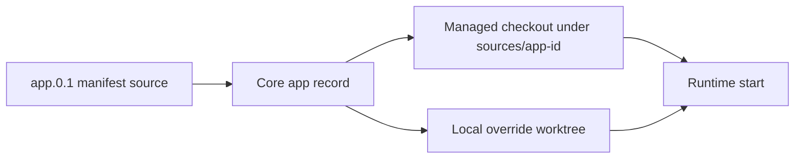

# Runtime Source Workflows

Runtime source workflows let administrators and local operators inspect and update the source state stored for an installed Hosty runtime app. This is the completed Stage 2 source/runtime model: manifests can declare app-level Git source metadata, Core stores managed checkout and local override state in the app record, local command runtimes can run from that source state, and the CLI exposes trusted control commands for day-to-day operations.



## Source State

An app manifest may declare one app-level source repository. Multi-repository runtime apps are out of scope for the first source runtime implementation; split independently-owned services into separate runtime apps or defer them until a future `source.repositories[]` contract exists.

Core stores source state as Host installation state, not as public manifest metadata:

- repository type and URL/path;
- resolved ref;
- immutable commit SHA;
- managed checkout path under the Hosty `sources/<app-id>/` root;
- optional administrator-selected local source override path;
- update timestamp.

Managed checkouts are for public-readable `http`/`https` Git repositories or local filesystem repositories. Core rejects embedded credentials and SSH-style repository URLs, and git subprocesses run with interactive credential prompts disabled. Private repositories should be cloned by an administrator and connected through `source-override` until Hosty has a Core-owned credential provider.

## CLI Commands

- `hosty apps source <app-id>` shows the current source state for an installed app.
- `hosty apps source-resolve <app-id> [--branch <name>|--tag <tag>|--commit <sha>] [--fetch]` prepares or refreshes the managed checkout and records an immutable commit SHA.
- `hosty apps source-override <app-id> --path <worktree> [--commit <sha>]` stores an administrator-selected local worktree override in installation state.
- `hosty apps source-clear-override <app-id>` removes the local override and leaves managed source state intact.
- `hosty apps source-cleanup-plan` previews abandoned managed checkout directories under the Hosty `sources/` root.
- `hosty apps source-cleanup` deletes the abandoned managed checkout directories returned by the cleanup plan.
- `hosty apps health <app-id>` reports runtime health. For `localCommand` runtimes, Core reports each service process status, PID, exit code, log path, and working directory.
- Add `--format json` to any source command for scripting.

Only one of `--branch`, `--tag`, or `--commit` may be passed to `source-resolve`. If none is passed, Core resolves the app's stored ref or `HEAD`.

## Runtime Behavior

Local command runtime profiles require a source root. Core resolves it in this order:

- administrator-selected `source-override` path, when configured;
- local worktree inferred at install/update time when the manifest was loaded from a local filesystem path;
- managed checkout under `sources/<app-id>` when the manifest was loaded from an HTTP(S) URL.

When a manifest is installed from a local path, Core treats that path as a developer/operator-owned worktree. It does not clone or fetch `source.repository`; instead it records the nearest Git root above the manifest path when one exists, or falls back to the manifest directory/relative `workingDirectory` inference.

When a manifest is installed from an HTTP(S) URL and the selected runtime profile is `localCommand`, Core requires an app-level `source.repository` that can be cloned as an absolute Git URL or local repository path. Relative repositories such as `.` are rejected for this remote-manifest start path because Core has no repository root to resolve them against.

Docker runtime profiles do not need a source root and ignore source checkout state during start. Source override state is not public manifest metadata; it belongs to the local Hosty installation.

Docker-only apps remain valid without source metadata. Resolving source for an app with no source repository returns a Core validation error instead of changing the app.

Cleanup only considers immediate child directories under Hosty's managed `sources/` root. It does not delete local source override paths or arbitrary administrator worktrees.

Local command runtimes are Core-supervised process runtimes. Core starts each service command from the resolved working directory, injects app data/settings/dependency/port/Core identity environment, captures stdout/stderr into app logs, and reports per-service health with process state, PID, exit code, log path, and working directory. Core fails the start when the resolved working directory does not exist; it does not create missing source directories on behalf of the app.

## Runtime Switch Reviews

`hosty apps switch-runtime-plan <app-id> --runtime <key>` returns a reviewed plan with a digest and a `changes` list. The plan compares the current and target runtime contracts, including runtime type, service images or commands, ports, service environment keys, settings, dependencies, endpoint contracts, data target compatibility, and generated Docker container names. `hosty apps switch-runtime` requires the reviewed digest, and Core includes the `changes` list in the digest seed so a stale review is rejected if the runtime contract changes before apply.

Runtime switching can move between Docker profiles, from Docker to `localCommand`, and from `localCommand` back to Docker. Core rejects switching an app with existing primary data to a target runtime that cannot preserve a compatible primary data target.

When a running app is switched, Core stops the current runtime, updates selected runtime state, and starts the target runtime. If the target runtime fails to start, Core restores the selected runtime in installation state to the previous runtime, leaves the app stopped, records `LastError`, and returns `runtime_switch_restart_failed`. Any `pre-runtime-switch` backup created before mutation remains available through normal backup commands.

## Default Hosty Apps

Hosty Shell is also a runtime app. Its manifest declares Docker and `dev` local command runtime profiles, so administrators can use the same source commands for Shell-only local runtime work:

```bash
hosty apps source-override hosty.shell --path "$PWD"
hosty apps switch-runtime-plan hosty.shell --runtime dev
hosty apps switch-runtime hosty.shell --runtime dev --plan-digest <digest>
```

Core and combined-Host self-runtime changes are different from Shell-only changes. Core cannot complete its own replacement after it stops, so Core runtime switching still requires the trusted CLI or another outer supervisor.

Shell also exposes Hosty Shell runtime switching in the Installed Apps System Apps table when Core reports multiple runtime profiles. Other system app lifecycle controls remain hidden there.
