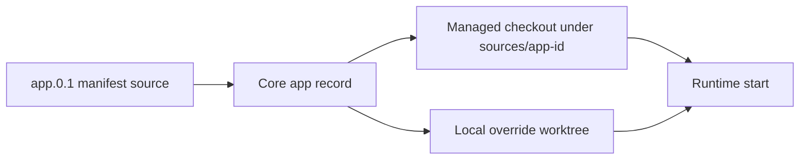

# Runtime Source Workflows

Runtime source workflows let administrators and local operators inspect and update the source state stored for an installed Hosty runtime app. The workflow is part of Stage 2 runtime profiles and source runtimes: manifests can declare app-level Git source metadata, Core stores managed checkout and local override state in the app record, and the CLI exposes trusted control commands for day-to-day operations.



## CLI Commands

- `hosty apps source <app-id>` shows the current source state for an installed app.
- `hosty apps source-resolve <app-id> [--branch <name>|--tag <tag>|--commit <sha>] [--fetch]` prepares or refreshes the managed checkout and records an immutable commit SHA.
- `hosty apps source-override <app-id> --path <worktree> [--commit <sha>]` stores an administrator-selected local worktree override in installation state.
- `hosty apps source-clear-override <app-id>` removes the local override and leaves managed source state intact.
- Add `--format json` to any source command for scripting.

Only one of `--branch`, `--tag`, or `--commit` may be passed to `source-resolve`. If none is passed, Core resolves the app's stored ref or `HEAD`.

## Runtime Behavior

Local command runtime profiles start from the local override path when one is configured. Otherwise they use the managed checkout path, then fall back to the app root. Source override state is not public manifest metadata; it belongs to the local Hosty installation.

Docker-only apps remain valid without source metadata. Resolving source for an app with no source repository returns a Core validation error instead of changing the app.

## Default Hosty Apps

Hosty Shell is also a runtime app. Its manifest declares Docker and `dev` local command runtime profiles, so administrators can use the same source commands for Shell-only local runtime work:

```bash
hosty apps source-override hosty.shell --path "$PWD"
hosty apps switch-runtime-plan hosty.shell --runtime dev
hosty apps switch-runtime hosty.shell --runtime dev --plan-digest <digest>
```

Core and combined-Host self-runtime changes are different from Shell-only changes. Core cannot complete its own replacement after it stops, so Core runtime switching still requires the trusted CLI or another outer supervisor.
