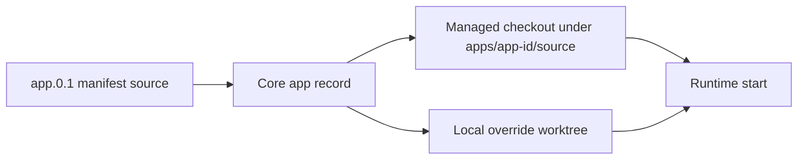

# Runtime Source Workflows

Created: 2026-06-03
Updated: 2026-09-17

Runtime source workflows let administrators and local operators inspect and update the source state stored for an installed Hosty runtime app. Manifests declare source metadata, Core stores managed checkout and local override state, local command runtimes run from those folders, and Shell exposes Git inspection and reviewed file discard.



## Source State

An app manifest may declare one app-level source repository. Multi-repository runtime apps are out of scope for the first source runtime implementation; split independently-owned services into separate runtime apps. Future source extensions are tracked in [Runtime Source Extensions](../../ideas/runtime-source-extensions.md).

Core stores source state as Host installation state, not as public manifest metadata:

- repository type and URL/path;
- resolved ref;
- immutable commit SHA — the reviewed pin, advanced only by `source-resolve` or a reviewed update;
- managed checkout path, by default `apps/<app-id>/source/` inside the app root (pre-existing records may still point at the retired top-level `sources/<app-id>/` location);
- optional administrator-selected local source override path;
- the override folder's own commit, when one was recorded;
- update timestamp.

The reviewed pin and the override's commit are separate fields because they answer different questions: which upstream commit Core reviewed, and where the operator's folder happened to be. Configuring an override therefore never moves the pin, and a pinned start (reviewed source profile) runs the recorded pin as-is — fetching it when the checkout does not have it yet. A recorded commit that the repository does not contain even after a fetch falls back to the reviewed ref rather than failing the start, and the record self-heals. The override's commit is whatever `git rev-parse HEAD` answers in that folder, so a linked worktree or a folder nested inside a repository records one too; a folder git does not recognize records none.

Installation records predate this split at schema version 1, where both facts shared the `commit` field. Core migrates such a record on read — the commit of a record that has an override moves to the override's field and the pin re-resolves from the reviewed ref, exactly as a pre-split Core behaved — and the next write stores it at version 2, after which a recorded pin is taken as reviewed.

Managed checkouts are for public-readable `http`/`https` Git repositories or local filesystem repositories. Core rejects embedded credentials and SSH-style repository URLs, and git subprocesses run with interactive credential prompts disabled. Private repositories should be cloned by an administrator and connected through `source-override` until Hosty has a Core-owned credential provider.

## Development Profiles And Source Preservation

Development is selected through a manifest profile with `development: true`, not a separate toggle.
The profile name is arbitrary and its commands supply reload behavior. Old independent mode settings
are ignored; see [profile-bound development](../runtime-artifact-model/feature.md).

A profile named `dev` without the development flag is still a reviewed source profile. For a
remote install, it runs the managed checkout even when a local override is saved. Enabling the
flag in an updated manifest requires applying that manifest first; saving an override alone does
not change the installed profile. Reviewed update plans explicitly list changes to the selected
profile's development flag and require review, including when accompanied by a version bump.

A pinned start never discards edits or cleans new files. It refuses a dirty managed checkout and
instructs the operator to commit or explicitly discard work, or select a development profile.
Switching to Docker leaves source intact. Returning to a reviewed source profile can therefore fail
with a source-change error; a running runtime switch then restores the previous selection and leaves
the app stopped. Source history and explicit discard belong to Git; data backups are not source backups.

## Source Inspection And Selected Discard

Core inspects the effective source root (local override first, otherwise managed checkout). In a
monorepo it narrows inspection to the recorded manifest subdirectory. Shell displays that absolute
scope: changes in shared libraries outside the app directory are not included. No extra source
registry, history, automatic commit, fetch or push is involved.

The administrator-only Dashboard version cell for a live/development app shows the current branch
with a dotted underline and an explicit file count (`2 files`, or `No changes` when clean), followed
by green added-line and red deleted-line totals when available. Its tooltip contains the
full HEAD, scope and observation time; the hash takes no space in the table. The branch only exposes
the tooltip; clicking the separate change-count line opens the source dialog. Manifest version remains
in the source dialog. Other apps
can open **Inspect source changes** in Source settings. Visible panels refresh every 15 seconds and
on explicit refresh; observations carry their time. A clean result describes files on disk, not an
uploaded commit, a running process's loaded code or successful hot reload.

Dashboard requests only summary metadata: branch, HEAD, observation time, total changed-file count
and available aggregate line statistics. It receives no file entries, patches or image bytes.
Opening the source dialog requests the complete file metadata list, without pagination or a
fixed file-count cap; each entry contains only its path, status, discard eligibility and line counts.
Full diff/image requests happen only when a specific file is expanded.

Status distinguishes `none`, `missing`, `no-git`, `clean`, `changes` and `unavailable`. Unborn branches
have no HEAD; detached HEAD and linked worktrees are supported. No-Git folders have no invented
clean/dirty state or recovery promise. Failed probes are unavailable, never clean. Results contain
all observed files, subject to an 8 MiB status/numstat output safety limit, with a truncation flag
only if that resource limit is reached. Each Git invocation has a ten-second deadline and bounded
output. File counts are independent of preview loading. Git paths are literal and no credentials
or remote URLs are returned by these reads.

Each file row in the source dialog independently expands to show its HEAD-to-working-tree diff
directly below the filename, with staged changes in a nested disclosure. Multiple files can stay
expanded; opening or closing a preview does not change its discard checkbox. Previews load on
expansion and reload when reopened. Loading and error states appear inside the owning file section.
The diff fills the file card's width without an inset border or its own vertical scrollbar;
expanded sections grow to their content height and share the dialog body's vertical scrolling.
Long code lines wrap by default and scroll horizontally when wrapping is disabled. The repository
HEAD appears once at the top of the dialog. File headers show green added-line and red deleted-line counts from source status,
including while collapsed and before a preview is requested. The Dashboard uses the same source
status for aggregate counts. Both compare HEAD with the working tree, exclude context lines and
do not double-count staged changes. A file whose staged edit was reverted on disk has zero net
line changes even though its index is still dirty. Files removed with `git rm --cached` but retained
on disk are compared through a temporary HEAD index, preserving the operator's real index. Binary files have no per-file line counts and
contribute zero to textual totals. Incomplete/unsupported statistics remain unknown; the Dashboard
omits an incomplete total and explains this in the branch tooltip.

Core obtains tracked counts in one scoped `git diff --numstat -z` call per non-clean status
observation, with external diff/text conversion disabled and the existing output/time limits.
Untracked files, and working-tree files on an unborn branch, are counted as additions using bounded
regular-file reads: at most 4 MiB per text file, a 16 MiB aggregate read budget (including binary
probes), and a two-second deadline. POSIX regular-file checks run in batches of 64, with paths
passed as literal arguments, avoiding a process per new file and rejecting FIFOs before opening.
Binary NUL bytes stop text counting. Missing final newlines
count as one final line. The existing 15-second status refresh cadence is unchanged; opening
previews and validating discard plans use status without computing statistics again. A truncated
file list never exposes its partial sum as a complete total.
Shell lazily loads `@pierre/diffs` in the browser for previews with syntax highlighting, using
the Shell's light/dark theme. A shared display toolbar controls unified/split layout, bars/classic/no
change markers, word-alt/word/character/no inline highlighting, unchanged-line separators
(Line Info Basic, Line Info, Metadata or Simple), change backgrounds, line wrapping
and line numbers. It applies to all expanded files and their staged previews without refetching
patches. Each dialog starts with unified layout, bars, word-alt highlighting, Line Info Basic separators, backgrounds, wrapping
and line numbers enabled; settings last until the dialog closes. File cards still share the dialog's
vertical scroll area. The dialog fills the viewport on narrow screens; on desktop it leaves a
16 px margin on each edge. Its header and footer stay visible while the body scrolls.
New untracked text files appear as additions; binary files have a label. Oversized patches
return only a truncation marker with no partial patch payload; Shell shows a
clear message directing the operator to an editor or Git client, without mounting the diff viewer.
Unparseable complete patches retain a plain-text fallback.
Text previews allow up to 4,194,304 decoded characters per Git patch part, or 4 MiB of raw
untracked contents, and mark truncation beyond that bound. This protects response size and browser
parsing without cutting off ordinary documents of several hundred kilobytes. Binary detection is
independent of size: tracked files follow Git's binary classification; untracked previews detect
NUL bytes in the inspected contents. Rename detection is disabled:
a rename appears as the old path's deletion and the new path's addition, so each path is explicit.
Symlinks, submodule directories and special files cannot be previewed through this panel.

PNG, JPEG, GIF and WebP paths render image previews instead of text diffs. Core returns the
HEAD version (Before) and the working-tree version (After), or only the existing side for an
addition/deletion. Each version is limited to 4 MiB, identified by its raster signature and
encoded inline in the existing authenticated diff response. Missing, oversized, unsupported or
undecodable versions have an explanatory message. Binary files without an image preview display
“Binary file — a preview is not available for this format. Open it locally to view its contents.”
instead of a misleading text-truncation warning. Images have no line counts or pixel comparison.

Image reads accept only an exact entry from the current scoped change list. The client cannot
choose an absolute filesystem path, Git revision or object ID. Core checks the canonical app
scope and regular-file path, rejects symlinks and special files, and accepts only regular blobs
from its observed HEAD. Git paths remain literal; Git reads have bounded output and deadlines.
No public image/file-download endpoint or image optimizer is involved, and SVG/HTML is never
returned as an image. These checks share the existing trusted-local-worktree boundary: they
do not sandbox a malicious local process racing filesystem changes or controlling Git storage.

**Select all** above the file list selects/deselects all eligible files and shows a mixed state for
partial selection. After status refreshes, review requests and counts include only currently discardable
selected files. Viewers without source-management rights see the manifest version instead of Git details.
Unsupported files remain unavailable; lists above the 32-file review limit
explain the limit and require manual selection rather than silently selecting only a subset.

**Review discard** accepts 1–32 selected paths. The review names the exact HEAD, source scope and
files, marking new files for deletion. It expires after five minutes and is single-use. Apply checks
HEAD, canonical source binding, selected Git status/index, file mode and contents again. A changed
review is refused before mutation. Complete status and an existing HEAD are required; no-Git and
unborn repositories cannot discard against a fictitious baseline.

Tracked selections restore both their index and worktree to the reviewed HEAD. Only exact selected
new files are deleted; unrelated edits/staging are preserved. Files above 4 MiB, conflicts, unsafe
paths, symlinks and submodules require an external Git workflow. Core never recursively cleans the
source tree and keeps no recovery copy. Its app/scope locks serialize its own discard operations;
external editors and Git clients are not locked. A concurrent external write or filesystem failure
can interrupt apply or leave a partial result, so the UI refreshes status after failures as well as
success. Users reload/restart explicitly when the profile commands do not provide hot reload.

Browser API routes under `/api/apps/{appId}/source`:

| Method and suffix | Purpose |
| --- | --- |
| `GET /summary` | Dashboard observation with file count and line totals, without a file list or previews |
| `GET /status` | Complete scoped file metadata list and summary for the source dialog, subject to resource limits |
| `POST /diff` | Preview a currently changed `path` as text, bounded raster image sides or a binary-file message |
| `POST /discard/plan` | Review explicit `paths` and return an opaque `reviewId` |
| `POST /discard` | Apply that `reviewId` once after revalidation |

All require a Host administrator; browser POSTs require CSRF. Equivalent trusted local control
routes use `/control/v1/apps/{appId}/source` and the control secret. Responses are `no-store`.
Scoped assistant credentials do not become administrator sessions through these routes. Assistant
source grants and runtime orchestration remain tracked in
[development controls](../app-development-controls/plan.md) and
[approval rules](../assistant-approval-rules/plan.md). No new CLI or MCP discard wrapper is exposed.

## CLI Commands

- `hosty apps source <app-id>` shows the current source state for an installed app.
- `hosty apps source-resolve <app-id> [--branch <name>|--tag <tag>|--commit <sha>] [--fetch]` prepares or refreshes the managed checkout and records an immutable commit SHA.
- `hosty apps source-override <app-id> --path <worktree> [--commit <sha>]` stores an administrator-selected local worktree override in installation state. `--commit` (or the folder's `HEAD`) is recorded as the override's commit; the reviewed pin is left alone.
- `hosty apps source-clear-override <app-id>` removes the local override and its commit, and leaves managed source state intact.
- `hosty apps health <app-id>` reports runtime health. For `localCommand` runtimes, Core reports each service process status, PID, exit code, log path, and working directory.
- Add `--format json` to any source command for scripting.

Only one of `--branch`, `--tag`, or `--commit` may be passed to `source-resolve`. If none is passed, Core resolves the app's stored ref or `HEAD`.

## Runtime Behavior

Local command runtime profiles require a source root. Core resolves it in this order:

- administrator-selected `source-override` path, when configured;
- local worktree inferred at install/update time when the manifest was loaded from a local filesystem path;
- managed checkout under `apps/<app-id>/source` when the manifest was loaded from an HTTP(S) URL.

When a manifest is installed from a local manifest file or app directory, Core treats that filesystem location as a developer/operator-owned worktree. It does not clone or fetch `source.repository`; instead it records the nearest Git root above the manifest when one exists, or falls back to the manifest directory/relative `workingDirectory` inference.

When a manifest is installed from an HTTP(S) URL and the selected runtime profile is `localCommand`, Core requires an app-level `source.repository` that can be cloned as an absolute Git URL or local repository path. Relative repositories such as `.` are rejected for this remote-manifest start path because Core has no repository root to resolve them against.

Image-only Docker profiles do not need a source root. Docker source and mixed development profiles resolve the app source root and preserve image dependencies; see [Mixed Development Runtimes](../mixed-development-runtimes/feature.md). Source override state is not public manifest metadata; it belongs to the local Hosty installation.

Docker-only apps remain valid without source metadata. Resolving source for an app with no source repository returns a Core validation error instead of changing the app.

The managed checkout lives inside the app root, so removing the app with "Delete source checkout" enabled removes it (both the current in-root location and the retired top-level `sources/<app-id>` location, for installs that predate the move). The dedicated `source-cleanup` commands and Core cleanup endpoints were removed together with the top-level `sources/` root.

Local command runtimes are Core-supervised process runtimes. Core starts each service command from the resolved working directory, injects app data/settings/dependency/port/Core identity environment, captures stdout/stderr into app logs, and reports per-service health with process state, PID, exit code, log path, and working directory. Core fails the start when the resolved working directory does not exist; it does not create missing source directories on behalf of the app.

Core places each published `localCommand` service inside an operating-system process-tree boundary before the platform shell starts: a dedicated process group on POSIX and a kill-on-close Job Object on Windows. Stop terminates that boundary rather than relying only on a snapshot of parent/child relationships. A command chain such as `cmd → npm → tsx → node` therefore cannot leave the final Node runtime holding its assigned port when an intermediate process exits during shutdown. Setup commands use the same temporary Windows boundary, and closing Core itself also closes every owned job.

## Runtime Switch Reviews

`hosty apps switch-runtime-plan <app-id> --runtime <key>` returns a reviewed plan with a digest and a `changes` list. The plan compares the current and target runtime contracts, including runtime type, service images or commands, ports, service environment keys, settings, dependencies, endpoint contracts, data target compatibility, and generated Docker container names. `hosty apps switch-runtime` requires the reviewed digest, and Core includes the `changes` list in the digest seed so a stale review is rejected if the runtime contract changes before apply.

Runtime switching can move between Docker, `localCommand`, and mixed profiles. Core rejects switching an app with existing primary data to a target runtime that cannot preserve a compatible primary data target.

When a running app is switched, Core stops the current runtime, updates selected runtime state, and starts the target runtime. If the target runtime fails to start, Core restores the selected runtime in installation state to the previous runtime, leaves the app stopped, records `LastError`, and returns `runtime_switch_restart_failed`. Any `pre-runtime-switch` backup created before mutation remains available through normal backup commands.

## Default Hosty Apps

Hosty Shell is also a runtime app. Its manifest declares Docker and `dev` local command runtime profiles, so administrators can use the same source commands for Shell-only local runtime work:

```bash
hosty apps source-override hosty.shell --path "$PWD"
hosty apps switch-runtime-plan hosty.shell --runtime dev
hosty apps switch-runtime hosty.shell --runtime dev --plan-digest <digest>
```

Core and combined-Host self-runtime changes are different from Shell-only changes. Core cannot complete its own replacement after it stops, so Core runtime switching still requires the trusted CLI or another outer supervisor.

Shell also exposes Hosty Shell runtime switching in the Installed Apps System Apps table when Core reports multiple runtime profiles. System apps also use the ordinary lifecycle controls; stopping Shell interrupts its UI.

## Testing Expectations

- Changing the selected profile's development flag in either direction appears in the update plan and requires review, even alongside a version bump.
- `source-override` records the folder's commit as the override's own and leaves the reviewed pin unchanged, including for a folder nested inside a repository; clearing the override drops both.
- A schema-version-1 record that has an override reads back with its commit moved to the override's field, once, and keeps a reviewed pin recorded afterwards.
- A pinned start (reviewed source profile) checks out the recorded pin — including one a reviewed update has just advanced to — with an override configured, and fetches when the checkout does not have that commit yet.
- A pinned start whose recorded commit is unreachable even after a fetch falls back to the reviewed ref instead of failing.
- A pinned start refuses a dirty checkout with `source_changes_present`, preserving staged, unstaged and untracked work. Non-forcing checkout also protects ignored files that would be overwritten.
- On Windows, stopping a `localCommand` service terminates descendants held by its Job Object even when an intermediate command process has already exited; an immediate start can reuse the assigned port.
- Source status covers clean, staged, unstaged/untracked, unborn, detached, linked-worktree, no-Git,
  missing and truncated states; monorepo observations exclude sibling apps and shared root files.
- Reviewed discard refuses changed content/index/HEAD/bindings, symlinks and special files, preserves
  unrelated staging, and handles literal filenames, renamed files and cached deletions.
- Browser source routes reject non-admin sessions and missing CSRF; trusted control routes require
  the control secret. Large child-process outputs are drained with bounded retention.
- Text preview coverage includes complete documents above the former 64 KiB limit and tracked/
  untracked content above the 4 MiB/character limit returning a marker with no partial payload.
- Shell preview coverage includes tracked and staged patches, untracked text (including patch-like
  contents), empty and binary files, missing final newlines, and truncated or malformed patches.
  Verify independent file expansion/collapse, reopening, and discard-checkbox independence through
  Core-managed Shell in the browser.
- Verify the shared diff display controls in both Shell themes: unified/split, marker and inline
  highlighting modes, unchanged-line separator styles, backgrounds, wrapping and line numbers. Settings affect combined and staged
  previews without new diff requests, and reset when the dialog is reopened.
- Image previews cover added/staged, modified and deleted images, exact binary round trips from
  HEAD, nested app scopes, literal names, format detection, both-side size limits and disguised
  active content. Unauthorized sessions, absent CSRF, unlisted/ignored/unchanged files, traversal,
  filesystem symlinks and deleted Git symlinks must not expose source bytes. Shell accepts only
  inline raster data URLs and reports unsupported binary formats, including older Core responses.
- Source statistics cover staged/unstaged cancellation, untracked and unborn text, binary files,
  missing final newlines, scoped paths with tabs/newlines, deleted files, large text limits and
  symlink/FIFO rejection and literal shell syntax in paths. File headers show counts before
  expansion; Dashboard distinguishes changed
  file count from added/deleted line totals, and never presents unknown totals as zero.
- Lists beyond 512 files retain all observed entries and exact file counts, and their last files
  remain previewable/reviewable. Summary serialization contains neither file paths nor previews;
  summary routes enforce administrator/control-secret authorization. Verify a large list in the
  Core-managed dialog while Dashboard continues to request summary metadata only.
- Core-managed Shell verification: edit a clean Demo App source file, see the changed title in the
  embedded app, inspect its diff, review/discard that file, verify clean scoped status and the original
  title. This verifies source operations, not assistant execution grants or app-role identity.
