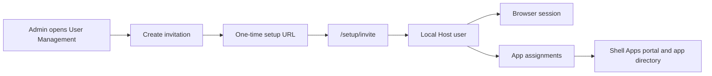

# User Management

Hosty administrators manage users from the Shell User Management view. The old Legacy Host `/settings/users` route has been removed with the combined Next.js Host package.

Host users can enter the system through these implemented flows:

- first-administrator setup creates the initial local `host.admin` with a password after a valid local setup token;
- local administrator recovery creates or restores a `host.admin` and replaces its password after a valid local recovery token;
- local invitations create `host.admin` or `host.user` accounts with passwords after the invite is accepted;
- future OIDC login can provision or update external users through provider role mappings;
- future trusted-proxy assertions can provision or update external users through trusted proxy role mappings;

First-administrator bootstrap and local administrator recovery are Core auth flows, not User Management flows. The removed Legacy Host auth-token writer is not part of the current implementation.

Browser account switching is a separate compatibility topic. User Management owns persisted users, invitations, assignments, sessions, and audit events.

The feature uses Core-owned auth state:

- users are stored as `HostUserRecord` entries in Core's `auth/state.json`;
- local password credentials are stored separately from `HostUserRecord` entries in Core auth state;
- roles remain `host.admin` and `host.user`;
- local invitations use one-time setup-token style links with only token hashes stored at rest;
- local password credentials use PBKDF2-HMAC-SHA256 with per-password salts;
- setup and recovery tokens use separate hash-only storage under `core/auth/bootstrap-tokens.json`;
- app access uses Core `AppAssignmentRecord` entries;
- mutating browser requests require an active administrator session and same-origin CSRF validation;
- user lifecycle changes append auth audit events.



## Administrator Surface

The Shell User Management view is available only to `host.admin` principals.

Administrators can:

- list Host users with role, disabled state, active sessions, and assigned app count;
- invite local `host.user` or `host.admin` accounts;
- choose invitation expiry from 15 minutes, 24 hours, or 7 days;
- assign installed apps during invitation creation;
- revoke pending invitations;
- change local user roles;
- disable users;
- replace a user's app assignments.

External-provider users are reserved for future auth-provider work. When enabled, they should be listed, disabled, and assigned to apps in the same surface, while their roles remain provider-managed.

User Management does not add a separate permissions store. It reuses Core auth state in `auth/state.json`: users are `HostUserRecord` entries, invitations are token-hash records, and app access is stored as `AppAssignmentRecord` entries.

`host.users.manage` is the authorization action for the feature. In the current two-role model, `host.admin` satisfies this action; it is not a separate RBAC role.

## Invitation Flow

Invitations create local Hosty users in the current implementation.

An invitation requires an email address. Hosty Core rejects invitation creation when an enabled or disabled user already has that email, or when another active invitation for the same email is still pending. The administrator can provide an optional display name, target role, initial app assignments, and an expiry of 15 minutes, 24 hours, or 7 days. The 24-hour option is the default. Hosty Core does not send email in this version; the administrator copies and delivers the generated URL.

The administrator generates a URL like:

```text
/setup/invite?setupToken=dhstp_...
```

The recipient opens the URL, confirms the token, sets a password, and creates the account. On success, Hosty Core:

- marks the invitation token as used;
- creates a local Host user with the invited role;
- stores the local password credential separately from the user record;
- applies the stored app assignments;
- creates a normal browser session;
- redirects `host.user` accounts to `/apps` and `host.admin` accounts to `/`.

The raw setup token is returned only once to the administrator and is never stored in auth state.

Hosty does not create users directly from User Management in this version. New local users are invite-first. Password-reset invites can reuse the same token mechanics later, but they are not part of this feature.

After logout, local users sign in through Core `/login` with email and password. Existing users from older builds that do not have password credentials need administrator recovery or a future reset-password flow before they can use password login.

Invitations do not pre-provision future OIDC or trusted-proxy identities. External users should be created or updated when they authenticate through their provider, then administrators can disable them or assign app access after first login.

## Safety Rules

User deletion is implemented as soft-disable. Disabled users remain in auth history but cannot authenticate.

When a user is disabled, Hosty Core:

- revokes active browser sessions;
- removes app assignments.

Hosty Core prevents disabling or demoting the last active administrator. Administrators also cannot disable their own account from User Management.

Changing a local user's role revokes that user's active sessions.

Provider-managed roles are read-only in User Management. OIDC and trusted-proxy login can overwrite stored roles from provider mappings, so external role changes belong to the provider configuration instead of this page.

Every user, invitation, role, disable, and assignment mutation appends an auth audit event with actor, target, result, and relevant mutation details.

## App Access

User Management uses the existing app assignment model.

For ordinary users, an app is visible when:

- the app has no assignments, which means all authenticated users can see it; or
- the app has assignments and the current user is assigned.

Administrators can see all Hosty apps. App directory responses still include only explicitly assigned, enabled users.

The access picker lists installed runtime apps. Hosty access assignments are app-wide and currently control Shell visibility. Future gateway work should reuse the same assignment model for assigned-only service/API exposure policy.

Invitation assignments are stored on the invitation and applied only when the invite is accepted, because the target user id does not exist before acceptance.

## API Summary

The UI uses the Core auth API:

- `GET /api/auth/users` lists users, pending invitation summaries, assignable apps, and invite expiry options.
- `GET /api/auth/invitations` lists invitation summaries.
- `POST /api/auth/invitations` creates an invitation and returns the raw setup token and setup URL once.
- `DELETE /api/auth/invitations/{inviteId}` revokes a pending invitation.
- `GET /api/auth/invitations/accept?setupToken=...` returns a safe invitation preview.
- `POST /api/auth/invitations/accept` consumes an invitation, stores the submitted password credential, and creates the user session.
- `PATCH /api/auth/users/{userId}` updates local user profile or role.
- `DELETE /api/auth/users/{userId}` disables the user.
- `PUT /api/auth/users/{userId}/assignments` replaces app assignments for the user.

All administrator mutation endpoints require `host.users.manage` and same-origin CSRF checks for browser sessions.

Common business errors include duplicate email, active invitation already exists, invalid or expired invitation token, provider-managed role, last active administrator protection, self-disable protection, and disabled or missing user.
