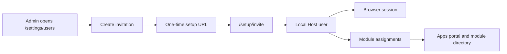

# User Management

Docker Host administrators manage Host users from `/settings/users`.

The feature uses the existing Host-owned auth state:

- users are stored as `AuthUserRecord` entries in `/data/auth/state.json`;
- roles remain `host.admin` and `host.user`;
- local invitations use one-time setup-token style links with only token hashes stored at rest;
- app access uses `AuthState.moduleAssignments`;
- sensitive changes require recent administrator reauthentication;
- user lifecycle changes append auth audit events.



## Administrator Surface

`/settings/users` is available only to `host.admin` principals.

Administrators can:

- list Host users with role, provider, disabled state, active sessions, CLI token count, last seen time, and assigned app count;
- invite local `host.user` or `host.admin` accounts;
- choose invitation expiry from 15 minutes, 24 hours, or 7 days;
- assign installed modules/apps during invitation creation;
- revoke pending invitations;
- change local user roles;
- disable users;
- replace a user's module assignments.

External-provider users from OIDC or trusted-proxy login can be listed, disabled, and assigned to modules, but their roles are provider-managed.

User Management does not add a separate permissions store. It reuses the Host auth state in `/data/auth/state.json`: users are `AuthUserRecord` entries, invitations are setup-token records with `purpose: "invite"`, and app/module access is stored in `AuthState.moduleAssignments`.

`host.users.manage` is the authorization action for the feature. In the current two-role model, `host.admin` satisfies this action; it is not a separate RBAC role.

## Invitation Flow

Invitations are local-password users only in the current implementation.

An invitation requires an email address. Docker Host rejects invitation creation when an enabled or disabled user already has that email, or when another active invitation for the same email is still pending. The administrator can provide an optional display name, target role, initial module assignments, and an expiry of 15 minutes, 24 hours, or 7 days. The 24-hour option is the default. Docker Host does not send email in this version; the administrator copies and delivers the generated URL.

The administrator generates a URL like:

```text
/setup/invite?setupToken=dhstp_...
```

The recipient opens the URL, confirms the token, sets a password, and creates the account. On success, Docker Host:

- marks the invitation token as used;
- creates a local Host user with the invited role;
- applies the stored module assignments;
- creates a normal browser session;
- adds the user to the browser account set;
- redirects `host.user` accounts to `/apps` and `host.admin` accounts to `/`.

The raw setup token is returned only once to the administrator and is never stored in auth state.

Docker Host does not create users directly from User Management in this version. New local-password users are invite-first so the recipient sets their own password. Password-reset invites can reuse the same token mechanics later, but they are not part of this feature.

Invitations do not pre-provision OIDC or trusted-proxy identities. External users are created or updated when they authenticate through their provider, then administrators can disable them or assign app access after first login.

## Safety Rules

User deletion is implemented as soft-disable. Disabled users remain in auth history but cannot authenticate.

When a user is disabled, Docker Host:

- revokes active browser sessions;
- removes the user from remembered browser account sets;
- revokes CLI tokens;
- removes module assignments.

Docker Host prevents disabling or demoting the last active administrator. Administrators also cannot disable their own account from User Management.

Changing a local user's role revokes that user's active sessions. When a user is changed away from `host.admin`, their CLI tokens are revoked because CLI tokens are admin-only credentials.

Provider-managed roles are read-only in User Management. OIDC and trusted-proxy login can overwrite stored roles from provider mappings, so external role changes belong to the provider configuration instead of this page.

Every user, invitation, role, disable, and assignment mutation appends an auth audit event with actor, target, result, and relevant mutation details.

## App Access

User Management uses the existing module assignment model.

For ordinary users, an installed app is visible when:

- the app has no assignments, which means all authenticated users can see it; or
- the app has assignments and the current user is assigned.

Administrators can see all Host apps. Module directory responses still include only explicitly assigned, enabled users.

Invitation assignments are stored on the invitation and applied only when the invite is accepted, because the target user id does not exist before acceptance.

## API Summary

The UI uses the Host auth API:

- `GET /api/auth/users` lists users, pending invitation summaries, assignable modules, and invite expiry options.
- `GET /api/auth/invitations` lists invitation summaries.
- `POST /api/auth/invitations` creates an invitation and returns the raw setup token and setup URL once.
- `DELETE /api/auth/invitations/{inviteId}` revokes a pending invitation.
- `GET /api/auth/invitations/accept?setupToken=...` returns a safe invitation preview.
- `POST /api/auth/invitations/accept` consumes an invitation and creates the user session.
- `PATCH /api/auth/users/{userId}` updates local user profile or role.
- `DELETE /api/auth/users/{userId}` disables the user.
- `PUT /api/auth/users/{userId}/assignments` replaces module assignments for the user.

All administrator mutation endpoints require `host.users.manage`, same-origin CSRF checks for browser sessions, and recent reauthentication.

Common business errors include duplicate email, active invitation already exists, invalid or expired invitation token, weak password, provider-managed role, last active administrator protection, self-disable protection, and disabled or missing user.
