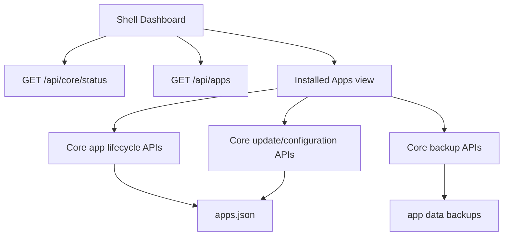

# Web UI Dashboard

The Hosty Web UI is the Core-managed Shell runtime app. The dashboard is an administrator-only overview surface; app lifecycle, updates, backups, configuration, and removal live in the Shell Installed Apps view.

## Scope

The dashboard reads:

- Core status from `GET /api/core/status`;
- the current Core session from `GET /api/auth/session`;
- installed app summaries from `GET /api/apps`.

The dashboard is addressable at `/dashboard`, with `/` retained as a compatible default Shell entry route. It shows aggregate non-system runtime app counts, running state, attention indicators, Core health warnings, Core status, and a link into `/installed-apps` for detailed management.

## Installed Apps Management

The Installed Apps view is the implemented administrator management surface for installed apps. It separates non-system Runtime Apps from System Apps such as Hosty Shell. Runtime Apps use Core app APIs:

- `POST /api/apps/install/plan`
- `POST /api/apps/install`
- `POST /api/apps/{appId}/start`
- `POST /api/apps/{appId}/stop`
- `POST /api/apps/{appId}/restart`
- `POST /api/apps/{appId}/configure`
- `POST /api/apps/{appId}/update/plan`
- `POST /api/apps/{appId}/update`
- `GET /api/apps/{appId}/logs`
- `GET /api/apps/{appId}/health`
- `GET /api/apps/{appId}/backups`
- `POST /api/apps/{appId}/backups`
- `POST /api/apps/{appId}/backups/{backupId}/restore`
- `DELETE /api/apps/{appId}/backups/{backupId}`
- `GET /api/apps/{appId}/backups/cleanup/plan`
- `POST /api/apps/{appId}/backups/cleanup`
- `POST /api/apps/{appId}/remove`

Shell renders install review, configuration, update, logs, backups, backup cleanup, restore, and removal flows with Core-generated plans and capability checks for non-system Runtime Apps. System Apps are inspect-only in Shell: logs can be opened when the app has the `logs` capability, while lifecycle, update, configuration, backup, restore, and removal controls stay hidden. Core remains the authority for app state and mutation validity.

## Empty and Recovery States

The runtime empty state is shown when Core has no non-system runtime apps. The primary way to leave the runtime empty state is the Installed Apps install dialog.

Failed apps remain visible with their last operation and error so administrators can choose the correct recovery path. Shell delegates retry, update, backup, and remove behavior to Core app endpoints.

Non-admin `host.user` accounts do not see Dashboard, Installed Apps, or User Management. They land on the `/apps` overview and can only open visible non-system runtime app UIs. Unauthorized management routes are redirected back to `/apps`.

## Gateway Boundary

Gateway exposure management and external ingress readiness were part of the retired Legacy Host UI. They are not current Shell dashboard features. Future gateway UX should be added as a Core-backed Shell view after Core or a Core-managed gateway runtime owns the underlying APIs.
