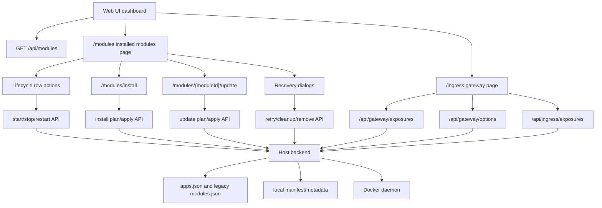

# Web UI Dashboard

The Web UI is the primary daily interface for Hosty system apps, runtime apps, and legacy module operations. The dashboard remains centered on Host backend APIs instead of direct raw Docker container management.

## Scope

The dashboard reads installed runtime state from `GET /api/modules` and app registry state from `GET /api/apps`. The current Installed modules widget combines module count, runtime health, summary metrics, widget-local refresh state, and a link to `/modules` for the detailed legacy module management page. The `/apps` portal shows system apps and runtime apps separately.

The `/modules` page owns the installed module table and uses module lifecycle routes for row actions:

- `POST /api/modules/{moduleId}/start`
- `POST /api/modules/{moduleId}/stop`
- `POST /api/modules/{moduleId}/restart`

The `/modules` page displays module metadata, service/image references, operation status, aggregate Docker runtime state, per-service runtime state, timestamps, and any recorded module/runtime error. Rows can expand for details. Lifecycle actions are enabled only for modules in `operationStatus=installed`; failed or removing modules expose recovery actions instead.

The dashboard and `/modules` page are admin-only Host management surfaces inside the authenticated shell. Non-admin `host.user` principals use the `/apps` portal instead and do not receive module lifecycle controls or the admin navigation groups.

Implemented app/module-management flows:

- Install uses the dedicated `/modules/install` route. It accepts a manifest URL or legacy metadata URL, calls `POST /api/modules/install/plan`, renders the reviewed plan, collects setting values and external mount selections, shows a redacted payload preview, then submits `POST /api/modules/install`.
- If the install plan response is `mode: "update"` for an app/module already registered from the same source URL, the install page redirects to that app's update review instead of showing an already-installed conflict.
- Update uses the dedicated `/modules/{moduleId}/update` route. Installed module rows link to it for installed runtime apps. The route calls `POST /api/modules/{moduleId}/update/plan`, shows refreshed manifest/metadata changes and prompts, builds a redacted update request, then submits `POST /api/modules/{moduleId}/update`.
- Failed update rows expose `POST /api/modules/{moduleId}/update/retry` plus a link to review the update again.
- Failed install rows expose `POST /api/modules/{moduleId}/retry` and cleanup through a backend-generated confirmation dialog.
- Installed rows expose remove through a backend-generated confirmation dialog.
- Cleanup and remove dialogs call `POST /api/modules/{moduleId}/cleanup/plan` or `POST /api/modules/{moduleId}/remove/plan` before apply, default to preserving module-owned data, and only submit apply after explicit confirmation.
- Gateway exposure management and external ingress readiness are available on the dedicated `/ingress` shell page. The page calls `/api/gateway/options`, `/api/gateway/exposures`, and `/api/ingress/exposures`, lets administrators create/edit/disable/delete service/API exposure hostnames, supports assigned-user editing for assigned-only module access, shows provider-neutral publish status, renders generated manual setup instructions, supports mark-ready/refresh/unlink actions, and keeps provider-specific DNS, tunnel, or identity-provider automation out of the Web UI.
- Shell Apps are not managed from the dashboard. System apps, including Hosty Shell, are synthesized by the app registry. Runtime apps are derived from explicit manifest or legacy module `ui` metadata and Host access policy, then rendered through the Apps sidebar, `/apps` portal, and `/apps/{moduleId}` app host route.

## Empty and recovery states

The empty state is shown when the merged app/legacy registry has no installed runtime app records. The primary way to leave the empty state is the install route.

Failed modules remain visible with their last operation error so administrators can choose the correct recovery path. Failed installs use install retry or cleanup. Failed updates use update retry or update review. Cleanup and remove previews list affected containers, metadata files, module directories, module-owned storage, external mount mappings, dependents, warnings, and conflicts before any destructive action runs.

Runtime app update uses a dedicated review route at `/modules/{moduleId}/update`, while reusing install review interaction patterns where practical. Module-provided dashboard widgets and module log detail views are not part of the dashboard contract.
