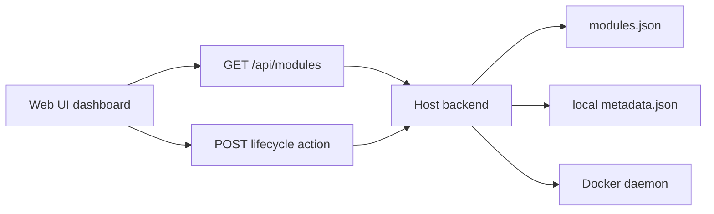

# Web UI dashboard

The Web UI is the primary daily interface for Docker Host module operations. In Phase 4, the dashboard is centered on installed modules from the Host backend API instead of direct raw Docker container management.

## Scope

The dashboard reads installed modules from `GET /api/modules` and uses module lifecycle routes for actions:

- `POST /api/modules/{moduleId}/start`
- `POST /api/modules/{moduleId}/stop`
- `POST /api/modules/{moduleId}/restart`

The UI displays module metadata, image reference, operation status, Docker runtime state, container identity, timestamps, and any recorded module/runtime error. It intentionally does not implement module installation, update plan review, settings editing, storage mapping edits, removal, or log viewing in Phase 4.

Phase 6 adds a dashboard entry point to a dedicated module install route. The install route owns metadata URL input, plan review, administrator setting collection, external mount selection, and construction of the future install apply payload. Dashboard rows stay focused on installed modules and lifecycle actions.

## Empty and seeded states

The empty state is shown when the Host modules store has no installed module records. A non-empty dashboard can be validated with the manual Phase 4 seed flow in [Local development and testing](local-development.md#phase-4-manual-module-seed).

## Open Questions

- What detail view should own module logs once diagnostics endpoints are added?
- Should module update reuse the dedicated install route layout or use a separate update review route once update plans are implemented?
