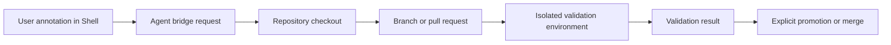

# Agent Bridge Workflow

Status: Idea
Created: 2026-06-12
Updated: 2026-07-10

## Description

This idea covers future Shell-to-agent workflows for changing runtime apps from in-context feedback. It depends on repository-backed app source support and a safe isolated validation mechanism. Runtime app feeds describe normal update sources; they are not disposable pull-request environments and must not be extended for Agent Bridge validation.

Agent Bridge should not be implemented in the current Core/Shell stabilization branch. The active branch should only preserve architectural room for future agent workflows while focusing on Shell lifecycle management, authentication, user management, and backup controls.

The target workflow is that a user can open a runtime app, annotate a UI element or route in Hosty Shell, describe a desired change, and let an agent create a branch or pull request. Changes must be validated in an isolated environment before promotion, but the concrete isolation contract remains unresolved.

## Milestones

### Phase 1 - Define annotation payloads

**Status**: Not Started

- Capture app id, route, followed feed, selected runtime profile, user note, and timestamp.
- Capture optional DOM target, screenshot reference, or selected text.
- Avoid storing sensitive runtime app data unless the user explicitly includes it.
- Add audit records for agent-triggering actions.

### Phase 2 - Add agent bridge service contract

**Status**: Not Started

- Define a Core-owned agent bridge interface.
- Add authorization checks for who can request code changes.
- Pass only app-scoped repository and runtime context to the agent.
- Track request status, branch, pull request, and validation outcome.
- Keep credentials and repository tokens out of Shell-visible state.

### Phase 3 - Connect repository-aware apps

**Status**: Not Started

- Require source repository metadata for agent-editable apps.
- Resolve source checkout and selected commit.
- Create a branch for agent changes.
- Keep agent edits isolated from installed production runtime state.
- Support apps whose current runtime is Docker image but source is available for edits.

### Phase 4 - Define isolated validation

**Status**: Not Started

- Keep validation separate from the installed app's followed feed and lifecycle state.
- Do not point the installed app at unmerged agent changes.
- Define whether validation runs in CI, a disposable Hosty instance, or another isolated runtime.
- Use copied or sanitized test data when app data is required; never mount production data read-write.
- Define cleanup, logs, validation results, and explicit promotion behavior before implementation.

### Phase 5 - User experience and safety

**Status**: Not Started

- Add Shell UI for creating annotations and reviewing agent status.
- Add clear user-facing boundaries for what the agent can inspect and modify.
- Add cancellation and cleanup behavior for stale agent requests.
- Add audit and diagnostics views.

## Decisions And Recommendations

- Agent Bridge cannot safely validate code changes before repository-backed source support and an isolated validation contract exist.
  Recommendation: treat both as prerequisites and keep the validation mechanism open until its data-isolation guarantees are designed.

- Agent workflows should not edit the live app data directory.
  Recommendation: validate against copied or synthetic data in a disposable environment, not by switching the installed app's feed or mutating production data directly.

- Not every runtime app should be agent-editable. Docker-only and source-less apps can still be managed by Hosty, but they cannot receive source edits.
  Recommendation: expose agent actions only when source metadata and permissions are present.
