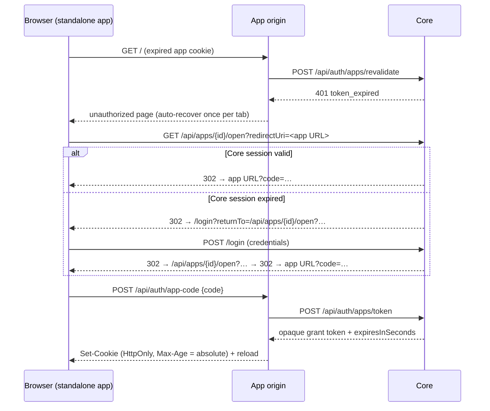

# Auth Session Lifecycle And Recovery

Status: Idea (agreed 2026-07-13)
Created: 2026-07-13
Updated: 2026-07-13

## Motivation

A runtime app opened in standalone mode dead-ends after its app identity token expires. The observed failure: work stops in the evening, the standalone app is refreshed in the morning, and the app reports "not authorized" with no way back — no redirect to a login surface, no sign-in affordance. The only recovery is a manual detour through Shell (open the app embedded, switch back to standalone), which re-issues a launch code as a side effect.

Four root causes, all confirmed in the current implementation:

1. **App identity tokens are fixed 24-hour JWTs with no renewal and no recovery path.** When the token lapses, apps render an unauthorized state and stop ([`AppIdentityService.cs`](../../apps/core/src/Haas.Hosty.Core/AppIdentityService.cs) `IdentityTokenLifetime`; the app-side `AppIdentityBridge` components only consume a `?code=` query parameter).
2. **Core sessions are fixed 12-hour absolute with no idle extension** ([`AuthEndpoints.cs`](../../apps/core/src/Haas.Hosty.Core/AuthEndpoints.cs) `CreateSessionAsync`), so the authorizing session is often also gone by morning — Shell recovers because it redirects to Core `/login`, standalone apps do not.
3. **The identity error contract collapses everything to 403** (`HandleIdentityError`): `token_expired` is indistinguishable from `app_access_denied`, so an app cannot safely decide to re-authorize. Notably, [App Auth And Origin Separation](../features/app-auth-origin-separation.md) already *documents* the intended contract ("treat Core `401` as missing or expired Host authentication and Core `403` as denied app access") — the implementation never honored it.
4. **Recovery only half exists.** `GET /api/apps/{appId}/open?redirectUri=...` already issues a fresh code and redirects (with the redirect URI validated against installed app endpoint origins), but no app navigates there on failure, and without a valid Core session the endpoint returns 401 JSON into a top-level browser navigation — a dead end, because `/login` has no continuation (`POST /login` always redirects to the Shell origin).

## Current Architecture Findings

- The browser app token is an HS256 JWT whose key is private to Core. Apps cannot verify it locally; every trust decision is an online `POST /api/auth/apps/revalidate` call authenticated by the app service token. The signature therefore buys nothing, while statelessness costs revocation and lifetime management.
- Revalidation already re-checks user disabled / app assignment / role / system-app-admin on every call (`RequireAccessibleUserAsync`), so *policy* revocation is immediate today. What is missing is *per-session* revocation and idle/absolute lifetime semantics.
- The decided platform token rule in [AI Agent Bridge](../features/ai-agent-bridge.md) (2026-07-11) already says: tokens presented **to Core** are opaque values with a server-side record (instant revocation, no signing needed); signed short-TTL tokens are reserved for delegated tokens that receiving apps verify **locally**. The browser app token is presented to Core on every revalidate, so it belongs in the opaque row; its current JWT form contradicts the decided rule.
- Core sessions are already opaque server-side records (`AuthSessionRecord` with `RevokedAt`), so idle+absolute lifetimes are an incremental change there. Session records are appended forever and never pruned.
- Apps already receive `HOSTY_CORE_PUBLIC_ORIGIN` (browser-reachable) alongside `HOSTY_CORE_ORIGIN` (server-reachable) in both runtime adapters — the standalone recovery redirect target needs no new wiring.
- Shell's embed iframe sandbox is `allow-scripts allow-same-origin allow-forms allow-popups allow-downloads` — no `allow-top-navigation*` — so an embedded app cannot navigate the top window to Core. A parent `postMessage` channel is the only embedded recovery path. Shell already has a precedent for verified iframe messaging (Marketplace install-intent handling: `event.source` + exact origin checks).
- `hosty apps identity <app> --user <email>` (CLI diagnostic) issues tokens through the same `CreateLaunchTokenAsync` path and must keep working.
- `telemetry-ui`'s route authorization already maps outward statuses correctly (401 missing / 403 denied / 503 Core unreachable) but receives only 403 from Core; no app ever deletes or refreshes its identity cookie.

## Decisions

1. **Fix the identity error contract first (prerequisite for everything else).** Core maps `AppIdentityException` codes to status classes instead of a blanket 403:
   - **401 (recoverable — re-authorization can fix it):** `invalid_code`, `code_expired`, `code_consumed`, `token_invalid`, `token_expired`, `token_revoked` (new).
   - **403 (terminal — access is denied for this user/app):** `user_not_found`, `user_disabled`, `app_access_denied`, `system_app_admin_required`, `token_app_mismatch`, `redirect_uri_denied`, `app_not_found`.
   - **503 is app-side only** (Core unreachable/timeout), never a Core identity status.
   App-side rules: terminal 401 → drop the app cookie and start recovery; 403 → access-denied page, **no** auto-redirect (this is the redirect-loop guard); 503 → keep the cookie and offer retry — a transient Core outage must never become a logout. This matches what `app-auth-origin-separation.md` already promises.

2. **Session recovery, standalone: browser navigation through the existing app-open endpoint, with a login continuation.** On a 401-class failure the app top-navigates to `{HOSTY_CORE_PUBLIC_ORIGIN}/api/apps/{appId}/open?redirectUri=<current app URL>` — automatically at most once per browser tab (sessionStorage guard, cleared on successful exchange), with an explicit "Sign in via Hosty" button rendered for every subsequent attempt. Core `/open` behavior:
   - valid Core session → issue a code and redirect back immediately (works today);
   - no valid Core session → redirect to `/login?returnTo=<continuation>` instead of returning JSON; after successful login Core resumes the app-open flow and lands the user back in the exact app URL they came from.
   The continuation is constrained to prevent open redirects: `returnTo` may only be a Core-relative `/api/apps/{id}/open` path (query included), and `/open` itself keeps validating `redirectUri` against installed app endpoint origins as it does today. On invalid `returnTo`, `/login` falls back to the Shell origin.

3. **Session recovery, embedded: `postMessage`, not top navigation.** The embedded app posts `{ type: "hosty:auth-required", appId }` to `window.parent` (no secrets in the payload). Shell verifies `event.source` against the workspace iframe's `contentWindow`, verifies `event.origin` against that app's endpoint origin, verifies the appId matches, then re-issues a launch code through the existing `launch-code` endpoint and replaces the iframe `src`. Shell rate-limits reissue per iframe (one per few seconds) as its own loop guard. The iframe sandbox is **not** loosened. Apps pick the channel by embedding detection (`window.self !== window.top`); if an embedded app gets no parent response within a few seconds (non-Shell embedder), it falls back to the sign-in card, whose button opens the standalone recovery URL in a new tab (`allow-popups` permits this).

4. **Replace the browser JWT with a Core-managed app session grant (opaque, server-side record).** This aligns the browser app session with the decided token rule instead of adding a third mechanic. `AppSessionGrantRecord`:
   - `id`, `appId`, `userId`;
   - `tokenHash` — SHA-256 of the opaque token; the raw value (256-bit random, `hostyg_` prefix for debuggability) is returned once and never stored;
   - `createdAt`, `lastSeenAt`, `absoluteExpiresAt`, `revokedAt`;
   - `issuedVia` — `code` (browser exchange), `launch` (Core-side launch token), `cli-diagnostic` (`hosty apps identity`);
   - `authorizingSessionId` — nullable, recorded for audit and explicit-logout cascade **only**.
   Validity: not revoked, `now < absoluteExpiresAt`, and `now < lastSeenAt + idleTtl`. Revalidate resolves the hash, applies the existing `RequireAccessibleUserAsync` policy checks unchanged, and extends the idle window by updating `lastSeenAt` — throttled to at most one write per ~5 minutes, because revalidate runs on every server render and the store is a rewritten JSON file. The wire contracts (`/api/auth/apps/token`, `/revalidate` request/response shapes, the app cookie mechanics, `X-Docker-Host-Identity` header) do not change; only the token value's format does. Old JWT cookies simply fail as `token_invalid` → 401 → recovery; no migration is needed.

5. **Grants outlive the authorizing Core session; cascade only on explicit logout.** If grant validity were tied to Core session liveness, app sessions would die with the 12-hour Core session and the entire feature would be pointless. `authorizingSessionId` enables revoking the session's grants when the user *explicitly* logs out (`POST /api/auth/logout`, `/logout`) — an intent to leave — and is ignored on mere Core session expiry. Admin-side revocation (user disable, assignment removal) already works through the revalidate policy checks and additionally gets instant per-grant revoke.

6. **Idle + absolute lifetimes in days, not hours — including system apps; all knobs configurable.** Because every revalidate already re-checks role/assignment/disabled online and grants are instantly revocable server-side, short TTLs add little security while recreating the daily-login problem — and all current system apps (telemetry, marketplace) are `host.admin` daily-driver surfaces. Defaults (env-configurable on `HostyCoreRuntimeConfig`):
   - regular app grants: idle 7 days, absolute 30 days (`HOSTY_AUTH_APP_GRANT_IDLE_HOURS` / `HOSTY_AUTH_APP_GRANT_ABSOLUTE_HOURS`);
   - system-app grants: idle 3 days, absolute 14 days (`HOSTY_AUTH_SYSTEM_GRANT_IDLE_HOURS` / `HOSTY_AUTH_SYSTEM_GRANT_ABSOLUTE_HOURS`);
   - CLI-diagnostic grants keep a short fixed lifetime (hours) — they are probe credentials, not sessions.
   `expiresInSeconds` in the token response becomes time-to-absolute-expiry; apps set their cookie `Max-Age` from it (the current hardcoded 24-hour caps in app cookie routes are raised to follow the response).

7. **Core sessions get the same idle + absolute model.** `AuthSessionRecord` gains `lastSeenAt`; `ResolveSessionAsync` extends the idle window on authenticated use with the same ~5-minute write throttle and re-issues the cookie `Expires` when it extends. Defaults: idle 7 days, absolute 30 days (`HOSTY_AUTH_CORE_SESSION_IDLE_HOURS` / `HOSTY_AUTH_CORE_SESSION_ABSOLUTE_HOURS`). This is the single biggest UX lever for a self-hosted host: without it, every recovery still funnels through a daily password prompt.

8. **Pruning.** Expired and revoked session and grant records are dropped opportunistically on store writes (retaining recently revoked records for ~7 days for diagnostics). Today's session list only ever grows; longer lifetimes make cleanup mandatory.

**Rejected alternatives.**
- *Refresh-token pairs for browser apps* — rejected. Rotation machinery (refresh endpoint, replay detection, dual expiry bookkeeping in every app) buys nothing here: the credential is an HttpOnly cookie that the app server already presents to Core online, so a single opaque grant with server-side idle extension provides the same "long session, short exposure" property with none of the app-side complexity.
- *Signed longer-lived browser tokens with app-local verification* — rejected; contradicts the decided token rule and would force key distribution plus offline-revocation machinery into every runtime app. Signed short-TTL tokens remain reserved for the agent-bridge delegated path.
- *Tying grant validity to the authorizing Core session* — rejected (Decision 5).
- *Aggressively short system-app TTLs* — rejected (Decision 6); the online policy re-check on every revalidate is the real control.

## Recovery Flow

Embedded variant: the app posts `hosty:auth-required` to the parent instead of navigating; Shell verifies source/origin/appId, calls `launch-code`, and swaps the iframe `src` — same code-exchange tail.

## Implementation Plan

Each phase is independently shippable; 1 → 2 fix the observed dead-end, 3 → 4 make sessions long-lived.

**Packaging.** One PR covering all four phases is feasible but large (~25–35 files): Core is compact (~6 files), but the app-side work triples across `demo-app`, `telemetry-ui`, and `marketplace` (no shared package — `host-auth.ts`, `app-code/route.ts`, and the identity bridge are independent copies), plus a Shell handler and tests. Recommended split at the natural seam:
- **PR A — Phase 1 + 2** (error contract + recovery). Fully fixes the observed dead-end; token format untouched; low risk, readable review.
- **PR B — Phase 3 + 4** (app session grants + sliding Core sessions). Changes the token value format and the session model; warrants its own test pass. Removes the daily password prompt.

The app-facing recovery contract is documented for app authors in [`skills/hosty-app-skill/references/app-auth-and-users.md`](../../skills/hosty-app-skill/references/app-auth-and-users.md); the 401-vs-403 split (Phase 1) and the Shell `hosty:auth-required` responder (Phase 2) are its implementation prerequisites, so that skill guidance lands with PR A.

**Phase 1 — error contract (Core + apps).**
Core: per-code status mapping in `HandleIdentityError` (+ `token_revoked` reserved), tests for each class. Apps (demo-app, telemetry-ui, marketplace): classify 401/403/503 responses from their identity routes, drop the cookie on terminal 401, keep it on 503, access-denied state for 403. Update `app-auth-origin-separation.md` (contract now actually enforced).

**Phase 2 — recovery.**
Core: `returnTo` continuation on `/login` (constrained to Core-relative `/api/apps/{id}/open`), `/open` redirects to `/login` instead of JSON 401 for browser navigations. Apps: unauthorized page with once-per-tab auto-navigation + explicit sign-in button (standalone), `hosty:auth-required` postMessage (embedded), embedding detection and non-Shell fallback. Shell: verified message handler, launch-code reissue, iframe `src` swap, per-iframe rate limit; Shell version bump per release policy.

**Phase 3 — app session grants.**
Core: `app-grants` store (separate private file beside the auth state, temp+rename discipline), grant issuance in exchange/launch/CLI-diagnostic paths, revalidate against grants with throttled `lastSeenAt`, explicit-logout cascade, pruning, lifetime config knobs and defaults. Apps: cookie `Max-Age` follows `expiresInSeconds` (remove 24-hour caps). Update feature docs; platform version bump.

**Phase 4 — sliding Core sessions.**
Core: `lastSeenAt` on session records, throttled idle extension with cookie re-issue, absolute cap, pruning, config knobs. `/login` pages unchanged.

## Boundaries

- Browser app tokens are never signed for app-local verification; signed short-TTL tokens stay reserved for delegated agent-bridge tokens per the decided rule in [ai-agent-bridge.md](../features/ai-agent-bridge.md).
- Grant validity is never coupled to Core session liveness; `authorizingSessionId` drives cascade only on explicit logout or admin revoke.
- Core session cookies keep never being forwarded to app origins or gateway targets ([gateway-and-app-wrapping.md](gateway-and-app-wrapping.md)).
- The Shell embed iframe sandbox is not loosened (`allow-top-navigation*` stays off).
- `returnTo` and `redirectUri` are always validated server-side; no raw absolute URLs from query parameters are followed.
- On 503 (Core unreachable) apps must not delete their session cookie or trigger recovery navigation.
