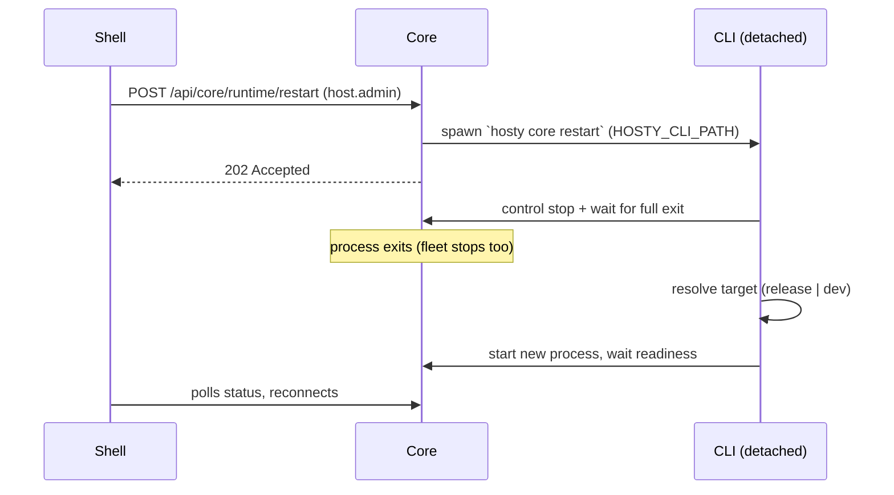

# Core Launch Target (release / dev)

Status: Idea
Created: 2026-07-12
Updated: 2026-07-12

## Motivation

Iterating on Core itself is the worst dev loop on the platform. `hosty core restart --project <csproj>` already runs Core from a source tree with the real data root and settings, but the choice is one-shot: it is not persisted, `core status` does not show it, and the next plain `restart` silently reverts to the installed binary. There is also no way to see or drive any of this from Shell, even though every ordinary app gets runtime switching, a source-override tab, and update affordances.

The fix is deliberately small. Core stays a **mandatory root workload launched by the CLI acting as a thin agent layer** — not an `app.0.1` app installed through its own pipeline (that is a bootstrap cycle: Core would be required to start Core). What users actually need is UX parity, not model parity:

- a persisted launch target: `release` (installed binary) or `dev` (compile-and-run from a source checkout);
- honest failure reporting when the dev tree does not build;
- a small Shell surface — at the existing sidebar version block, not an app card — showing the mode, an update indicator, and switch/restart/update actions.

This document records the design agreed on 2026-07-12 and the implementation plan. It complements [core-extension-model.md](core-extension-model.md): that document defines how *extensions* relate to Core; this one defines how *Core itself* is launched and managed.

## Current Architecture Findings

- `hosty core start|restart --project` resolves a `CoreStartTarget` from either an explicit project path (`dotnet run` from source) or the installed binary (`CoreCommand.ResolveStartTargetAsync`, `apps/cli/src/Haas.Hosty.Cli/Commands/CoreCommand.cs:98`). Nothing persists the choice.
- The CLI already has a persistent-settings mechanism: `HostyEnvironment` roots everything at `~/.hosty` (overridable), and `LaunchSettingsStore` + `LaunchSettingDefinitions` manage a validated, atomically-written `launch.env` behind `hosty config set/get`. The launch target belongs here, not in a new file format.
- The CLI already injects a managed environment into Core at start (`BuildCoreEnvironment`, `CoreCommand.cs:220`): data root, ports, origins, bootstrap manifest paths. Adding target/CLI-path variables is an established pattern, not a new channel.
- Background start writes Core output to `~/.hosty/core/logs/core.log` and waits for control discovery readiness. On failure the message is generic — "local control discovery was not ready before the timeout" (`CoreCommand.cs:89`) — which is exactly what a dev compile error would look like today.
- `hosty core stop` signals shutdown through the control endpoint and waits for the process to fully exit, port released and discovery file removed (`CoreCommand.cs:343`). The stop path is target-agnostic; `restart` composes stop + start (`CoreCommand.cs:393`).
- Core's shutdown intentionally stops the whole app fleet (`HostyCoreApplication.StopAsync`, `apps/core/src/Haas.Hosty.Core/HostyCoreApplication.cs:1183`). Any Core restart is therefore fleet-visible; UI copy must say so.
- There is **no OS autostart integration** (no launchd/systemd anywhere in CLI or Core). The CLI is the only launcher today, so "CLI as agent layer" regresses nothing: nobody supervises Core after a crash now either.
- Core install/update is CLI-owned: `CoreInstallationService` downloads the release artifact with SHA256 verification via `ReleaseArtifactService` into the CLI's bin directory. This is the "release slot".
- Shell's sidebar already renders the Core version and online state (`SidebarVersionInfo`, `apps/shell/src/app/shell/sidebar/shell-sidebar.tsx:157`). This is the natural anchor for the platform panel.
- The app service-token secret is per-process (`ControlSecret`, fresh random bytes each start, `HostyCoreApplication.cs:278`). Irrelevant to this feature — the fleet restarts with Core anyway — but it becomes the first blocker if the deferred "fleet survives Core restart" idea is ever picked up.

## Decisions

1. **Core is launched by the CLI, always.** The CLI is the single owner of launch mechanics, the persisted target, and the release binary. Core never manipulates its own process or binary; every mutating action Shell offers is executed by spawning a detached CLI process.
2. **The launch target is a pair of launch settings**, not a manifest and not a new file: mode `release|dev` plus a dev project path. `hosty core target …` is sugar over `hosty config set`.
3. **Dev mode is compile-and-run from source** via the existing `dotnet run --project` machinery. `dotnet watch` is a follow-up, not part of v1 (see Deferred).
4. **No `app.0.1` manifest for Core**, not even a strict subset. Rationale: the boot interpreter (CLI) would honor ~10% of what the format can express, so every ignored field is a lying contract; the manifest model and validation live inside Core (`RuntimeAppManifest.cs`) and would have to be extracted into a shared library; and the pipeline that gives manifests meaning — install plans, reviewed updates, service tokens, runtime adapters — cannot apply to Core by construction. The persisted target *is* Core's launch spec.
5. **Core does not appear in the apps list.** An app card drags in install/uninstall/assignment semantics that would all need special-casing. The Shell surface is a small platform panel opened from the sidebar version block. Nothing is lost: if a full card is ever wanted, the panel's data model is exactly what it would display.
6. **Failure stays honest.** A dev tree that fails to build yields an explicit "dev target failed" report with the log tail — never a silent fallback to the release binary.

## Design

### Launch target settings (CLI)

Two new `LaunchSettingDefinitions` keys, persisted in `launch.env`:

- `HOSTY_CORE_TARGET` — `release` (default) or `dev`.
- `HOSTY_CORE_DEV_PROJECT` — absolute path to the Core `.csproj` (or a source root from which the csproj is discovered). Required and validated (path exists, file is a csproj) when target is `dev`; ignored otherwise.

Sugar commands:

```bash
hosty core target                 # show: mode, dev project, effective start plan
hosty core target dev --source /path/to/docker-host   # sets both keys; discovers the csproj
hosty core target release
```

Resolution order in `ResolveStartTargetAsync`:

1. explicit `--project <path>` — one-shot override, never persisted (unchanged behavior);
2. `HOSTY_CORE_TARGET=dev` → `CoreStartTarget.FromProject(HOSTY_CORE_DEV_PROJECT)`;
3. installed binary via `CoreInstallationService.EnsureInstalledAsync()` (unchanged).

`start`, `restart`, and `--foreground` all flow through this resolve, so they pick the target up with no further changes.

### Environment handoff (CLI → Core)

`BuildCoreEnvironment` additionally injects:

- `HOSTY_CLI_PATH` — absolute path to the CLI executable that launched Core (`Environment.ProcessPath`). Core uses it to spawn actuator commands; it never guesses a CLI location.
- `HOSTY_CORE_TARGET` and, when dev, `HOSTY_CORE_DEV_PROJECT` — display-only for Core; the CLI remains the source of truth.

### Honest dev failure

Background start currently fire-and-forgets the process and polls discovery. Change: while waiting for readiness, also watch the child process handle. If the process exits before discovery appears:

- report `Hosty Core (dev target) failed to start` distinctly from the readiness timeout;
- print the last ~30 lines of `core/logs/core.log` (the compiler error lands there);
- hint the recovery commands: fix the tree, or `hosty core target release && hosty core start`.

`hosty core status` gains a target line: `target: dev · /path/to/docker-host` or `target: release · v0.42.0`. This is the guard against "forgot the host has been running a dev kernel for a week".

### Update interplay

`hosty core update` keeps updating the installed binary (the release slot) regardless of target. When the persisted target is `dev`, it prints a warning that the running Core is a dev build and the update affects the release binary only. No refusal — updating the release slot while parked on dev is a legitimate move.

Update-available detection for the panel: Core compares its own version against the latest release tag from the same release source `ReleaseArtifactService` uses, checked on demand with a cached result (a few hours TTL; network failure degrades to "unknown", never an error).

### Data safety on first dev switch

A dev Core running against live state can apply a store migration the release binary cannot read, stranding rollback. On the **first** switch to `dev` (and any switch where the last snapshot is older than the installed release version), `hosty core target dev` snapshots Core-owned state before completing:

- scope: Core's private metadata directories under the data root (auth, app records, settings stores) — **not** app data payloads, which can be arbitrarily large;
- location: `~/.hosty/core/state-snapshots/<version>-<timestamp>/`;
- `--no-snapshot` opts out explicitly.

The exact directory list is an implementation-time decision (see Open Questions).

### Core runtime endpoints (thin proxy)

New host-admin-gated endpoints on Core. Core is a *reporter and requester*, never an actuator:

- `GET /api/core/runtime` → `{ version, targetMode, devProjectPath, updateAvailable, latestVersion, startedAt }`.
- `POST /api/core/runtime/target` `{ mode, sourcePath? }` → runs `hosty core target …` synchronously (it only rewrites settings), relays the CLI's success/error output.
- `POST /api/core/runtime/restart` → spawns **detached** `hosty core restart` and returns `202`. The old Core then dies mid-flight by design; Shell rides the existing core-offline handling until the new Core is up.
- `POST /api/core/runtime/update` → spawns detached `hosty core update`.

Detachment matters: the spawned CLI must survive Core's own shutdown (new process group / `DETACHED_PROCESS` on Windows), otherwise the restart kills its own executor. The CLI logs these runs to its normal log locations, so a failed unattended restart is diagnosable afterwards.



### Shell platform panel

The sidebar version block (`SidebarVersionInfo`) becomes clickable and gets a small dot indicator when `updateAvailable`. Clicking opens a compact "Platform" dialog:

- version, uptime, mode badge — `Release` or `Dev · <path>`, styled like the existing Live badge on development-runtime apps;
- `Update` (visible when an update is available) → confirm → `POST …/update`;
- `Switch to dev…` → path input (pre-filled from the last value), amber warning that this runs arbitrary code from that folder as the host user (same trust framing as the remote localCommand install warning), note about the state snapshot → `POST …/target`;
- `Switch to release` → `POST …/target`;
- `Restart Core` → confirm dialog that **explicitly says the entire app fleet restarts with it** → `POST …/restart`.

Non-admin users see what they see today: the version, nothing clickable. All actions require `host.admin`, enforced by Core, mirrored in UI.

## Deferred and rejected

- **`app.0.1` manifest for Core** — rejected for this scope (Decision 4). Revisit only if Core ever genuinely needs more runtime shapes than release/dev; the strict-subset dialect and the manifest-model extraction to a shared library are the known costs.
- **Resident Hosty Agent (supervisor process)** — deferred. The persisted target is deliberately shaped as the future `CoreLaunchSpec`: an Agent would become a second reader of the same settings and add autostart, crash-loop restart with backoff, and versioned binary slots with rollback. Nothing in this design blocks it.
- **Cheap autostart interim** — a launchd LaunchAgent / `systemd --user` unit with `KeepAlive` running the existing `hosty core start --foreground` (`CoreCommand.cs:74`) would make the OS the supervisor without writing an Agent. Requires teaching `core restart` to cooperate with `launchctl kickstart`. Separate small feature.
- **`dotnet watch` dev loop** — deferred. Watch survives app exit and waits for a file change, so after `hosty core stop` a live watcher would resurrect Core on the next save; stop must learn to kill the watcher's whole process tree first. Plain `dotnet run` (compile on every start) ships first.
- **Fleet survives Core restart (handover/adopt)** — deferred, separate idea. Requires a durable `ControlSecret` (the persistence pattern already exists in `app-identity-signing.key`), skipping `StopRuntimeAppsAsync` under a handover flag, and adopt-if-healthy reconciliation (docker by labels, localCommand by pidfile/pgid). Even then a Core restart stays user-visible (auth, notifications, directory), which is why this is not on the main path.
- **Shared CLI/Core library** — not needed by this feature. Its first honest contents, when it happens, are the control-discovery contract and PID-liveness rules currently maintained twice (`apps/cli/.../ControlDiscovery.cs` + `ProcessLiveness.cs` vs. Core's writer side). Both binaries are Native AOT: the library must be reflection-free with source-generated serialization owned per consumer.

## Implementation plan

### Phase 1 — CLI target (self-contained, useful from the terminal alone)

1. Add `HOSTY_CORE_TARGET` / `HOSTY_CORE_DEV_PROJECT` to `LaunchSettingDefinitions` with validation (dev requires an existing csproj; `release` clears nothing — the dev path is kept for pre-filling).
2. `hosty core target` subcommand (show / `dev --source` / `release`), including csproj discovery from a source-root path.
3. Wire the resolve order into `ResolveStartTargetAsync`; keep `--project` as a non-persisted one-shot override.
4. Inject `HOSTY_CLI_PATH` + target variables in `BuildCoreEnvironment`.
5. Dev-failure reporting: watch the child process during the readiness wait; distinct error + log tail on early exit. Add the target line to `core status`.
6. `core update` warning when parked on dev.
7. State snapshot on first dev switch + `--no-snapshot`.

Touched: `apps/cli/src/Haas.Hosty.Cli/Configuration/LaunchSettingDefinitions.cs`, `LaunchSettings.cs`, `Commands/CoreCommand.cs`, new `Commands/CoreTargetCommand.cs` (or a `CoreCommand` branch), CLI usage/docs.

Acceptance: `hosty core target dev --source <repo> && hosty core restart` starts Core from source; a plain `hosty core restart` afterwards *stays* on dev; a broken tree reports `dev target failed` with the compiler error; `core target release && core restart` returns to the installed binary.

### Phase 2 — Core runtime endpoints

1. `GET /api/core/runtime` (version, target from env, update check with cached release-tag lookup).
2. `POST target|restart|update` — synchronous settings change via CLI; detached spawn helper for restart/update (new process group, Windows `DETACHED_PROCESS`).
3. Host-admin gating consistent with existing admin endpoints.

Touched: new `CoreRuntimeEndpoints.cs` in `apps/core/src/Haas.Hosty.Core/`, `CoreJsonSerializerContext.cs` additions, `docs/features/core-api.md`.

Acceptance: with dev target parked, `GET /api/core/runtime` reports it; `POST restart` from an HTTP client restarts Core through the CLI and the fleet comes back per autostart rules.

### Phase 3 — Shell platform panel

1. Make `SidebarVersionInfo` clickable; update-available dot.
2. Platform dialog: mode badge, update / switch-to-dev (amber warning + snapshot note) / switch-to-release / restart (fleet warning) actions against the Phase 2 endpoints.
3. Core-offline ride-through during restart (existing `coreOnline` handling; verify the panel reopens sanely).
4. Shell version bumps per convention (package.json + manifest + lockfile).

Touched: `apps/shell/src/app/shell/sidebar/shell-sidebar.tsx`, new platform-panel component, shell web API routes if Shell proxies Core admin calls, Shell manifest/package versions.

Acceptance: admin sees mode badge and can switch release↔dev and restart from Shell; non-admin sees only the version; update dot appears when a newer release exists.

### Follow-ups (separate efforts, in likely order of value)

1. `dotnet watch` dev mode with watcher-tree-aware stop.
2. launchd/systemd autostart via `start --foreground` + `KeepAlive`.
3. Handover/adopt (fleet survives Core restart) — starts with durable `ControlSecret`.
4. Shared CLI/Core contract library (control discovery + liveness first).
5. Resident Hosty Agent, if autostart + rollback demand outgrows the launchd trick.

## Open Questions

- Exact snapshot scope: which directories under the data root are Core-owned metadata vs. app payload; where app records/settings stores physically live today.
- Update-available source when offline / rate-limited: cache TTL and the "unknown" display state.
- Whether `POST /api/core/runtime/target` switching to dev should require the snapshot to have succeeded, or allow `--no-snapshot` semantics from the UI (leaning: UI always snapshots; only the CLI can skip).
- Windows specifics of the detached actuator spawn (process groups, console inheritance) — the localCommand setsid shim solved the POSIX side; Windows needs its own check.
- Naming: "Platform" vs "Core" for the Shell panel (the sidebar label already says `Core/CLI v…`).
