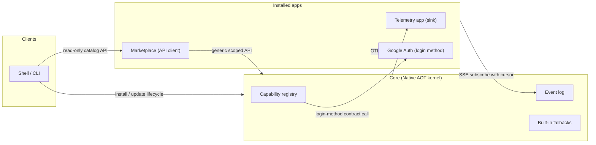
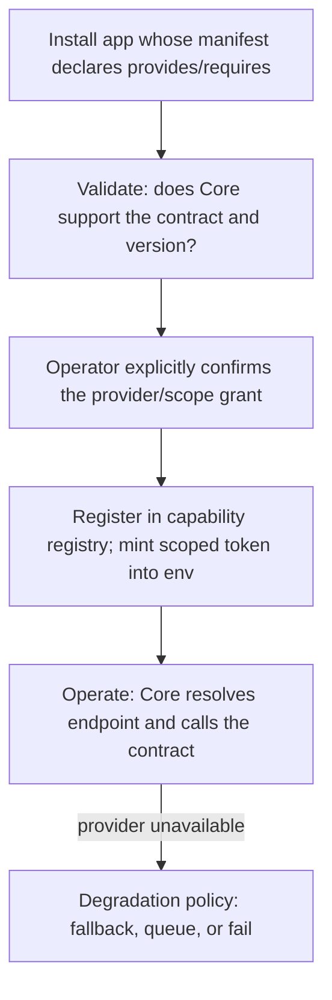
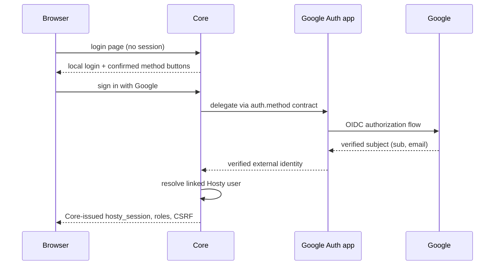

# Core Extension Model

Status: Idea
Created: 2026-07-10
Updated: 2026-07-12

## Motivation

Some platform capabilities should be replaceable, optional, or third-party-suppliable without growing the Core kernel: telemetry storage, notification delivery channels, catalog/marketplace logic, additional sign-in methods, backup targets. Today every such capability is either compiled into Core or wired to a hardcoded well-known app id.

Core is Native AOT, so classic in-process plugin loading (`AssemblyLoadContext`, MEF) is impossible by construction. That constraint points at the better architecture anyway: extensions run out-of-process, as ordinary installed apps, with fault isolation, independent update cycles, their own trust boundary, and no language coupling. The closest prior art is Home Assistant add-ons and Docker volume/network plugins (HTTP contracts against a supervisor), not VS Code extensions.

The pattern already exists in practice: the telemetry app took the telemetry store, query API, and now the observability UI out of Core and Shell, and Marketplace shipped as a read-only system app that Core knows nothing about. This document formalizes the pattern into one model instead of inventing a second delivery vehicle. The 2026-07-12 revision folds in the interaction-form taxonomy, contract cardinality, the ownership reading of "system", and the login-methods reframing of authentication.

## Current Architecture Findings

- System apps have no first-class model. They are identified by well-known ids (`CollectorBootstrap.AppId = "hosty.telemetry"`); the `app.0.1` manifest has no `role`/`system` field. The existing manifest `capabilities` field is a lifecycle-affordance list (`open`, `update`, `restart`, ...), not a grant or contract declaration.
- Marketplace already runs as a read-only system app with **zero Core scopes**, using only generic app-token endpoints (installed-apps, app-directory roster). It is live proof that a real extension can need no contract at all — just the ordinary API surface.
- Core's telemetry integration is now producer-side only: it pushes host-produced docker stats and logs into the collector endpoint resolved live from the app's `AppRecord.Endpoints` (well-known endpoint keys, literal IPv4, never `localhost`). The former read proxy was removed with the telemetry-ui extraction; per-app ingest auth is still deferred. This push relationship is a de-facto sink contract that only lacks a name, a version, and auth.
- The idiomatic in-process seam is `IAppRuntimeAdapter` (multiple registrations, string-keyed `ResolveAdapter`). Catalog document fetching is pluggable via `ICatalogDocumentFetcher`, and catalog sources are runtime-mutable.
- A notification hub exists (Core-owned store, per-user SSE stream via `NotificationBroadcaster`), but there is no generic domain event bus. Lifecycle transitions (install/start/crash) are observable only as user notifications produced inline in `CoreLifecycleService`.
- Two Core-minted token systems exist: `AppIdentityService` (HMAC-signed user-identity tokens for app SSO) and `AppServiceTokenService` (opaque per-app service token injected as `HOSTY_APP_SERVICE_TOKEN`, used for app→Core callbacks). Neither carries scopes; there is no data-plane token yet.
- Cross-app `dependencies` already wire sibling endpoint URLs into env; trusted-proxy SSO (the `X-Hosty-Trusted-User-Id` and `X-Hosty-Trusted-Proxy-Secret` headers, validated against the Core-configured `HOSTY_TRUSTED_PROXY_SECRET`, exchanged for a session) already provides an external-identity entry point.

## Extension Model

Design principle: a contract is a question Core asks — "who signed in with this method?", "where does this telemetry stream go?", "how do I deliver this notification?" — never a right for a plugin to reach into the kernel. Core always keeps the decision and the privileged execution; plugins supply answers. Contracts are small, versioned HTTP+JSON APIs (AOT-friendly with source-generated serialization; no gRPC).

The companion rule sets the default: **a contract exists only where Core itself must know and call the counterparty. Everything else is just an app using Core's API.** Marketplace demonstrated that the contract-free form goes further than expected — prefer growing small generic endpoints over minting bespoke contracts whenever the flow is app-initiated.

### Interaction Forms

| Form | Direction | Contract needed | Example |
| --- | --- | --- | --- |
| API client | app → Core | No — scopes only | Marketplace (zero scopes today) |
| Driver | Core → app, request/response | Yes | login method, notification channel, backup target |
| Sink | Core → app, data stream | Yes | telemetry OTLP push (de-facto today) |
| Event subscription | app-initiated pull from Core | One generic mechanism | automations, delivery plugins |
| System app pages | Shell renders app UI | No — existing `ui.*` manifest | Marketplace, telemetry UI |

1. **API clients (no contract).** An app consumes Core's API with whatever scopes the operator granted — possibly none. Core does not model the app's purpose at all. Marketplace is the canonical example: it serves its own catalog data and reads two generic app-token endpoints; stopping it removes discovery and nothing else.
2. **Driver contracts (Core calls the app, request/response).** The manifest declares `provides: [{ contract, version, endpoint }]`. Core keeps a capability registry mapping contract → app → endpoint; endpoints are resolved live from `AppRecord.Endpoints` at call time (literal IPv4, never `localhost`). Candidate contracts: login method, notification delivery channel, backup target. Runtime adapters stay in Core: they need docker.sock-level privileges.
3. **Sink contracts (Core pushes a stream into the app).** Same registry and manifest surface as drivers, but the shape is a continuous producer→consumer stream rather than a call: today's concrete case is Core pushing docker CPU/memory stats and logs as OTLP into the telemetry collector. Formalizing it means naming the contract (e.g. `hosty.telemetry.sink@1`), binding it to an endpoint key, and adding the deferred ingest auth. Sinks are naturally fan-out — several confirmed sinks can all receive the stream.
4. **Event subscriptions (the app pulls from Core).** Core writes domain events (`app.installed`, `app.started`, `app.crashed`, `backup.completed`, ...) into a durable log with monotonic sequence numbers. An app subscribes over SSE/long-poll using its `HOSTY_APP_SERVICE_TOKEN` and a persisted cursor, and re-reads from the cursor after reconnect — at-least-once delivery with no Core-side retry queue. Pull is preferred over webhooks because app→Core dialing already works (host gateway), the app needs no inbound endpoint, and Core→container calls would require published ports and reintroduce the `localhost`/IPv6 dial hazards.
5. **System app pages (Shell).** A UI-capable app reuses `ui.entrypoint` and `ui.navigation`; Shell renders it through the existing app-origin iframe/SSO machinery. Shipped for Marketplace and — since 2026-07-12 — the telemetry app (its Metrics / Structured logs / Traces pages moved out of Shell into an `apps/telemetry-ui` system-app UI that reads its own backend directly; Core's telemetry read proxy was removed, and the UI labels appId-keyed data via a generic app-token roster endpoint rather than a telemetry-specific contract — see [observability](../features/observability/feature.md)).

### Provider Lifecycle

Cross-cutting rules:

- **Manifest.** Two symmetric sections when needed: `provides` (contracts the app implements) and `requires` (control-plane scopes the app requests). An app that only serves its own read-only API declares neither. Naming must avoid the existing lifecycle `capabilities` field.
- **Trust.** `provides`/`requires` declarations are inert until the operator explicitly confirms them at install review, and an update that **changes** these declarations re-enters review — a harmless app must not grow into a login method through a minor version bump. Catalog signing (marketplace WS5) can strengthen this later. Consent dialogs for sensitive contracts must be alarming by design: a media app requesting the login-method role should look anomalous.
- **Cardinality.** Every contract explicitly declares whether it is **single-active** (one confirmed provider is selected by the operator, like a default app) or **fan-out** (all confirmed providers are called, or all receive the stream). Login methods, notification channels, and telemetry sinks are fan-out; single-active is reserved for genuine replacements. Leaving cardinality implicit is not allowed — introducing a second provider would otherwise create unresolvable ambiguity.
- **Auth.** One scoped-token mint covers both directions: Core→app contract calls present a Core-issued token the app can verify, and app→Core control-plane/event-stream calls present the app's service token extended with granted scopes. This generalizes the deferred observability ingest auth and matches the AI-agent-bridge decision that data planes use Core-issued signed tokens.
- **Versioning.** Contract identifiers carry an integer version (`hosty.auth.method@1`). Core advertises supported contracts (e.g. `GET /api/capabilities`); installing an app that provides an unsupported contract version fails manifest validation.
- **Degradation.** Each contract declares what Core does when the provider is stopped or unhealthy (the registry consults the existing health supervisor): fall back to a built-in implementation (telemetry → "no data"), queue and retry (notification delivery), or shrink the option set (an unavailable login method's button disappears while local login remains). Because Core is never displaced from its own responsibilities, no contract needs a break-glass mechanism.

## Roles, Trust, And The "System" Label

The label "system" conflates two independent axes, and this model deliberately splits them:

- **Privilege is not a sort of app.** Any installed app may declare `provides`/`requires`; the right to act on them comes from per-declaration operator consent (plus, later, signing) — never from being "system". A small domain app living in the Google ecosystem is a perfectly legitimate login-method provider.
- **Ownership remains a real property.** Some apps are bundled with the platform, bootstrapped and supervised by Core (Shell, telemetry, Marketplace). That is a distribution/ownership fact — who installs, updates, and repairs the app — not a trust tier.

Consequences for the operator surface:

- **One app list, badges instead of a separate class.** All apps appear in the same Installed Apps list. Badges derive from **confirmed registry facts** — ownership (platform-bundled), confirmed roles (login method, telemetry sink), and role state (active vs merely registered) — never from manifest self-description.
- **Uniform lifecycle actions, consequence-aware warnings.** Every app gets the same stop/restart/update/uninstall verbs. Warnings are generated only from Core's own bookkeeping: stopping an app that holds a confirmed contract role names that role. An app with no roles and no scopes gets zero ceremony — stopping Marketplace simply removes its pages, which the user sees immediately because Shell reflects app state changes in navigation right away. A manifest field for "message to show when I am stopped" is explicitly rejected: self-description is both untrustworthy and unnecessary.
- **Shell is a smaller exception than it looks.** Stopping the UI you are currently using is recoverable through three mechanisms that already exist or are already designed: the loaded browser page talks to Core directly and survives a Shell stop (the same continuity that system-app self-update relies on), the CLI can start it back (`hosty apps start hosty.shell`), and Core bootstrap reinstalls a missing bundled app at startup. A deliberately scary confirmation is therefore enough; a hard "mandatory app" block would contradict both the warn-don't-block precedent and the architecture rule that Shell is only one of several possible UI clients.

## Worked Example: Marketplace As A System App

*This extraction has shipped (2026-07-11); the boundaries below are current behavior plus the remaining migration steps tracked in the linked documents.*

Marketplace is a read-only service extension plus an administrator system-app page. It owns catalog sources, fetching, federation, diagnostics, and catalog display data. It requests no registry, proposal, install, or update scope from Core.

The flow is: Shell/CLI reads catalog information from Marketplace → a catalog entry supplies `feedsUrl` for the runtime app's repository-owned `feeds.json` → Shell/CLI passes that untrusted URL to Core → Core fetches and validates the feeds document and selected manifest → Core presents and applies the reviewed install plan. Marketplace never resolves a feed or calls a Core lifecycle endpoint.

Hard boundaries:

- **The install decision never leaves Core.** Feed resolution, manifest validation, operator consent, artifact locks, and any install-blocking trust policy run in Core. Marketplace output is treated like an operator-pasted URL.
- **Bootstrap.** The marketplace app itself must install without a marketplace — from a bundled/default system-app bootstrap descriptor — and the base install paths (CLI, direct manifest URL) remain in Core permanently, consistent with the marketplace MVP decision that the catalog is optional and non-intrusive. The final mechanism should be generic rather than another app-id-specific bootstrap branch.
- **Feed ownership.** `feeds.json` lives in the runtime app repository. Its named feeds are the app's update channels. Core stores `FeedsUrl`, `FollowedFeedId`, and resolved `ManifestUrl` independently of catalog provenance, so a stopped Marketplace disables discovery but not installed-app updates.
- **UI ownership.** Marketplace declares ordinary system-app UI pages. Shell provides the frame and admin-only navigation but contains no Marketplace implementation.

The detailed boundaries are tracked in [Marketplace As A System App](marketplace-system-app.md), [Runtime App Repository Feeds](runtime-app-repository-feeds.md), and [System App Pages](system-app-pages.md).

## Worked Example: Additional Login Methods

The first draft of this document asked "can a plugin replace authentication?". The revised answer is: it should not. **Core remains the sole authorization authority** — users, roles, sessions (`hosty_session`), CSRF, and request authorization are kernel-owned, and no external provider displaces them. What apps add are authentication *methods*: extra ways to prove you are an existing Hosty user.

The contract is `hosty.auth.method@1`, a fan-out driver contract. The canonical example is a small "Google Auth" app with no other product function:

- **Linking.** A signed-in user connects a Google account to their existing Hosty user. The method app runs the OIDC flow against Google and returns a verified external subject to Core; Core stores the identity link. Linking requires an existing session, so there is no automatic user provisioning by default — which keeps the [Auth provider extensions](auth-provider-extensions.md) boundaries intact.
- **Sign-in.** The login surface shows a button per *available* confirmed method. Choosing one delegates verification to the method app; the app returns the verified subject; Core resolves the linked user and issues its own session. A method app never issues credentials.
- **Degradation is trivial.** Methods supplement local password login rather than replacing it, so an unavailable method just loses its button. The break-glass problem that a full replacement provider would create does not exist here.

Two adjacent capabilities are related but deliberately separate:

- **Identity claims for apps (cheap, near-term).** Apps that only need to know "this is the user linked to Google account X" get it through the existing app-SSO token: the identity link enriches the claims Core already mints. No new contract.
- **Identity token broker (heavy, deferred).** Handing an app a real Google access/refresh token so it can call Google APIs on the user's behalf is a different trust surface entirely: storing third-party refresh tokens, per-app consent on specific provider scopes, rotation, and revocation. It anchors on the same identity link and will likely become a second, linked contract — but it must not weigh down the simple login-methods story and is out of scope here.

A perimeter alternative also remains available with no new contract: an authenticating-proxy system app (the oauth2-proxy pattern) fronting Shell and presenting the existing trusted-proxy assertion (the `X-Hosty-Trusted-User-Id` and `X-Hosty-Trusted-Proxy-Secret` headers) to mint a Core session. It suits whole-perimeter SSO; login methods suit per-user, per-account linking.

## Limits Of The Model

An honest boundary statement: this approach does not allow adding functionality Core never anticipated. A plugin can only extend seams Core explicitly cut, and each new *category* of extension is a Core release that adds a contract. Three things soften this:

- The generic seams — API clients with scopes, event subscriptions, and system app pages — cover many scenarios without any new contract, and Marketplace proves the ceiling is high.
- Adding a contract is a small, ordinary Core release, not a redesign; the registry, token, and validation machinery are shared.
- Some functionality must never be pluggable, by design rather than by limitation: anything touching docker.sock or host privileges, the app lifecycle state machine, session/authorization integrity, and manifest validation. In-process extensibility (WASM/scripting hosts) is rejected for v1 as a second runtime inside the kernel with no current demand.

## Conflicts With Existing Features

- [Shell access and system apps](../features/shell-access-and-system-apps/feature.md) treats system apps as a separate visibility/administration class; this idea moves toward one Installed Apps list with ownership/role badges and uniform lifecycle actions, while keeping visibility itself role-gated as today.
- [Notifications](../features/notifications.md) deferred Core→app delivery to webhooks; this idea revises that direction to pull-based event subscriptions.
- The manifest `capabilities` field name collides conceptually with capability contracts; the new sections need distinct names (`provides`/`requires`) and documentation.
- [Auth provider extensions](auth-provider-extensions.md) lists OIDC and provisioning directions; the login-methods contract supplies a delivery mechanism for the OIDC half while keeping its boundaries (provider-managed roles read-only, no pre-provisioning, external identities attach on authentication). Full replacement of Core authentication by an external provider is explicitly not pursued.

## Risks

- **Contract sprawl / premature abstraction.** Mitigation: formalize the existing telemetry push as the first contract before designing new ones; one pilot per interaction form.
- **Privilege escalation through declarations.** Mitigation: explicit operator consent per declaration, re-consent when an update changes declarations, minimal scope grants, audit-log entries for every scoped call, catalog signing later, and consent UX that makes anomalous requests look anomalous.
- **Availability coupling.** Core paths that call providers inherit their failure modes, and provider roles can be held by casually-stopped domain apps. Mitigation: mandatory per-contract degradation policy, short timeouts, health-supervisor gating, and stop/uninstall warnings derived from confirmed registry roles.
- **Hot-path latency.** Out-of-process calls must stay off per-request paths; request authorization always evaluates against Core-owned sessions, never a plugin round-trip. Method apps are consulted only during interactive sign-in and linking.
- **Event log growth.** The durable log needs bounded retention and a compaction story before the first external subscriber.
- **Silent best-effort failures.** Swallow-everything client behavior has already produced invisible outages (empty marketplace, empty observability); registry calls need structured error surfacing and admin notifications instead.

## Open Questions

- Question: How is the ownership label expressed — `role: system`, an explicit `owner: platform` marker, or purely Core-side bootstrap state?
  - Recommendation: since the label now means ownership rather than privilege, prefer Core-side state (Core knows what it bootstrapped) surfaced as a badge, with a manifest field only if third-party "suites" later need it.
- Question: Where are `requires` scopes enforced — at token mint, per request, or both?
  - Recommendation: both; mint restricts the ceiling, per-request checks catch stale grants after an update changes declarations.
- Question: How is the event log persisted (in-memory ring vs SQLite in Core) and how are event schemas versioned?
  - Recommendation: start with a bounded persistent log inside Core state; version events with the contract-style integer suffix.
- Question: Where do login-method buttons render, given the login surface is Core-owned today?
  - Recommendation: the method list must come from Core's confirmed registry (never from app self-description), with unavailable methods hidden; the exact split between Core-served login pages and Shell rendering needs a design pass together with the linking UX in user settings.
- Question: Which contract ships first?
  - Recommendation: formalize the telemetry sink (`hosty.telemetry.sink@1`) — it names an integration that already runs in production, proves registry/token/degradation with zero new product surface, and closes the deferred ingest-auth item.
- Question: What is the token-broker consent and storage model?
  - Deferred with the broker itself; revisit once login methods exist and a concrete app needs provider-API access.

## Current Recommendation

Sequence the work so each step is independently useful:

1. Surface ownership and roles in the UI: one Installed Apps list, badges from Core-confirmed facts, uniform lifecycle actions with registry-derived warnings, immediate navigation updates on app state changes.
2. Formalize the telemetry push as the first sink contract (`hosty.telemetry.sink@1`) with scoped data-plane tokens — no behavior change, mechanism proven, ingest auth closed.
3. Introduce the domain event log and pull subscriptions; ship a notification-channel plugin (e.g. Telegram delivery) as the first external consumer.
4. Marketplace extraction — shipped 2026-07-11 as the first zero-scope API client with system-app pages; finish the remaining feeds/migration steps tracked in [Marketplace As A System App](marketplace-system-app.md).
5. Design `hosty.auth.method@1` (link-first login methods) after the mechanism has survived steps 2–3; keep the identity token broker explicitly deferred; the authenticating-proxy pattern remains available meanwhile for perimeter SSO.

## Links

- [Final Hosty architecture boundaries](../features/final-hosty-architecture.md) — the Core/Shell/CLI ownership rules this model extends.
- [Observability — telemetry backend](../features/observability/feature.md) — the de-facto first plugin; source of the sink contract.
- [Notifications](../features/notifications.md) — the hub the first event-subscriber plugin would deliver for.
- [Runtime app marketplace](../features/runtime-app-marketplace/feature.md) — the storefront history; its Shell-embedded implementation was since extracted into the Marketplace system app.
- [Marketplace As A System App](marketplace-system-app.md) — the read-only catalog ownership boundary and migration design.
- [System App Pages](system-app-pages.md) — the shared admin-only page model for UI-capable system apps.
- [Runtime App Repository Feeds](runtime-app-repository-feeds.md) — current feed behavior with repository ownership and Core resolution.
- [AI Agent Bridge](../features/ai-agent-bridge/feature.md) — shares the Core-issued scoped-token direction for data planes.
- [Auth provider extensions](auth-provider-extensions.md) — auth directions the login-methods contract gives a delivery mechanism for.
- [On-Demand System App Updates](system-app-updates.md) — the reviewed update path provider apps rely on, since they update like any other app.

## Notes

This document is exploratory. It does not authorize implementation and does not change current system-app behavior.
