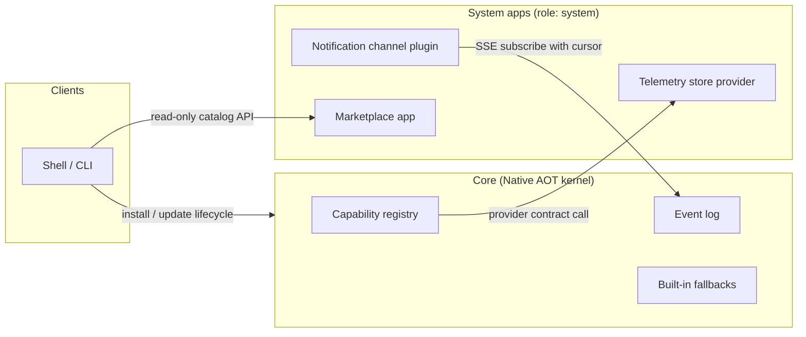
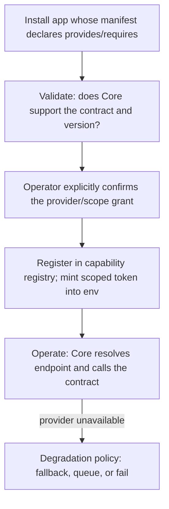
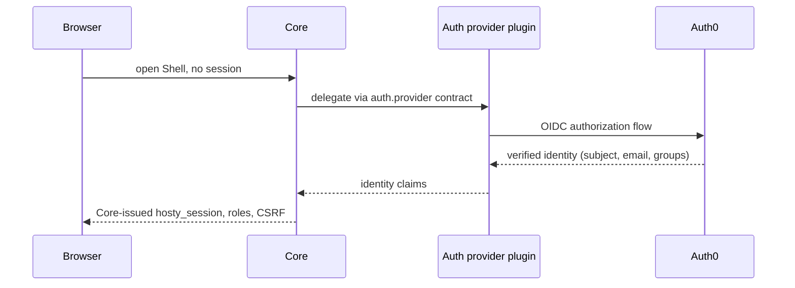

# Core Extension Model

Status: Idea
Created: 2026-07-10
Updated: 2026-07-10

## Motivation

Some platform capabilities should be replaceable, optional, or third-party-suppliable without growing the Core kernel: telemetry storage, notification delivery channels, catalog/marketplace logic, external authentication providers, backup targets. Today every such capability is either compiled into Core or wired to a hardcoded well-known app id.

Core is Native AOT, so classic in-process plugin loading (`AssemblyLoadContext`, MEF) is impossible by construction. That constraint points at the better architecture anyway: extensions run out-of-process, as ordinary installed apps, with fault isolation, independent update cycles, their own trust boundary, and no language coupling. The closest prior art is Home Assistant add-ons and Docker volume/network plugins (HTTP contracts against a supervisor), not VS Code extensions.

The pattern already exists informally: the telemetry app is a de-facto plugin that took the telemetry store and query API out of Core. This idea formalizes that pattern into a first-class model — "system apps are the plugin mechanism" — instead of inventing a second delivery vehicle.

## Current Architecture Findings

- System apps have no first-class model. They are identified by well-known ids (`CollectorBootstrap.AppId = "hosty.telemetry"`); the `app.0.1` manifest has no `role`/`system` field. The existing manifest `capabilities` field is a lifecycle-affordance list (`open`, `update`, `restart`, ...), not a grant or contract declaration.
- Core already resolves the telemetry backend live from the installed app's endpoints (`ResolveBackendQueryUrlAsync` reads the `query` endpoint key from `AppRecord.Endpoints`). `TelemetryBackendClient` is a plain best-effort HTTP client with no authentication; per-app ingest auth is explicitly deferred.
- The idiomatic in-process seam is `IAppRuntimeAdapter` (multiple registrations, string-keyed `ResolveAdapter`). Catalog document fetching is pluggable via `ICatalogDocumentFetcher`, and catalog sources are already runtime-mutable.
- A notification hub exists (Core-owned store, per-user SSE stream via `NotificationBroadcaster`), but there is no generic domain event bus. Lifecycle transitions (install/start/crash) are observable only as user notifications produced inline in `CoreLifecycleService`.
- Two Core-minted token systems exist: `AppIdentityService` (HMAC-signed user-identity tokens for app SSO) and `AppServiceTokenService` (opaque per-app service token injected as `HOSTY_APP_SERVICE_TOKEN`, used for app→Core callbacks). Neither carries scopes; there is no data-plane token yet.
- Cross-app `dependencies` already wire sibling endpoint URLs into env; trusted-proxy SSO (the `X-Hosty-Trusted-User-Id` and `X-Hosty-Trusted-Proxy-Secret` headers, validated against the Core-configured `HOSTY_TRUSTED_PROXY_SECRET`, exchanged for a session) already provides an external-identity entry point.

## Extension Model

Design principle: a contract is a question Core asks — "who is this user?", "where do I store telemetry?", "how do I deliver this notification?" — never a right for a plugin to reach into the kernel. Core always keeps the decision and the privileged execution; plugins supply answers. Contracts are small, versioned HTTP+JSON APIs (AOT-friendly with source-generated serialization; no gRPC).

Plugins are ordinary installed apps whose manifest declares `role: system`. Everything else about installation, lifecycle, updates, backups, and observability stays the standard runtime-app machinery, including the reviewed update flow described in [On-Demand System App Updates](system-app-updates.md).

### Four Extension Forms

1. **Provider contracts (Core calls the plugin).** The manifest declares `provides: [{ contract, version, endpoint }]`, e.g. `hosty.telemetry.store@1` bound to the app's `query` endpoint key. Core keeps a capability registry mapping contract → app → endpoint; endpoints are resolved live from `AppRecord.Endpoints` at call time (literal IPv4, never `localhost`). Candidate contracts: telemetry store (retrofit of the existing integration), notification delivery channel, backup target, and auth provider. Runtime adapters stay in Core: they need docker.sock-level privileges.
2. **Event subscriptions (the plugin pulls from Core).** Core writes domain events (`app.installed`, `app.started`, `app.crashed`, `backup.completed`, ...) into a durable log with monotonic sequence numbers. A plugin subscribes over SSE/long-poll using its `HOSTY_APP_SERVICE_TOKEN` and a persisted cursor, and re-reads from the cursor after reconnect — at-least-once delivery with no Core-side retry queue. Pull is preferred over webhooks because plugin→Core dialing already works (host gateway), the plugin needs no inbound endpoint, and Core→container calls would require published ports and reintroduce the `localhost`/IPv6 dial hazards.
3. **Service extensions (clients call the plugin).** A plugin exposes its own versioned API surface for Shell/CLI, either directly or through a bounded Core proxy route `/api/ext/{appId}/...`. A read-only service such as Marketplace needs no Core scope merely to serve its own data.
4. **System app pages (Shell).** A UI-capable system app reuses `ui.entrypoint` and `ui.navigation`; Shell renders it through the existing app-origin iframe/SSO machinery in a separate administrator-only System group. Native Shell contribution slots are a different future mechanism and are unnecessary for ordinary system app pages. *Shipped for both Marketplace and — since 2026-07-12 — the Telemetry app (its Metrics / Structured logs / Traces pages moved out of Shell into an `apps/telemetry-ui` system-app UI that reads its own backend directly; Core's telemetry read proxy was removed, and the UI labels appId-keyed data via a generic app-token roster endpoint rather than a telemetry-specific contract — see [observability-phase-2-backend.md](../features/observability-phase-2-backend.md)).*

### Provider Lifecycle

Cross-cutting rules:

- **Manifest.** `role: system` plus two symmetric sections when needed: `provides` (contracts the app implements) and `requires` (control-plane scopes the app requests). A system app that only serves its own read-only API may declare an interface without requesting any Core scope. Naming must avoid the existing lifecycle `capabilities` field.
- **Trust.** `provides`/`requires` declarations are inert until the operator explicitly confirms them at install/update review; later, catalog signing (marketplace WS5) can strengthen this. A random catalog app must not be able to nominate itself as an auth provider silently.
- **Auth.** One scoped-token mint covers both directions: Core→plugin contract calls present a Core-issued token the plugin can verify, and plugin→Core control-plane/event-stream calls present the app's service token extended with granted scopes. This generalizes the deferred observability ingest auth and matches the AI-agent-bridge decision that data planes use Core-issued signed tokens.
- **Versioning.** Contract identifiers carry an integer version (`hosty.auth.provider@1`). Core advertises supported contracts (e.g. `GET /api/capabilities`); installing an app that provides an unsupported contract version fails manifest validation.
- **Degradation.** Each contract declares what Core does when the provider is stopped or unhealthy (the registry consults the existing health supervisor): fall back to a built-in implementation (telemetry → "no data"), queue and retry (notification delivery), or refuse with a clear error (auth provider, with break-glass local login preserved).

## Worked Example: Marketplace As A System App

Marketplace is a read-only service extension plus an administrator system-app page. It owns catalog sources, fetching, federation, diagnostics, and catalog display data. It requests no registry, proposal, install, or update scope from Core.

The flow is: Shell/CLI reads catalog information from Marketplace → a catalog entry supplies `feedsUrl` for the runtime app's repository-owned `feeds.json` → Shell/CLI passes that untrusted URL to Core → Core fetches and validates the feeds document and selected manifest → Core presents and applies the reviewed install plan. Marketplace never resolves a feed or calls a Core lifecycle endpoint.

Hard boundaries:

- **The install decision never leaves Core.** Feed resolution, manifest validation, operator consent, artifact locks, and any install-blocking trust policy run in Core. Marketplace output is treated like an operator-pasted URL.
- **Bootstrap.** The marketplace app itself must install without a marketplace — from a bundled/default system-app bootstrap descriptor — and the base install paths (CLI, direct manifest URL) remain in Core permanently, consistent with the marketplace MVP decision that the catalog is optional and non-intrusive. The final mechanism should be generic rather than another app-id-specific bootstrap branch.
- **Feed ownership.** `feeds.json` lives in the runtime app repository. Its named feeds are the app's update channels. Core stores `FeedsUrl`, `FollowedFeedId`, and resolved `ManifestUrl` independently of catalog provenance, so a stopped Marketplace disables discovery but not installed-app updates.
- **UI ownership.** Marketplace declares ordinary system-app UI pages. Shell provides the frame and admin-only navigation but contains no Marketplace implementation.

Migration can be staged without granting Marketplace access to Core: first move catalog schemas, sources, fetching, federation, and the read-only API into the app while existing Shell/CLI clients use compatibility `GET` proxies; then move the storefront into generic system-app pages; finally move the current feeds unchanged into runtime-app-owned `feeds.json` and move resolution into Core. The detailed boundaries are tracked in [Marketplace As A System App](marketplace-system-app.md), [Runtime App Repository Feeds](runtime-app-repository-feeds.md), and [System App Pages](system-app-pages.md).

## Worked Example: External Auth Provider (Auth0)

This example probes the model's main limitation: authentication is deeply built into Core, so can a plugin replace it?

Two paths, in increasing order of integration:

1. **Available near-term with no new contract:** an authenticating-proxy system app (the oauth2-proxy pattern). It fronts Shell as ingress, drives the OIDC flow against Auth0, and on success presents the existing trusted-proxy assertion (the `X-Hosty-Trusted-User-Id` and `X-Hosty-Trusted-Proxy-Secret` headers) to mint a Core session. Core never learns about Auth0. Limits: sign-in only — no user provisioning, role mapping, or coordinated logout.
2. **The proper long-term seam:** a `hosty.auth.provider@1` contract. Core delegates only the question "who is this?": the plugin initiates the OIDC flow, handles the callback, and returns a verified external identity (subject, email, groups). Core then makes every decision that must not be delegated: user provisioning/mapping, role assignment, session issuance (`hosty_session`), CSRF, and request authorization. The degradation policy is "fail closed, keep break-glass local login for administrators". The same contract covers Keycloak, Authentik, or Google; Auth0 is just the first implementation.

The split answers the general question: a plugin can replace the *identity* half of auth because Core exposes that seam, but sessions and authorization stay kernel-owned because a crashed or compromised auth plugin must not be able to issue credentials.

## Limits Of The Model

An honest boundary statement: this approach does not allow adding functionality Core never anticipated. A plugin can only extend seams Core explicitly cut, and each new *category* of extension is a Core release that adds a contract. Three things soften this:

- The generic seams — event subscriptions, `/api/ext` service extensions, and `requires` scopes over the existing control-plane API — cover many scenarios without any new contract.
- Adding a contract is a small, ordinary Core release, not a redesign; the registry, token, and validation machinery are shared.
- Some functionality must never be pluggable, by design rather than by limitation: anything touching docker.sock or host privileges, the app lifecycle state machine, session/authorization integrity, and manifest validation. In-process extensibility (WASM/scripting hosts) is rejected for v1 as a second runtime inside the kernel with no current demand.

## Conflicts With Existing Features

- [Shell access and system apps](../features/shell-access-and-system-apps.md) treats system apps as a visibility/administration concern; this idea gives `system` a functional meaning (extension surface) and requires a manifest field instead of well-known ids in `CollectorBootstrap`/bootstrap code.
- [Notifications](../features/notifications.md) deferred Core→app delivery to webhooks; this idea revises that direction to pull-based event subscriptions.
- [Runtime app marketplace](../features/runtime-app-marketplace.md) ships the catalog page inside Shell; the worked example above would eventually extract it into a marketplace app.
- The manifest `capabilities` field name collides conceptually with capability contracts; the new sections need distinct names (`provides`/`requires`) and documentation.
- [Auth provider extensions](auth-provider-extensions.md) lists OIDC/provisioning directions; this idea supplies the delivery mechanism (contract + plugin) for them and keeps its boundaries (provider-managed roles read-only, no pre-provisioning).

## Risks

- **Contract sprawl / premature abstraction.** Mitigation: retrofit the existing telemetry integration as the first contract before designing new ones; one pilot per extension form.
- **Privilege escalation through scopes.** A plugin holding `apps.install` is powerful. Mitigation: explicit operator consent per scope, minimal scope grants, audit-log entries for every scoped call, catalog signing later.
- **Availability coupling.** Core paths that call providers inherit their failure modes. Mitigation: mandatory per-contract degradation policy, short timeouts, health-supervisor gating; auth keeps break-glass local login.
- **Hot-path latency.** Out-of-process calls must stay off per-request paths; e.g. request authorization always evaluates against Core-owned sessions, never a plugin round-trip.
- **Event log growth.** The durable log needs bounded retention and a compaction story before the first external subscriber.
- **Silent best-effort failures.** The telemetry client's swallow-everything behavior has already produced invisible outages (empty marketplace, empty observability); registry calls need structured error surfacing and admin notifications instead.

## Open Questions

- Question: What is the manifest field name — `role: system`, `kind: system`, or a boolean?
  - Recommendation: a `role` enum, leaving room for future roles, and disambiguated docs against the lifecycle `capabilities` list.
- Question: Where are `requires` scopes enforced — at token mint, per request, or both?
  - Recommendation: both; mint restricts the ceiling, per-request checks catch stale grants after an update changes declarations.
- Question: How is the event log persisted (in-memory ring vs SQLite in Core) and how are event schemas versioned?
  - Recommendation: start with a bounded persistent log inside Core state; version events with the contract-style integer suffix.
- Question: iframe vs module federation for UI contributions, and how does the embedded page get theme + auth context?
  - Recommendation: iframe with the existing app-SSO token exchange; revisit only if real friction appears.
- Question: Which contract ships first — telemetry retrofit or notification channel?
  - Recommendation: telemetry retrofit; it proves registry/token/degradation on live code with zero new product surface, and closes the deferred ingest-auth item.

## Current Recommendation

Sequence the work so each step is independently useful:

1. Add `role: system` to the manifest and replace well-known-id checks in bootstrap and Shell; surface the role in the UI.
2. Retrofit the telemetry backend integration as the first provider contract (`hosty.telemetry.store@1`) with scoped tokens on both data planes — no behavior change, mechanism proven, ingest auth closed.
3. Introduce the domain event log and pull subscriptions; ship a notification-channel plugin (e.g. Telegram delivery) as the first external consumer.
4. Extract Marketplace as the first read-only service extension with administrator system-app pages and no Core scopes; keep all feed resolution and lifecycle in Core.
5. Design `hosty.auth.provider@1` after the mechanism has survived steps 2–4; ship the authenticating-proxy pattern in the meantime for users who need external IdPs now.

## Links

- [Final Hosty architecture boundaries](../features/final-hosty-architecture.md) — the Core/Shell/CLI ownership rules this model extends.
- [Observability Phase 2 — telemetry backend](../features/observability-phase-2-backend.md) — the de-facto first plugin; source of the retrofit contract.
- [Notifications](../features/notifications.md) — the hub the first event-subscriber plugin would deliver for.
- [Runtime app marketplace](../features/runtime-app-marketplace.md) — the Shell-embedded MVP the marketplace example would extract.
- [Marketplace As A System App](marketplace-system-app.md) — the read-only catalog ownership boundary and migration design.
- [System App Pages](system-app-pages.md) — the shared admin-only page model for UI-capable system apps.
- [Runtime App Repository Feeds](runtime-app-repository-feeds.md) — current feed behavior with repository ownership and Core resolution.
- [AI Agent Bridge](../features/ai-agent-bridge.md) — shares the Core-issued scoped-token direction for data planes.
- [Auth provider extensions](auth-provider-extensions.md) — auth directions this idea gives a delivery mechanism for.
- [On-Demand System App Updates](system-app-updates.md) — the reviewed update path plugins rely on, since plugins update like any system app.

## Notes

This document is exploratory. It does not authorize implementation and does not change current system-app behavior.
