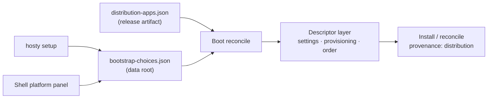

# Generic Bootstrap (distribution list + operator intent)

Status: Idea
Created: 2026-07-12
Updated: 2026-07-12

## Motivation

Core and the CLI still know every first-party app by name. Each bootstrapped app is a set of dedicated launch settings (`HOSTY_SHELL_MANIFEST_PATH`, `HOSTY_COLLECTOR_MANIFEST_PATH`, `HOSTY_MARKETPLACE_MANIFEST_PATH`, plus runtime/autostart/enabled flags), a field group on `HostyCoreRuntimeConfig`, and a static descriptor class in Core. Adding the next first-party app means touching the CLI's setting definitions, the CLI→Core environment handoff, Core's config parsing, and the descriptor list — four code sites for what is really one row of data.

Worse, the persisted value is a **location** (a manifest path/URL), and we have already been bitten by that: when the telemetry app was renamed, the persisted `HOSTY_COLLECTOR_MANIFEST_PATH` kept pointing at the old URL; bootstrap is deliberately non-fatal, so the 404 degraded to a single log warning and the host quietly kept running the stale app. Persisted locations go stale; releases move things.

Finally, there is no setup choice. Everything the build knows about is installed (or gated behind ad-hoc flags like `HOSTY_OBSERVABILITY_ENABLED`). What operators actually want is: Core always; then *pick* the optional extensions — telemetry if you need observability, marketplace if you want a storefront — at install time from the CLI, or later from Shell.

This document records the design agreed on 2026-07-12. It complements [core-extension-model.md](core-extension-model.md) ("system" is ownership, not privilege) and [core-dev-target.md](core-dev-target.md) (the Shell platform panel this feature extends).

## Prior work — already shipped, do not re-plan

An earlier proposal ("system-apps.0.1") bundled this bootstrap change with a large cleanup: remove Core's `CatalogService`/endpoints/DTOs, remove `hosty catalog`, remove Shell's hardcoded `/marketplace`, drop the catalog source store and federation. **All of that already shipped** in the marketplace system-app pivot (commit `e8939c7c`, PR #154): catalog discovery lives in the `hosty.marketplace` app, and Core kept only the *generic* `app-feeds.0.1` lifecycle (`AppFeedService`, digest-bound install/update plans) plus the `catalogMetadata` display passthrough. Those two survivors are lifecycle/display contracts, not catalog remnants — they stay. The only actionable part of that proposal is the generic bootstrap file, redesigned here.

## Current Architecture Findings

- The bootstrap *mechanism* is already generic: `SystemAppBootstrapDescriptor` (`apps/core/src/Haas.Hosty.Core/SystemAppBootstrap.cs`) carries app id, enabled, manifest path, runtime, autostart, a settings map, a source override, and an optional provisioning hook. Only the *data* is hardcoded: `SystemAppBootstraps.FromConfig` returns a fixed Shell/collector/Marketplace list.
- Per-app knowledge is duplicated in the CLI: `LaunchSettingDefinitions.cs:13-18` defines the per-app env keys, and `BuildCoreEnvironment` (`Commands/CoreCommand.cs`) injects them into Core. `HostyCoreRuntimeConfig.FromEnvironment` (`HostyCoreApplication.cs:722-760`) reads them back.
- The Marketplace descriptor is already shaped right: enabled purely by manifest-path presence, no Core-owned runtime or autostart policy, installed defaults preserved on reconcile. This is the template for every entry.
- Two descriptors carry genuinely app-specific behavior that a plain list cannot express:
  - **Shell** gets Core-owned settings re-applied every boot (`HOSTY_PORT_HTTP` from Core's shell port, `HOSTNAME` from the public origin) plus a dev source-override path.
  - **The collector** (`CollectorBootstrap.cs`) has Core-owned provisioning: an embedded `config.yaml` template written into the app-data dir and mounted over the image's config directory, sink subdirs (`otlp-logs/`, `otlp-traces/`, `store/`), and `StartPriority = 100` so its OTLP endpoint resolves before consuming apps start. It is gated behind `HOSTY_OBSERVABILITY_ENABLED` (default off).
- Bundled manifest defaults already resolve relative to the running binary (`ResolveDefaultShellManifestPath`, `ResolveDefaultCollectorManifestPath`) — the "ship data inside the release artifact and find it next to the binary" pattern exists.
- Since the pivot, installs can be **feed-bound**: `AppFeedService` resolves a followed feed digest-bound, `AppRecord` stores `FeedsUrl` + `FollowedFeedId`, and update planning re-resolves the followed feed. Direct installs coerce feed state to null. Bootstrap installs currently take the direct path, so bootstrapped apps have no update affordance through feeds.
- The CLI already has one **ambient-env-only knob** precedent (`HOSTY_COLLECTOR_BOOTSTRAP_RUNTIME` is deliberately not a launch setting) — the pattern this design uses for its override variable.

## Decisions

1. **Two layers, not one file: persist intent, not location.** A release-owned **distribution list** (what this build can preinstall, with defaults) ships *inside the release artifact*; an operator-owned **choices file** (which entries are enabled, nothing else durable) lives in the data root. Manifest locations are resolved from the distribution list at every boot, so a release update moves all refs atomically and nothing persisted can go stale.
2. **Provenance instead of `role: system`.** Bootstrap does not stamp roles. Core records *how the app was installed* — an install-origin annotation (`distribution`) on the app record. Shell's grouping keys off provenance. The schema name avoids the word "system" (the class is dissolving per the extension model): `distribution-apps.0.1`.
3. **The file feeds the descriptor layer, it does not replace it.** `SystemAppBootstraps` keeps producing descriptors; the list becomes their data source. The Shell settings map, the collector's provisioning hook, and start ordering survive unchanged — de-specializing them into capability-based hooks is Phase 4, not a free side effect.
4. **Bootstrap installs go through the digest-bound feed path when the entry has a feed.** Entries may carry a `feedsUrl`; when present, install resolves through `AppFeedService` and the app gets the standard update affordance. Entries without a feed (bundled manifests) install directly, as today.
5. **Setup UX on both surfaces.** `hosty setup` (interactive multi-select + non-interactive `--with`/`--without` flags) for terminal and scripted installs; an Extensions section in the Shell platform panel (the sidebar panel designed in [core-dev-target.md](core-dev-target.md)) for later changes, gated on `host.admin`.
6. **The override env var is ambient-only and never persisted.** By default Core resolves the distribution list next to its own binary (same pattern as bundled manifests). `HOSTY_DISTRIBUTION_APPS_PATH` exists for dev trees, tests, and custom distribution builds — it is not a launch setting, mirroring the `HOSTY_COLLECTOR_BOOTSTRAP_RUNTIME` precedent and the one-shot `--project` philosophy from the core dev-target design.

**Terminology.** This is a *distribution list*, not a catalog. "Catalog" stays reserved for the marketplace's storefront (`marketplace.0.2` + per-app `feeds.json`): remote, display-rich, unbounded, read by the marketplace app. The distribution list is boot config: bundled, minimal, a handful of entries, read by Core. They meet only at the data level — both point at the same app manifests and feeds, so the same app can be a preinstall choice *and* a storefront entry, updated through the same feed path.



## Design

### distribution-apps.0.1 (release-owned)

Bundled in the release artifact next to the Core binary (dev target: resolved from the source tree). Example:

```json
{
  "schemaVersion": "distribution-apps.0.1",
  "apps": [
    {
      "id": "hosty.shell",
      "title": "Hosty Shell",
      "description": "Web UI client for this host.",
      "manifestRef": "apps/shell/manifest.json",
      "defaultEnabled": true
    },
    {
      "id": "hosty.telemetry",
      "title": "Telemetry",
      "description": "OpenTelemetry collector and observability backend.",
      "manifestRef": "apps/telemetry/manifest.json",
      "defaultEnabled": false
    },
    {
      "id": "hosty.marketplace",
      "title": "Marketplace",
      "description": "App discovery storefront.",
      "manifestRef": "https://raw.githubusercontent.com/alex-de-haas/docker-host/main/apps/marketplace/manifest.json",
      "feedsUrl": "https://raw.githubusercontent.com/alex-de-haas/docker-host/main/apps/marketplace/feeds.json",
      "defaultEnabled": true
    }
  ]
}
```

- `manifestRef`: relative refs resolve against the list file's own location (bundled manifests inside the artifact); absolute HTTP(S) URLs allowed.
- `feedsUrl` (optional): when present, install goes through the digest-bound feed path and the record follows the feed for updates.
- `title`/`description`: just enough for `hosty setup` and the Shell Extensions section to render checkboxes. No icons, publishers, or screenshots — that is catalog territory.
- The list does not grow: an app that is not needed at boot belongs in a marketplace feed, not here. Custom distribution builds ship their own list; being listed grants no privilege (provenance is a fact, not a capability).

### bootstrap-choices (operator-owned)

`{dataRoot}/core/bootstrap-choices.json`, Core-owned, written atomically (temp file + rename, per the established private-file rule). Schema `bootstrap-choices.0.1`:

```json
{
  "schemaVersion": "bootstrap-choices.0.1",
  "apps": {
    "hosty.telemetry": { "enabled": true },
    "hosty.marketplace": { "enabled": false }
  }
}
```

- Only intent lives here. Effective enablement: `choices[id].enabled ?? entry.defaultEnabled`.
- Optional first-install inputs (`runtime`, `autostart`) may be recorded by setup; they apply on first install only — afterwards the installed record is the source of truth, exactly like the Marketplace descriptor today.
- Choices for ids absent from the current distribution list are kept (a future release may re-add the app) and logged as inert.

### Reconcile semantics

- Boot reconcile enforces **presence for enabled entries only; it never removes**. Disabling an entry stops future installs/reconciles; an already-installed app stays until explicitly uninstalled.
- **Uninstalling a distribution-provenance app writes `enabled: false`** into choices as part of the uninstall. This is the fix for the uninstall-vs-reconcile conflict: the app does not resurrect on next boot, and re-enabling later is one toggle.
- Legacy migration: on first boot with no choices file, Core synthesizes one from the legacy env (`HOSTY_SHELL_BOOTSTRAP_ENABLED`, `HOSTY_OBSERVABILITY_ENABLED` → telemetry, `HOSTY_MARKETPLACE_MANIFEST_PATH` presence → marketplace). The per-app path variables are honored with a deprecation warning for one release, then removed from `LaunchSettingDefinitions` and `BuildCoreEnvironment`.

### Provenance

`AppRecord` gains an install-origin field: `distribution` (installed by boot reconcile) vs `user` (everything else). Shell groups the current "System" section by provenance instead of the manifest `role`; retiring the `role: system` manifest field itself belongs to the extension-model work, not this feature.

### Setup surfaces

- **`hosty setup`**: interactive multi-select over the distribution list (title + description per entry), plus `--with <id>` / `--without <id>` / `--yes` for scripts and headless installs. Writes the choices file atomically. Runs standalone; whether `hosty core install` invokes it on first run is an open question.
- **Shell Extensions section** in the platform panel from [core-dev-target.md](core-dev-target.md): `GET /api/core/bootstrap` returns entries + effective enablement + installed state; `POST /api/core/bootstrap/choices` (host-admin, CSRF) flips a choice. Enabling installs and starts the app live — no Core restart. Disabling only stops reconciling; the panel offers the normal uninstall flow separately. Disabling Shell from Shell gets the strongest warning plus the CLI recovery hint (`hosty setup --with hosty.shell`); a headless host is a legitimate end state.

## Deferred and rejected

- **Single mutable `system-apps.0.1` file** (the original shape) — rejected. It conflates distribution offer with operator choice: optionality requires editing the file, which forks it from the release copy and reintroduces stale pinned refs; uninstall fights reconcile.
- **Stamping `role: system` at bootstrap** — rejected; provenance annotation instead (Decision 2).
- **Reusing the `marketplace.0.2` catalog format for the distribution list** — rejected. The storefront format carries display concerns (icons, publishers, description URLs) the boot path must not parse; the pivot deliberately removed catalog identity from Core and this would sneak it back in.
- **Capability-based provisioning and ordering** — deferred to Phase 4: `StartPriority` becomes a manifest/role property ("provides OTLP → starts before consumers"), the collector's provisioning hook keys off a capability rather than the app id, so a third-party collector can fill the slot.
- **Folding `HOSTY_OBSERVABILITY_ENABLED` away** — deferred until its non-bootstrap consumers (OTLP env injection, scrape loops) are inventoried; see Open Questions.

## Implementation plan

### Phase 1 — data-driven descriptor list (Core)

1. `DistributionApps` loader: schema validation, relative-ref resolution against the file location, default location next to the binary, `HOSTY_DISTRIBUTION_APPS_PATH` ambient override. STJ source-generated context entries (Native AOT).
2. `BootstrapChoicesStore`: atomic temp+rename writes, memoized load, uninstall hook that records `enabled: false` for distribution-provenance apps.
3. `SystemAppBootstraps.FromConfig` → `FromDistribution(list, choices, config)`; the Shell settings map and collector provisioning hook attach by app id for now (Phase 4 removes that).
4. Install-origin field on `AppRecord`; feed-path installs for entries with `feedsUrl`.
5. Legacy env migration + deprecation warnings.

Touched: new `DistributionApps.cs`, new `BootstrapChoicesStore.cs`, `SystemAppBootstrap.cs`, `HostyCoreApplication.cs` (config trimming), `AppRegistryStore.cs`, `CoreJsonSerializerContext.cs`, Core tests.

Acceptance: a fresh install boots the default-enabled set with zero env configuration; editing choices to disable telemetry + restart yields no collector install; uninstalling marketplace does not resurrect on next boot; legacy env vars still work with a warning.

### Phase 2 — CLI

1. `hosty setup` (interactive + flags) writing the choices file.
2. Stop injecting per-app variables in `BuildCoreEnvironment`; deprecate the `LaunchSettingDefinitions` entries.

Touched: new `Commands/SetupCommand.cs`, `Configuration/LaunchSettingDefinitions.cs`, `Commands/CoreCommand.cs`, CLI usage/docs, CLI tests.

Acceptance: `hosty setup --without hosty.telemetry --yes && hosty core start` on a fresh host installs Shell + marketplace only.

### Phase 3 — Core endpoints + Shell Extensions

1. `GET /api/core/bootstrap`, `POST /api/core/bootstrap/choices` (host-admin, consistent with the runtime endpoints from core-dev-target).
2. Live enable: install + start without Core restart; disable stops reconciling and surfaces the separate uninstall action.
3. Shell platform panel Extensions section with confirm dialogs (self-disable warning for Shell); Shell version bumps per convention.

Acceptance: an admin toggles telemetry on in Shell and the collector installs and starts with no restart; non-admin sees nothing actionable.

### Phase 4 — de-specialization

Capability/role-based start ordering from the manifest; provisioning hooks keyed by capability (e.g. `otlp-collector`) instead of app id; retire the static `ShellBootstrap`/`CollectorBootstrap` descriptor classes; revisit `HOSTY_OBSERVABILITY_ENABLED`.

## Open Questions

- Final names and locations: where the artifact carries `distribution-apps.json` (next to the binary, alongside the `apps/<name>/manifest.json` layout the bundled-manifest resolver already walks); exact env var name.
- Whether `hosty core install` should run `hosty setup` implicitly on first install, or print a hint.
- `HOSTY_OBSERVABILITY_ENABLED` consumers beyond descriptor gating (OTLP env injection into apps, metrics scrape/tail loops) — what "telemetry enabled" means once the flag folds into choices.
- Which first-party entries get remote `feedsUrl` vs bundled manifests, and how the dev-Shell source-override workflow (`HOSTY_SHELL_SOURCE_OVERRIDE_PATH`) maps onto choices-era overrides.
- Whether disabling an entry should optionally stop the running app immediately (current leaning: no — reconcile-only, stopping stays an explicit lifecycle action).
