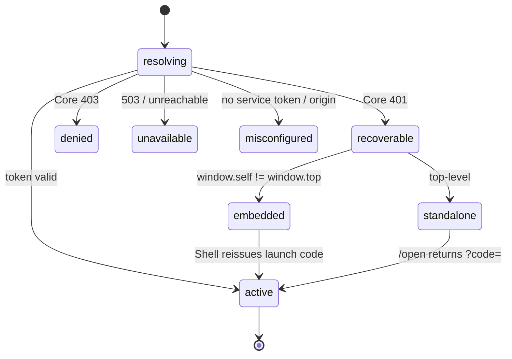

# Hosty App SDK — Shared Auth And Host Integration For Runtime Apps

Status: Phase 1 (auth) shipped and adopted — second wave open (see Adoption Status)
Created: 2026-07-15
Updated: 2026-07-20

## Adoption Status (2026-07-20)

Phase 1 (auth) is built, published, and adopted across the fleet, with two debts noted
in the table. The sections below are kept as the ratified design record; findings dated
2026-07-17 describe the pre-SDK state and are superseded by this table where they disagree.

Shipped artifacts:

- **`@hosty-sdk/app` — npmjs, latest 0.4.0.** All four slices: `core`, `server`, `react`,
  `embedder` (extraction #241, publishing chain #242–#244, rich resolution detail #248),
  plus the app secrets client in `server` (0.3.0; classified errors 0.4.0). Still missing from the design's
  `server`/`react` scope: the identity/session/logout route factories, the
  middleware/proxy factory, the scoped app-directory client, and the headless
  `useHostSession()` — tracked in
  [Second Wave](#second-wave-inventoried-2026-07-20) item 1.
- **`HostySdk.App` — NuGet, 0.3.0.** The .NET slice (#249; Trusted Publishing #250): Core
  revalidation behind the decided 30s positive cache, the `Hosty` authentication scheme,
  `HOSTY_*` options binding, cookie-name/`MapHostRole` parameterization, and
  `HostySecretsClient` for the app secrets store (0.2.0; classified errors 0.3.0). The package-shape
  placeholder `Haas.Hosty.AppSdk` is settled as **`HostySdk.App`**.
- **Shell** consumes the embedder slice (#245) — the reference implementation and the
  shipped artifact are the same code, as planned.

Per-app adoption:

| App | Status | Remaining auth debt |
| --- | --- | --- |
| marketplace | full (server + react + app-code factory; #241, #248) | — |
| telemetry-ui | full (#241, #248) | — |
| media-server web | full (media-server #63/#64) | on `^0.1.2` — a 0.x caret never reaches 0.2.0; needs an explicit bump |
| media-server .NET | full (`HostySdk.App` 0.1.0, media-server #65; a Core timeout now fails closed as 401) | none — `HostyKestrel`/`HostyTelemetry`/`HostyCoreClient` stay app-side as second-wave material, not auth |
| project-manager | adopted (PM #27) | on `^0.1.2`; a pre-SDK wrapper layer still duplicates SDK exports: `module-runtime.ts` (env), `host-app-code.ts` (own code exchange), `host-app-cookie.ts` (cookie attrs), own token reading in `host-identity.ts`/`proxy.ts` |
| demo-app | partial — `AppIdentityBridge` + the app-code factory only | **server slice unadopted**: `host-auth.ts` (~550 lines) still hand-rolls `resolveAppSession` and holds the fleet's only in-tree scoped app-directory client — ironic for the extraction source |
| solitaire | n/a | nothing to adopt until the theme slice (#247 verdict) |

## Motivation

Every runtime app re-implements the same Host integration — app-identity auth,
session recovery, theme bridging, Core origin/token wiring — as its own private copy.
There is no shared package. The copies have already drifted far enough to cause a
production incident and to leave two apps without any recovery path at all.

Observed failure (Hosty Marketplace, opened embedded in Shell): three unrelated error
surfaces render at once — `App service token is missing or invalid` (a **deploy
misconfiguration**), a `Host session expired` badge (the storefront diagnostic), and a
`Your Hosty session ended. Sign in via Hosty` bar (the identity bridge's embedded-recovery
*fallback* firing). The app asks the user to **sign in to fix a problem that signing in
cannot fix** (a missing `HOSTY_APP_SERVICE_TOKEN` is an operator concern), and it shows a
login affordance **inside Shell**, where the user is already authenticated. No single code
path owns "what is the auth state", so the three surfaces contradict each other.

This is drift plus a missing failure-class: apps conflate *session expiry* (a user problem,
recoverable) with *app misconfiguration* (an operator problem, terminal). The
[auth session lifecycle](auth-session-lifecycle.md) work already called this out — "the
app-side work triples across demo-app, telemetry-ui, and marketplace (no shared package …
independent copies)" — and the copies keep multiplying as new apps ship.

## Current Architecture Findings (snapshot 2026-07-17, pre-SDK)

This section records the state the design was ratified against; the Adoption Status
table above is current.

Six runtime apps, at least five incompatible copies of the same security-sensitive logic,
and one app that is not React at all:

| App | Repo | Stack | Auth copy | Recovery | 401/403/503 classified |
| --- | --- | --- | --- | --- | --- |
| demo-app | monorepo (`apps/demo-app`) | Next | own | yes (reference) | yes |
| marketplace | monorepo (`apps/marketplace`) | Next | own | yes, but blind to `misconfigured` | yes |
| telemetry-ui | monorepo (`apps/telemetry-ui`) | Next | own | yes | yes |
| project-manager | separate repo | Next | own | yes (added + hardened 2026-07) | yes |
| media-server | separate repo | Next | own | **no — dead-ends** | **no — only 401** |
| solitaire | separate repo | **vanilla JS** | **none** | n/a | n/a |

Per-app specifics:

- **demo-app** ([`apps/demo-app/src/lib/host-auth.ts`](../../apps/demo-app/src/lib/host-auth.ts),
  [`AppIdentityBridge.tsx`](../../apps/demo-app/src/components/AppIdentityBridge.tsx)) is the
  de-facto reference: full status classification and standalone/embedded recovery.
- **marketplace** ([`apps/marketplace/src/lib/host-auth.ts`](../../apps/marketplace/src/lib/host-auth.ts))
  has the richest embedding handling ([`embedding-origin.ts`](../../apps/marketplace/src/lib/embedding-origin.ts))
  and is the pattern other apps should learn `shellOrigin` from — but it has no
  `misconfigured` state, so `app_service_token_missing` surfaces as a session prompt.
- **telemetry-ui** mirrors demo-app.
- **project-manager** (separate repo) recently gained the recovery flow and three hardening
  fixes not present elsewhere: cookie-only status probe, no `AbortSignal.any` (browser
  support), and `userId` consistency between the probe and the real auth path. These fixes
  now have to be hand-copied into every other Next app.
- **media-server** (separate repo, Next 16 / React 19 / `@base-ui/react` / TanStack Query)
  has its own `host-auth.ts`/`identity.ts`, a `mapHostRole → AppRole` layer, and a `logout`
  route — but `revalidateIdentity` collapses every failure to `null`, the session route only
  returns `401`, and there is **no recovery** (`?code=` is exchanged in `providers.tsx`, but
  nothing acquires a fresh code on expiry). It dead-ends exactly like the screenshot, with no
  recovery even attempted. Highest-risk app. **Confirmed in production 2026-07-17**: after the
  grant died the app rendered its "Open this app from the Hosty Shell to authenticate"
  dead-end, and the only way back was restarting the app — which works by accident, not by
  design (a non-running app makes Shell reset the workspace, so the next open takes the full
  launch-code path). Core's `app-auth-codes.json` showed the last media-server code sitting at
  `consumedAt: null` with no grant behind it: Core offered a code, the app never used it. It
  also never reads `HOSTY_CORE_PUBLIC_ORIGIN`, so it cannot build a standalone recovery URL
  either — both channels of the contract are missing, not just the embedded one. Its **.NET
  side is in better shape and becomes the .NET reference**: `HostyAuthenticationHandler` +
  `CachingIdentityValidator` (30s clamp, no negative cache) + `HostyOptions`, plus the
  Jellyfin/Infuse per-user PIN credential as the proof case for services validating their own
  public endpoints.
- **solitaire** (separate repo) is a vanilla-JS game served by a small static server
  (`scripts/server.mjs`); it does no app-identity auth at all (only local storage). Access is
  gated by Shell/gateway. It disproves the assumption that "all apps are Next.js (React)."

The platform side of the contract is already complete, which narrows this work to the apps
(verified 2026-07-17): Core issues codes and revalidates grants correctly, and Shell already
implements the full responder in two pieces — `parseActiveFrameAuthRequired`
(`workspace/auth-intent.ts`, a pure function invoked by `EmbeddedWorkspacePanel`'s message
listener) verifies the sender (`event.source` must be the active frame's `contentWindow`,
`event.origin` must match the frame URL's origin, the `appId` must match the mounted app), and
only then `handleAuthRequired` (`shell-client.tsx`) reissues a launch code and swaps the
iframe `src`, rate-limited to one reissue per app per 3s. What that verification also surfaced is **why the
app half is load-bearing rather than a nicety**: when the requested app is already the one in
the workspace, Shell deliberately skips `/launch-code` and reuses the bare redirect URI with
no `?code=` (`shell-client.tsx`, both the `launchAppPage` and route-restore paths). That is
correct while the app's cookie is alive, and it means `hosty:auth-required` is the *only* way
back once the grant dies — an app that does not post it cannot be recovered by any amount of
clicking. So the SDK's `recoverable` state needs no Core or Shell change; it needs apps to
hold up their end.

Naming has diverged completely, which any shared code must accommodate rather than fight:

- App identity cookie: `hosty_demo_app_identity`, `hosty_telemetry_identity`,
  `hosty_marketplace_identity`, `project_manager_hosty_identity`, `hosty_identity`
  (media-server) — five different names.
- Internal trusted-identity header prefix differs per app; the **inbound** identity header
  `x-docker-host-identity` is the one thing that is consistent.
- Role mapping (`mapHostRole → AppRole`) exists only in media-server.

Environment injection is already uniform (both runtime adapters set `HOSTY_APP_ID`,
`HOSTY_CORE_ORIGIN`, `HOSTY_CORE_PUBLIC_ORIGIN`, `HOSTY_APP_SERVICE_TOKEN`,
`HOSTY_APP_DATA_DIR`), so the SDK has a stable contract to read from.

## Decisions

Ratified by the owner 2026-07-17 (session review of the live media-server incident).

1. **Build a framework-agnostic core with thin bindings — not a React component library.**
   Because solitaire is vanilla JS and future apps may not be Next, the contract cannot live
   in a React layer. Two language targets (that is the whole matrix today), four slices:
   - **`core` (pure TS, zero React/Next):** token exchange, `classifyAppSessionStatus`
     (including the new `misconfigured` class), the session **state machine**, embedding
     detection, the recovery *decision* (state × embedding → action), the
     `hosty:auth-required` message schema, and cookie/origin/env helpers. Usable from
     solitaire's `server.mjs` and from any React app alike.
   - **`server` (Next binding):** route-handler factories (`/api/auth/app-code`,
     `/api/auth/identity`, `/api/auth/session`, optional `/logout`) and a middleware/proxy
     factory.
   - **`react` (client binding):** `<HostyAuthGate>`, `useHostSession()` — thin wrappers over
     `core`. (Theme bridging is **out** of the SDK for now — decision 11.)
   - **`.NET` (NuGet):** authentication handler + cached Core revalidation + `HOSTY_*` options
     binding, extracted from media-server's working `MediaServer.Api/Hosty/` code.

   **Trust model (owner decision): every service validates its own public endpoints against
   Core — variant (a), not a trusted-header relay.** Services have private and public
   endpoints; private intra-app calls need no special validation (the per-app network is the
   boundary), but public endpoints validate for themselves. media-server's Jellyfin/Infuse
   surface already proves the pattern on .NET: a Core-authenticated user mints a per-user
   derived credential (username + PIN, plaintext shown once) for external clients — an
   endpoint the TS layer could never front. That is why a .NET SDK package exists at all.

2. **One session state machine, one gate, one source of truth — with a `misconfigured` class.**
   The gate is the only thing that decides what the user sees; the header badge and any
   diagnostic read the same state. States and rules are in [State Machine](#unified-session-state-machine)
   below. The new `misconfigured` state (no service token / no Core origin) is what today's
   marketplace mis-renders as a login prompt.

3. **Parameterize everything that diverges.** The SDK takes a config object:
   `appId`, identity cookie name, internal header prefix, and an optional `mapHostRole` hook.
   Each app keeps its own cookie namespace and role model while sharing the logic.

4. **Layered / opt-in adoption.** An app pulls only what it needs: solitaire takes theme +
   embedding awareness only; media-server / project-manager take the full auth gate. Never
   force the full gate onto an app with no protected data.

5. **Distribution: public registries — npmjs for TS, NuGet for .NET.** (Revised 2026-07-17.)
   GitHub Packages is rejected: it demands an auth token even to *install* a public npm
   package, which is friction in every external repo's CI and on every contributor machine.
   The direction is also the opposite of the original "absorb repos into the monorepo" note:
   the owner intends to gradually move runtime/system apps **out** of the monorepo, and
   third-party app authors need frictionless access — so published public packages are the
   canonical channel, and the workspace link inside the monorepo is only an interim
   convenience for the apps still in-tree. Re-examined 2026-07-17 against GitHub-only
   alternatives and confirmed: GitHub Packages still token-gates public installs; git-tag
   installs (`github:<owner>/<repo>#semver:^1`) work anonymously but need a separate SDK repo
   (npm's git-URL spec has no subfolder syntax — only `#<commit-ish>` / `#semver:` suffixes —
   so a monorepo subfolder cannot be an install source), build-on-install or a committed
   `dist/`, and have poor bot support; a `.tgz` on GitHub Releases pins the version into the
   URL. And .NET settles it: NuGet has no git dependencies at all, so NuGet.org is
   unavoidable — at which point
   avoiding npmjs saves nothing. The git-tag channel stays as a free *auxiliary* for
   installing the SDK from a branch or commit during debugging. Scope settled 2026-07-18:
   `@hosty` was taken on npmjs, so the owner registered **`@hosty-sdk`**. Package names
   under it are short role names with no `hosty`/`sdk` stutter — the app-side package is
   **`@hosty-sdk/app`** (monorepo folder `packages/app-sdk`), leaving room for future role
   packages under the same scope.

6. **Enforce the server/client boundary with subpath exports + `server-only`.** The service
   token and Core fetches must never reach a client bundle. `core` stays pure; `server` is
   marked `import "server-only"`; `react` is `'use client'`.

7. **No version synchronization between Core and the SDK.** (Replaces the original "version
   the SDK to the Core auth contract" — rejected 2026-07-17: any sync mechanism is itself a
   place to break, e.g. Core changes a signature but forgets to bump the SDK requirement and
   everything fails on the check rather than the call.) The compatibility policy is
   behavioral, not mechanical:
   - Core avoids breaking API signatures; new APIs are additive; old APIs are not removed
     immediately.
   - Apps simply track the current SDK — the fleet is small and updates often.
   - If something does break anyway: update the app, or wait for the SDK release that
     catches up. No runtime assertion, no contract-version endpoint.
   CI contract tests (the SDK exercised against a live Core build) are welcome as a *soft*
   net for the "don't break signatures" promise — they create no runtime coupling.

8. **Launch-mode awareness and the logout affordance.** The SDK exposes "how is this app
   running" (embedded in a shell vs standalone) as a first-class helper. Logout UI is at the
   app's discretion, gated by that helper: **embedded → hide logout entirely** (the session
   belongs to the Shell, not the app); **standalone → a logout control that drops the app
   cookie and navigates to Core's login page** is fine. How the helper learns the mode is an
   implementation detail (client-side `window.self !== window.top` is the baseline; a
   Core-reported launch channel is a candidate if the client signal proves insufficient).
   Server-side grant revocation on app logout is **deferred**: v1 logout is cookie-drop, and
   the doc notes openly that the grant then lives until its idle expiry.

9. **Revalidation cache: 30 seconds, clamped to the grant's `expiresAt`, negative results
   never cached.** Adopted verbatim from media-server's .NET `CachingIdentityValidator`, which
   already implements exactly this. Bounded staleness a valid session can tolerate; a
   stuck-unauthenticated state stays impossible because failures are not cached. Configurable
   down to zero for apps that want every request online.

10. **Classify by HTTP status, not by error-code strings.** 401 → `recoverable`, 403 →
    `denied`, 503/unreachable → `unavailable`, missing config → `misconfigured`. The code
    strings (`token_expired`, `app_access_denied`, …) pass through untouched for logging and
    diagnostics but never drive branching — new Core codes then cannot break an app.
    Consequence for Core: `MapIdentityErrorStatus` is the normative table; moving a code
    between 401 and 403 is a breaking contract change and gets reviewed as one.

11. **Theme bridging stays out of the SDK.** The owner has redesign ideas for theming; the
    copied `HostThemeBridge` / bootstrap script are explicitly *not* extracted in v1 so the
    SDK does not freeze a design about to change. Theme moves to the second wave at the
    earliest.

12. **The message literal stays `hosty:auth-required`.** (Owner-decided 2026-07-17.) It is a
    frozen *protocol* constant that never tracks branding — the precedent is the
    `x-docker-host-identity` header, which survived the docker-host→hosty rename untouched.
    A generic name like `auth:required` was considered and rejected: `postMessage` is a party
    line every embedded document shares, so an unprefixed type raises collision risk. Since
    the SDK becomes the only place the literal appears in app code, a future rename — should
    branding ever force one — is one SDK+Shell release with a dual-accept window.

13. **Versioned packages; updates flow through Dependabot — never floating versions.**
    (Owner-decided 2026-07-17.) Both registries require versions anyway; the bump chore is
    eliminated by automation, not by floating:
    - Apps depend on the SDK with a wide semver range (`^1`), so an app-side change never
      touches the SDK version — SDK releases and app work are independent streams.
    - SDK releases reach external repos as Dependabot PRs with **auto-merge on green CI**
      enabled for the SDK dependency: in practice "always latest", but with a CI gate and a
      visible trail.
    - In-tree apps use the npm workspace symlink and always build against the working-tree
      SDK — no versions involved at all.
    - Co-developing the SDK with an external app needs no publishing: `npm link` / `file:` on
      the TS side, `ProjectReference` or a local feed on .NET, and the
      `github:<owner>/<repo>#semver:^1` git-tag channel for installing straight from a branch.
    Floating versions (`latest` / `*`, NuGet `1.*`) were considered and rejected: npm
    lockfiles make them a lie (CI restores the pinned resolve regardless), NuGet's genuine
    floating trades away build reproducibility, a bad release would hit every app's next
    build fleet-wide with no gate, and auth code auto-flowing from a registry account into
    every build is exactly the supply-chain exposure the platform's own digest pinning
    exists to prevent — the same rolling-vs-pinned choice already made for app images
    (ArtifactLocks), decided the same way.

## UX Contract (owner-stated 2026-07-17)

The user-visible rule the state machine below must implement, stated by the owner and treated
as the acceptance criterion for this SDK:

1. **Inside Shell, an authenticated user never sees an auth screen or an "unauthenticated"
   message.** Session recovery is always silent.
2. **If the Shell session itself is dead** (unlikely), the user sees a single plain
   "re-authenticate" message at most — and in practice not even that, because Shell redirects
   the whole window to Core `/login`.
3. **Standalone, an expired session redirects straight to Core's login page.** No app-rendered
   sign-in card as the primary surface.
4. **Shell is just an app in standalone mode and follows the same rule.** Already true:
   every Core 401 in Shell calls `redirectToCoreLogin` (`core-api.ts`), *including* inside the
   launch-code reissue path — so an embedded app's silent recovery is backstopped by Shell's
   own whole-window redirect, and the chain always terminates at Core `/login`.
5. **Corollary: Core `/login` is the only authentication UI in the entire system.** Apps never
   render login UI; the SDK's job is two reflexes (post `hosty:auth-required` when embedded,
   navigate to `/open` when standalone) plus not rendering errors while they run.

Verified 2026-07-17: the platform already implements all of this. The contract requires zero
Core or Shell changes — it prunes the *app-side* design below (no embedded sign-in card, no
standalone "Sign in via Hosty" card as a primary state).

Simplicity is a stated goal ("the less there is to break, the less breaks"): the one piece of
complexity that must survive pruning is the standalone once-per-tab redirect guard — without
it a failing code exchange becomes an infinite redirect loop, which is strictly worse than any
error page.

## Unified Session State Machine

| State | Cause | Embedded (in Shell) | Standalone |
| --- | --- | --- | --- |
| `resolving` | probe in flight | quiet skeleton, never an error | same |
| `active` | token valid | app content | app content |
| `recoverable` | Core **401** (expired/invalid/revoked) | `postMessage(hosty:auth-required)` → Shell silently reissues a code; keep the quiet skeleton (never an error). If the parent stays silent past a timeout (non-Shell embedder, or Shell broken), show one plain "session expired — re-authenticate via Hosty" message; no embedded login UI | redirect immediately to Core `/open` (once per tab); Core bounces through `/login?returnTo` and returns with a fresh code. Only the loop-guard terminal state (second consecutive failure) shows a message with an explicit link. Guard: if the injected Core origin is loopback but the page host is not (off-machine IP access without a configured public origin), the redirect cannot succeed — skip it and show the message directly |
| `denied` | Core **403** (disabled / unassigned / admin-only) | "signed in, no access", **no login button** (a redirect would loop) | same |
| `unavailable` | **503** / Core unreachable / timeout | "can't reach Hosty, retrying" + Retry; **keep the cookie** | same |
| `misconfigured` | app-side: service token / Core origin not configured | "app is misconfigured on the host, contact the administrator", **no login button** | same |

Note `denied` / `unavailable` / `misconfigured` do not violate contract rule 1: they are not
"unauthenticated" surfaces. `denied` is an authenticated user without access (terminal by
design), and the other two are operator/platform problems that a login cannot fix — showing a
login there is exactly the bug the `misconfigured` class exists to prevent.

Four rules that eliminate the broken pages:

1. Embedded never shows login UI at all — recovery is silent via Shell, and Shell's own dead
   session resolves by whole-window redirect, not by anything the app renders.
2. A login affordance exists **only** in `recoverable` fallback paths (non-Shell embedder
   timeout; standalone loop-guard terminal). Never for `denied` / `misconfigured` / `unavailable`.
3. Single source of truth — content, header badge, and diagnostics read one state; no
   three-overlapping-errors.
4. Standalone worst case is a clean empty page with one explanation and one link, never a
   half-rendered error UI.



## Embedder Contract (any Shell, Including Third-Party)

Raised 2026-07-17: Shell is just one UI client in the component model, so the embedder half of
the recovery contract is itself duplicable logic — would a third-party shell step on the same
rakes the apps did?

**The embedder's participation is irreducible.** Recovery needs two capabilities at once: the
user's Core session in a first-party context (to mint a launch code) and control of the iframe
`src` (to deliver it). Only the embedder has both. The embedded app cannot self-recover: the
sandbox forbids top navigation, and an in-iframe navigation to Core `/open` cannot be relied on
to carry Core's session cookie (SameSite behavior varies by install — http vs https, same-site
vs cross-domain public origins) — which is why the agreed lifecycle design chose `postMessage`
over any navigation trick. So the question is not whether an embedder participates, but how
small and how safe its share is.

**The contract is one sentence.** *On a verified `hosty:auth-required` from an app you embed,
re-run your normal open flow for that app (which mints a fresh launch code), rate-limited.* An
embedder that can open apps at all already has the open flow; the handler is glue. Two
sharpenings the sentence carries:

- *Verified* = `event.source` is your iframe's `contentWindow`, `event.origin` is that app's
  endpoint origin, and the `appId` matches. Only the embedder can check these — they are facts
  about its own DOM.
- The re-open triggered by `auth-required` must take the full launch-code path. An "already
  open → reuse the URL without a code" optimization (today's Hosty Shell behavior on reopen)
  must not short-circuit recovery — that optimization is exactly what made the app-side
  `postMessage` load-bearing in the first place.

**A missing or broken embedder degrades gracefully, not into the media-server dead end.** The
app-side state machine does not depend on the embedder: if the parent stays silent past the
timeout, the app shows its plain re-authenticate message whose link opens the standalone
recovery URL in a new tab (`allow-popups`), and that channel needs no embedder at all — only
Core. Worst-case UX under a do-nothing shell is one message and one working link.

**A sloppy or malicious embedder is contained by Core, not by embedder correctness.** Codes
are single-use with a 5-minute lifetime; minting requires the embedder's own Core session plus
CSRF; and Core validates `redirectUri` against the target app's registered endpoint origins
(`RequireAllowedRedirectUriAsync`), so a code minted for app X can only ever be delivered to
app X's origin. A bad embedder can degrade its own user's experience; it cannot steal another
app's session. One hardening worth taking regardless: a Core-side per-app rate limit on
`/launch-code` — today the only storm guard is Hosty Shell's own 3s client-side throttle, i.e.
politeness.

**SDK consequence: ship the embedder half as code too.** Add an `embedder` slice — the
verified message listener, the rate limit, and a "re-open this app" callback — extracted from
Hosty Shell's working pair: `parseActiveFrameAuthRequired` (the sender/origin/appId
verification — already a standalone pure function in `workspace/auth-intent.ts`, the natural
seed of the slice) plus `handleAuthRequired` (the rate-limited reissue in `shell-client.tsx`).
Migrate Shell onto the slice so the reference implementation and the shipped artifact are the
same code (the same medicine the apps get).
Non-JS embedders keep the one-sentence contract in prose. Priority note: there are many apps
and few shells (today: one), so this slice is lower-risk and lower-priority than the app
slices — but it is also nearly free, since the code already exists in Shell.

## What To Extract

Status 2026-07-20: shipped, except the `server` route factories beyond app-code
(identity/session/logout), the middleware/proxy factory, the scoped app-directory client,
and the headless `useHostSession()`; the .NET slice shipped as `HostySdk.App` with the
auth scope only.

**`core` (pure TS, safe anywhere):**
- Contract types/constants: `AppSessionStatus` (+ `misconfigured`), `TrustedHostIdentity`, claims.
- `classifyAppSessionStatus` — the 401/403/503/misconfigured table (single source of truth).
- `exchangeAppAuthorizationCode` — `?code=` → token.
- `revalidateAppIdentityToken` — opaque-token online revalidation, with the decided cache
  (30s, clamped to `expiresAt`, no negative caching) + in-flight dedup.
- Session state machine + recovery decision (state × embedding → action).
- Launch-mode helper (embedded vs standalone) — drives the logout affordance per decision 8.
- Embedding detection (`window.self !== window.top`) + the marketplace `embedding-origin` pattern for learning `shellOrigin`.
- Cookie option builder (Secure/SameSite from proto, `Max-Age` from `expiresInSeconds`).
- Origin/env resolution: `getAppId`, `getHostyCoreOrigin`, `getHostyCorePublicOrigin`, service
  token. Core always injects `HOSTY_CORE_PUBLIC_ORIGIN` (`EffectiveCorePublicOrigin =
  CorePublicOrigin ?? ListenUrl`), so a missing value is a broken environment →
  `misconfigured`, never a fallback path. Semantics (owner, 2026-07-17): a *configured* public
  origin is always a domain and is authoritative. Unset means the *auth loop* is
  localhost-only — it does **not** mean the machine is unreachable from elsewhere: apps with
  `expose: host` bind `0.0.0.0`, so LAN or port-forwarded IP+port access to the app itself is
  possible with nothing configured. In that state the injected fallback is Core's loopback
  listen URL, which only a same-machine browser can follow. The SDK must **not** try to be
  clever about it (e.g. deriving Core's origin from the page's hostname): Core's default bind
  is loopback, and its redirect-URI allowlist rejects an app origin it does not know
  (`redirect_uri_denied`) — the heuristic is doubly dead on arrival. Off-machine access is
  supported by configuring public origins, full stop.
- `hosty:auth-required` message schema (shared with Shell).

**`server` (`import "server-only"`, Next binding):**
- Route-handler factories: `/api/auth/app-code`, `/api/auth/identity`, `/api/auth/session`, optional `/logout`.
  The identity/session responses carry the recovery parameters (`appId` + browser-reachable
  Core origin) so the client never learns them from a server-component prop: static routes are
  prerendered at image build, where the `HOSTY_*` environment does not exist, so a layout prop
  bakes the build-time fallback into the RSC payload (hit live by media-server and fixed in
  `alex-de-haas/media-server` PR #63 — not a docker-host PR number; the three monorepo Next
  apps now use the probe-carried form too, docker-host PR #233).
- Middleware/proxy factory: public paths, launch-code bootstrap, header stripping, trusted-identity injection.
- Scoped app-directory client (`/api/internal/apps/{id}/directory/users`).

**`react` (`'use client'` binding):**
- `<HostyAuthGate>` — renders the state machine; headless `useHostSession()` + a default, overridable UI.

**`.NET` (NuGet, extracted from media-server `src/api/MediaServer.Api/Hosty/` — the working
reference):**
- The authentication handler (identity token from bearer / cookie / inbound header, online
  revalidation against Core — today's `HostyAuthenticationHandler`).
- The cached validator (today's `CachingIdentityValidator`: 30s, clamped, no negative cache) —
  the same numbers the TS slice adopts.
- `HOSTY_*` options binding (today's `HostyOptions`).
- Per decision 1's trust model this slice exists for services with their own *public*
  endpoints (media-server's Jellyfin/Infuse API being the live example); private intra-app
  endpoints keep trusting the per-app network.

**Second wave:** the original shortlist (theme, OTel, storage, SSRF-safe fetch, debug
logging, manifest types) is superseded by a fleet-wide inventory — see
[Second Wave (inventoried 2026-07-20)](#second-wave-inventoried-2026-07-20). Auth was phase 1.

## Package Shape

```
@hosty-sdk/app                 # npmjs — pure types, constants, state machine, message schema
@hosty-sdk/app/server          # import "server-only": routes, middleware, revalidate, directory
@hosty-sdk/app/react           # 'use client': the identity bridge, useHostSession
@hosty-sdk/app/embedder        # 'use client': verified auth-required responder for shells

HostySdk.App                   # NuGet — auth handler, cached validator, HOSTY_* options
                               # (shipped 0.1.0 — #249, Trusted Publishing #250)
```

Config object passed by each app: `{ appId, identityCookieName, internalHeaderPrefix, mapHostRole? }`.

**Package granularity (owner-decided 2026-07-18): `@hosty-sdk/app` is an umbrella — one
dependency per app, forever.** Second-wave functions (theme, OTel, storage helpers, manifest
types) arrive as *subpaths* (`@hosty-sdk/app/theme`, …), not as packages: they are 50–150-line
utilities, and package-per-utility would mean micro-package noise plus a shared "internals"
base package whose bumps cascade — exactly the version-sync machinery decision 7 rejects. The
split axis, when splitting ever happens, is **function/audience — never runtime**:
server/react/embedder stay subpaths inside whatever package owns the domain, so auth can never
end up smeared across packages. A domain earns its own package only when it has a *different
audience or a life of its own*; the one visible candidate is `embedder` (its consumers are
shells, not apps), which stays a subpath until a third-party shell actually exists. Splitting
later is cheap (auto-merged bot bumps); merging packages back is not.

## Second Wave (inventoried 2026-07-20)

A fleet-wide sweep (media-server, project-manager, the three in-tree apps, Shell — run
2026-07-19/20, after the media-server migration) confirms the original second-wave
shortlist and replaces it with evidence-ranked items. Ordering is by payoff; the drift
examples are the argument, exactly as they were for auth.

1. **Finish the auth slice (adoption + the missing factories — not new extraction).**
   Route-handler factories for `/api/auth/identity`, `/api/auth/session`, and optional
   `/logout` — every app hand-writes them today, and media-server maps status↔HTTP twice
   (once in its session route, back again in `app-shell.tsx`). The middleware/proxy
   factory (public paths, launch-code pass-through, header stripping, trusted-identity
   injection) — project-manager's `proxy.ts` is the live reference. The scoped
   app-directory client — three parallel implementations exist (demo-app `host-auth.ts`,
   project-manager `host-directory.ts`, media-server .NET `HostyCoreClient`). The
   headless `useHostSession()`. Plus the two adoption debts from the Adoption Status
   table: demo-app's server slice and project-manager's wrapper layer.

2. **App secrets client — shipped 2026-07-22.** Both packages wrap the Core-managed
   keychain (`/api/internal/apps/{appId}/secrets…`) so no app hand-rolls the HTTP
   contract: `HostySecretsClient` (.NET, `AddHostySecrets`) and
   `getAppSecret`/`setAppSecret`/`deleteAppSecret`/`listAppSecretKeys` (TypeScript,
   server-only), both with a write-through cache so a briefly unavailable Core does not
   break an app that already read its secret. Design and plan:
   [app-secrets-store](app-secrets-store.md) and
   [../planning/app-secrets-store.md](../planning/app-secrets-store.md).

3. **`/otel` — OpenTelemetry wiring.** The drift is already real and it is the auth
   story again: `instrumentation.ts` + `otel-logs.ts` (the console→OTLP logs bridge with
   trace correlation and SIGTERM flush) are copied in media-server and project-manager,
   but secret redaction and the 200-records/10s rate limit exist **only in the
   project-manager copy**. ~200 lines of platform glue whose only app-specific value is
   the service-name default. The .NET counterpart is media-server's `HostyTelemetry.cs`
   → `HostySdk.App`. The three in-tree Next apps wire no OTel today and would gain
   tracing for free.

4. **`/theme` — theme bridging.** Still gated by decision 11, but the pre-SDK auth drift
   is repeating in slow motion: five `HostThemeBridge` copies (marketplace and
   telemetry-ui byte-identical; demo-app, project-manager, and media-server each
   divergent), four independent theme normalizers, and the anti-FOUC bootstrap script
   present in demo-app and project-manager but **not** in media-server. The protocol
   surface to freeze is small: `hosty:shell-theme`, the
   `?hosty_theme`/`?hosty_theme_preference` launch params, and the
   `hosty.theme.resolved`/`hosty.theme.preference` `sessionStorage` keys. Shell's sender
   half (`postTheme`, `appendHostyThemeParams`) belongs to the embedder slice. Either
   the theming redesign lands first, or the extraction carries the current protocol and
   the redesign happens inside the SDK — leaving five copies to drift further is the
   worst of the three options.

5. **`/env` — the non-auth environment contract.** The SDK reads only the auth
   variables; every app hand-parses the rest: `HOSTY_PORT_{KEY}` (media-server
   `HostyKestrel`), `HOSTY_SERVICE_{KEY}_URL` (telemetry-ui `backend.ts`),
   `HOSTY_DEPENDENCY_{KEY}_URL`, `HOSTY_PUBLIC_ORIGIN_{ENDPOINT}`, `HOSTY_APP_DATA_DIR`
   (project-manager `storage.ts`), and the `HOSTY_MOUNT_{KEY}` `label=path,…` parser —
   duplicated across languages (demo-app `demo-config.ts` and media-server
   `MediaServerSettings.cs`). Cheap to type once; it is platform contract, not app logic.

6. **Core capability client (`server` + .NET).** media-server's `HostyCoreClient` is the
   fleet's only implementation of the backup trigger and operator notifications; any
   stateful app wants both, and the directory client (item 1) is the same surface.
   Adjacent: the data-dir ownership pattern (project-manager's `docker-entrypoint.sh`
   mkdir/chown/drop-privileges dance) for stateful Docker apps. If
   [cross-app-auth.md](cross-app-auth.md) is ratified, its provider middleware and
   consumer handler land in this same area of the package.

7. **Small standardizers.** A `healthz` route factory — marketplace and telemetry-ui are
   identical, while demo-app, project-manager, and media-server use three different
   paths and response shapes for the same manifest `healthcheck` contract. The BFF proxy
   route factory (media-server `api/proxy/[...path]`: hop-by-hop stripping, identity
   bearer injection, body streaming) together with the bearer-fallback browser transport
   (media-server `api.ts` + the fetch-based SSE client in `sse.ts` — the
   cross-site-cookie workaround every app with its own backend service re-derives).
   `host-auth-debug` (project-manager) per the original shortlist. The manifest render
   script (project-manager `render-app-manifest.mjs`) as shared release tooling.

Checked and rejected as non-candidates: `app.0.1` manifest types (Core is the only
parser — there is no app-side duplication to collapse); `hosty:install-feed` (a single
producer and a single consumer; it stays a marketplace/Shell private protocol until a
second party appears); project-manager's `safe-fetch.ts` (an SSRF guard for
user-configured outbound URLs — app business logic that only looks like platform glue).

## Migration Plan (by risk)

1. **media-server** — no recovery at all; will dead-end like the incident. Highest
   priority. **Done 2026-07-19**: recovery + SDK on the web side (media-server #63/#64),
   `HostySdk.App` on the .NET side (media-server #65).
2. **marketplace + telemetry-ui** — have recovery but are blind to `misconfigured`; the
   in-tree apps that fixing the workspace package covers immediately. **Done** (#241, #248).
3. **project-manager** — already correct; becomes the SDK's verification reference.
   **Adopted** (PM #27) — the pre-SDK wrapper layer remains to be deleted (see Adoption
   Status).
4. **solitaire** — verified 2026-07-19: **nothing to adopt today.** Its only Hosty surface
   is two `localStorage` key names — no embedding detection, no `postMessage`, no auth, and zero
   npm dependencies. Adding the package now would be a dependency with no consumer; its SDK
   moment arrives with the theme slice (deferred by decision 11).
5. **demo-app** — added 2026-07-20: the extraction source itself never adopted the server
   slice; migrating it deletes the last hand-rolled revalidation copy in-tree and frees
   the app-directory client for extraction (Second Wave item 1).

Each phase is independently shippable. Start by extracting `core` + `server` + `react` from
demo-app (the reference), wire the three in-tree apps against `packages/hosty-app-sdk`, then
publish for the external repos. (Done — the packages live at `packages/app-sdk` and
`packages/app-sdk-dotnet`, published as `@hosty-sdk/app` and `HostySdk.App`.)

## Boundaries / Non-Goals

- The SDK owns the auth **contract and logic**, not each app's visual design — the gate UI is
  overridable.
- The SDK never signs or verifies tokens locally; revalidation stays online against Core, per
  the decided token rule in [ai-agent-bridge/plan.md](../features/ai-agent-bridge/plan.md).
- Cookie/header names stay per-app (parameterized), not unified — no forced cookie migration.
- The Shell embed iframe sandbox is not loosened; embedded recovery stays `postMessage`-only.
- Not every app must adopt every layer; solitaire may take theme-only.

## Rejected Alternatives

- **React-first component library.** Rejected — solitaire is vanilla JS and the contract must
  be framework-agnostic; a React-only SDK would exclude non-React apps and re-create drift for
  them.
- **Copy-and-keep-in-sync with a lint rule.** Rejected — the drift is already in production
  across five copies; a lint rule does not stop divergence, only flags it after the fact.
- **Unifying cookie/header names across apps.** Rejected — forces a cookie migration and a
  coordinated redeploy for no functional gain; parameterization achieves the same sharing.

## Immediate Operational Note (separate from the SDK) — resolved 2026-07-17

This section proposed that the screenshot's root cause was likely a **deploy problem, not the
SDK's absence**: an invalid or missing `HOSTY_APP_SERVICE_TOKEN` for marketplace/telemetry.
That was the right suspicion and it has since been chased down independently — but it is **not**
what the media-server incident above turned out to be, and the two must not be conflated.

- **The failure class was real and now has a fix.** Service tokens are minted into an app's
  environment at container creation, so a Core that re-derived its signing key per process
  invalidated every already-running app's token — every app→Core callback then 401'd until the
  app was recreated. That is [PR #220](https://github.com/alex-de-haas/docker-host/pull/220)
  (Platform 0.58.2): a durable `auth/app-service-signing.key`, plus a boot-time adopt-vs-recreate
  check that recreates any container whose baked token the current key rejects.
- **It is not the current cause.** Verified live 2026-07-17 against marketplace, telemetry,
  media-server and project-manager: Core accepts every one of their service tokens (a revalidate
  with a deliberately bogus grant returns `token_invalid`, i.e. the *grant* lookup — not
  `app_service_token_invalid`, which would mean the service token was rejected first). The
  media-server dead-end is the missing recovery path, full stop.

The conclusion for this proposal is unchanged and, if anything, better evidenced: the SDK would
not have prevented either failure, but a `misconfigured` state would have made the first one
legible instead of rendering it as a login prompt the user cannot act on. That state is worth
having precisely because the failure it names has now been observed in production.

## References

- [auth-session-lifecycle.md](auth-session-lifecycle.md) — the recovery contract this SDK packages.
- [`skills/hosty-app-skill/references/app-auth-and-users.md`](../../skills/hosty-app-skill/references/app-auth-and-users.md) — the app-author-facing contract.
- [gateway-and-app-wrapping.md](gateway-and-app-wrapping.md) — origin separation and session-cookie boundaries.
