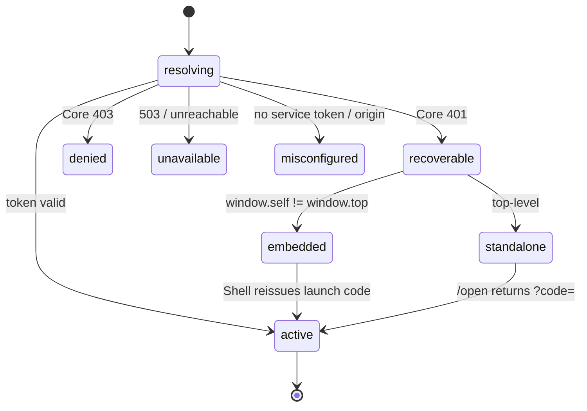

# Hosty App SDK — Shared Auth And Host Integration For Runtime Apps

Status: Idea (proposed 2026-07-15)
Created: 2026-07-15
Updated: 2026-07-15

## Motivation

Every runtime app re-implements the same Host integration — app-identity auth,
session recovery, theme bridging, Core origin/token wiring — as its own private copy.
There is no shared package. The copies have already drifted far enough to cause a
production incident and to leave two apps without any recovery path at all.

Observed failure (Hosty Marketplace, opened embedded in Shell): three unrelated error
surfaces render at once — `App service token is missing or invalid` (a **deploy
misconfiguration**), a `Host session expired` badge (the storefront diagnostic), and a
`Your Hosty session ended. Sign in via Hosty` bar (the identity bridge's embedded-recovery
*fallback* firing). The app asks the user to **sign in to fix a problem that signing in
cannot fix** (a missing `HOSTY_APP_SERVICE_TOKEN` is an operator concern), and it shows a
login affordance **inside Shell**, where the user is already authenticated. No single code
path owns "what is the auth state", so the three surfaces contradict each other.

This is drift plus a missing failure-class: apps conflate *session expiry* (a user problem,
recoverable) with *app misconfiguration* (an operator problem, terminal). The
[auth session lifecycle](auth-session-lifecycle.md) work already called this out — "the
app-side work triples across demo-app, telemetry-ui, and marketplace (no shared package …
independent copies)" — and the copies keep multiplying as new apps ship.

## Current Architecture Findings

Six runtime apps, at least five incompatible copies of the same security-sensitive logic,
and one app that is not React at all:

| App | Repo | Stack | Auth copy | Recovery | 401/403/503 classified |
| --- | --- | --- | --- | --- | --- |
| demo-app | monorepo (`apps/demo-app`) | Next | own | yes (reference) | yes |
| marketplace | monorepo (`apps/marketplace`) | Next | own | yes, but blind to `misconfigured` | yes |
| telemetry-ui | monorepo (`apps/telemetry-ui`) | Next | own | yes | yes |
| project-manager | separate repo | Next | own | yes (added + hardened 2026-07) | yes |
| media-server | separate repo | Next | own | **no — dead-ends** | **no — only 401** |
| solitaire | separate repo | **vanilla JS** | **none** | n/a | n/a |

Per-app specifics:

- **demo-app** ([`apps/demo-app/src/lib/host-auth.ts`](../../apps/demo-app/src/lib/host-auth.ts),
  [`AppIdentityBridge.tsx`](../../apps/demo-app/src/components/AppIdentityBridge.tsx)) is the
  de-facto reference: full status classification and standalone/embedded recovery.
- **marketplace** ([`apps/marketplace/src/lib/host-auth.ts`](../../apps/marketplace/src/lib/host-auth.ts))
  has the richest embedding handling ([`embedding-origin.ts`](../../apps/marketplace/src/lib/embedding-origin.ts))
  and is the pattern other apps should learn `shellOrigin` from — but it has no
  `misconfigured` state, so `app_service_token_missing` surfaces as a session prompt.
- **telemetry-ui** mirrors demo-app.
- **project-manager** (separate repo) recently gained the recovery flow and three hardening
  fixes not present elsewhere: cookie-only status probe, no `AbortSignal.any` (browser
  support), and `userId` consistency between the probe and the real auth path. These fixes
  now have to be hand-copied into every other Next app.
- **media-server** (separate repo, Next 16 / React 19 / `@base-ui/react` / TanStack Query)
  has its own `host-auth.ts`/`identity.ts`, a `mapHostRole → AppRole` layer, and a `logout`
  route — but `revalidateIdentity` collapses every failure to `null`, the session route only
  returns `401`, and there is **no recovery** (`?code=` is exchanged in `providers.tsx`, but
  nothing acquires a fresh code on expiry). It dead-ends exactly like the screenshot, with no
  recovery even attempted. Highest-risk app.
- **solitaire** (separate repo) is a vanilla-JS game served by a small static server
  (`scripts/server.mjs`); it does no app-identity auth at all (only local storage). Access is
  gated by Shell/gateway. It disproves the assumption that "all apps are Next.js (React)."

Naming has diverged completely, which any shared code must accommodate rather than fight:

- App identity cookie: `hosty_demo_app_identity`, `hosty_telemetry_identity`,
  `hosty_marketplace_identity`, `project_manager_hosty_identity`, `hosty_identity`
  (media-server) — five different names.
- Internal trusted-identity header prefix differs per app; the **inbound** identity header
  `x-docker-host-identity` is the one thing that is consistent.
- Role mapping (`mapHostRole → AppRole`) exists only in media-server.

Environment injection is already uniform (both runtime adapters set `HOSTY_APP_ID`,
`HOSTY_CORE_ORIGIN`, `HOSTY_CORE_PUBLIC_ORIGIN`, `HOSTY_APP_SERVICE_TOKEN`,
`HOSTY_APP_DATA_DIR`), so the SDK has a stable contract to read from.

## Decisions (proposed)

1. **Build a framework-agnostic core with thin bindings — not a React component library.**
   Because solitaire is vanilla JS and future apps may not be Next, the contract cannot live
   in a React layer. Three layers:
   - **`core` (pure TS, zero React/Next):** token exchange, `classifyAppSessionStatus`
     (including the new `misconfigured` class), the session **state machine**, embedding
     detection, the recovery *decision* (state × embedding → action), the `hosty:auth-required`
     message schema, and cookie/origin/env helpers. Usable from solitaire's `server.mjs` and
     from any React app alike.
   - **`server` (Next binding):** route-handler factories (`/api/auth/app-code`,
     `/api/auth/identity`, `/api/auth/session`, optional `/logout`) and a middleware/proxy
     factory.
   - **`react` (client binding):** `<HostyAuthGate>`, `useHostSession()`, `<HostThemeBridge>`
     — thin wrappers over `core`.

2. **One session state machine, one gate, one source of truth — with a `misconfigured` class.**
   The gate is the only thing that decides what the user sees; the header badge and any
   diagnostic read the same state. States and rules are in [State Machine](#unified-session-state-machine)
   below. The new `misconfigured` state (no service token / no Core origin) is what today's
   marketplace mis-renders as a login prompt.

3. **Parameterize everything that diverges.** The SDK takes a config object:
   `appId`, identity cookie name, internal header prefix, and an optional `mapHostRole` hook.
   Each app keeps its own cookie namespace and role model while sharing the logic.

4. **Layered / opt-in adoption.** An app pulls only what it needs: solitaire takes theme +
   embedding awareness only; media-server / project-manager take the full auth gate. Never
   force the full gate onto an app with no protected data.

5. **Distribution: workspace package first, published package for external repos.**
   Add `packages/hosty-app-sdk` and include `packages/*` in the root `workspaces` (currently
   `apps/*` only) for the three in-tree apps — zero friction, and it fixes exactly the
   marketplace/telemetry apps from the incident. Publish `@haas/hosty-app-sdk` (GitHub
   Packages) for the external repos (project-manager, media-server, solitaire). Longer term,
   absorbing those repos into the monorepo as workspaces removes cross-repo entirely.

6. **Enforce the server/client boundary with subpath exports + `server-only`.** The service
   token and Core fetches must never reach a client bundle. `core` stays pure; `server` is
   marked `import "server-only"`; `react` is `'use client'`.

7. **Version the SDK to the Core auth contract.** Optionally have Core expose a contract
   version the SDK asserts, so an app can fail loudly on a mismatch instead of drifting
   silently.

## Unified Session State Machine

| State | Cause | Embedded (in Shell) | Standalone |
| --- | --- | --- | --- |
| `resolving` | probe in flight | quiet skeleton, never an error | same |
| `active` | token valid | app content | app content |
| `recoverable` | Core **401** (expired/invalid/revoked) | `postMessage(hosty:auth-required)` → Shell silently reissues a code; neutral "Reconnecting…"; show a sign-in link **only** if Shell is silent past the timeout (non-Shell embedder) | auto-redirect once per tab to Core `/open`, then a clean "Sign in via Hosty" card |
| `denied` | Core **403** (disabled / unassigned / admin-only) | "signed in, no access", **no login button** | same |
| `unavailable` | **503** / Core unreachable / timeout | "can't reach Hosty, retrying" + Retry; **keep the cookie** | same |
| `misconfigured` | app-side: service token / Core origin not configured | "app is misconfigured on the host, contact the administrator", **no login button** | same |

Four rules that eliminate the broken pages:

1. Embedded never shows a login button as the primary affordance — recovery is silent via Shell.
2. Login is offered **only** for `recoverable`. Never for `denied` / `misconfigured` / `unavailable`.
3. Single source of truth — content, header badge, and diagnostics read one state; no three-overlapping-errors.
4. Standalone worst case is a clean empty page with one explanation and one button, never a half-rendered error UI.



## What To Extract

**`core` (pure TS, safe anywhere):**
- Contract types/constants: `AppSessionStatus` (+ `misconfigured`), `TrustedHostIdentity`, claims.
- `classifyAppSessionStatus` — the 401/403/503/misconfigured table (single source of truth).
- `exchangeAppAuthorizationCode` — `?code=` → token.
- `revalidateAppIdentityToken` — opaque-token online revalidation, with cache + in-flight dedup.
- Session state machine + recovery decision (state × embedding → action).
- Embedding detection (`window.self !== window.top`) + the marketplace `embedding-origin` pattern for learning `shellOrigin`.
- Cookie option builder (Secure/SameSite from proto, `Max-Age` from `expiresInSeconds`).
- Origin/env resolution: `getAppId`, `getHostyCoreOrigin`, `getHostyCorePublicOrigin`, service token.
- `hosty:auth-required` message schema (shared with Shell).

**`server` (`import "server-only"`, Next binding):**
- Route-handler factories: `/api/auth/app-code`, `/api/auth/identity`, `/api/auth/session`, optional `/logout`.
- Middleware/proxy factory: public paths, launch-code bootstrap, header stripping, trusted-identity injection.
- Scoped app-directory client (`/api/internal/apps/{id}/directory/users`).

**`react` (`'use client'` binding):**
- `<HostyAuthGate>` — renders the state machine; headless `useHostSession()` + a default, overridable UI.
- `<HostThemeBridge>` + the theme bootstrap script (currently copied into every app).

**Second-wave candidates (also duplicated, not auth):** OpenTelemetry wiring (`OTEL_*`),
storage / `HOSTY_APP_DATA_DIR` helpers, SSRF-safe Core fetch (timeouts + dispatcher),
debug logging (`host-auth-debug`), manifest types. Auth is phase 1.

## Package Shape

```
@haas/hosty-app-sdk            # pure types, constants, state machine, message schema
@haas/hosty-app-sdk/server     # import "server-only": routes, middleware, revalidate, directory
@haas/hosty-app-sdk/react      # 'use client': HostyAuthGate, useHostSession, HostThemeBridge
```

Config object passed by each app: `{ appId, identityCookieName, internalHeaderPrefix, mapHostRole? }`.

## Migration Plan (by risk)

1. **media-server** — no recovery at all; will dead-end like the incident. Highest priority.
2. **marketplace + telemetry-ui** — have recovery but are blind to `misconfigured`; the
   in-tree apps that fixing the workspace package covers immediately.
3. **project-manager** — already correct; becomes the SDK's verification reference.
4. **solitaire** — last, and only the theme/embedding slice (no auth gate needed).

Each phase is independently shippable. Start by extracting `core` + `server` + `react` from
demo-app (the reference), wire the three in-tree apps against `packages/hosty-app-sdk`, then
publish for the external repos.

## Boundaries / Non-Goals

- The SDK owns the auth **contract and logic**, not each app's visual design — the gate UI is
  overridable.
- The SDK never signs or verifies tokens locally; revalidation stays online against Core, per
  the decided token rule in [ai-agent-bridge.md](../features/ai-agent-bridge.md).
- Cookie/header names stay per-app (parameterized), not unified — no forced cookie migration.
- The Shell embed iframe sandbox is not loosened; embedded recovery stays `postMessage`-only.
- Not every app must adopt every layer; solitaire may take theme-only.

## Rejected Alternatives

- **React-first component library.** Rejected — solitaire is vanilla JS and the contract must
  be framework-agnostic; a React-only SDK would exclude non-React apps and re-create drift for
  them.
- **Copy-and-keep-in-sync with a lint rule.** Rejected — the drift is already in production
  across five copies; a lint rule does not stop divergence, only flags it after the fact.
- **Unifying cookie/header names across apps.** Rejected — forces a cookie migration and a
  coordinated redeploy for no functional gain; parameterization achieves the same sharing.

## Immediate Operational Note (separate from the SDK)

The screenshot's root cause is likely a **deploy problem, not the SDK's absence**:
`HOSTY_APP_SERVICE_TOKEN` is missing or invalid for marketplace/telemetry in production, so
they cannot revalidate anything (403 on `/api/catalog/apps`, 503 on telemetry). Verify the
runtime adapter injects a valid service token for system apps in production **independently**
of this proposal — the SDK would only make the resulting state legible (`misconfigured`), not
fix the injection.

## References

- [auth-session-lifecycle.md](auth-session-lifecycle.md) — the recovery contract this SDK packages.
- [`skills/hosty-app-skill/references/app-auth-and-users.md`](../../skills/hosty-app-skill/references/app-auth-and-users.md) — the app-author-facing contract.
- [gateway-and-app-wrapping.md](gateway-and-app-wrapping.md) — origin separation and session-cookie boundaries.
