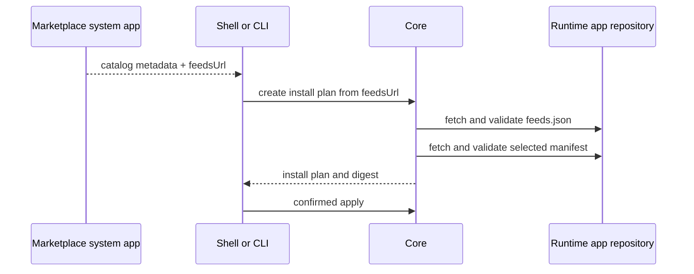

# Marketplace As A System App

Status: Idea
Created: 2026-07-10
Updated: 2026-07-10

## Motivation

The shipped marketplace is optional product functionality, but its implementation currently spans Core, Shell, and CLI. Core owns catalog schemas, source persistence, network fetching, federation, installed-state enrichment, feed resolution, and both browser/control APIs. Shell owns the storefront. The CLI is compiled against Core-specific catalog endpoints.

Catalog discovery is a good system-app boundary: it may fail, restart, and update independently without affecting authentication, app lifecycle, direct manifest installs, or already installed apps. Moving it to a first-party `hosty.marketplace` app also removes optional network-facing catalog parsing and federation policy from the Native AOT kernel.

## Confirmed Boundaries

- Marketplace provides information about configured catalogs and the apps declared by them.
- Marketplace never installs, updates, removes, configures, or resolves runtime apps.
- Core remains the only install/update/feed-resolution authority.
- Runtime-app feeds live in `feeds.json` in the runtime app repository. Those feeds are the app's update channels, not Marketplace-owned data.
- System apps with UI use separate Shell pages, analogous to runtime app pages.

These decisions make Marketplace a read-only catalog service plus a system-app UI, not a privileged Core client.

## Current Architecture Findings

- `CatalogService`, `CatalogSourceService`, `CatalogSourceStore`, catalog wire models, and `/api/catalog/*` plus `/control/v1/catalog/*` are compiled into Core.
- Catalog sources are host state at `core/catalog-sources.json`, initially seeded from `HOSTY_CATALOG_SOURCES`.
- Catalog reads join external entries with `AppRegistryStore` and installed manifest files, so their responses mix catalog information with Core lifecycle state.
- `CoreLifecycleService` depends on `CatalogService` for feed rebinding. `AppRecord` stores `FollowedFeedId`, while `ManifestUrl` stores the concrete moving manifest reference.
- Shell owns the hardcoded `/marketplace` route and hands a selected manifest reference to its Core install flow.
- `hosty catalog` reads Core catalog endpoints and then calls the generic Core lifecycle endpoint itself.
- A system app is currently an `AppRecord.System` flag, not a manifest role. Shell filters all system apps out of runtime-app navigation even when they declare UI.
- App SSO exists, but Core does not yet enforce `host.admin` solely because the target is a system app.
- Catalog sources may be absolute host paths. A Docker-backed marketplace app cannot see those paths without an explicit import or mount design.

## Target Boundary

| Concern | `hosty.marketplace` | Runtime app repository | Core |
| --- | --- | --- | --- |
| Catalog source configuration | Owns in app data | None | Bootstraps/migrates only |
| Catalog fetch/cache/federation/diagnostics | Owns | None | None |
| Catalog app metadata | Serves read-only | Supplies referenced app/feed artifacts | Treats as untrusted input |
| Runtime app feeds (channels) | Returns only `feedsUrl` | Owns `feeds.json` | Fetches, validates, resolves, and stores followed-feed state |
| Installed/version/update state | Does not return | None | Owns; Shell/CLI may join separately |
| Marketplace UI | Owns as a system-app page | None | Issues app SSO only |
| Install/update/feed selection | Cannot initiate or apply | Supplies feeds/manifests/artifacts | Owns selection, plan, review, apply, locks, backup, and audit |
| Trust enforcement | May show informational catalog verification | Signs/publishes app-owned feed data when supported | Owns any install-blocking verification policy |

The governing rule is: Marketplace describes where an app-owned install source is; Core resolves and acts on it.

## Read-Only Catalog Contract

The versioned Marketplace API should contain only catalog-owned information:

```text
GET /v1/catalogs
GET /v1/catalogs/{catalogId}/apps
GET /v1/catalogs/{catalogId}/apps/{appId}
```

An app detail contains:

- stable catalog identity (`catalogId`, `appId`);
- display metadata, publisher, category, tags, assets, and support links;
- the app-owned feed document URL:

```json
{ "feedsUrl": "https://example.invalid/app/feeds.json" }
```

It does not contain Core-owned projections such as `installed`, `installedVersion`, followed feed, update availability, artifact locks, health, or lifecycle permissions. The federated identity is `(catalogId, appId)`; a bare app id is not globally unique across independently configured catalogs.

Catalog source add/remove operations are Marketplace-owned configuration, separate from the read-only catalog contract. They mutate only Marketplace app data and confer no Core lifecycle authority.

## Core-Owned Install Flow

Marketplace never resolves a feed to a manifest. A user selection hands `feedsUrl` to a Shell or CLI Core client:



The handoff is data/navigation, not a privileged Marketplace call. Shell may use a user-activated Shell link or a narrowly validated iframe message to open the Core-owned install surface. In both cases it treats the reference exactly like an operator-pasted URL. The Marketplace app receives no install/proposal scope and never receives the Core control secret or session cookie.

The Core plan request should accept `feedsUrl` plus an optional requested feed id. Core validates `app-feeds.0.1` and app id, selects the requested/default/sole feed, resolves the manifest, and displays the runtime, settings, permissions, and artifact changes. Install apply must be bound to the reviewed plan digest; that is a generic lifecycle correctness requirement, not Marketplace authority.

For CLI, `hosty catalog install` remains an orchestration command: read Marketplace data through a read-only proxy, pass the returned `feedsUrl` to Core, review/confirm the Core plan, and apply through Core's control plane.

## Runtime App Feeds As Channels

Catalog entries no longer carry inline `feeds[]` or resolve manifests. They point to app-owned `feeds.json`. The existing feed entries (`id`, `manifestRef`, optional `default`) are the runtime app's update channels. Core owns feed validation and lifecycle semantics; the runtime app repository owns the document and its publication.

The standalone feed document and ownership migration are tracked in [Runtime App Repository Feeds](runtime-app-repository-feeds.md). Marketplace can still show the catalog entry when it cannot reach `feeds.json`; Core reports a resolution error only when an operator chooses that source.

An installed app stores `FeedsUrl`, `FollowedFeedId`, and the last resolved `ManifestUrl` independently of its originating catalog. Deleting Marketplace or removing a catalog must not break that app's update path.

## System App Pages

`hosty.marketplace` should expose its UI through the same `ui.entrypoint` and `ui.navigation` contract used by runtime apps. Shell displays UI-capable system apps in a separate administrator-only System group and renders their pages through the existing app-origin iframe/SSO machinery.

No marketplace-specific Shell route or native page contract is required. The current `/marketplace` route can be a temporary alias while the generic system-app page model is introduced. Details are tracked in [System App Pages](system-app-pages.md).

## Runtime Shape And Configuration

The Marketplace app should use ordinary Core-managed lifecycle, a pinned production artifact, a development runtime, a health endpoint, and app data. Catalog sources, cache metadata, source health, and migration markers live under its app data directory.

The app does not need Core registry-read or lifecycle scopes. Its only Core interaction is ordinary app SSO/revalidation for its admin UI. Shell and CLI obtain Core-owned app state from Core directly when they need to combine catalog information with installed state.

The Marketplace read API can be reached by CLI through a narrow Core compatibility proxy that accepts only authenticated `GET` requests and forwards them to the declared Marketplace endpoint. Source configuration should use the app's own authenticated admin UI first; a future CLI configuration proxy is separate from the read-only catalog API.

## Possible Approaches

### Approach A: Move Only The UI

The system app renders the storefront while Core keeps catalog data and APIs.

Pros:

- Small visual migration.

Cons:

- Marketplace would need to read a Core-owned catalog API.
- Catalog parsing, state, and federation remain in Core.
- It contradicts the clean read-only-provider boundary.

This is not recommended as the first extraction step.

### Approach B: Move The Read-Only Catalog Service First

Move sources, catalog schemas, fetch/cache, federation, and diagnostics into `hosty.marketplace`. Keep the current Shell page and CLI commands temporarily through Core `GET` compatibility proxies.

Pros:

- Establishes the final ownership boundary immediately.
- Requires no Marketplace-to-Core privilege.
- Preserves existing client UX during migration.

Cons:

- The UI remains temporarily split from its backend.

This is the recommended first extraction step.

### Approach C: One-Step Vertical Move

Move catalog backend, UI, routes, CLI transport, source state, and feed ownership together.

Pros:

- No compatibility period.

Cons:

- Couples three migrations and makes rollback difficult.
- Mixes Marketplace extraction with the runtime-feed migration.

This is not recommended.

## Migration Phases

### Phase 0: Generic System-App Foundations

- First-class, fail-closed system role.
- Admin-only system-app SSO authorization.
- Generic system-app pages using `ui.entrypoint` and `ui.navigation`.
- Generic optional-system-app bootstrap and reviewed update/recovery.
- Bounded read-only extension proxy for CLI compatibility.

### Phase 1: Extract Catalog Data And API

- Add the `hosty.marketplace` runtime app and app-data store.
- Move catalog models, schema validation, sources, fetch/cache, federation, and diagnostics out of Core.
- Preserve browser/control `GET /catalog` behavior as compatibility proxies.
- Stop joining catalog responses with Core installed/update state.

### Phase 2: Extract Marketplace UI

- Move the storefront and source-management pages out of Shell.
- Render them as generic system-app pages.
- Replace the hardcoded Shell `/marketplace` implementation with a temporary redirect/alias.
- Hand selected install-source references to the Core-owned Shell install surface.

### Phase 3: Move Feeds To Runtime App Repositories

- Publish app-owned `feeds.json` from runtime app repositories.
- Replace catalog `feeds[]` with `feedsUrl`.
- Move feed loading, selection, update detection, and following fully into Core while preserving the current feed entry shape.
- Preserve existing installed apps as direct-manifest update sources until explicitly bound to `feeds.json`.

### Phase 4: Cleanup

- Remove Core catalog implementations and Marketplace DTO registrations.
- Remove hardcoded Shell marketplace components and stale feed UI.
- Remove compatibility routes after a supported client transition window.

## Conflicts With Existing Features

- [Core Extension Model](core-extension-model.md) previously described Marketplace as proposal-scoped. The confirmed boundary requires no Core privilege or installed-state read.
- [Runtime App Marketplace](../features/runtime-app-marketplace.md) currently documents Core-owned catalog APIs, Shell-owned UI, and catalog-hosted feeds.
- [Catalog-Hosted App Feeds](../features/catalog-hosted-app-feeds.md) puts the current feed entries in the catalog. The future direction preserves their behavior but moves `feeds.json` back to the runtime app repository.
- [Core App Shell](../features/core-app-shell.md) and [Shell Access And System Apps](../features/shell-access-and-system-apps.md) exclude all system apps from navigation. The new model preserves the normal Apps group and adds a separate admin System group.
- Absolute host-path catalog sources currently work because Core reads the host filesystem. A Docker Marketplace app needs an explicit import/mount decision.

## Risks

- **Accidental lifecycle authority.** Returning resolved manifests or Core state would pull Marketplace back into install/update policy. Keep the API catalog-only and let Core resolve feeds.
- **Identity collisions.** Merging on app id alone can hide different entries from different catalogs. Preserve catalog-qualified identity.
- **False trust presentation.** Marketplace verification is informational unless Core independently enforces the same evidence during install.
- **State loss or double ownership.** Reading both `core/catalog-sources.json` and app data after migration can diverge. Perform a one-time import and keep one source of truth.
- **Host filesystem exposure.** Do not preserve local catalog paths through automatic arbitrary bind mounts.
- **Version skew.** Version the read API and `app-feeds` schema; fail explicitly when Core/CLI cannot understand them.
- **Availability.** Marketplace failure must disable only discovery, not direct installs or installed-app updates.

## Open Questions

- Question: How does a Marketplace iframe hand an install-source reference back to Shell?
  - Current answer: this is a user-navigation handoff, not a privileged API call.
  - Recommendation: prefer a Shell-owned install URL opened by user activation; use a narrowly validated message only if same-tab UX requires it.
- Question: How are catalog sources configured from CLI?
  - Current answer: source mutation belongs to Marketplace configuration, not the read-only catalog API.
  - Recommendation: ship the system-app settings page first; add a separate authenticated configuration proxy only if CLI demand remains.
- Question: How are absolute local catalog paths preserved?
  - Current answer: a Docker app cannot see them, and automatic arbitrary mounts are unsafe.
  - Recommendation: use an explicit Core-owned import into Marketplace app data; confirm whether live-following local files is a real requirement before adding a broker.
- Question: Who verifies catalog signatures?
  - Current answer: Marketplace may verify for display, but only Core can make an install-blocking trust decision.
  - Recommendation: keep catalog verification informational initially; define a portable Core-verifiable trust proof before claiming enforced publisher trust.
- Question: Should Marketplace display installed/update state?
  - Current answer: those are Core facts, not catalog facts.
  - Recommendation: omit them from the Marketplace contract and first UI; if later needed, let Shell compose Core and Marketplace responses without granting registry access to the app.

## Current Recommendation

Build `hosty.marketplace` as a read-only catalog provider with ordinary admin-only system-app pages. Extract the backend first, keep temporary read proxies for Shell/CLI, then move the UI. The app receives no lifecycle or registry grants.

Catalog entries point to runtime-app-owned `feeds.json`. Shell/CLI pass `feedsUrl` to Core, and Core alone resolves feeds, validates manifests, presents review, applies lifecycle changes, and stores followed-feed state independently of Marketplace.

## Links

- [Core Extension Model](core-extension-model.md) - the general system-app extension mechanism.
- [System App Pages](system-app-pages.md) - generic Shell pages for UI-capable system apps.
- [Runtime App Repository Feeds](runtime-app-repository-feeds.md) - current feed behavior moved unchanged to app-owned `feeds.json` with Core-owned resolution.
- [Runtime App Marketplace](../features/runtime-app-marketplace.md) - the shipped implementation being extracted.
- [Catalog-Hosted App Feeds](../features/catalog-hosted-app-feeds.md) - current feed ownership being replaced in future work.
- [Core App Shell](../features/core-app-shell.md) - current runtime app page and iframe behavior.
- [On-Demand System App Updates](system-app-updates.md) - safe independent system-app update work.

## Notes

This document is exploratory. It records confirmed ownership decisions but does not authorize implementation.
