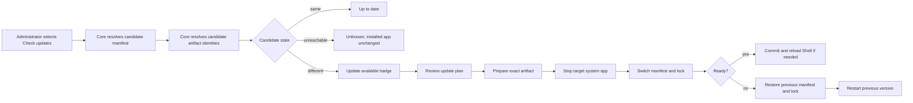

# On-Demand System App Updates

Status: Idea
Created: 2026-07-10
Updated: 2026-07-10

## Motivation

Hosty currently treats Shell and telemetry as Core-managed runtime apps, but their installed manifests are reconciled and ordinary updates are applied automatically when Core starts. This creates network work and version movement during Core startup, bypasses the reviewed update flow used by normal runtime apps, and makes the existing Shell **Check updates** action irrelevant for system apps.

The desired behavior is:

- Core startup installs a missing system app and starts the already installed, pinned version.
- An administrator explicitly runs **Check updates**.
- Core resolves candidate system-app manifests and artifacts without downloading full images or mutating installed state.
- Shell shows the same update-available indicators used for runtime apps.
- The administrator reviews and installs an update through the normal plan/apply flow.
- Only the updated system app restarts; Core keeps running.

Core executable updates are a separate platform concern. A newly installed Core binary still requires a Core process restart before it becomes active.

## Current Architecture Findings

The feature is a strong fit for the existing architecture rather than a new updater subsystem:

- [Final Hosty architecture boundaries](../features/final-hosty-architecture.md) defines Shell as a normal Core-managed runtime app with install, start, stop, restart, update, status, and logs lifecycle operations.
- Core already exposes generic, administrator- and CSRF-protected update plan/apply endpoints. They do not reject records whose `System` flag is true.
- `CoreLifecycleService` already serializes mutations with a per-app lock, recomputes the plan digest on apply, stops only the target app, creates a pre-update data backup when applicable, and restarts only that app.
- The default compiled-artifact policy is `pinned`. Once an image digest is recorded, an ordinary restart runs that digest instead of advancing a mutable tag.
- Shell already has a **Check updates** button, per-app update status state, update badges, and a reviewed update dialog.

The missing behavior is concentrated in policy, discovery, and safety:

- The fleet check targets only non-system runtime apps.
- Row and dialog eligibility hide the update action for every system app.
- Expanding a system-app row already performs a digest check and can display update status, but the result is not actionable.
- Current `GET /api/apps/{appId}/update-status` checks only image tags from the installed internal manifest copy. It does not fetch the external manifest source, so a new manifest version or a new immutable image tag can be incorrectly reported as up to date.
- Core startup currently creates and automatically applies update plans for both `hosty.shell` and `hosty.telemetry`.
- The current apply path has no automatic rollback when the new version fails to start.
- The candidate image digest is visible in the plan changes, but apply clears the old lock and resolves the mutable tag again at start. The reviewed digest is therefore not yet the exact artifact guaranteed to run.
- Apply reloads a remote manifest after recomputing the plan. A moving URL can change between those reads.

These gaps also affect ordinary runtime-app update correctness. Candidate resolution should be shared by update status and reviewed update planning rather than adding a second system-app-only implementation.

## Possible Approaches

### Approach A: Add System Apps To The Existing Shell Check Only

Pros:

- Small UI change.
- Reuses the current status and update dialog.

Cons:

- Does not stop automatic startup updates.
- Misses manifest-version and immutable-tag updates.
- Leaves Shell self-update without readiness handling or rollback.
- Can review one digest and run another when a mutable tag moves.

This approach does not satisfy the requested behavior and is not recommended.

### Approach B: On-Demand Candidate Resolution With Reviewed Apply

Pros:

- Reuses the existing manifest loader, artifact resolver, plan digest, backup, and per-app lifecycle lock.
- Keeps Core as the single source of lifecycle truth.
- Applies equally to runtime apps and capability-enabled system apps.
- Removes remote version movement from ordinary Core startup.
- Can be delivered for Shell first without waiting for a complete product-channel service.

Cons:

- Requires the generic update-status and apply internals to share a resolved candidate.
- Requires staged apply, readiness, and rollback before Shell self-update is safe.
- The current moving `main` manifest and `latest` image publication are not atomic.

This is the recommended first implementation direction.

### Approach C: Build Product Channels Before Any System-App UI

Pros:

- Provides an atomic, CI-published source of compatible Core, Shell, and other system-app releases.
- Can carry immutable manifest snapshots, artifact digests, and compatibility metadata.
- Is the strongest eventual production distribution model.

Cons:

- Expands the first increment into platform release coordination.
- Duplicates no lifecycle work but delays a useful Shell-only flow.
- Product channels are currently an idea and the committed index is only a local placeholder.

Product channels should become a later candidate-source implementation, not a prerequisite for the first on-demand Shell update.

## Recommended Architecture

### Startup Semantics

Core remains the system-app lifecycle owner, but bootstrap and update responsibilities are separated:

- If a required system app is missing, Core installs it from its configured bootstrap manifest source.
- If it is already installed, Core keeps the reviewed manifest and artifact lock already stored in app state.
- Core continues reconciling Hosty-owned settings, autostart, source override, data directories, and other provisioning that does not advance app code or manifest contract.
- Ordinary movement at the same remote manifest URL or image tag is not fetched and applied during startup.
- Autostart starts the stored pinned artifact. Pulling that exact digest when it is absent locally is recovery of the installed version, not an update.
- Capability-enabled system apps that use the manual update flow should remain pinned; `rolling` would intentionally reintroduce version movement on restart.

An explicit change to a bootstrap manifest reference is different from movement behind the same reference. The current recommendation is to treat a changed `HOSTY_*_MANIFEST_PATH` as explicit operator migration intent while keeping normal branch/tag movement pending for review. The exact migration UX remains an open question below.

### Candidate Discovery

Candidate discovery stays read-only and Core-owned:

1. Resolve the app's configured external manifest reference (`ManifestUrl`, original install reference, followed feed, or the Core-owned bootstrap reference for a system app).
2. Load and validate the candidate manifest for the selected runtime.
3. Compare installed and candidate manifest digests.
4. Resolve candidate artifact identities with light registry/git lookups, without a full image pull.
5. Compare candidate artifact identities with installed locks.
6. Return a structured status such as `available`, `up-to-date`, `unknown`, or `not-applicable`, plus current/target versions and whether every target artifact is resolvable.

`UpdateAvailable` should mean:

```text
candidate manifest digest differs
OR
candidate artifact identity differs
```

Version strings remain display metadata. An unchanged version with changed content must still be detectable.

The existing `GetUpdateStatusAsync` and `CreateUpdatePlanAsync` should share one internal candidate-resolution result so the badge and the reviewed plan cannot disagree. A new fleet API is optional; the current Shell concurrency pool is sufficient for the first increment.

### Reviewed And Staged Apply

The existing plan-confirm-apply contract remains the only update path, with stronger artifact guarantees:

1. Recompute the candidate once and retain the exact manifest selection and structured target artifact identities for the apply operation.
2. Include the target manifest digest and target artifact identities in the plan digest seed.
3. Reject an unresolved target for a critical system app rather than stopping the currently working version.
4. Download or otherwise prepare the exact reviewed artifact before stopping the app.
5. Snapshot the previous app record, manifest, vendored assets, and artifact locks.
6. Stop only the target system app.
7. Atomically switch the installed manifest/state to the reviewed candidate and start the exact prepared artifact.
8. Wait for app readiness.
9. If start or readiness fails, restore the previous manifest/state/locks and restart the previous pinned artifact.

This closes both moving-manifest and moving-tag time-of-check/time-of-use gaps. It also makes rollback a generic lifecycle property that ordinary runtime apps can benefit from.



### System-App Eligibility

The UI should not enable every lifecycle control merely because system-app updates become possible. Update eligibility should be generic but opt-in:

```text
host.admin
AND app.system
AND app.capabilities contains "update"
AND app is not running in live Development Mode
AND a reviewed candidate source is available
```

The first increment enables `hosty.shell`, whose manifest already declares `update`. Stop, remove, backup, and unrelated system-app actions remain governed separately. The system-app update dialog should not offer marketplace feed rebinding; its candidate source is Core/bootstrap-owned unless the operator changes that source explicitly.

`hosty.telemetry` should be enabled only after it declares `update` and Core invokes its system-specific provisioning hook during an in-process update. Today Core rewrites telemetry configuration and prepares its data subdirectories only from startup bootstrap, so merely exposing the generic button would be incomplete.

### Shell Self-Update Continuity

Updating `hosty.shell` does not require a Core restart. The browser sends lifecycle requests directly to Core, so the already loaded JavaScript can survive the brief Shell container restart.

The self-update UX should:

1. Warn that Shell will briefly restart and show a blocking **Updating Shell — keep this tab open** state.
2. Send the reviewed apply request to Core.
3. Keep the current document alive while Core prepares, swaps, and starts Shell.
4. Poll Shell readiness after Core reports success.
5. Perform a full page reload so the browser loads the new Shell assets and build-time version.
6. If Core reports a successful rollback, keep the old page active and show the update failure.
7. If both update and rollback fail, show CLI recovery instructions while Core remains reachable.

The same continuity helper should eventually cover runtime switching of the active Shell because that operation has the same stop/start interruption.

### Release Source

The configured remote manifest URL is sufficient as the first candidate source, but the current Shell artifact publication should be hardened:

- Publish an immutable semantic-version image tag in addition to `latest` and `sha-*`.
- Make the released Shell manifest reference the semantic-version tag matching its `version`.
- Treat unresolved target artifacts as `unknown` or `not ready`, not installable.
- Keep the installed digest as the runtime lock and rollback identity.

There is still a short race because the moving raw `main` manifest can become visible before the image workflow finishes. A later CI-published product-channel index should move only after all referenced artifacts exist and should carry compatible, immutable system-app release references.

### Compatibility Boundary

`schemaVersion: app.0.1` proves only that Core understands the manifest contract. It does not prove that a candidate Shell uses only browser APIs supported by the running Core.

The development-channel MVP can retain the current compatibility assumption and rely on rollback, but a stable product channel should publish an explicit minimum/maximum Core compatibility range or otherwise guarantee that the offered Shell/system-app versions are compatible with the running platform version.

## Conflicts With Existing Features

This idea intentionally revises current, narrower policies:

- [Shell access and system apps](../features/shell-access-and-system-apps.md), [Core app shell](../features/core-app-shell.md), and [Hosty Shell Docker Image](../features/hosty-shell-image.md) currently describe system apps as inspect-only and hide update controls.
- `RuntimeAppSupervisorService` currently auto-reconciles Shell and telemetry manifests at startup; existing tests assert that behavior.
- Current update status is artifact-only even though [Catalog-hosted app feeds](../features/catalog-hosted-app-feeds.md) already defines update availability as manifest movement or artifact movement.
- The telemetry system app does not currently expose the `update` capability and has Core-owned provisioning that is startup-only.

The feature does not conflict with the deeper Core/Shell ownership boundary. It restores the general rule that Shell is updated through the same Core-owned reviewed lifecycle as other runtime apps.

## Risks

- **Shell becomes unavailable after a failed self-update.** Mitigation: prepare first, readiness gate, automatic rollback, and CLI recovery.
- **A moving manifest or tag changes after review.** Mitigation: one retained candidate context and exact digest-based apply.
- **The manifest is visible before its image is published.** Mitigation: unresolved artifacts are not installable; later use a post-publish product index.
- **New Shell is incompatible with the running Core.** Mitigation: compatibility metadata/guarantee plus readiness and rollback.
- **Core startup no longer repairs a stale system app automatically.** Mitigation: preserve missing-install and explicit provisioning behavior, surface pending updates clearly, and keep CLI update/recovery commands.
- **A generic system-app update skips app-specific provisioning.** Mitigation: enable each system app only after its Core-owned pre/post-update hook is defined.
- **Several system apps are updated together in an unsafe order.** Mitigation: no bulk apply in the first increment; update one reviewed app at a time, with Shell last if bulk update is introduced later.

## Open Questions

- Question: Should changing `HOSTY_SHELL_MANIFEST_PATH` or another bootstrap source still apply automatically on Core startup?
  - Current answer: This is explicit operator configuration, unlike a new commit appearing behind the same URL. Automatic migration preserves custom-Shell and development workflows, but still changes executable code during startup.
  - Recommendation: Keep automatic handling only when the reference string itself changes, log it as an explicit bootstrap-source migration, and never auto-apply ordinary content movement behind an unchanged reference. Revisit a staged confirmation flow before stable releases.

- Question: Should the first implementation depend on product channels?
  - Current answer: No. The configured external manifest source and existing manifest/artifact resolvers are enough for an on-demand Shell MVP.
  - Recommendation: Introduce a candidate-source abstraction now and add the generated product-channel index as a later implementation after release artifacts are published atomically.

- Question: Is rollback required only for Shell or for all updates?
  - Current answer: Shell makes the missing rollback user-visible and potentially removes the primary UI, but the same failure mode exists for every runtime app.
  - Recommendation: Implement rollback in the generic apply lifecycle and require it before exposing Shell self-update. Start with readiness rules suitable for Shell, then extend health contracts per app.

- Question: Which system apps should appear in Check updates?
  - Current answer: `hosty.shell` is ready at the capability level. `hosty.telemetry` is not, because it lacks `update` and needs its Core-owned configuration provisioning during manual apply.
  - Recommendation: Gate generically on `system + update capability`, ship Shell first, then opt each system app in only after its provisioning and readiness behavior is covered.

- Question: How should Core/Shell compatibility be enforced?
  - Current answer: The manifest schema check does not cover browser API compatibility, and the current rolling `main` source has no compatibility range.
  - Recommendation: Accept the existing rolling-channel assumption for the development MVP with rollback, but require compatibility metadata or a coordinated product-channel guarantee before exposing stable system-app releases.

## Current Recommendation

Proceed to a Draft planning document for a Shell-first increment, but design the extension points around any capability-enabled system app. The minimum safe scope is:

- stop automatic same-source Shell update application during Core startup;
- make update status resolve candidate manifest and artifact identities through the same code as update planning;
- bind apply to the exact reviewed manifest and artifact digests;
- prepare artifacts before stopping, add readiness, and roll back on failure;
- include eligible system apps in **Check updates** and enable only their Update action;
- reload the browser after successful Shell self-update;
- publish and reference an immutable versioned Shell image;
- revise the existing startup-reconciliation and inspect-only tests when implementation begins.

Do not expose telemetry or bulk system-app apply in the first increment. Those remain follow-on work until system-app provisioning hooks and update ordering are defined.

## Review Remarks

Added 2026-07-10 after verifying the findings above against the current Core and Shell code. Every statement in Current Architecture Findings checks out: startup does create-plan-then-auto-apply for both system apps, update status compares only locked image digests against the registry without refetching the external manifest, apply drops `ArtifactLocks` so the next start re-resolves mutable tags, there is no readiness gate or rollback in the apply path, the fleet check and row/dialog eligibility exclude system apps, and the browser does call Core directly so in-flight requests survive a Shell restart. PR #143's live-manifest adoption on restart is correctly scoped to Development-Mode live-source apps only, so the pinned startup semantics described here hold for docker system apps. The remarks below are gaps or sharpenings, not corrections.

1. **Eligibility must require an explicitly declared `update` capability.** When a manifest omits `capabilities`, Core substitutes the default set, which includes `update` (`ResolveCapabilities` in `CoreLifecycleService`). The proposed gate `app.capabilities contains "update"` is therefore opt-out, not opt-in, for any system app whose manifest omits the list. Telemetry is safe only because it declares an explicit list. The gate should require the capability to be present in the manifest text for system apps, or default substitution should be disabled for them.

2. **Shell has no pollable readiness or version endpoint, so "wait for readiness" and "poll Shell readiness" have nothing to poll yet.** The Shell version is baked at build time into the client bundle; there are no Next.js route handlers at all. The readiness gate needs a concrete contract: a `HEALTHCHECK` in the Shell image (Core's docker health model already reads `State.Health.Status`) plus a lightweight Shell health/version route the browser can poll to distinguish the old build from the new one after the swap. The gate also needs a post-start stability window: the supervisor's crash-loop detection exists but is not wired into apply, so a Shell that starts cleanly and flaps seconds later would pass a naive readiness check and evade rollback.

3. **The review-to-apply drift window is already mostly closed; the actionable gaps are inside apply and at start.** Apply re-derives the plan and rejects a stale plan digest, and the seed already carries the target manifest digest plus artifact-digest deltas via `changes`, so a manifest or tag that moves between review and apply is generally rejected rather than silently applied. The two genuine gaps are: (a) apply loads the manifest a second time after recomputing the plan, a small double-fetch race inside apply itself; and (b) `BuildAppRecord` intentionally nulls `ArtifactLocks`, so the post-apply start re-resolves the mutable tag — this is where "review one digest, run another" actually happens. The minimal fix is a single retained candidate context per apply plus writing the reviewed digests as the new `ArtifactLocks` instead of null-and-backfill; the recommendation to extend the plan digest seed is largely already satisfied and should become structured fields rather than parsed `changes` strings.

4. **Rollback needs an explicit app-data policy.** The pre-update backup zips only the app data directory, and restore is a separate operator verb. The proposed rollback restores manifest/state/locks but not data, so a new version that migrates its data directory can leave the rolled-back old binary running against incompatible data — the telemetry SQLite store is the concrete case. Shell is safe because it holds no meaningful data. Before enabling any other system app, each needs a stated policy: either rollback also restores the pre-update backup (accepting loss of data written during the failed window) or the app guarantees backward-compatible data across one version.

5. **Removing startup auto-update makes Core-newer-than-Shell the default skew.** Today the startup reconcile is what drags Shell forward together with `hosty update`; after this change every Core binary update leaves the installed Shell stale until someone manually checks. The Compatibility Boundary section covers only the new-Shell-on-old-Core direction. Core should run read-only candidate discovery when its own version changes (or on a slow schedule) and raise a persistent update-pending notification through the notifications hub, so the implicit guarantee the auto-update provided is replaced by an explicit prompt rather than silence.

6. **"Changed bootstrap reference = migration intent" does not work with persisted `launch.env` defaults.** The CLI bakes the default manifest URLs into `launch.env` at install and Core prefers the env value, so a new binary's changed default is shadowed by the persisted string — the telemetry rename already failed exactly this way, silently, with the 404 swallowed. In practice the reference string only changes on an explicit `config set`, so product-driven source migrations (renames, repository moves) would never trigger the proposed automatic handling. Either the CLI must record whether a value was operator-set versus a baked default (letting new defaults flow through unmodified installs), or bootstrap-source migrations must become an explicit versioned migration step. Relatedly, the env key is still `HOSTY_COLLECTOR_MANIFEST_PATH` while the app id is `hosty.telemetry`; this work is the natural point to introduce the aligned name with an alias.

7. **Candidate-resolution failures must be first-class, not best-effort.** Startup bootstrap currently swallows install/update failures into a log warning, and the marketplace has already demonstrated how best-effort silence turns into an empty UI with no diagnostic. The `unknown` status should carry a structured reason surfaced in the row and dialog, and repeated resolution failures for a system app should raise a host-admin notification.

8. **Prefer a persisted update-operation record over a synchronous apply response.** Preparing the exact artifact before stopping moves the image pull inside the apply request, which can run for minutes. The browser fetch does survive the Shell restart because requests go directly to Core, but a long synchronous request is fragile through ingress and timeouts, and after the post-update page reload the new Shell has no in-memory context to know whether a rollback happened — step 6 of the self-update UX silently assumes it does. A persisted per-app update operation (id returned immediately, status queryable afterwards) gives the reloaded Shell, the CLI, and step 7's recovery path a durable outcome, and makes "keep this tab open" advisory instead of load-bearing.

## Links

- [Update Channels](update-channels.md) — future generated product-channel indexes can become the atomic candidate source for system-app releases.

## Notes

This document is exploratory. It does not authorize implementation and does not change the current system-app lifecycle behavior.
