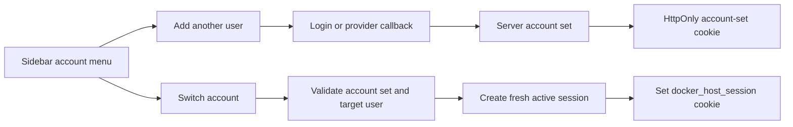

# Browser Account Switching

## Description

Browser account switching lets one browser remember multiple authenticated Host users and switch the active Host session from the sidebar account menu. The experience should feel similar to common multi-account products: the current account is visible in the sidebar, the account menu lists remembered accounts, and "Add another user" starts a login flow that adds another account to the same browser.

The feature should not store raw Host session tokens in client-readable storage. The recommended implementation is a server-side browser account set keyed by an HttpOnly cookie. Login, recovery, and supported external-provider callbacks add the authenticated user to that account set. Switching accounts validates the account-set cookie and creates a fresh active Host session for the selected remembered user.

This feature is account switching, not local user management. Creating new local `host.user` or additional `host.admin` accounts should remain a separate `/settings/users` feature unless explicitly added to this scope.

## Milestones

### Phase 1 - Account set persistence and auth service contract

**Status**: Not Started

Add the server-side account-set model that can remember which Host users are available in the current browser.

- Add an `accountSets` collection to the auth state schema with a record shape similar to:
  - `id`
  - `tokenHash`
  - `users`: remembered user ids with `addedAt` and `lastUsedAt`
  - `createdAt`
  - `updatedAt`
  - `expiresAt`
  - optional `revokedAt`
- Add normalization and validation in `auth-store.ts` so older auth state files continue to load.
- Add an `ACCOUNT_SET_COOKIE_NAME`, cookie creation, cookie clearing, and secure-cookie behavior matching the existing session cookie rules.
- Add auth-service operations:
  - create or load browser account set from cookie
  - add authenticated user to the account set
  - list remembered active users for the account set
  - switch to a remembered user by creating a new active session
  - remove one remembered user from the browser
  - revoke or clear the entire browser account set
- Store only hashes for account-set tokens. Do not persist raw session tokens.
- Add audit events for account added, switched, removed, and account set cleared.
- Ensure switching to an admin account does not mark the new session as recently reauthenticated; sensitive admin actions should still require the existing reauthentication flow.

### Phase 2 - Account switching API and login integration

**Status**: Not Started

Expose the account-set behavior through Host auth APIs and connect it to existing login flows.

- Add `GET /api/auth/accounts` to return the current active user plus remembered account summaries for the current browser.
- Add `POST /api/auth/accounts/switch` with `{ "userId": "..." }` to create a fresh active session for a remembered user and set the active session cookie.
- Add `DELETE /api/auth/accounts/{userId}` or equivalent to remove one remembered account from this browser.
- Add `DELETE /api/auth/accounts` to clear all remembered accounts from this browser and revoke the active session.
- Update `/api/auth/login` so successful local-password login adds the user to the browser account set.
- Update `/api/auth/bootstrap` and `/api/auth/recovery` so setup and recovery sessions also initialize or update the account set.
- Update OIDC callback handling to add the authenticated provider-backed user to the account set when browser-session auth is in use.
- Keep trusted proxy mode out of the first account-switching scope because upstream identity controls the browser principal.
- Add `redirectTo` support where needed so "Add another user" returns to the previous Host page after successful login.

### Phase 3 - Sidebar account menu UX

**Status**: Not Started

Replace the current single-account dropdown in the sidebar with a multi-account menu.

- Fetch remembered accounts from `GET /api/auth/accounts` when the sidebar renders.
- Show the active account first with display name, email, role, and active state.
- Show remembered inactive accounts as switch targets.
- Add an "Add another user" command that opens `/login?mode=add-account&redirectTo=<current-url>`.
- Add current-account logout and all-accounts logout commands with clear labels.
- Keep the compact sidebar behavior: compact mode should still show the active avatar and expose the full account menu on click.
- On successful switch, reload or navigate to the selected account's default shell path:
  - `host.admin` -> `/`
  - `host.user` -> `/apps`
- Ensure `host.user` cannot briefly see admin navigation after switching away from an admin account.

### Phase 4 - Gateway and embedded app cookie hygiene

**Status**: Not Started

Make sure the new account-set cookie does not leak to module traffic.

- Strip the account-set cookie from gateway-proxied module requests in `server.mjs`.
- Strip the account-set cookie from embedded app requests in `app-embed-service.ts`.
- Keep the active `docker_host_session` cookie as the only session credential used by the existing gateway authorization path.
- Verify switch behavior for shell Apps and gateway exposures:
  - `host.admin` remains allowed through assigned-only module access.
  - `host.user` follows `loginRequired` and assignment rules after switching.
  - disabled users are not shown as switchable and cannot be activated.

### Phase 5 - Tests, documentation, and rollout checks

**Status**: Not Started

Cover the behavioral and security edge cases before treating the feature as complete.

- Add unit tests for account-set creation, listing, switching, removal, expiry, disabled users, and audit events.
- Add route tests for the new auth account APIs.
- Add UI-level tests for the sidebar account menu and add-account flow.
- Update `docs/features/auth-gateway.md` with the implemented account-switching behavior after completion.
- Update `docs/features/host-api.md` with the new auth account endpoints after completion.
- Add a release note or operator-facing documentation explaining that account switching remembers accounts per browser, not globally.

## Accepted Decisions

- **Question**: Should this feature create new local users?
  **Decision**: No. The first implementation switches between users that already exist or are provisioned by login providers.
  **Recommendation**: Keep local user creation as a separate `/settings/users` feature so account switching stays focused and safer to ship.

- **Question**: Should account switching work in trusted proxy deployments?
  **Decision**: Not initially. Trusted proxy mode makes the upstream proxy the browser identity authority, and local account switching can conflict with that model.
  **Recommendation**: Disable or hide the switcher when trusted proxy auth mode is active. Revisit only if a specific proxy provider supports explicit account selection.

- **Question**: Should OIDC accounts be supported in the first version?
  **Decision**: Yes, if the existing OIDC callback can add the authenticated Host user to the account set without adding provider-specific assumptions.
  **Recommendation**: Implement OIDC account-set attachment, but treat provider account selection prompts as best effort.

- **Question**: How long should remembered accounts remain available?
  **Decision**: The first version aligns with the existing browser session absolute lifetime.
  **Recommendation**: Use the existing 14-day absolute session lifetime for account sets initially, then add a configurable remember duration later if needed.

- **Question**: What should "Log out" mean in a multi-account menu?
  **Decision**: It removes the active account from this browser and revokes the active session. A separate "Log out all accounts" clears the whole account set.
  **Recommendation**: Use explicit labels: "Log out current account" and "Log out all accounts".

- **Question**: Does switching to an admin account satisfy recent reauthentication?
  **Decision**: No. Switching creates an active session but does not populate `reauthenticatedAt`.
  **Recommendation**: Keep sensitive operations behind the current recent-reauthentication check.

## Risks

- Account-set tokens are persistent authentication credentials. They must be HttpOnly, Secure when required, SameSite Lax, stored server-side only as hashes, audited, and revocable.
- Gateway and embedded module proxies must strip every Host auth cookie, including the new account-set cookie.
- A stale UI can show admin navigation after switching to `host.user` unless the app forces a reload or server navigation after switch.
- Disabled users and revoked account sets must fail closed.
