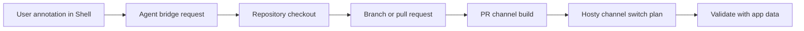

# Agent Bridge Workflow

## Description

This plan covers future Shell-to-agent workflows for changing runtime apps from in-context feedback. It depends on repository-backed app source support and update channels. Without a source checkout and a way to publish pull request channels, the agent bridge has nowhere safe to apply and validate changes.

The target workflow is that a user can open a runtime app, annotate a UI element or route in Hosty Shell, describe a desired change, and let an agent create a branch or pull request. Hosty can then expose a pull request channel so the app can be validated against the same app data before promotion.

## Milestones

### Phase 1 - Define annotation payloads

**Status**: Not Started

- Capture app id, route, selected channel, selected runtime profile, user note, and timestamp.
- Capture optional DOM target, screenshot reference, or selected text.
- Avoid storing sensitive runtime app data unless the user explicitly includes it.
- Add audit records for agent-triggering actions.

### Phase 2 - Add agent bridge service contract

**Status**: Not Started

- Define a Core-owned agent bridge interface.
- Add authorization checks for who can request code changes.
- Pass only app-scoped repository and runtime context to the agent.
- Track request status, branch, pull request, and validation outcome.
- Keep credentials and repository tokens out of Shell-visible state.

### Phase 3 - Connect repository-aware apps

**Status**: Not Started

- Require source repository metadata for agent-editable apps.
- Resolve source checkout and selected commit.
- Create a branch for agent changes.
- Keep agent edits isolated from installed production runtime state.
- Support apps whose current runtime is Docker image but source is available for edits.

### Phase 4 - Publish and consume pull request channels

**Status**: Not Started

- Connect agent-created pull requests to update channel generation.
- Publish PR-specific runtime app channel entries.
- Show generated PR channels in Hosty.
- Reuse update/channel plan review before applying a PR channel.
- Validate PR channels against existing app data and rollback/recovery behavior.

### Phase 5 - User experience and safety

**Status**: Not Started

- Add Shell UI for creating annotations and reviewing agent status.
- Add clear user-facing boundaries for what the agent can inspect and modify.
- Add cancellation and cleanup behavior for stale agent requests.
- Add audit and diagnostics views.

## Open Questions And Recommendations

- Question: Can agent bridge work before repository-backed source support?
  Answer: Not meaningfully for code changes.
  Recommendation: Treat repository-backed source and PR channel publishing as prerequisites.

- Question: Should the agent edit the live app data directory?
  Answer: No.
  Recommendation: Validate changes against copied or mounted app data through normal runtime/channel plans, not by letting the agent mutate production data directly.

- Question: Should every runtime app be agent-editable?
  Answer: No. Docker-only and source-less apps can still be managed by Hosty, but they cannot receive source edits.
  Recommendation: Expose agent actions only when source metadata and permissions are present.

