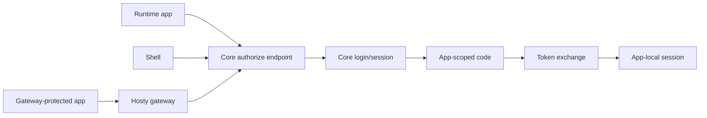

# App Auth And Origin Separation

## Description

This plan covers standalone runtime app authentication, optional gateway-protected access, and the future split between Hosty Core and Hosty Shell public origins.

The current implementation uses one combined public origin through `HOST_PUBLIC_ORIGIN`. That origin serves Shell pages, Core-owned auth pages, and public Core APIs. Runtime apps receive app-scoped identity through Shell iframe token delivery or gateway identity injection; they must not receive Hosty session cookies.

The recommended order is:

1. Define app-scoped identity and authorize/token exchange.
2. Implement standalone auth redirect for Hosty-aware apps.
3. Add SDK/middleware guidance.
4. Add optional gateway-protected mode for non-aware apps.
5. Split Core and Shell public origins after the auth contract exists.

## Milestones

### Phase 1 - Define app-scoped auth contract

**Status**: Not Started

- Define app audience, app id, origin, redirect URI, requested scopes, and token lifetime.
- Define app-scoped signed identity token claims.
- Define app-scoped auth code storage, expiry, and one-time consumption.
- Define revocation/revalidation behavior when Host access assignments change.
- Keep Hosty browser session cookies scoped to Core/Shell only.

### Phase 2 - Implement standalone auth redirect

**Status**: Not Started

- Add Core-owned app authorize endpoint.
- Redirect unauthenticated users to Core login.
- Return app-scoped authorization codes to approved app redirect URIs.
- Add token exchange endpoint for Hosty-aware runtime apps.
- Add refresh or revalidation endpoint if needed.
- Add tests for expired codes, invalid redirect URIs, disabled users, and assignment changes.

### Phase 3 - Add app integration guidance

**Status**: Not Started

- Document Hosty-aware app middleware expectations.
- Document how apps create app-local sessions from Hosty identity.
- Provide examples for Next.js/Node first if that matches existing first-party apps.
- Document how apps should handle Core `401` and `403` responses.
- Document that third-party integration credentials remain app-owned settings or secrets.

### Phase 4 - Add optional gateway-protected access

**Status**: Not Started

- Add manifest/configuration support for gateway-protected mode.
- Use gateway protection as an outer access gate for legacy apps, no-auth apps, third-party tools, external URL/API wrappers, and service endpoints.
- Ensure Hosty session cookies are stripped before forwarding to upstream apps.
- Keep upstream app-owned authentication independent when the upstream already has its own login.
- Add diagnostics that distinguish gateway denial from upstream app denial.

### Phase 5 - Split Core and Shell public origins

**Status**: Not Started

- Add explicit configuration for Core and Shell public origins, such as `HOST_CORE_PUBLIC_ORIGIN` and `HOST_SHELL_PUBLIC_ORIGIN`.
- Keep `HOST_PUBLIC_ORIGIN` as a compatibility alias for combined deployments during migration.
- Decide whether Core-owned auth pages live on the Core origin, Shell origin, or a dedicated auth system-app origin.
- Update Shell API calls to use the configured Core origin instead of same-origin `/api`.
- Add CORS, CSRF, cookie, account switching, logout, OIDC callback, and trusted proxy behavior for cross-origin Shell-to-Core requests.
- Document reverse proxy and TLS requirements.

### Phase 6 - Migration and validation

**Status**: Not Started

- Validate existing same-origin deployments continue to work.
- Validate split-origin deployments with HTTPS.
- Add warnings for insecure non-loopback public origins.
- Add migration docs for installations where `HOST_PUBLIC_ORIGIN` currently represents combined Core/Shell origin.

## Open Questions And Recommendations

- Question: Should auth pages belong to Core or Shell after origins split?
  Answer: Not implemented.
  Recommendation: Keep auth pages Core-owned first. Shell should redirect to Core and resume after auth.

- Question: Should Hosty support gateway-protected mode before standalone auth?
  Answer: It is possible, but it risks making gateway mode the default for first-party apps.
  Recommendation: Implement standalone auth first and keep gateway-protected mode explicitly optional.

- Question: Should runtime apps share Hosty browser cookies?
  Answer: No. This is already an accepted decision.
  Recommendation: Runtime apps should receive only app-scoped auth codes or signed identity tokens.

