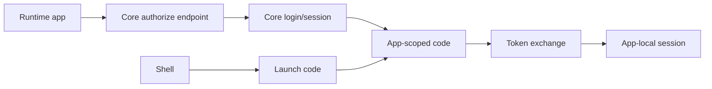

# App Auth And Origin Separation

## Description

This plan covers Hosty-aware runtime app authentication, standalone app launch, Shell app launch, and the future split between Hosty Core and Hosty Shell public origins.

The current implementation uses one combined public origin through `HOST_PUBLIC_ORIGIN`. That origin serves Shell pages, Core-owned auth pages, and public Core APIs. Runtime apps receive app-scoped identity through Shell iframe token delivery today; the target model is an app-scoped launch/auth code exchange that lets each Hosty-aware app create and refresh its own app-origin session. Runtime apps must not receive Hosty session cookies.

The source-runtime developer workflow should use existing Host users rather than seeded development users. Trusted local CLI helpers can list Host users and request app-scoped identity or one-time standalone app auth links for a selected existing user, but those helpers must still enforce disabled-user, app-assignment, and access-policy checks by default.

Gateway/proxy wrapping for arbitrary third-party browser applications is out of scope for this plan. Browser runtime apps are expected to be written or adapted for Hosty, receive Core origin/app identity configuration, and exchange app-scoped codes with Core.

The current stabilization branch implements Shell lifecycle management before broadening auth behavior. The recommended order for this plan after Shell management is usable is:

1. Stabilize split-origin Core/Shell browser requests, credentials, and login/logout navigation.
2. Define app-scoped identity and authorize/token exchange.
3. Implement Shell launch and standalone auth redirect for Hosty-aware apps.
4. Add SDK/middleware guidance.
5. Keep auth pages Core-owned unless a later UI split requires a dedicated auth surface.
6. Defer gateway/proxy wrapping until a separate future plan.

## Milestones

### Phase 1 - Define app-scoped auth contract

**Status**: Partially Implemented

- Define app audience, app id, origin, redirect URI, requested scopes, and token lifetime.
- Define app-scoped signed identity token claims.
- Define app-scoped auth code storage, expiry, and one-time consumption.
- Define revocation/revalidation behavior when Host access assignments change.
- Keep Hosty browser session cookies scoped to Core/Shell only.

Implemented in the Core/Shell stabilization branch:

- Core app identity tokens use app id as audience, Host user id as subject, Host email/display name/role claims, and a five-minute lifetime.
- App auth codes are one-time, expire after five minutes, and are rechecked against current disabled-user and assignment state before exchange.
- Browser app launch-code issuance uses the active Core session user only. Trusted local control helpers remain the only surface that can request identity/open links for an explicitly selected existing user.
- Redirect URIs are constrained to installed app endpoint origins before Core issues an app code.

### Phase 2 - Implement Shell launch and standalone auth redirect

**Status**: Partially Implemented

- Add Core-owned app authorize endpoint.
- Redirect unauthenticated users to Core login.
- Return app-scoped authorization codes to approved app redirect URIs.
- Add token exchange endpoint for Hosty-aware runtime apps.
- Add Shell launch-code issuance for opening a runtime app under the active Host user without passing Hosty session cookies to the app.
- Add a trusted local CLI/control helper that can create a short-lived, one-time app auth link for an existing enabled Host user when normal app access checks pass.
- Add refresh or revalidation endpoint for app-origin sessions when needed.
- Add tests for expired codes, one-time consumption, invalid redirect URIs, disabled users, assignment changes, and app session refresh/revalidation.

Implemented in the Core/Shell stabilization branch:

- Core exposes app authorize, token exchange, revalidate, and Shell launch-code APIs.
- Shell runtime app open actions request launch codes from Core with CSRF and open the returned app-scoped redirect URI.
- Trusted local control open-link helpers can create shell or standalone links for existing enabled Host users when access checks pass.

### Phase 3 - Add app integration guidance

**Status**: Not Started

- Document Hosty-aware app middleware expectations.
- Document how apps create app-local sessions from Hosty identity.
- Provide examples for Next.js/Node first if that matches existing first-party apps.
- Document how apps should handle Core `401` and `403` responses.
- Document that third-party integration credentials remain app-owned settings or secrets.

### Phase 4 - Split Core and Shell public origins

**Status**: In Progress

- Add explicit configuration for Core and Shell public origins, such as `HOST_CORE_PUBLIC_ORIGIN` and `HOST_SHELL_PUBLIC_ORIGIN`.
- Keep `HOST_PUBLIC_ORIGIN` as a compatibility alias for combined deployments during migration.
- Decide whether Core-owned auth pages live on the Core origin, Shell origin, or a dedicated auth system-app origin.
- Update Shell API calls to use the configured Core origin instead of same-origin `/api`.
- Add CORS, CSRF, cookie, account switching, logout, OIDC callback, and trusted forwarded-header behavior for cross-origin Shell-to-Core requests.
- During local development, Core should allow the default Shell origin `http://127.0.0.1:3000` when running in the development environment, while retaining `HOST_SHELL_PUBLIC_ORIGIN` for explicit split-origin deployments.
- Document reverse proxy and TLS requirements for Core/Shell deployment frontends, not for runtime app browser UI wrapping.

### Phase 5 - Defer gateway/proxy wrapping

**Status**: Not Started

- Keep arbitrary third-party browser app wrapping out of the current runtime app auth implementation.
- Do not add gateway-protected browser UI mode as the default or fallback path for apps that do not implement Hosty auth.
- Record future requirements separately if Hosty later needs to wrap legacy apps, no-auth apps, third-party tools, or external URL/API apps.
- Keep service/API endpoint exposure distinct from browser UI app launch.

### Phase 6 - Migration and validation

**Status**: Not Started

- Validate existing same-origin deployments continue to work.
- Validate split-origin deployments with HTTPS.
- Add warnings for insecure non-loopback public origins.
- Add migration docs for installations where `HOST_PUBLIC_ORIGIN` currently represents combined Core/Shell origin.

## Open Questions And Recommendations

- Question: Should auth pages belong to Core or Shell after origins split?
  Answer: Core. Alternate Shells can be browser, desktop, mobile, or other clients, so provider-specific auth pages and session creation must stay Core-owned.
  Recommendation: Shell clients should redirect or open a Core-owned webview for login, logout, invitation acceptance, and provider callbacks, then resume Shell state from Core session APIs.

- Question: Should Hosty support gateway/proxy wrapping for browser apps in this plan?
  Answer: No. It is deferred.
  Recommendation: Treat current browser runtime apps as Hosty-aware apps and capture third-party wrapping in a separate future plan only when the requirements are clearer.

- Question: Should runtime apps share Hosty browser cookies?
  Answer: No. This is already an accepted decision.
  Recommendation: Runtime apps should receive only app-scoped auth codes or signed identity tokens.

- Question: Can a browser Shell select which Host user receives an app launch code?
  Answer: No. Browser launch-code issuance uses the active Core session user. Explicit user selection is limited to trusted local control and CLI helpers.
  Recommendation: Keep browser launch-code APIs session-bound and CSRF-protected.
