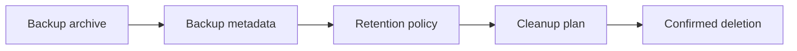

# App Data Backup Retention

## Description

The Hosty compatibility foundation implements manual app data backups, pre-update backups, pre-restore backups, ZIP archive metadata, digest verification, per-entry CRC validation before restore, delete-one Core APIs, and conservative automatic retention for pre-update backups. Shell/CLI backup management controls, scheduled retention cleanup, and retention previews remain planned.

This plan covers the remaining backup management work: retention previews, scheduled cleanup, Shell and CLI controls, and documentation for safe deletion.

## Milestones

### Phase 1 - Define retention policy model

**Status**: Partially Implemented

- Add default retention settings for manual, pre-update, pre-restore, scheduled, and pre-runtime-switch backups.
- Support keep-last-N per app.
- Support optional max age per backup reason.
- Ensure retention never deletes the only known backup unless explicitly configured.

### Phase 2 - Add backup deletion APIs

**Status**: Partially Implemented

- Add list details that show retention eligibility.
- Add delete-one backup API with confirmation.
- Existing Core control APIs can delete one backup by id; Shell/CLI confirmation UX remains planned.
- Add cleanup plan API that previews which archives and metadata files will be removed.
- Add cleanup apply API with digest/path verification.

### Phase 3 - Add scheduled retention cleanup

**Status**: Not Started

- Add a Host-owned scheduler or maintenance hook.
- Run retention cleanup safely without blocking app lifecycle operations.
- Write audit/diagnostic records for cleanup.
- Handle missing archive or metadata pairs gracefully.

### Phase 4 - Add UI and CLI controls

**Status**: Partially Implemented

- Add `hosty apps backup delete <app-id> <backup-id>` or equivalent command.
- Add `hosty apps backups prune <app-id>` or equivalent command.
- Add Web UI actions for backup deletion and retention previews.
- Document manual filesystem cleanup as a fallback, not the preferred path.

Implemented in the Core/Shell stabilization branch:

- Shell can list backups, create a manual backup, restore a stopped app from a backup, and delete one backup with confirmation.
- Shell shows the current conservative retention behavior: manual backups remain explicit, pre-update and pre-restore backups keep the latest five per app, and scheduled retention is still deferred.
- Core browser and trusted local control APIs expose delete-one backup behavior.

Remaining:

- Add cleanup preview/apply APIs with digest/path verification.
- Add scheduled retention cleanup.
- Add CLI prune/delete commands where they are needed for local recovery.

## Open Questions And Recommendations

- Question: What default retention policy should Hosty use?
  Answer: Not decided.
  Recommendation: Start conservative: keep all manual backups, keep last 5 pre-update/pre-restore backups per app, and do not apply age-based deletion by default.

- Question: Should retention be global or per app?
  Answer: Not implemented.
  Recommendation: Support global defaults with per-app override later.
