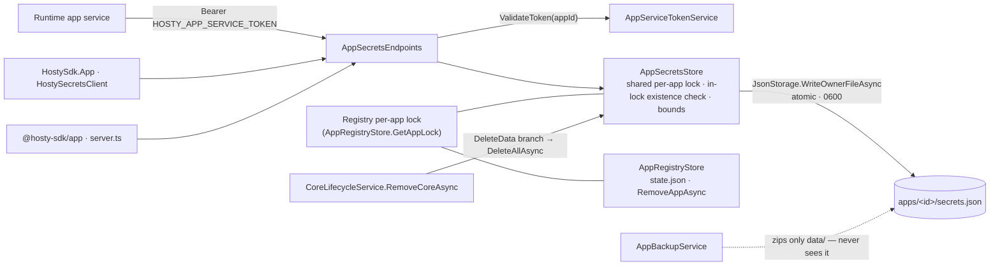

# App Secrets Store

Status: Implemented (Core 0.60.0; `HostySdk.App` 0.2.0, `@hosty-sdk/app` 0.3.0)
Created: 2026-07-22
Updated: 2026-07-22

## Goal

Implement the Core-managed keychain for runtime-acquired app secrets ratified in
the [promoted design](../ideas/app-secrets-store.md): an app-callable API under
the existing service token, persisted in Core-owned `apps/<id>/secrets.json`
outside backup scope, with SDK clients in both packages so no app hand-rolls the
contract. First consumer: media-server's Trakt integration, which drops its
operator-generated token-encryption-key workaround when this ships.

## Scope

- `AppSecretsStore`: per-app document store beside `state.json` with atomic
  owner-only writes, per-app locking, and bounds enforcement.
- `AppSecretsEndpoints`: list/get/put/delete under
  `/api/internal/apps/{appId}/secrets…`, authenticated with the inline
  service-token guard used by every existing app-callable endpoint.
- Removal integration: `secrets.json` follows the operator's delete-data choice.
- SDK secrets clients: `HostySecretsClient` in `HostySdk.App` (NuGet) and
  server-only functions in `@hosty-sdk/app` (npm).
- Tests following the repository's established endpoint/store patterns.
- Feature documentation and one platform minor version bump on completion.

## Out of Scope

- Encryption-at-rest (Decision 3 of the design: plaintext 0600 parity with
  `state.json`; a platform-wide at-rest pass is future work).
- Shell UI, CLI commands, rate limiting, change events, secret versioning, or a
  watch API.
- Per-service scoping inside multi-service apps; cross-app secret sharing.
- Service-token scoping/expiry hardening (C-M7) — companion work, not this plan.
- Core-state backup of secrets for whole-machine migration.
- media-server's Trakt adoption (owned by that app's own plan).

## Current Behavior

Verified 2026-07-22 against the working tree:

- All app-callable endpoints (`AppDirectoryEndpoints`, `AppBackupEndpoints`,
  `NotificationEndpoints`) are minimal APIs registered from
  `HostyCoreApplication`, each authenticating inline:
  `CoreSessionAuthorization.ReadBearerToken(request)` +
  `AppServiceTokenService.ValidateToken(appId, token)` (401), then a
  `GetAppAsync` existence check (404). Cross-app rejection is structural — the
  app id is HMAC-signed into the token, so a token minted for app B fails
  validation against route app A (covered by `AppServiceTokenServiceTests`).
- `AppRegistryStore` owns `state.json`: per-app `SemaphoreSlim` (`GetAppLock`),
  path composed via traversal-safe
  `CoreDataPaths.ResolveContainedPath(paths.AppsRoot, appId)`, writes through
  `JsonStorage.WriteOwnerFileAsync` — atomic temp-file + rename, 0600 file mode,
  containing directory left traversable so a container running as another uid
  can still reach `data/`. `GetAppAsync` reads are lock-free.
- `AppBackupService.CreateBackupAsync` zips exactly `apps/<id>/data`; nothing
  beside it enters an archive.
- There are **two per-app lock families today**, and they do not overlap:
  `CoreLifecycleService.operationLocks` (`WithAppLockAsync`) serializes
  lifecycle verbs — including `RemoveAsync` — while `AppRegistryStore.appLocks`
  (`GetAppLock`) serializes `state.json` writes and the hard subtree delete in
  `RemoveAppAsync`. `RemoveCoreAsync` deletes `state.json`/`manifest.json`/
  `data/` as direct file operations under the lifecycle lock only.
- `CoreLifecycleService.RemoveCoreAsync` takes
  `AppRemoveRequest(DeleteRuntimeState = true, DeleteData = false, …)`. When
  data is kept it writes `retained-config.json` (settings including secrets,
  mounts, autostart) for reinstall; when `DeleteData` is set it deletes the
  retained config and `data/`. `AppRegistryStore.RemoveAppAsync` hard-deletes
  the whole app subtree under the registry's `GetAppLock`.
- JSON serialization uses the AOT source-generated `CoreJsonSerializerContext`;
  unregistered request/response types fail at runtime, not compile time.
- `EndpointAuthorizationTests` mechanically scans a fixed list of endpoint
  source files to enforce CSRF flags on session-authenticated mutations;
  service-token endpoints are exempt by design.
- SDK packages: `packages/app-sdk` (npm `@hosty-sdk/app`; `src/server.ts` holds
  the service-token plumbing, e.g. `revalidateWithCore`) and
  `packages/app-sdk-dotnet` (NuGet `HostySdk.App`; `CoreIdentityValidator`
  calls Core with `HostyAppOptions.ServiceToken`). Neither has any secrets
  client today.
- There is no encryption-at-rest anywhere in Core or the CLI; the Cloudflare
  API token (`CloudflareCredentialStore`) and `secret: true` settings are
  plaintext 0600 by design.

## Target Behavior

### Contract

```text
GET    {HOSTY_CORE_ORIGIN}/api/internal/apps/{appId}/secrets
Authorization: Bearer <HOSTY_APP_SERVICE_TOKEN>
→ 200 { "keys": ["trakt.connection.4.tokens", …] }        // names only

GET    .../secrets/{key}      → 200 { "value": "…" } | 404
PUT    .../secrets/{key}      { "value": "…" }      → 204   // create or replace
DELETE .../secrets/{key}      → 204                          // idempotent
```

- Every handler uses the standard inline guard: bearer token must validate for
  the route `{appId}` (401 otherwise), then the app must exist (404 otherwise)
  — byte-for-byte the `AppDirectoryEndpoints` pattern.
- Key naming `^[a-z0-9][a-z0-9._-]{0,127}$`; value is a non-empty UTF-8 string
  of at most 16 KiB; at most 256 keys per app. Violations return 400 with the
  existing internal-endpoint error conventions; values are never truncated.
  The store enforces the same bounds independently of the endpoint — they are
  the persisted document's invariant, and the store is reachable from other
  Core code.
- A `GET` 404 for an absent key is an expected state (reconnect-required), not
  an error path.
- List returns key names only; values are never enumerable.

### Storage

New `AppSecretsStore` (singleton, DI-registered beside `AppServiceTokenService`
in `HostyCoreApplication`), modeled on `AppRegistryStore`:

- Path: `Path.Combine(CoreDataPaths.ResolveContainedPath(paths.AppsRoot, appId), "secrets.json")`.
- Document:
  `{ "schemaVersion": 1, "secrets": { "<key>": { "value": "…", "updatedAt": "<ISO-8601 UTC>" } } }`.
  `updatedAt` is file-internal diagnostics, not exposed through the API in v1.
  The schema version exists so a future at-rest encryption pass is a lazy
  migration, not a format break.
- Read via `JsonStorage.ReadAsync`; write via `JsonStorage.WriteOwnerFileAsync`
  (atomic temp + rename, 0600 file, traversable directory). A missing file
  reads as an empty store; a malformed file fails loud rather than being
  silently replaced.
- **Locking: the store serializes on the registry's per-app lock family, not a
  third one.** `AppRegistryStore.GetAppLock` becomes shareable (exposed to the
  secrets store, or both consume one extracted per-app lock registry), so
  secrets operations, `state.json` writes, and the `RemoveAppAsync` recursive
  delete all contend on the same per-app semaphore. Store reads take the lock
  too (cheap, and it removes torn-read reasoning entirely).
- **Two removal fences, both re-checked inside the lock** immediately before the
  mutation — not only in the endpoint prologue. Without them an in-flight PUT
  could finish after removal deleted the secrets and `WriteOwnerFileAsync`
  would write the credential it was carrying back to disk:
  1. **`state.json` existence** — covers an ordinary removal, which deletes it.
     A write that loses the race observes the deletion and returns 404.
  2. **A per-app data-removal generation** held on `AppRegistryStore` beside the
     shared lock, bumped by `DeleteAllAsync`. This covers
     `hosty apps remove --delete-data --keep-state`, a supported combination
     where `state.json` deliberately survives and existence alone proves
     nothing. A mutation samples the generation on entry and re-checks it under
     the lock, so only writes that *straddle* a removal are refused — a request
     that starts afterwards samples the new value and proceeds, which matters
     because a kept-state app is still installed. It lives on the registry, not
     the secrets store, so any collaborator sharing the registry shares the
     fence by construction rather than by DI wiring.
- Request/response records registered in `CoreJsonSerializerContext`.

### Lifecycle

- Update / restart / runtime-switch / Core restart: the file simply persists;
  no runtime-adapter involvement.
- Backup / restore: structurally excluded (backup zips only `data/`). Restore
  rolls the database back, not the secrets; the app reconciles rows referencing
  secrets that no longer exist (or the reverse) as its defined reconnect state.
- Removal: `DeleteData: false` (default) retains `secrets.json` alongside
  `retained-config.json`. `DeleteData: true` deletes it **through
  `AppSecretsStore.DeleteAllAsync(appId)`** — which takes the shared per-app
  lock — ordered after the `state.json` deletion and before the empty-root
  cleanup, so a concurrent write either lands first and is then deleted, or
  arrives after and 404s on the existence re-check. The hard-delete path
  (`RemoveAppAsync`) already runs its recursive delete under the same shared
  lock, so in-flight secret writes serialize against it and late writes 404.
  A PUT that completes just before removal deletes the store is benign: its
  write is removed with everything else.

### Observability and redaction

Values never appear in logs, audit records, telemetry, Shell payloads, or error
bodies; log statements reference key names at most.

## Acceptance Criteria

- [x] An app can list/get/put/delete its own secrets with its service token;
  another app's token yields 401; an unknown app yields 404.
- [x] `secrets.json` is created beside `state.json` with mode 0600 via the
  atomic write path, and never appears in a backup archive.
- [x] Bounds enforced: malformed key, empty or oversize value, and the 257th
  key are rejected with 400 and no partial write.
- [x] A restored backup leaves stored secrets untouched.
- [x] Keep-data removal retains `secrets.json` and a reinstall can read it;
  delete-data removal deletes it; hard subtree deletion covers it.
- [x] A secret write racing app removal cannot leave or recreate `secrets.json`
  after delete-data removal completes: mutations re-check both fences under the
  shared per-app lock, removal deletes the store under that same lock, and
  straddling writes return 404 — covered by interleaving tests for the ordinary
  removal, the `--delete-data --keep-state` variant, and the hard
  subtree-delete path.
- [x] A malformed `secrets.json` fails loud; a missing one reads as empty.
- [x] Concurrent writes to one app's store are serialized; a Core kill mid-write
  never leaves a torn file (temp + rename).
- [x] Secret values appear in no log output, no Shell/admin API response, and
  no error body; the list endpoint returns names only.
- [x] `EndpointAuthorizationTests` sees the new endpoint file and passes
  (service-token endpoints are CSRF-exempt by design).
- [x] SDK clients in both packages cover all four operations; the .NET client's
  write-through cache serves reads when Core is briefly unavailable and stays
  consistent through its own writes.
- [x] `docs/features/` documentation describes only implemented behavior;
  `core-api.md` lists the endpoints; the `hosty-app-sdk.md` second-wave
  inventory includes the clients.

## Deliverables

- [x] `AppSecretsStore` with document schema, atomic owner-only writes, bounds
  enforcement, fail-loud malformed-file behavior, and serialization on the
  registry's shared per-app lock (extracted or exposed from
  `AppRegistryStore.GetAppLock`) with the in-lock existence re-check.
- [x] `AppSecretsEndpoints` (four minimal-API routes, inline service-token
  guard + app existence check), registered in `HostyCoreApplication`; DTOs in
  `CoreJsonSerializerContext`.
- [x] Removal integration in `CoreLifecycleService.RemoveCoreAsync` for both
  `DeleteData` values, deleting through `AppSecretsStore.DeleteAllAsync` under
  the shared lock, plus removal-race interleaving tests.
- [x] Core tests: pure validation statics tested directly (the
  `NotificationEndpointsTests` pattern), store CRUD + permissions + bounds
  against a temp directory (the `AppBackupServiceTests` pattern), removal-flow
  coverage, `EndpointAuthorizationTests.EndpointFiles` extended.
- [x] `HostySecretsClient` in `packages/app-sdk-dotnet/HostySdk.App/`
  (mirroring `CoreIdentityValidator`: `GetAsync` null on 404, `SetAsync`,
  `DeleteAsync`, `ListKeysAsync`, write-through in-memory cache with a bypass
  option) plus tests in `HostySdk.App.Tests`.
- [x] Secrets functions in `packages/app-sdk/src/server.ts` (server-only,
  following the `revalidateWithCore` pattern), re-exported through the
  `./server` entry point, plus tests.
- [x] SDK package minor bumps and changelogs per the
  [repository release model](../features/repository-release-model.md).
- [x] `docs/features/app-secrets-store.md` describing implemented behavior;
  `docs/root.md` index updated (ideas entry annotated, features entry added,
  this plan marked Implemented); `core-api.md` and `hosty-app-sdk.md` updated.
- [x] Notify the first consumer: media-server platform request #15 flips to
  Implemented; its Trakt plan drops the fallback encryption-key design.
- [x] One platform **minor** version bump in `Directory.Build.props`
  (`0.59.0` → `0.60.0`, unless the tree has moved by then) in the same change
  that ships the work, per `AGENTS.md`.

## Technical Design



The store is deliberately boring: one JSON document per app, the registry's
existing per-app lock (shared, not a third lock family — so secret mutations,
`state.json` writes, and subtree deletion serialize together), the existing
atomic write path, and the existing auth guard. No new authentication, no new
mounts, no runtime-adapter changes, no backup-service changes.

## Risks

- **The service token becomes more valuable** — with this store it grants live
  third-party account access, and it still has no expiry, scopes, or
  per-install generation (C-M7). Accepted for the trusted single-tenant
  homelab; scoping/expiry should land before marketplace-era third-party apps.
- **Retained secrets outlive keep-data removal.** A removed-but-kept app leaves
  working credentials on disk until reinstall or delete-data removal. This
  mirrors `retained-config.json` (which retains secret settings) and is the
  ratified trade-off for working reinstalls; the features doc must state it.
- **DB/keychain divergence after restore** is by design (rotating refresh
  tokens), but consuming apps must actually implement the reconnect state for
  missing secrets; the SDK clients surface 404 as "no value" to make that path
  explicit.
- **A malformed `secrets.json` blocks the app's secret operations** until the
  operator intervenes (fail-loud, no silent replacement). Preferable to silent
  credential loss, but the error surface must name the file.
- **The removal race is designed out, not assumed away** (review finding,
  2026-07-22): the lifecycle `operationLocks` and the registry `appLocks` are
  disjoint today, so a store with its own third lock would let an in-flight
  write resurrect `secrets.json` after delete-data removal. The shared-lock +
  in-lock existence re-check + store-mediated `DeleteAllAsync` design closes
  both removal paths; the interleaving tests in Acceptance Criteria keep it
  closed.

## Open Questions

None open. The four questions raised in the idea stage were resolved in the
[promoted design](../ideas/app-secrets-store.md) (Decisions 3, 4, 9, 10):
plaintext-0600 parity instead of v1 encryption, removal following the
operator's data choice, no per-service scoping in v1, and SDK clients shipping
with the feature. Ratified 2026-07-22.

## Implementation Phases

### Phase 1: Core Store and API

- [x] `AppSecretsStore` + document schema + bounds + locking + atomic writes.
- [x] `AppSecretsEndpoints` + registration + serializer-context entries.
- [x] Removal integration for both `DeleteData` values.
- [x] Core tests per Deliverables, including `EndpointAuthorizationTests`
  extension.

### Phase 2: SDK Clients

- [x] `HostySecretsClient` (.NET) with write-through cache + tests.
- [x] `server.ts` secrets functions (TypeScript) + tests.
- [x] Package version bumps and changelogs.

### Phase 3: Documentation and Release

- [x] Feature doc, `docs/root.md` index updates, `core-api.md`,
  `hosty-app-sdk.md` second-wave inventory.
- [x] media-server request #15 status flip and Trakt-plan fallback removal
  (separate repo).
- [x] Platform minor version bump in the shipping change.

## Verification

```sh
dotnet test apps/core/tests/Haas.Hosty.Core.Tests/Haas.Hosty.Core.Tests.csproj
```

Manual, against a dev install (`.hosty-dev`):

- PUT/GET/DELETE/list a secret with the app's own service token; verify 401
  with another app's token and 404 for an unknown app or absent key.
- Verify `secrets.json` appears beside `state.json` with mode 0600, and that a
  freshly created app backup archive does not contain it.
- Restore an older backup and verify the secret survives untouched.
- Remove the app keeping data → `secrets.json` retained; reinstall → readable.
  Remove with data deletion → `secrets.json` gone.
- Verify bounds: reject a 17 KiB value, a malformed key, and the 257th key.
- Kill Core mid-write under a write loop; verify no torn file and continued
  reads after restart.
- Grep Core logs for a stored value; expect zero hits.

## Links

- [Promoted design](../ideas/app-secrets-store.md)
- [App data backup retention](../features/app-data-backup-retention.md)
- [Core API](../features/core-api.md)
- [Hosty App SDK](../ideas/hosty-app-sdk.md)
- [Repository and release model](../features/repository-release-model.md)
- [2026-07-10 Core code review (C-M7)](../reviews/2026-07-10-core-code-review.md)
- [media-server platform request #15](https://github.com/alex-de-haas/media-server/blob/main/docs/features/hosty-platform-requests.md)
- [media-server Trakt plan](https://github.com/alex-de-haas/media-server/blob/main/docs/planning/trakt-watched-state-sync.md)

## Notes

Shipped in three parts: the Core store and API (#266, platform 0.60.0), the SDK
clients (#267, `HostySdk.App` 0.2.0 and `@hosty-sdk/app` 0.3.0), and this
documentation pass. Implemented behavior lives in
[features/app-secrets-store.md](../features/app-secrets-store.md); the design
record with its ten ratified decisions stays in
[ideas/app-secrets-store.md](../ideas/app-secrets-store.md).

Two defects surfaced in review rather than in testing, and both are worth
remembering. The removal fence originally keyed on `state.json` existence alone,
which `--delete-data --keep-state` defeats; it needed the per-app data-removal
generation. The SDK caches originally keyed on the bare secret name and let a
straddling read overwrite a newer write; both were fixed before merge.

The live verification pass (2026-07-22) found one thing the automated tests
could not: secret **key names** appear in Core's Development request log via the
URL path. Names are listable by design, so nothing leaks, but it is recorded in
the feature document so apps do not encode sensitive data in a key name.
