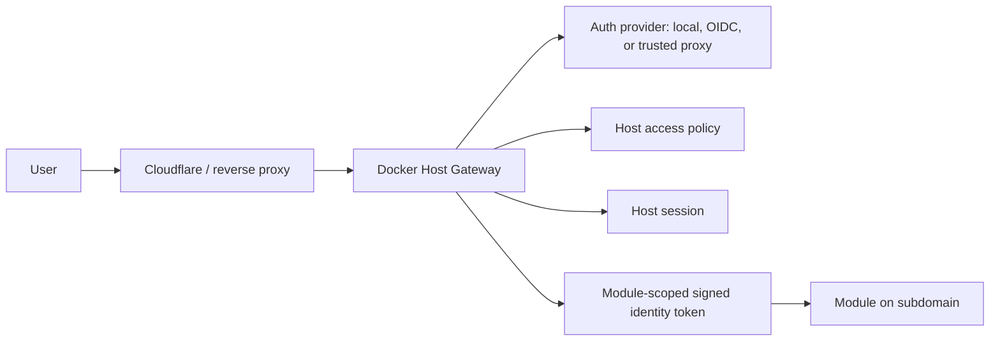

# Auth Gateway

## Description

Docker Host should own authentication and authorization for its Web UI, Host API, and externally exposed module UIs. External identity providers such as Auth0, Keycloak, Authentik, ZITADEL, Microsoft Entra ID, GitHub OAuth, Cloudflare Access, Pomerium, or oauth2-proxy may authenticate users, but Docker Host remains the policy enforcement point.

The Host should protect all privileged operations itself. A regular managed module must not be required to secure the Host, because that would create a dependency cycle: the Host would need a module that the Host itself installs, updates, stops, and recovers before the Host can safely expose its own administrative UI.

Accepted direction:

- module UIs are exposed on their own subdomains, not through path-based routing;
- all external module traffic goes through the Host gateway unless an explicit development override is used;
- Host decides whether a module can be opened by an unauthenticated visitor, any logged-in user, or only assigned users;
- Host roles stay simple at first: `host.admin` and `host.user`;
- modules own their internal authorization and store their own module-specific permissions;
- modules may query a Host-scoped directory of users assigned to that module, but must not receive the whole Host user directory by default;
- multiple real-world accounts are modeled as multiple Host users with account switching, not as required identity profiles in the first implementation;
- identity profiles remain a possible future extension if multiple external identities must later be linked into one Host person.

Target model:



Authentication and authorization are separate concerns:

- authentication identifies the user and establishes a Host session;
- Host authorization decides whether the user can access the Host, open a module, or operate module lifecycle actions;
- module authorization decides what the user can do inside a module after access has been granted;
- module identity propagation uses short-lived Host-signed tokens scoped to a specific module audience.

The recommended implementation direction is to start with local Host authentication and internal authorization primitives, then add gateway routing and module identity tokens, then add generic OIDC, trusted proxy modes, and external ingress automation.

## Milestones

### Phase 1 - Architecture and policy model

**Status**: In Progress

Define the core boundaries before implementation:

- Auth core is part of Docker Host, not an ordinary managed module.
- Host API and Web UI are protected at the Host boundary.
- Module UIs are exposed through a Host gateway instead of direct public container ports.
- Module UI routing is subdomain-based.
- External providers can authenticate users, but Host owns Host roles, module access assignment, sessions, and audit events.
- Modules own their internal role and permission systems.
- Service-to-service module calls are treated separately from user-to-module access.

Initial Host role model:

- `host.admin` can manage Host configuration, auth settings, module install/update/remove, module exposure, and recovery flows.
- `host.user` can access modules allowed by module exposure policy and assignment state, but cannot call Host API functionality, including module listing or Host status views.

Module exposure policy should use three explicit states:

| Policy | Host login required | Host assignment required | Intended use |
| --- | --- | --- | --- |
| `public` | no | no | Public module UI that does not need Host identity. |
| `loginRequired` | yes | no | Any authenticated Host user can open the module; module handles internal permissions. |
| `assignedUsersOnly` | yes | yes for `host.user` | Host grants access to selected users; module still handles internal permissions. |

`loginRequired` is the default exposure policy for externally opened module UI ports. The existing metadata field `runtime.ports[].public` remains a port capability hint that an endpoint is suitable for external UI exposure. It is not the Host authorization policy. Normal external module access must still go through the Host gateway and use the Host-owned exposure policy.

Host-level permissions and module-level permissions should remain separate:

- Host decides whether a request can reach a module.
- The module decides which actions are available inside the module.
- Host may pass `hostRole` in the identity token so a module can implement bootstrap or admin UX, but Host does not automatically own every module's internal authorization model.
- `host.admin` can reach modules through the Host gateway for bootstrap and configuration even when the module uses `assignedUsersOnly`; the module decides whether that Host role becomes an internal module administrator.
- `host.user` has no Host management surface. A `host.user` only receives access to module subdomains allowed by module exposure policy and assignment state.

#### Decisions

- Authentication is mandatory by default for local Host instances, including `localhost`. Development bypass must be explicit configuration, not the default.
- Direct public module port publishing is not part of the normal exposure model. It may exist only as an explicit development override; production-like access goes through the Host gateway.
- CLI module commands should use local administrator credentials or a local administrator token. The CLI is expected to run on the local physical machine and should not expose those credentials outside the machine.
- `host.admin` is allowed through the Host gateway for module bootstrap and configuration. Internal module administrator rights remain module-owned and may be granted, mapped, or ignored by the module.

#### Open Questions

- What exact local credential form should the CLI store or request for admin access in Phase 2?

### Phase 2 - Local Host authentication

**Status**: Not Started

Implement a local provider that works without external services:

- bootstrap the first admin through a CLI/setup token;
- create Host-owned user identities;
- store password credentials or another local login method;
- issue secure cookie sessions for Web UI and API calls;
- support multiple Host accounts in the browser through an account switcher;
- protect all privileged API routes;
- provide logout and session revocation;
- log authentication and authorization decisions.

This phase should produce the minimum viable security boundary for a local-first Docker Host installation.

The first identity model should be simple:

```text
personal@example.com -> host.admin
work@example.com     -> host.user
```

Fast switching between these accounts should be a UI/session feature. It should not require a separate profile model in the MVP.

#### Open Questions

- Should local auth start with password login, passkeys, or password login with passkeys planned later?
- Where should local users, roles, and sessions be persisted: `modules.json`, a separate JSON file, or SQLite?
- What is the emergency recovery flow if the only admin account is lost?
- What session lifetime and idle timeout should be used by default?
- Should Host remember a preferred account per module subdomain for faster switching?

### Phase 3 - Host gateway for subdomain module exposure

**Status**: Not Started

Add a gateway layer that routes external module traffic through Docker Host:

- maintain a module exposure registry;
- map hostnames to installed module targets;
- route traffic to Docker network aliases and container ports;
- apply the module exposure policy before proxying;
- support HTTP, static assets, redirects, uploads, streaming, websockets, SSE, long polling, and SignalR-style negotiation where practical;
- keep module containers private by default.

Preferred external routing model:

```text
host.example.com    -> Docker Host Web UI
reports.example.com -> Docker Host Gateway -> mod-reports:8080
media.example.com   -> Docker Host Gateway -> mod-media:3000
```

Path-based module routing is not part of the accepted target model. Many module UIs assume they run at `/`, and realtime transports such as WebSockets and SignalR are simpler and more predictable on a dedicated subdomain.

Realtime behavior:

- Host authorizes the initial HTTP request or WebSocket upgrade.
- SignalR-style `/negotiate` endpoints must be proxied with the same access checks as the socket endpoint.
- For WebSockets, identity is established at handshake time.
- Host should be able to close active gateway connections if a session is revoked or module access changes.
- Long-lived connections should have a defined revalidation or maximum lifetime policy.

#### Open Questions

- How should redirects from modules be rewritten or constrained when modules run on dedicated subdomains?
- How should the Host represent and validate public hostname ownership?
- What connection revalidation policy should be used for WebSockets and other long-lived transports?
- Should each module hostname be limited to one module, or should future virtual-host routing support aliases per module?

### Phase 4 - Module identity contract

**Status**: Not Started

Define how modules receive authenticated user context from Host:

- Host must not share its own session cookie with modules.
- Host should issue short-lived signed JWTs for proxied module requests when a user is authenticated.
- Tokens should be scoped to a module with `aud` equal to the module id.
- Tokens should include normalized Host identity, Host role, and module access context.
- Modules should validate tokens against a Host JWKS endpoint or configured public key.
- Public module requests should not receive a user identity token unless the visitor is authenticated and the module explicitly accepts optional identity.

Example token claims:

```json
{
  "iss": "docker-host",
  "sub": "user_123",
  "aud": "com.acme.reports",
  "exp": 1790000000,
  "email": "work@example.com",
  "name": "Work User",
  "hostRole": "host.user",
  "moduleAccess": "assigned"
}
```

Host may also pass identity headers for convenience, but signed tokens should be the authoritative contract for modules that need trustable identity.

#### Open Questions

- Which claims are stable contract fields and which are optional convenience fields?
- Should modules receive external IdP groups directly, or only normalized Host identity and Host role?
- Where should Host signing keys live, and how should key rotation work?
- Should there be an official module SDK or helper library for validating Host-issued tokens?
- How should optional identity work for `public` modules when a visitor is already logged in to Host?

### Phase 5 - Module user directory and module-owned permissions

**Status**: Not Started

Define a scoped Host API that modules can use to list users who have access to that module. The module should not receive the entire Host user directory unless the Host admin explicitly grants that capability later.

Target rule:

- Host stores users, Host roles, and module access assignment.
- Module stores module-specific roles and permissions.
- Module can ask Host for users assigned to that module.
- Module grants internal permissions against Host user ids or external identity ids carried in Host-issued tokens.

Example scoped directory response:

```json
{
  "moduleId": "com.acme.reports",
  "users": [
    {
      "id": "user_123",
      "email": "work@example.com",
      "displayName": "Work User",
      "hostRole": "host.user"
    }
  ]
}
```

The directory API should require a module service token or another machine-to-machine credential. It should not be callable by arbitrary browser users.

#### Open Questions

- Should `loginRequired` modules be able to query all Host users, only users who have opened the module, or only users explicitly assigned later?
- Should modules store permissions against Host user ids, external provider subject ids, or both?
- Should Host expose user email to modules by default, or should email be an optional claim controlled by policy?
- What machine-to-machine credential should modules use to call Host internal APIs?

### Phase 6 - Generic OIDC provider mode

**Status**: Not Started

Add a provider implementation for standard OIDC:

- issuer URL;
- client id and client secret;
- callback URL;
- scopes;
- claim mapping;
- group mapping;
- Host role mapping;
- session creation inside Host after successful OIDC login.

External providers can include Auth0, Keycloak, Authentik, ZITADEL, Microsoft Entra ID, Google Workspace, or similar OIDC-compatible services.

OIDC should authenticate the user, but Host should still decide Host role, module assignment, session lifetime, and gateway access.

Example mapping concept:

```text
OIDC group "docker-host-admins" -> host.admin
OIDC group "docker-host-users"  -> host.user
```

#### Open Questions

- Which OIDC provider should be tested first as the reference implementation?
- Should Docker Host support multiple active auth providers at once, or one active provider per Host?
- Should role mappings be configured through Web UI, config files, or both?
- How should Host handle users whose external groups change while they have an active session?

### Phase 7 - Trusted proxy mode

**Status**: Not Started

Support deployments where a trusted upstream proxy authenticates the user before traffic reaches Docker Host.

Candidate providers include:

- Cloudflare Access;
- Pomerium;
- Authentik proxy provider;
- oauth2-proxy;
- Traefik ForwardAuth deployments.

Host should accept upstream identity only when the request comes through a trusted boundary and the identity proof is verifiable. Signed provider tokens are preferred over plain headers. Plain headers should be allowed only when direct access to the Host origin is blocked.

#### Open Questions

- Which trusted proxy providers should be first-class presets?
- Should Cloudflare Access be modeled as trusted proxy mode, OIDC mode, or both?
- How should Host prevent direct-origin bypass when trusted proxy mode is enabled?
- Should trusted proxy mode support non-browser API clients through service tokens or managed OAuth?

### Phase 8 - Developer mode for modules

**Status**: Not Started

Allow module authors to develop without always running the full Host install flow:

- standalone module development can run on a local port;
- modules may use mock identity in explicit development mode;
- Host can proxy a module subdomain to a local dev target through a development override;
- integrated tests can verify metadata, storage, dependency URLs, auth, realtime transports, and routing through Host gateway.

Example development modes:

```text
Standalone:
  module dev server -> http://localhost:3001
  auth -> mock user or local test JWT

Integrated:
  reports.localhost -> Docker Host Gateway -> http://host.docker.internal:3001
  auth -> real Host session and module-scoped JWT
```

#### Open Questions

- Should development target overrides live in module metadata, Host settings, or a separate local-only file?
- Should Host provide a command to mint local test JWTs for module development?
- How should integrated development work for modules that depend on other modules?
- Should module dev mode be blocked automatically outside localhost/private networks?

### Phase 9 - Audit, recovery, and operational controls

**Status**: Not Started

Add operational features needed for a secure admin surface:

- audit log for login, logout, account switch, access denied, module open, lifecycle actions, install/update/remove, and auth configuration changes;
- session management and revocation;
- emergency auth recovery through local CLI or setup token;
- diagnostics for OIDC/proxy misconfiguration;
- clear user-facing errors when authorization blocks an action.

#### Open Questions

- Should audit log storage be file-based initially, or should auth work introduce SQLite?
- How long should audit events be retained by default?
- Which recovery actions should require local machine access through CLI?
- Should auth configuration changes require reauthentication?

### Phase 10 - External ingress automation

**Status**: Not Started

Optionally automate external exposure through providers such as Cloudflare:

- create or validate DNS records;
- configure Cloudflare Tunnel public hostnames;
- configure Cloudflare Access applications and policies;
- show exposure status in Host Web UI;
- keep manual setup as a supported path.

This phase should happen after Host gateway, authorization, and module identity contracts are stable.

#### Open Questions

- Is Cloudflare automation required for MVP, or is manual Tunnel/DNS/Access configuration enough?
- Should Host store Cloudflare API credentials, or only generate instructions/config snippets?
- Should each module hostname get its own Access application, or should access be enforced only by Host?
- How should Host reconcile external ingress state if DNS/Tunnel settings are changed outside Docker Host?
