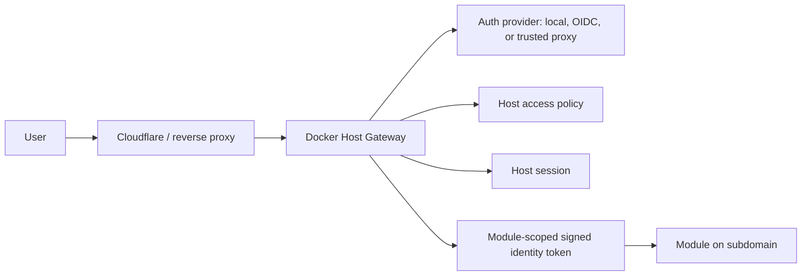

# Auth Gateway

## Description

Docker Host should own authentication and authorization for its Web UI, Host API, and externally exposed module UIs. External identity providers such as Auth0, Keycloak, Authentik, ZITADEL, Microsoft Entra ID, GitHub OAuth, Cloudflare Access, Pomerium, or oauth2-proxy may authenticate users, but Docker Host remains the policy enforcement point.

The Host should protect all privileged operations itself. A regular managed module must not be required to secure the Host, because that would create a dependency cycle: the Host would need a module that the Host itself installs, updates, stops, and recovers before the Host can safely expose its own administrative UI.

Accepted direction:

- module UIs are exposed on their own subdomains, not through path-based routing;
- all external module traffic goes through the Host gateway unless an explicit development override is used;
- Host decides whether a module can be opened by an unauthenticated visitor, any logged-in user, or only assigned users;
- Host roles stay simple at first: `host.admin` and `host.user`;
- modules own their internal authorization and store their own module-specific permissions;
- modules may query a Host-scoped directory of users assigned to that module, but must not receive the whole Host user directory by default;
- multiple real-world accounts are modeled as multiple Host users with account switching, not as required identity profiles in the first implementation;
- identity profiles remain a possible future extension if multiple external identities must later be linked into one Host person.

Target model:



Authentication and authorization are separate concerns:

- authentication identifies the user and establishes a Host session;
- Host authorization decides whether the user can access the Host, open a module, or operate module lifecycle actions;
- module authorization decides what the user can do inside a module after access has been granted;
- module identity propagation uses short-lived Host-signed tokens scoped to a specific module audience.

The recommended implementation direction is to start with local Host authentication and internal authorization primitives, then add gateway routing and module identity tokens, then add generic OIDC, trusted proxy modes, and external ingress automation.

## Milestones

### Phase 1 - Architecture and policy model

**Status**: In Progress

Define the core boundaries before implementation:

- Auth core is part of Docker Host, not an ordinary managed module.
- Host API and Web UI are protected at the Host boundary.
- Module UIs are exposed through a Host gateway instead of direct public container ports.
- Module UI routing is subdomain-based.
- External providers can authenticate users, but Host owns Host roles, module access assignment, sessions, and audit events.
- Modules own their internal role and permission systems.
- Service-to-service module calls are treated separately from user-to-module access.

Initial Host role model:

- `host.admin` can manage Host configuration, auth settings, module install/update/remove, module exposure, and recovery flows.
- `host.user` can access modules allowed by module exposure policy and assignment state, but cannot call Host API functionality, including module listing or Host status views.

Module exposure policy should use three explicit states:

| Policy | Host login required | Host assignment required | Intended use |
| --- | --- | --- | --- |
| `public` | no | no | Public module UI that does not need Host identity. |
| `loginRequired` | yes | no | Any authenticated Host user can open the module; module handles internal permissions. |
| `assignedUsersOnly` | yes | yes for `host.user` | Host grants access to selected users; module still handles internal permissions. |

`loginRequired` is the default exposure policy for externally opened module UI ports. The existing metadata field `runtime.ports[].public` remains a port capability hint that an endpoint is suitable for external UI exposure. It is not the Host authorization policy. Normal external module access must still go through the Host gateway and use the Host-owned exposure policy.

Host-level permissions and module-level permissions should remain separate:

- Host decides whether a request can reach a module.
- The module decides which actions are available inside the module.
- Host may pass `hostRole` in the identity token so a module can implement bootstrap or admin UX, but Host does not automatically own every module's internal authorization model.
- `host.admin` can reach modules through the Host gateway for bootstrap and configuration even when the module uses `assignedUsersOnly`; the module decides whether that Host role becomes an internal module administrator.
- `host.user` has no Host management surface. A `host.user` only receives access to module subdomains allowed by module exposure policy and assignment state.

#### Decisions

- Authentication is mandatory by default for local Host instances, including `localhost`. Development bypass must be explicit configuration, not the default.
- Direct public module port publishing is not part of the normal exposure model. It may exist only as an explicit development override; production-like access goes through the Host gateway.
- CLI admin access in Phase 2 uses a revocable local admin token. The Host stores only a server-side hash, and the CLI stores token material locally with restrictive file permissions or platform ACLs. The CLI is expected to run on the local physical machine and should not expose those credentials outside the machine.
- `host.admin` is allowed through the Host gateway for module bootstrap and configuration. Internal module administrator rights remain module-owned and may be granted, mapped, or ignored by the module.

### Phase 2 - Local Host authentication

**Status**: In Progress

Implement a local provider that works without external services:

- bootstrap the first admin through a CLI/setup token;
- create Host-owned user identities;
- store password credentials or another local login method;
- issue secure cookie sessions for Web UI and API calls;
- support multiple Host accounts in the browser through an account switcher;
- protect all privileged API routes;
- provide logout and session revocation;
- log authentication and authorization decisions.

Initial implementation slice:

- dedicated JSON auth store under the Host data root;
- local setup-token bootstrap for the first administrator;
- password hashing and opaque server-side browser sessions;
- login, logout, bootstrap, auth status, and public health API routes;
- Host API route protection with `host.admin` checks;
- same-origin checks for mutating cookie-authenticated API requests;
- setup and login UI pages;
- `docker-host auth setup-token` for local setup token creation;
- auth core tests for bootstrap, weak-password rejection, login, session validation, and revocation.

This phase should produce the minimum viable security boundary for a local-first Docker Host installation.

The first identity model should be simple:

```text
personal@example.com -> host.admin
work@example.com     -> host.user
```

Fast switching between these accounts should be a UI/session feature. It should not require a separate profile model in the MVP.

#### Decisions Before Phase 2

These answers are accepted for the first local Host authentication implementation:

| Topic | Decision |
| --- | --- |
| Deployment boundary | Phase 2 protects the local-first Host. The current CLI-published Host UI remains loopback-bound. Private LAN and reverse-proxy deployments are not the first target, but auth code must not depend on `localhost` except for explicit setup and recovery checks. |
| Unauthenticated routes | Default deny. Allow only static assets, login, setup-token bootstrap, idempotent logout, local-only recovery token flow, and a minimal public health endpoint. Full Host status, modules, containers, images, and fixtures are protected unless an explicit development bypass is enabled. |
| HTTPS | HTTP is allowed for loopback. Non-loopback session cookies require HTTPS. Private-network HTTP is supported only behind an explicit development override. |
| First local credential type | Use password authentication for Phase 2. Passkeys are deferred. |
| Password policy and throttling | Require a minimum 12-character password, reject obviously weak values, hash with a per-user salt and recorded KDF parameters, rate-limit by account and request origin, and audit login failures. |
| First admin creation | Create the first `host.admin` through a local CLI-generated setup token that opens or unlocks the setup UI. A first arbitrary browser visitor must not be able to claim admin access. |
| Setup token lifetime | Setup tokens are single-use, stored hashed, expire after 15 minutes, and are invalidated immediately after the first admin is created. New setup tokens require local CLI or container access. |
| Auth persistence boundary | Store users, password hashes, sessions, CLI tokens, recovery tokens, role assignments, and audit events under a dedicated versioned auth directory in the Host data root, for example `/data/auth/`. Do not store auth state in `modules.json`. |
| SQLite | Do not introduce SQLite for Phase 2. JSON files are the intended local persistence model. Future external providers may own external identity, but Docker Host still stores Host-owned roles, local sessions, tokens, assignments, and audit state in JSON unless a concrete operational requirement proves otherwise. |
| CLI admin credential | Use a revocable local admin token with a narrow CLI scope. Store only the server-side token hash in Host auth state, and store the client token material in the local CLI config area with restrictive file permissions or platform ACLs. Provide rotation and revocation. |
| Emergency recovery | Recovery requires local machine or container access. CLI should be able to mint a recovery/setup token or reset local admin access. No unauthenticated remote recovery endpoint is allowed. |
| Session model | Use opaque random session tokens in HttpOnly cookies. Store only hashed session tokens server-side and treat the server-side session record as authoritative for revocation. Do not use Host session JWTs. |
| Session lifetime | Use a 12-hour idle timeout and a 14-day absolute lifetime for browser sessions. Longer-lived remember-me behavior is deferred. |
| Logout scope | Default logout revokes the current account/session. Broader actions such as revoking every session for an account or every account in a browser should be explicit separate actions. |
| Account switching | Support multiple remembered browser sessions, with one active account per request. Per-module preferred account selection is deferred. |
| Host API authorization | Keep all current Host API functionality admin-only in Phase 2, including `host.read`. If unauthenticated uptime is needed, expose a separate minimal public health endpoint rather than weakening Host status. |
| Phase 2 audit events | Implement structured audit records for bootstrap, login success/failure, logout, session revocation, recovery, denied Host API calls, CLI token create/revoke, and auth configuration changes. Retention, filtering, and an admin audit UI are deferred. |
| Pre-auth migration | Existing installations without auth state enter setup-required mode. Existing modules and data remain intact, but privileged API/UI access is blocked until a local admin is created. |
| Completion tests | Phase 2 is complete only after tests cover route protection, admin/user authorization, bootstrap idempotency, expired and revoked sessions, CSRF rejection, CLI token authorization, logout/account switching basics, and migration from a pre-auth install. |

#### Implementation Notes

- Keep Phase 2 focused on a local password provider, Host sessions, route protection, CLI admin access, logout, revocation, recovery, and audit scaffolding. Defer passkeys, OIDC, trusted proxy mode, module gateway routing, and module-scoped JWTs to later phases.
- Use a dedicated JSON persistence interface for auth state so route and policy code do not depend on file layout details.
- Hash passwords with a memory-hard or intentionally slow KDF with per-user salts and recorded parameters. Prefer a dependency-light implementation that can run consistently inside the Host container.
- Protect mutating cookie-authenticated API routes against CSRF with same-origin checks and/or CSRF tokens. Treat cookie authentication as insufficient by itself for state-changing requests.
- Treat all Host API routes as protected by default. Add explicit allow-list entries only for bootstrap, login, logout, recovery, static assets, explicit development fixtures, and operational health endpoints that genuinely need to remain public.
- Keep `host.admin` as the only role that can call Host management APIs in Phase 2. `host.user` should authenticate successfully but should not receive Host management screens or module listing until a user-facing dashboard is explicitly designed.

### Phase 3 - Host gateway for subdomain module exposure

**Status**: Not Started

Add a gateway layer that routes external module traffic through Docker Host:

- maintain a module exposure registry;
- map hostnames to installed module targets;
- route traffic to Docker network aliases and container ports;
- apply the module exposure policy before proxying;
- support HTTP, static assets, redirects, uploads, streaming, websockets, SSE, long polling, and SignalR-style negotiation where practical;
- keep module containers private by default.

Preferred external routing model:

```text
host.example.com    -> Docker Host Web UI
reports.example.com -> Docker Host Gateway -> mod-reports:8080
media.example.com   -> Docker Host Gateway -> mod-media:3000
```

Path-based module routing is not part of the accepted target model. Many module UIs assume they run at `/`, and realtime transports such as WebSockets and SignalR are simpler and more predictable on a dedicated subdomain.

Realtime behavior:

- Host authorizes the initial HTTP request or WebSocket upgrade.
- SignalR-style `/negotiate` endpoints must be proxied with the same access checks as the socket endpoint.
- For WebSockets, identity is established at handshake time.
- Host should be able to close active gateway connections if a session is revoked or module access changes.
- Long-lived connections should have a defined revalidation or maximum lifetime policy.

#### Open Questions

- How should redirects from modules be rewritten or constrained when modules run on dedicated subdomains?
- How should the Host represent and validate public hostname ownership?
- What connection revalidation policy should be used for WebSockets and other long-lived transports?
- Should each module hostname be limited to one module, or should future virtual-host routing support aliases per module?

#### Decisions Before Phase 3

These decisions define the first Host gateway implementation slice:

| Topic | Options considered | Recommended decision |
| --- | --- | --- |
| Gateway runtime | Next route handlers, custom Node server in the Host process, or separate gateway container. | Use a custom Node server in the Host container. It can inspect `Host`, proxy streaming requests, and handle WebSocket upgrades before falling through to Next. A separate container is deferred until there is an operational need to scale or harden the gateway independently. |
| Next deployment mode | Keep `next start`, use standalone output, or run a custom server. | Run `server.mjs` directly. Official Next.js guidance states custom servers and standalone output are not meant to be combined, so the production image should copy `.next` and production dependencies instead of `.next/standalone`. |
| External bind | Keep loopback only, bind public interfaces by default, or make public bind explicit. | Keep `127.0.0.1` as the default. Add explicit launch settings for `HOST_BIND_ADDRESS`, `HOST_PUBLIC_ORIGIN`, and `HOST_GATEWAY_BASE_DOMAIN`. Binding `0.0.0.0` must be an administrator choice. |
| Exposure registry | Store in `modules.json`, auth state, or a dedicated gateway file. | Store hostname mappings in `/data/gateway/exposures.json`. Keep Host user assignments in auth state because assignments are Host-owned authorization data. |
| Exposure target | One hostname per module, one hostname per runtime port, or path routing. | Use one hostname per `moduleId + runtime.ports[].key`. Path routing remains out of scope. Multiple aliases can be added later as additional exposure records. |
| Port eligibility | Allow any container port, only `runtime.ports[].public`, or admin override. | Allow only metadata ports marked `public: true` in Phase 3. The field remains a capability hint, while exposure policy remains Host-owned. |
| Default policy | Public, authenticated, or assigned users only. | Use `loginRequired` as the default policy for new exposures. |
| Host session on subdomains | Host-only cookie, parent-domain cookie, per-module handoff token. | Use parent-domain Host cookies only when `HOST_GATEWAY_BASE_DOMAIN` is configured. The gateway strips the Host session cookie before forwarding to module containers. |
| Redirect handling | Pass through, rewrite all, or constrain internal redirects. | Preserve relative redirects. Rewrite absolute redirects from the internal module target back to the external module hostname. Leave unrelated external redirects untouched. |
| Request headers | Pass through everything, strip only hop-by-hop headers, or sanitize Host-owned headers. | Strip hop-by-hop headers, CLI `Authorization`, the Host session cookie, and inbound `X-Docker-Host-*` headers. Add standard `X-Forwarded-*` headers. Do not send trusted identity headers in Phase 3. |
| Module identity | Start with headers, start with JWT, or defer. | Defer trusted identity propagation to Phase 4. Phase 3 only decides whether traffic can reach the module. |
| Unknown hostnames | Let Next handle them, return gateway 404, or proxy to a default module. | When a base domain is configured, reject unknown subdomains under that base domain with 404. Keep ordinary Host UI requests working on the canonical Host origin. |
| Long-lived connections | Handshake-only auth, maximum lifetime, or active revocation registry. | Implement handshake authorization for WebSocket upgrades in Phase 3. Add maximum lifetime and active revocation closure after the basic proxy path is stable. |
| Stopped modules | Auto-start on first request, return unavailable, or admin prompt. | Do not auto-start modules from gateway traffic. Return an upstream error when the installed module is not ready. Lifecycle remains an explicit admin action. |
| Audit | Log every proxied request, only denied/config events, or no audit. | Audit exposure changes, assignment changes, and denied access events. Do not audit every static asset or proxied request. |

#### Phase 3 MVP Scope

- Add a gateway exposure registry and admin API.
- Add subdomain matching before the Next request handler.
- Proxy HTTP requests, static assets, uploads, streaming responses, and internal redirects.
- Authorize WebSocket upgrades at handshake time and proxy them where practical.
- Keep module containers private by relying on the existing Host-managed Docker network and no public module port bindings.
- Do not implement module-scoped JWTs, identity headers, external ingress automation, DNS ownership checks, or active long-lived connection revocation in this phase.

### Phase 4 - Module identity contract

**Status**: In Progress

Define how modules receive authenticated user context from Host:

- Host must not share its own session cookie with modules.
- Host should issue short-lived signed JWTs for proxied module requests when a user is authenticated.
- Tokens should be scoped to a module with `aud` equal to the module id.
- Tokens should include normalized Host identity, Host role, and module access context.
- Modules should validate tokens against a Host JWKS endpoint or configured public key.
- Public module requests should not receive a user identity token unless the visitor is authenticated and the module explicitly accepts optional identity.

Example token claims:

```json
{
  "iss": "docker-host",
  "sub": "user_123",
  "aud": "com.acme.reports",
  "exp": 1790000000,
  "iat": 1789999700,
  "jti": "mit_...",
  "email": "work@example.com",
  "name": "Work User",
  "hostRole": "host.user",
  "moduleAccess": "assigned",
  "moduleExposurePolicy": "assignedUsersOnly"
}
```

Host should not pass unsigned identity convenience headers in the Phase 4 MVP. If convenience headers are added later, the signed token remains the only authoritative identity artifact for modules that need trustable identity.

#### Decisions Before Phase 4

These decisions define the first module identity implementation slice:

| Topic | Options considered | Recommended decision |
| --- | --- | --- |
| Token format | Signed JWT, opaque reference token, or trusted headers only. | Use a signed JWT as the authoritative module identity contract. Opaque reference tokens would force every module request back through Host introspection, and trusted headers alone are too easy for module authors to misuse. |
| Signing algorithm | Shared-secret `HS256`, RSA `RS256`, elliptic-curve `ES256`, or EdDSA. | Use an asymmetric signing key. Prefer `ES256` for the MVP because it works well with JWKS and avoids sharing a signing secret with modules. If the runtime dependency chosen for JWT support makes `RS256` materially simpler, it is acceptable as long as modules validate through JWKS and never receive private key material. |
| JWT library | Hand-written signing, Node WebCrypto directly, or a maintained JOSE library. | Use a maintained JOSE implementation, for example the `jose` package, instead of hand-writing JWT/JWKS handling. |
| Signing key storage | Store keys in `auth/state.json`, environment variables, or a dedicated key file. | Store module identity signing keys in a dedicated versioned file under the auth root, for example `/data/auth/module-identity-keys.json`. Keep private key material separate from users, sessions, CLI tokens, and module assignments. |
| Key rotation | No rotation, manual replacement, or active plus retired keys. | MVP may start with one active key, but the key file format should support `kid`, `createdAt`, `active`, and retired public keys. JWKS should publish active and still-valid retired public keys so old short-lived tokens can expire naturally. |
| JWKS endpoint | Configured public key only, internal-only endpoint, or unauthenticated JWKS route. | Add an unauthenticated JWKS route, for example `/.well-known/docker-host/jwks.json`. Public keys are not secret, and a standard JWKS endpoint makes module validation simpler. |
| Discovery endpoint | No discovery, document static paths, or publish metadata. | Add a small unauthenticated discovery document, for example `/.well-known/docker-host/module-identity.json`, with `issuer`, `jwks_uri`, supported algorithms, and token header name. |
| Internal Host origin for modules | Use `HOST_PUBLIC_ORIGIN`, Docker container name, or a dedicated internal origin. | Add a stable internal Host origin for module-to-Host calls, defaulting to `http://docker-host:3000`. The CLI should attach the Host container to the module network with a matching stable alias, even when `HOST_CONTAINER_NAME` is customized. |
| Token transport to modules | Forward `Authorization: Bearer`, module cookie, or Host-owned header. | Pass the JWT in `X-Docker-Host-Identity`. Do not use `Authorization`, because modules may already use it for their own APIs. Do not use cookies, because Host identity must not become ambient module browser state. |
| Convenience headers | Add signed token only, add unsigned identity headers, or add both. | MVP should send only the signed JWT. The gateway already strips inbound `X-Docker-Host-*` headers; unsigned convenience headers can be added later if needed, but modules must not depend on them for trust. |
| Stable claims | Minimal registered claims, full user profile, or provider-specific claims. | Stable required claims: `iss`, `sub`, `aud`, `exp`, `iat`, `jti`, `hostRole`, `moduleAccess`, and `moduleExposurePolicy`. Optional convenience claims: `email`, `name`, `gatewayExposureId`, `hostname`, and `portKey`. |
| Audience | Use module id, exposure id, hostname, or runtime port key. | Use `aud` equal to the module id. Exposure id, hostname, and port key may be included as optional informational claims, but they should not replace the module audience. |
| Module access claim | Boolean access, permission list, or reason enum. | Use a reason enum aligned with Host gateway access decisions: `authenticated`, `assigned`, `hostAdmin`, or `publicAuthenticated`. Keep module-specific permissions out of the Host token. |
| External IdP groups | Pass through directly, normalize into Host roles, or defer. | Do not pass external IdP groups in Phase 4. Modules receive normalized Host identity and Host role. Provider-specific groups belong to later OIDC or trusted proxy phases. |
| Token lifetime | Match Host session, one request only, or short fixed TTL. | Use a short fixed TTL, initially 5 minutes. The gateway issues a fresh token for each authenticated proxied HTTP request and for WebSocket/SSE/long-poll setup requests. |
| Realtime identity | No identity for realtime, token only on initial request, or periodic revalidation. | Use the token on the initial HTTP request or WebSocket handshake in Phase 4. Active revalidation and forced closure of long-lived connections remain a later gateway hardening task. |
| Public module identity | Always omit identity, always send identity when logged in, or per-exposure opt-in. | Add an identity mode to exposure configuration: `none`, `optional`, or `required`. Default `public` exposures to `none`; allow `optional` so a public module can personalize for logged-in Host users. `loginRequired` and `assignedUsersOnly` exposures default to `required`. |
| Official module SDK | Required before Phase 4, validation snippets only, or SDK after integration. | Do not block Phase 4 on an SDK. First publish the contract, JWKS, and validation examples. Add an SDK only after at least one real module integration proves the shape. |

The Phase 4 token contract should start with this claim shape:

```json
{
  "iss": "docker-host",
  "sub": "user_123",
  "aud": "com.acme.reports",
  "exp": 1790000000,
  "iat": 1789999700,
  "jti": "mit_...",
  "hostRole": "host.user",
  "moduleAccess": "assigned",
  "moduleExposurePolicy": "assignedUsersOnly",
  "email": "work@example.com",
  "name": "Work User",
  "gatewayExposureId": "gw_...",
  "hostname": "reports.example.com",
  "portKey": "web"
}
```

Required claims are the compatibility contract. Optional claims may be omitted by Host configuration, future provider mode, privacy policy, or module exposure policy.

#### Phase 4 MVP Scope

- Add module identity signing key persistence under `/data/auth/`.
- Add JWKS and discovery endpoints.
- Add token minting for authenticated gateway requests.
- Inject the token into proxied module HTTP requests and WebSocket handshake requests through `X-Docker-Host-Identity`.
- Add exposure identity mode handling for `public`, `loginRequired`, and `assignedUsersOnly` exposures.
- Keep Host session cookies stripped before forwarding to modules.
- Keep inbound `X-Docker-Host-*` request headers stripped before adding Host-owned identity headers.
- Document the module validation contract, including claims, token header, JWKS discovery, expected audience, and expiration handling.
- Add tests for signing, JWKS publication, wrong audience rejection, expired token rejection, header spoofing protection, public exposure identity defaults, and authenticated gateway token injection.

Do not implement provider group passthrough, module-specific permission claims, a module SDK, module-to-Host directory APIs, active long-lived connection revalidation, or external ingress automation in Phase 4.

#### Implementation Notes

- Extract module identity signing, JWKS, discovery, token-issuance, and identity-mode decisions into testable helpers that can be reused by the custom gateway server.
- Use `HOST_INTERNAL_ORIGIN`, defaulting to `http://docker-host:3000`, so module containers can reliably fetch Host JWKS inside the Host-managed Docker network.
- Attach the Host container to the shared module network with the stable `docker-host` network alias, even if the administrator customizes the Host container name.
- Store `identityMode` on gateway exposure records so `public` modules can opt into authenticated identity without changing the exposure access policy.
- Add a fixture module or test upstream before closing Phase 4 so the Host verifies the full custom-server proxy path: valid token injection, no token for default public exposures, optional public identity, and spoofed inbound `X-Docker-Host-*` rejection.

### Phase 5 - Module user directory and module-owned permissions

**Status**: In Progress

Define a scoped Host API that modules can use to list users who have access to that module. The module should not receive the entire Host user directory unless the Host admin explicitly grants that capability later.

Target rule:

- Host stores users, Host roles, and module access assignment.
- Module stores module-specific roles and permissions.
- Module can ask Host for users assigned to that module.
- Module grants internal permissions against Host user ids or external identity ids carried in Host-issued tokens.

Example scoped directory response:

```json
{
  "moduleId": "com.acme.reports",
  "users": [
    {
      "id": "user_123",
      "email": "work@example.com",
      "displayName": "Work User",
      "hostRole": "host.user"
    }
  ]
}
```

The directory API should require a module service token or another machine-to-machine credential. It should not be callable by arbitrary browser users.

#### Decisions Before Phase 5

These decisions define the first module directory and module-owned permissions implementation slice.

| Topic | Options considered | Recommended decision |
| --- | --- | --- |
| Directory scope for `loginRequired` modules | Return all enabled Host users, return only users who have opened the module, or return only explicitly assigned users. | Use explicit module assignment as the first directory scope, even for `loginRequired` modules. `loginRequired` controls gateway access, while directory visibility is a separate privacy boundary. A later phase can add a Host admin setting that grants a module broader directory access. |
| Assignment granularity | Store assignments by `moduleId`, by gateway exposure id, or by `moduleId + portKey`. | Keep assignments module-scoped by `moduleId` for Phase 5. Module permissions are module-owned, and splitting the Host directory by exposure or port would make permissions harder for modules to reason about. |
| `host.admin` directory inclusion | Always include `host.admin`, include only explicitly assigned admins, or include admins only when they have opened the module. | Include only explicitly assigned admins in the directory response. Admin gateway access is for bootstrap and recovery, but it should not silently disclose admin identities to every module. |
| Permission subject identifiers | Modules store permissions against Host user ids, external provider subject ids, or both. | Modules should store permissions against stable Host user ids from the Host token `sub`. External provider subject ids can be added later as optional identity metadata after OIDC and trusted proxy modes exist. |
| Directory response fields | Return `id` only, return `id` plus display fields, or allow policy-controlled fields. | Return `id`, `displayName`, and `hostRole` by default. Make `email` opt-in per module or per exposure because email is personally identifying and may not be needed for module permission assignment. |
| Disabled or deleted users | Hide them, return tombstones, or keep full records until cleanup. | Hide disabled users from normal directory responses and reserve tombstones for a later sync/audit API. This keeps the MVP simple and prevents modules from granting new permissions to disabled users. |
| Module service credential type | Per-module static bearer token, per-install service token, signed client assertion, or mTLS. | Use a Host-generated per-installed-module service token for Phase 5. Store only a server-side hash in Host auth state, expose the raw token once during install/credential rotation, and mount or inject it into the module as a secret environment variable. |
| Credential storage and rotation | Store in auth state, module state, or gateway state; rotate manually or automatically. | Store service credential hashes in auth state because they authorize Host internal APIs. Support explicit admin rotation and revocation in the MVP; automatic rotation can wait until modules have a refresh protocol. |
| Module API authorization | Trust the requested `moduleId`, derive module from credential, or require both to match. | Derive the authorized module from the service token and require any path `moduleId` to match it. A module must never be able to ask for another module's directory by changing a URL parameter. |
| Network boundary | Expose directory API on public Host API, internal Docker network only, or both with different auth. | Serve the module directory API on the Host internal origin used by modules, defaulting to `http://docker-host:3000`. It may share the same process, but it should require a module service token and should not be callable with browser session cookies. |
| Endpoint contract | Single list endpoint, paginated endpoint, or query/filter API. | Start with `GET /api/internal/modules/{moduleId}/directory/users` returning a schema-versioned response. Include pagination fields even if the first implementation returns all assigned users, so the contract can grow without a breaking change. |
| Directory caching | No caching, fixed TTL, or ETag/conditional requests. | Allow short module-side caching with a small TTL such as 60 seconds and include `updatedAt` in the response. Add ETag or long-poll invalidation only if real modules need it. |
| Audit events | Audit every successful query, denied queries only, or credential lifecycle and policy changes only. | Audit credential create/rotate/revoke and denied directory access. Do not audit every successful directory read in the MVP because modules may query on startup or permission screens. |
| Admin UI scope | Build user and assignment management UI, backend API only, or minimal read-only diagnostics. | Phase 5 should prioritize backend service credential and directory APIs. Reuse existing assignment data. A richer Host user/assignment UI should be a separate UX slice unless it blocks manual testing. |
| Completion tests | Unit tests only, API route tests, or end-to-end module fixture. | Require API/service tests for credential authorization, cross-module denial, disabled user filtering, email opt-in behavior, credential rotation/revocation, and directory behavior for `loginRequired` and `assignedUsersOnly` modules. Add an end-to-end fixture only after Phase 4 gateway identity tests are stable. |

#### Phase 5 MVP Scope

- Add Host-generated per-installed-module service tokens with server-side token hashes in auth state.
- Inject `DOCKER_HOST_INTERNAL_ORIGIN`, `DOCKER_HOST_MODULE_ID`, and `DOCKER_HOST_MODULE_SERVICE_TOKEN` into newly created module containers.
- Add a scoped internal directory endpoint at `GET /api/internal/modules/{moduleId}/directory/users`.
- Add admin-only endpoints for service token creation/revocation and module directory policy updates.
- Authorize directory requests with module service tokens only; do not accept browser session cookies.
- Return only explicitly assigned, enabled Host users in directory responses.
- Omit email by default and include it only when a module directory policy opts in.
- Add audit events for service token creation, revocation, rejected service tokens, denied cross-module directory reads, and directory policy changes.
- Add focused tests for directory scope, credential authorization, cross-module denial, email opt-in behavior, and token revocation.

### Phase 6 - Generic OIDC provider mode

**Status**: Not Started

Add a provider implementation for standard OIDC:

- issuer URL;
- client id and client secret;
- callback URL;
- scopes;
- claim mapping;
- group mapping;
- Host role mapping;
- session creation inside Host after successful OIDC login.

External providers can include Auth0, Keycloak, Authentik, ZITADEL, Microsoft Entra ID, Google Workspace, or similar OIDC-compatible services.

OIDC should authenticate the user, but Host should still decide Host role, module assignment, session lifetime, and gateway access.

Example mapping concept:

```text
OIDC group "docker-host-admins" -> host.admin
OIDC group "docker-host-users"  -> host.user
```

#### Open Questions

- Which OIDC provider should be tested first as the reference implementation?
- Should Docker Host support multiple active auth providers at once, or one active provider per Host?
- Should role mappings be configured through Web UI, config files, or both?
- How should Host handle users whose external groups change while they have an active session?

### Phase 7 - Trusted proxy mode

**Status**: Not Started

Support deployments where a trusted upstream proxy authenticates the user before traffic reaches Docker Host.

Candidate providers include:

- Cloudflare Access;
- Pomerium;
- Authentik proxy provider;
- oauth2-proxy;
- Traefik ForwardAuth deployments.

Host should accept upstream identity only when the request comes through a trusted boundary and the identity proof is verifiable. Signed provider tokens are preferred over plain headers. Plain headers should be allowed only when direct access to the Host origin is blocked.

#### Open Questions

- Which trusted proxy providers should be first-class presets?
- Should Cloudflare Access be modeled as trusted proxy mode, OIDC mode, or both?
- How should Host prevent direct-origin bypass when trusted proxy mode is enabled?
- Should trusted proxy mode support non-browser API clients through service tokens or managed OAuth?

### Phase 8 - Developer mode for modules

**Status**: Not Started

Allow module authors to develop without always running the full Host install flow:

- standalone module development can run on a local port;
- modules may use mock identity in explicit development mode;
- Host can proxy a module subdomain to a local dev target through a development override;
- integrated tests can verify metadata, storage, dependency URLs, auth, realtime transports, and routing through Host gateway.

Example development modes:

```text
Standalone:
  module dev server -> http://localhost:3001
  auth -> mock user or local test JWT

Integrated:
  reports.localhost -> Docker Host Gateway -> http://host.docker.internal:3001
  auth -> real Host session and module-scoped JWT
```

#### Open Questions

- Should development target overrides live in module metadata, Host settings, or a separate local-only file?
- Should Host provide a command to mint local test JWTs for module development?
- How should integrated development work for modules that depend on other modules?
- Should module dev mode be blocked automatically outside localhost/private networks?

### Phase 9 - Audit, recovery, and operational controls

**Status**: Not Started

Add operational features needed for a secure admin surface:

- audit log for login, logout, account switch, access denied, module open, lifecycle actions, install/update/remove, and auth configuration changes;
- session management and revocation;
- emergency auth recovery through local CLI or setup token;
- diagnostics for OIDC/proxy misconfiguration;
- clear user-facing errors when authorization blocks an action.

#### Open Questions

- What retention and compaction strategy should JSON audit logs use?
- How long should audit events be retained by default?
- Which recovery actions should require local machine access through CLI?
- Should auth configuration changes require reauthentication?

### Phase 10 - External ingress automation

**Status**: Not Started

Optionally automate external exposure through providers such as Cloudflare:

- create or validate DNS records;
- configure Cloudflare Tunnel public hostnames;
- configure Cloudflare Access applications and policies;
- show exposure status in Host Web UI;
- keep manual setup as a supported path.

This phase should happen after Host gateway, authorization, and module identity contracts are stable.

#### Open Questions

- Is Cloudflare automation required for MVP, or is manual Tunnel/DNS/Access configuration enough?
- Should Host store Cloudflare API credentials, or only generate instructions/config snippets?
- Should each module hostname get its own Access application, or should access be enforced only by Host?
- How should Host reconcile external ingress state if DNS/Tunnel settings are changed outside Docker Host?
