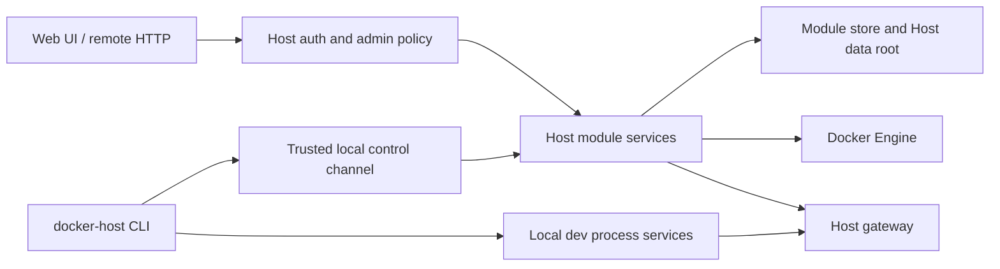

# CLI Trusted Control and Dev Metadata

## Description

Docker Host should treat the local CLI as a trusted machine-control tool instead of a user-authenticated remote API client. A person who can run `docker-host` on the machine already has local administrative access to that Host installation, so CLI operations should not require Host user sessions, CLI admin tokens, or bearer-token import flows.

The Host should remain the single owner of module lifecycle implementation: install, update, remove, start, stop, restart, module store updates, Docker container creation, gateway registration, identity token behavior, and app shell integration. The CLI should expose the full operational command surface by calling a local trusted control channel exposed by the running Host. Web UI and remote HTTP access should continue to use normal Host user authentication and authorization.

The module development workflow should also move from a separate CLI-only dev harness shape toward a second metadata manifest that lives next to the production metadata in the module repository. A repository can contain both `metadata.json` for production-like image installs and `metadata.dev.json` for local development from checked-out source. The dev manifest should use the same module contract as production metadata, with service sources changed from images to local processes where needed.



## Trusted Local Control Contract

The trusted local control channel is a Host-owned local management endpoint for the installed CLI. It is not the public Host Web UI/API and it is not a user authentication mechanism.

Transport and discovery:

- The Host writes a control discovery file at `<HOST_DATA_ROOT_HOST>/run/control.json` and the same data is visible inside the Host as `<HOST_DATA_ROOT_CONTAINER>/run/control.json`.
- The discovery file is owner-only on Unix-like platforms and restricted to the current user plus Administrators on Windows.
- The file contains `schemaVersion`, `controlContractVersion`, `instanceId`, `transport`, endpoint details, and creation timestamp.
- Preferred transport on Linux/macOS when the Host can expose it to the CLI is HTTP/JSON over Unix domain socket at `<HOST_DATA_ROOT_HOST>/run/docker-host-control.sock`.
- Preferred native Windows transport is a named pipe under `\\.\pipe\docker-host\<host-container-name>\control`.
- When the Host runs as a Linux container on Docker Desktop and the socket/pipe cannot cross the container boundary reliably, the initial Windows production-compatible fallback is a loopback-only HTTP listener bound to `127.0.0.1`. The fallback endpoint is discovered only from the owner-only discovery file.
- The loopback fallback may use a random per-start control secret from `control.json` as channel binding. This is not a user credential, is not a CLI admin token, is not shown in the UI, is not revocable per user, and is never accepted by the normal Host Web UI/API.
- The Host removes stale socket files on startup and replaces stale `control.json` when the Host instance changes.

Request contract:

- Control routes live under `/control/v1/...`.
- CLI requests send `X-Docker-Host-Cli-Version` and `X-Docker-Host-Control-Contract-Version`.
- CLI requests do not send `Authorization: Bearer`, Host browser cookies, account-set cookies, or CSRF headers.
- Browser, gateway, ingress, and public Host API routes must never proxy or expose `/control/v1`.
- The Host returns a clear incompatible-contract response when the CLI control contract version is unsupported.

Initial control methods:

- `GET /control/v1/host/status`
- `GET /control/v1/modules`
- `POST /control/v1/modules/install/plan`
- `POST /control/v1/modules/install`
- `POST /control/v1/modules/{moduleId}/update/plan`
- `POST /control/v1/modules/{moduleId}/update`
- `POST /control/v1/modules/{moduleId}/start`
- `POST /control/v1/modules/{moduleId}/stop`
- `POST /control/v1/modules/{moduleId}/restart`
- `POST /control/v1/modules/{moduleId}/remove/plan`
- `POST /control/v1/modules/{moduleId}/remove`
- `GET /control/v1/dev/modules`
- `PUT /control/v1/dev/modules/{targetId}`
- `DELETE /control/v1/dev/modules/{targetId}`
- Host-owned development helpers for seeding development users, assignments, and module directory policy.

Control responses should reuse the existing Host module service models and error envelopes where possible. The CLI may own terminal presentation, prompts, process supervision, and manifest discovery, but Host services remain the only owner of install, update, remove, lifecycle, app registry, gateway, identity, assignment, and module store behavior.

## Milestones

### Phase 1 - Define the local trust boundary

**Status**: Not Started

- Define the trusted local control channel as the replacement for CLI bearer-token access.
- Implement `run/control.json` discovery under the Host data root.
- Prefer a Unix socket on Linux/macOS where the Host process can expose it to the local CLI.
- Prefer a named pipe for native Windows Host processes.
- Support a loopback-only fallback for Docker Desktop Windows/macOS production when socket/pipe transport is not viable from a Linux Host container.
- Store the socket, pipe metadata, loopback fallback metadata, and any fallback channel binding secret under the Host data root with owner-only permissions.
- Ensure the trusted channel is available only for the local Host instance and is not exposed through public gateway, ingress, or browser routes.
- Document that local CLI access is equivalent to local machine administration for this Host installation.
- Add a control contract version header and unsupported-version error response.

### Phase 2 - Remove CLI user authorization

**Status**: Not Started

- Remove the `docker-host auth token ...` command surface.
- Remove local CLI token import, status, logout, create, list, revoke, and rotate flows.
- Remove `HostAuthTokenStore` usage from CLI module and dev commands.
- Stop sending bearer tokens from CLI requests.
- Remove Host CLI token creation/list/rotation/revocation API usage from the CLI.
- Remove Host Web UI surfaces that generate CLI admin tokens.
- Keep only minimal local recovery commands:
  - `docker-host auth setup-token` for first-admin bootstrap when no administrator exists.
  - `docker-host auth recovery-token` for local machine recovery, producing a one-time browser recovery token that can reset a local administrator password or recreate an administrator when recovery rules allow it.
- Recovery tokens are hash-only in Host auth state, expire, are single-use, are audited without raw token material, and do not grant CLI API access.
- Keep Host browser authentication, sessions, account switching, user roles, and remote Web UI authorization.
- Update CLI help, Host API documentation, and auth documentation to describe the new local-control model.

### Phase 3 - Route CLI module operations through trusted Host control

**Status**: Not Started

- Keep `docker-host modules install`, `update`, `remove`, `start`, `stop`, `restart`, `list`, and status-oriented commands available in the CLI.
- Require the Host to be running for module lifecycle operations.
- If the Host is not running, return a clear message that module lifecycle requires `docker-host start`.
- Reuse Host module services as the only implementation of install planning, apply, recovery, Docker container lifecycle, module store mutation, gateway state, and app registry behavior.
- Avoid duplicating lifecycle logic in the .NET CLI.
- Add request/response models for the trusted channel that match the existing Host module operation semantics closely enough to keep CLI output stable.
- Add `modules remove` through the Host-owned reviewed remove plan/apply flow.
- Keep failed-install retry, failed-update retry, and cleanup commands out of this CLI phase. They remain future CLI scope unless a concrete need appears.

### Phase 4 - Introduce schema `0.3` service metadata

**Status**: Not Started

- Add a new module metadata schema version that uses `services` instead of `containers`.
- Preserve schema `0.2` `containers` support for existing modules.
- Allow a temporary schema `0.3` compatibility alias from `containers` to `services` during migration, but document `services` as the canonical field.
- Model service runtime once and allow different source types:
  - `image` for production-like Docker image services.
  - `process` for local development services launched by the CLI.
- Keep stable service keys, endpoint keys, setting targets, storage targets, dependency declarations, UI metadata, and identity behavior.
- Reject unknown fields strictly for the new schema after the shape is finalized.
- Keep production install limited to `image` services initially.
- Allow dev mode to support mixed `image` and `process` services when it is useful.
- Add service-level health check metadata. HTTP services that are visible through the Host shell or gateway should declare a health check. Non-HTTP workers may omit one and report an unknown health state.
- For image services, Docker runtime state remains the baseline and health checks refine readiness/liveness when declared.
- For process services, the CLI owns process supervision and the Host uses declared health checks to show service health when possible.

Example direction:

```json
{
  "schemaVersion": "0.3",
  "id": "com.example.module",
  "name": "Example Module",
  "version": "1.0.0",
  "services": [
    {
      "key": "app",
      "source": {
        "type": "process",
        "command": "npm run dev",
        "workingDirectory": "."
      },
      "runtime": {
        "ports": [
          {
            "key": "http",
            "containerPort": 3000,
            "localPort": 3100,
            "protocol": "http"
          }
        ]
      },
      "healthCheck": {
        "type": "http",
        "path": "/api/health",
        "intervalSeconds": 10,
        "timeoutSeconds": 2,
        "successStatus": [200, 204]
      }
    }
  ],
  "endpoints": [
    {
      "key": "http",
      "service": "app",
      "port": "http",
      "public": true
    }
  ]
}
```

### Phase 5 - Support repository-local dev metadata

**Status**: Not Started

- Treat `metadata.dev.json` beside `metadata.json` as the canonical local development manifest.
- Resolve relative paths from the dev metadata file location.
- Let `docker-host dev up` accept:
  - an explicit `metadata.dev.json` path;
  - an explicit non-standard dev metadata file path;
  - a repository directory containing `metadata.dev.json`;
  - the current working directory when no path is passed, but only if it contains `metadata.dev.json`.
- Do not continue `.docker-host/dev.json` discovery in the new workflow.
- Start all required `process` services as foreground-owned child processes.
- Stop the full process tree when the dev session exits or is interrupted.
- Register dev targets through the trusted local control channel so the Host gateway, app shell, identity tokens, and assignment checks remain Host-owned.
- Seed default development accounts through Host-owned dev services when enabled.
- Do not require a separate Host launch setting such as `HOST_MODULE_DEV_MODE` for local dev target visibility. Dev target management is local-control only.
- Store development module records separately from installed module records, under the Host data root.
- Store persistent development module data under `<HOST_DATA_ROOT_HOST>/dev/modules/<module-id>/`.
- Reuse development module data by default between `docker-host dev up` runs so local datasets and test state survive restarts.
- Add an explicit cleanup command for dev data, for example `docker-host dev clean <module-id-or-dev-metadata>`, that removes only the selected dev module's stored data after confirmation.
- Mark dev modules in the Host app registry with a minimal development indicator. They are not installed Docker modules and do not use Docker runtime status.
- When health checks are declared, Host may show dev service health. Without health checks, dev service health is unknown while the CLI-owned process session is active.

Default repository workflow:

```bash
git clone <module-repo>
cd <module-repo>
docker-host start
docker-host dev up
```

### Phase 6 - Migrate existing dev harness and documentation

**Status**: Not Started

- Convert the demo module to include `metadata.dev.json` once schema `0.3` exists.
- Remove the current demo `.docker-host/dev.json` once the new workflow is in place.
- Update local development docs, module developer mode docs, module metadata docs, CLI docs, and Host API docs.
- Add focused CLI tests for manifest discovery, process service launch planning, trusted channel selection, and no-token behavior.
- Add Host tests for trusted channel access boundaries and shared module service execution.
- Add compatibility tests proving existing schema `0.2` metadata continues to install.
- Add tests for dev data persistence, explicit dev data cleanup, health check state, and Windows production control-channel fallback.

## Decisions

- CLI should expose the full operational surface for local machine administration.
- CLI should not require Host user credentials, sessions, or CLI tokens.
- Host should not invoke CLI commands.
- Host remains the single owner of module lifecycle implementation.
- CLI module lifecycle commands should call the Host through a trusted local control channel.
- Web UI and remote HTTP APIs continue to require Host authentication and role checks.
- `metadata.dev.json` should be a real module metadata variant, not an unrelated CLI config format.
- The preferred long-term metadata model is `services[]` with source types, introduced through a new schema version.
- CLI token authorization, token import, token storage, and token generation UI are removed from the target model.
- Minimal local auth recovery remains: setup token for first admin bootstrap and recovery token for administrator password/account recovery.
- Windows production support remains in scope for normal installed Host operation; Windows dev-mode process supervision is not required in the first pass.
- Dev modules are separate from installed modules, persist their dev data by default, and require explicit cleanup.
- Health checks become the Host-visible readiness signal for process-backed dev services and an optional refinement for image-backed services.
- New dev metadata discovery is `metadata.dev.json` by default, or an explicitly supplied file. Legacy `.docker-host/dev.json` discovery is removed.

## Open Questions and Answers

- **Question**: Should the trusted channel be a Unix socket/named pipe or loopback HTTP?
  **Answer**: A socket or named pipe best represents local machine trust and avoids accidental network exposure. Docker Desktop Windows/macOS may require loopback-only fallback for a Linux Host container.
  **Recommendation**: Implement socket/named pipe as the target design. Support loopback-only fallback through owner-only `control.json` for Windows production compatibility and Docker Desktop constraints.

- **Question**: Can module lifecycle run when the Host is stopped?
  **Answer**: No. Lifecycle implementation stays in the Host, so install/update/start/stop/remove require a running Host.
  **Recommendation**: CLI should offer a clear recovery path, for example `Run docker-host start first.`

- **Question**: What remains of `docker-host auth`?
  **Answer**: CLI token management is removed. Only local first-admin setup token and local recovery token commands remain.
  **Recommendation**: Keep `docker-host auth setup-token` and `docker-host auth recovery-token` until a clearer recovery namespace is introduced. Do not keep `auth token ...`.

- **Question**: Should Host keep CLI token API and UI?
  **Answer**: No. The CLI no longer authenticates as a Host user with Bearer tokens.
  **Recommendation**: Remove CLI token generation/list/rotate/revoke UI and API from the target model while preserving browser sessions, users, roles, audit, OIDC, and trusted proxy auth.

- **Question**: Which CLI operations use trusted local control?
  **Answer**: Module lifecycle and local development registration use trusted local control. The Host remains responsible for module services, gateway, app registry, identity, assignments, and directory policy.
  **Recommendation**: Put all Host-owned state mutation behind `/control/v1`. Let the CLI own prompts, local process supervision, and dev metadata discovery.

- **Question**: Should CLI add retry and cleanup commands now?
  **Answer**: Not initially. Only `modules remove` is in this CLI expansion.
  **Recommendation**: Keep retry and cleanup as future CLI scope even if Host APIs already exist.

- **Question**: What Windows support is required?
  **Answer**: Windows production operation must work. Windows process-backed dev mode is not required initially.
  **Recommendation**: Ensure module lifecycle can use the local control fallback on Windows. Keep process-service dev mode macOS/Linux-first unless Windows support becomes a concrete need.

- **Question**: Should `metadata.dev.json` and `metadata.json` share the same module id?
  **Answer**: Yes. They describe the same logical module in different runtime modes.
  **Recommendation**: Keep `id`, endpoint keys, setting keys, storage keys, UI metadata, and dependency ids stable between the two files.

- **Question**: Should schema `0.3` keep `containers` compatibility?
  **Answer**: Yes, temporarily. Existing schema `0.2` metadata remains supported, and schema `0.3` can accept `containers` as a migration alias while `services` becomes canonical.
  **Recommendation**: Normalize both shapes internally to services, document `services`, and add compatibility tests.

- **Question**: Should dev metadata support repository clone/pull sources now?
  **Answer**: Not initially. The current target workflow assumes the repository is already checked out.
  **Recommendation**: Start with local `process` sources and add repository sources later as a separate feature.

- **Question**: Should production installs support `process` services?
  **Answer**: Not initially. Production install should remain image-based until process supervision, persistence, restart policy, and security boundaries are designed.
  **Recommendation**: Allow `process` only in `docker-host dev` for the first implementation.

- **Question**: Where should dev module data live?
  **Answer**: Under the Host data root in a separate dev namespace, not in the CLI config root and not in installed module records.
  **Recommendation**: Use `<HOST_DATA_ROOT_HOST>/dev/modules/<module-id>/`, preserve it across runs, and add explicit cleanup.

- **Question**: How should dev manifest discovery work?
  **Answer**: Use standardized `metadata.dev.json` in the current or specified directory, or use an explicitly supplied file path for non-standard names.
  **Recommendation**: Remove implicit `.docker-host/dev.json` discovery from the new workflow.

- **Question**: How does Host know whether dev services are healthy?
  **Answer**: The CLI supervises process lifetime, and Host can use declared health checks for service health. Without a health check, Host can only mark health as unknown.
  **Recommendation**: Add optional service health checks to schema `0.3`; strongly prefer them for HTTP services exposed through the shell or gateway.

- **Question**: How much code duplication is acceptable?
  **Answer**: CLI may duplicate small presentation and discovery code, but not module lifecycle business logic.
  **Recommendation**: Keep parsing needed for process launch minimal in CLI and call Host services for normalized module and target state.

- **Question**: Why does the trusted control contract need its own version?
  **Answer**: CLI and Host are released independently, and the local control API will evolve separately from the browser-facing Host API.
  **Recommendation**: Send a dedicated control contract version header and return a precise unsupported-contract error when the Host and CLI are incompatible.

## Non-Goals

- Do not make the Host execute arbitrary CLI shell commands.
- Do not remove Host browser authentication or administrator policy checks.
- Do not expose the trusted local channel remotely.
- Do not require all modules to migrate from schema `0.2` immediately.
- Do not implement repository cloning or remote source management in the first pass.
- Do not require Windows process-backed dev mode in the first implementation.
