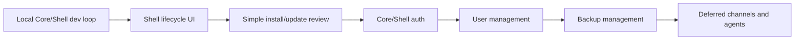

# Core Shell Stabilization

## Description

Core Shell Stabilization is the active implementation plan for the current architecture branch. The goal is to make the local Core and Shell development loop reliable, restore the Core-owned management workflows in the new Shell, and keep old lifecycle and user-management capabilities available while the final Core/Shell split matures.

Update channels, runtime app channel switching, and Agent Bridge remain valid architecture concepts, but they are deferred for this branch. Current stabilization work should preserve narrow extension points where they already exist, without adding channel generation, pull request channels, or agent-editable app flows.

The active priority order is:

1. Stabilize local Core/Shell development and documentation.
2. Restore Shell lifecycle management UI for system and runtime apps.
3. Simplify install and update review screens.
4. Stabilize Core/Shell authentication and app launch flows.
5. Restore user management in Shell.
6. Add backup management controls after Shell and auth are usable.
7. Defer channels and Agent Bridge to separate future feature branches.

## Milestones

### Phase 1 - Stabilize local Core and Shell development

**Status**: In Progress

- Make `npm run core:dev` start Core in the development environment.
- Allow the default local Shell origin `http://127.0.0.1:3000` in Core CORS during development.
- Keep `HOST_SHELL_PUBLIC_ORIGIN` as the explicit override for non-default Shell origins.
- Document the split-process workflow: Core on `http://127.0.0.1:3001`, Shell on `http://127.0.0.1:3000`.
- Validate `/api/core/status`, `/api/apps`, Shell session loading, and the Core login link in the browser.

### Phase 2 - Restore Shell lifecycle management

**Status**: Not Started

- Show system apps and runtime apps with current runtime state, operation status, selected runtime, version, and last error.
- Add Shell actions for start, stop, restart, open, update, logs, backup, restore, configure, and remove where each action is allowed.
- Hide self-stop and remove actions for the active `hosty.shell` app.
- Keep legacy module and app-native runtime app management flows covered by the new Shell UI.
- Test old CLI/control lifecycle flows against the new Shell-visible app state.

### Phase 3 - Simplify install and update review

**Status**: Not Started

- Replace highly technical install/update plan views with a concise review surface.
- Show the app/package identity, current digest, target digest, selected runtime, version change, and primary action.
- Show a settings form only when the target app declares settings, with defaults pre-filled.
- Hide storage mappings, mount details, dependency internals, and endpoint internals unless the target app declares user-configurable storage or a real conflict needs attention.
- Preserve technical details behind diagnostics or an expandable advanced section for administrators.

### Phase 4 - Stabilize Core/Shell authentication

**Status**: Not Started

- Keep Core-owned auth pages and sessions.
- Ensure split-origin Shell-to-Core requests work with credentials, CSRF expectations, and CORS configuration.
- Make Shell display active session state and redirect to Core login/logout flows cleanly.
- Validate app-scoped identity, Shell launch links, and standalone open links with existing Host users.
- Keep runtime apps from receiving Hosty browser cookies directly.

### Phase 5 - Restore user management in Shell

**Status**: Not Started

- Rebuild the user list, invitations, role changes, disabled-user state, account switching entry points, and app access assignments in Shell.
- Keep Core authoritative for all user mutations and audit records.
- Preserve existing user-management behavior while removing legacy UI coupling to the old combined Host app.
- Test administrator and non-administrator access boundaries.

### Phase 6 - Add backup management controls

**Status**: Not Started

- Add Shell views for backup lists, manual backup creation, restore, and deletion.
- Show retention behavior plainly: manual backups are explicit, pre-update backups are automatic, and scheduled retention remains deferred unless implemented.
- Keep destructive backup actions behind confirmation.
- Add CLI parity only where Core APIs already exist or where local recovery needs it.

### Phase 7 - Keep channels and Agent Bridge deferred

**Status**: Deferred

- Do not implement channel generation, product channel publishing, runtime channel UI, switch-channel UI, pull request channels, or Agent Bridge in this branch.
- Keep existing channel-related Core/CLI code as a narrow compatibility/architecture placeholder.
- Revisit channels only after Core/Shell management, auth, users, and backups are stable.
- Revisit Agent Bridge only after repository-backed source workflows and pull request validation are ready.

## Open Questions And Answers

- Question: Should channels be removed from the architecture?
  Answer: No. They remain useful for future release validation and pull request validation, but they are not part of the current stabilization implementation.
  Recommendation: Keep the existing contracts documented and avoid building UI or generation workflows until the main Core/Shell experience is stable.

- Question: Should Shell expose all technical install/update details by default?
  Answer: No. Most users need package identity, version/digest changes, settings, and a clear install/update action.
  Recommendation: Keep technical details available through diagnostics or an advanced section, not in the primary path.

- Question: What old behavior must be protected while rebuilding Shell?
  Answer: Lifecycle operations, user management, app access assignment, identity/open helpers, legacy module compatibility, runtime apps, and backups.
  Recommendation: Add a smoke checklist for old CLI/control flows before each major Shell UI milestone.
